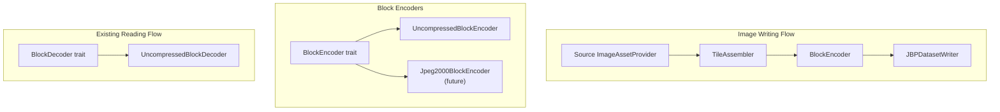

# Design Document: Block Encoder Refactor

## Overview

This design describes the refactoring of JBP image writing to use a symmetric block-based I/O architecture. The design introduces a `BlockEncoder` trait that mirrors the existing `BlockDecoder` trait, enabling consistent patterns for reading and writing image data.

### Key Design Decisions

1. **Symmetric Traits**: `BlockEncoder` mirrors `BlockDecoder` for consistency
2. **Band-Sequential Input**: Encoders accept data in BSQ format (same as decoder output)
3. **Internal IMODE Conversion**: Encoders handle conversion to target IMODE internally
4. **Tile Assembler**: A helper handles reading input tiles to produce output tiles of different sizes
5. **Minimal API Changes**: Public API of JBPDatasetWriter remains unchanged

## Architecture



## Components and Interfaces

### BlockEncoder Trait

The core trait for block-based image encoding, symmetric to `BlockDecoder`.

```rust
/// Trait for encoding image blocks to various compression formats.
///
/// This trait is symmetric to `BlockDecoder` and defines the interface for
/// block-based image encoding. Different compression formats implement this
/// trait, allowing the writer to delegate to the appropriate encoder.
///
/// # Thread Safety
///
/// Implementations must be thread-safe (`Send + Sync`) to allow concurrent
/// block encoding from multiple threads.
pub trait BlockEncoder: Send + Sync {
    /// Encode a single block of image data.
    ///
    /// # Arguments
    /// * `block_row` - Row index of the block in the block grid (0-indexed)
    /// * `block_col` - Column index of the block in the block grid (0-indexed)
    /// * `data` - Pixel data in band-sequential format
    /// * `shape` - Shape of the data as [rows, cols, bands]
    ///
    /// # Errors
    /// Returns `CodecError::InvalidBlockCoordinates` if coordinates are out of bounds.
    /// Returns `CodecError::InvalidData` if data size doesn't match shape.
    fn encode_block(
        &mut self,
        block_row: u32,
        block_col: u32,
        data: &[u8],
        shape: [u32; 3],
    ) -> Result<(), CodecError>;

    /// Finalize encoding and return the complete encoded image data.
    ///
    /// This method must be called after all blocks have been encoded.
    /// The returned data is ready to be written to the NITF image segment.
    ///
    /// # Errors
    /// Returns `CodecError::IncompleteData` if not all blocks have been encoded.
    fn finalize(self: Box<Self>) -> Result<Vec<u8>, CodecError>;

    /// Get the compression type identifier.
    ///
    /// # Returns
    /// The IC field value (e.g., "NC", "C8").
    fn compression_type(&self) -> &str;

    /// Get the block grid dimensions.
    ///
    /// # Returns
    /// A tuple of (num_block_rows, num_block_cols).
    fn block_grid_size(&self) -> (u32, u32);
    
    /// Get the output block dimensions in pixels.
    ///
    /// # Returns
    /// A tuple of (block_height, block_width).
    fn block_dimensions(&self) -> (u32, u32);
}
```

### UncompressedBlockEncoder

Implementation of `BlockEncoder` for uncompressed imagery (IC=NC).

```rust
/// Block encoder for uncompressed NITF imagery (IC=NC).
///
/// Accepts blocks in band-sequential format and converts to the target IMODE.
pub struct UncompressedBlockEncoder {
    /// Target image dimensions
    nrows: u32,
    ncols: u32,
    /// Number of bands
    nbands: u32,
    /// Bits per pixel
    nbpp: u8,
    /// Target interleave mode
    imode: InterleaveMode,
    /// Block dimensions
    nppbh: u32,
    nppbv: u32,
    /// Block grid size
    nbpr: u32,
    nbpc: u32,
    /// Accumulated encoded data
    encoded_data: Vec<u8>,
    /// Track which blocks have been encoded
    blocks_encoded: Vec<Vec<bool>>,
}

impl UncompressedBlockEncoder {
    /// Create a new uncompressed block encoder.
    ///
    /// # Arguments
    /// * `nrows` - Image height in pixels
    /// * `ncols` - Image width in pixels
    /// * `nbands` - Number of bands
    /// * `nbpp` - Bits per pixel
    /// * `imode` - Target interleave mode
    /// * `nppbh` - Block width in pixels
    /// * `nppbv` - Block height in pixels
    pub fn new(
        nrows: u32,
        ncols: u32,
        nbands: u32,
        nbpp: u8,
        imode: InterleaveMode,
        nppbh: u32,
        nppbv: u32,
    ) -> Self {
        let nbpr = (ncols + nppbh - 1) / nppbh;
        let nbpc = (nrows + nppbv - 1) / nppbv;
        
        // Pre-allocate space for encoded data
        let bytes_per_pixel = ((nbpp as usize) + 7) / 8;
        let total_size = (nrows as usize) * (ncols as usize) 
                       * (nbands as usize) * bytes_per_pixel;
        
        Self {
            nrows,
            ncols,
            nbands,
            nbpp,
            imode,
            nppbh,
            nppbv,
            nbpr,
            nbpc,
            encoded_data: vec![0u8; total_size],
            blocks_encoded: vec![vec![false; nbpr as usize]; nbpc as usize],
        }
    }
    
    /// Convert BSQ block data to target IMODE and write to output buffer.
    fn write_block_to_buffer(
        &mut self,
        block_row: u32,
        block_col: u32,
        data: &[u8],
        shape: [u32; 3],
    ) -> Result<(), CodecError>;
}

impl BlockEncoder for UncompressedBlockEncoder {
    fn encode_block(
        &mut self,
        block_row: u32,
        block_col: u32,
        data: &[u8],
        shape: [u32; 3],
    ) -> Result<(), CodecError> {
        // Validate coordinates
        if block_row >= self.nbpc || block_col >= self.nbpr {
            return Err(CodecError::InvalidBlockCoordinates(
                block_row, block_col, 0
            ));
        }
        
        // Validate data size
        let expected_size = (shape[0] as usize) * (shape[1] as usize) 
                          * (shape[2] as usize) * self.bytes_per_pixel();
        if data.len() != expected_size {
            return Err(CodecError::InvalidData(format!(
                "Block data size {} doesn't match expected {}",
                data.len(), expected_size
            )));
        }
        
        // Convert and write to buffer
        self.write_block_to_buffer(block_row, block_col, data, shape)?;
        self.blocks_encoded[block_row as usize][block_col as usize] = true;
        
        Ok(())
    }
    
    fn finalize(self: Box<Self>) -> Result<Vec<u8>, CodecError> {
        // Check all blocks encoded
        for (row, row_blocks) in self.blocks_encoded.iter().enumerate() {
            for (col, &encoded) in row_blocks.iter().enumerate() {
                if !encoded {
                    return Err(CodecError::IncompleteData(format!(
                        "Block ({}, {}) not encoded", row, col
                    )));
                }
            }
        }
        
        Ok(self.encoded_data)
    }
    
    fn compression_type(&self) -> &str {
        "NC"
    }
    
    fn block_grid_size(&self) -> (u32, u32) {
        (self.nbpc, self.nbpr)
    }
    
    fn block_dimensions(&self) -> (u32, u32) {
        (self.nppbv, self.nppbh)
    }
}
```

### Block Encoder Factory

Factory function to create the appropriate encoder based on IC code.

```rust
/// Factory function to create the appropriate block encoder based on IC field.
///
/// # Arguments
/// * `ic` - Image compression code (e.g., "NC", "C8")
/// * `nrows` - Image height in pixels
/// * `ncols` - Image width in pixels
/// * `nbands` - Number of bands
/// * `nbpp` - Bits per pixel
/// * `imode` - Target interleave mode
/// * `nppbh` - Block width in pixels
/// * `nppbv` - Block height in pixels
///
/// # Returns
/// A boxed `BlockEncoder` implementation appropriate for the compression type.
///
/// # Errors
/// Returns `CodecError::Unsupported` if the compression type is not supported.
pub fn create_block_encoder(
    ic: &str,
    nrows: u32,
    ncols: u32,
    nbands: u32,
    nbpp: u8,
    imode: InterleaveMode,
    nppbh: u32,
    nppbv: u32,
) -> Result<Box<dyn BlockEncoder>, CodecError> {
    match ic.trim() {
        "NC" => Ok(Box::new(UncompressedBlockEncoder::new(
            nrows, ncols, nbands, nbpp, imode, nppbh, nppbv
        ))),
        _ => Err(CodecError::Unsupported(format!(
            "Unsupported compression type for encoding: '{}'. Only NC is currently supported.",
            ic
        ))),
    }
}
```

### TileAssembler

Helper for reading input tiles and assembling output tiles of different sizes.

```rust
/// Assembles output tiles from input tiles of potentially different sizes.
///
/// When the output tile size differs from the input tile size, this helper
/// reads the necessary input tiles and assembles them into output tiles.
pub struct TileAssembler<'a> {
    /// Source image provider
    source: &'a dyn ImageAssetProvider,
    /// Output tile dimensions
    output_tile_width: u32,
    output_tile_height: u32,
    /// Source tile dimensions (from provider)
    source_tile_width: u32,
    source_tile_height: u32,
    /// Image dimensions
    image_width: u32,
    image_height: u32,
    num_bands: u32,
    bytes_per_pixel: usize,
}

impl<'a> TileAssembler<'a> {
    /// Create a new tile assembler.
    pub fn new(
        source: &'a dyn ImageAssetProvider,
        output_tile_width: u32,
        output_tile_height: u32,
    ) -> Self {
        Self {
            source,
            output_tile_width,
            output_tile_height,
            source_tile_width: source.num_pixels_per_block_horizontal(),
            source_tile_height: source.num_pixels_per_block_vertical(),
            image_width: source.num_columns(),
            image_height: source.num_rows(),
            num_bands: source.num_bands(),
            bytes_per_pixel: ((source.num_bits_per_pixel() + 7) / 8) as usize,
        }
    }
    
    /// Get the output block grid size.
    pub fn output_grid_size(&self) -> (u32, u32) {
        let cols = (self.image_width + self.output_tile_width - 1) / self.output_tile_width;
        let rows = (self.image_height + self.output_tile_height - 1) / self.output_tile_height;
        (rows, cols)
    }
    
    /// Get an output tile by assembling from source tiles.
    ///
    /// # Arguments
    /// * `output_row` - Output tile row index
    /// * `output_col` - Output tile column index
    ///
    /// # Returns
    /// Tuple of (data, shape) where data is in band-sequential format.
    pub fn get_output_tile(
        &self,
        output_row: u32,
        output_col: u32,
    ) -> Result<(Vec<u8>, [u32; 3]), CodecError> {
        // Calculate pixel region for this output tile
        let start_x = output_col * self.output_tile_width;
        let start_y = output_row * self.output_tile_height;
        let end_x = (start_x + self.output_tile_width).min(self.image_width);
        let end_y = (start_y + self.output_tile_height).min(self.image_height);
        let tile_width = end_x - start_x;
        let tile_height = end_y - start_y;
        
        // Determine which source tiles we need
        let src_start_col = start_x / self.source_tile_width;
        let src_end_col = (end_x - 1) / self.source_tile_width + 1;
        let src_start_row = start_y / self.source_tile_height;
        let src_end_row = (end_y - 1) / self.source_tile_height + 1;
        
        // Allocate output buffer (BSQ format)
        let tile_pixels = (tile_width as usize) * (tile_height as usize);
        let mut output = vec![0u8; tile_pixels * (self.num_bands as usize) * self.bytes_per_pixel];
        
        // Read source tiles and copy relevant pixels
        for src_row in src_start_row..src_end_row {
            for src_col in src_start_col..src_end_col {
                let (src_data, src_shape) = self.source.get_block(
                    src_row, src_col, 0, None
                )?;
                
                // Copy overlapping region to output
                self.copy_tile_region(
                    &src_data, src_shape,
                    src_row, src_col,
                    &mut output,
                    start_x, start_y, tile_width, tile_height,
                )?;
            }
        }
        
        Ok((output, [tile_height, tile_width, self.num_bands]))
    }
    
    /// Copy overlapping region from source tile to output buffer.
    fn copy_tile_region(
        &self,
        src_data: &[u8],
        src_shape: [u32; 3],
        src_row: u32,
        src_col: u32,
        output: &mut [u8],
        out_start_x: u32,
        out_start_y: u32,
        out_width: u32,
        out_height: u32,
    ) -> Result<(), CodecError>;
}
```


## Data Models

### Block Grid Calculation

| Parameter | Formula |
|-----------|---------|
| NBPR (blocks per row) | ceil(NCOLS / NPPBH) |
| NBPC (blocks per column) | ceil(NROWS / NPPBV) |
| Edge block width | NCOLS - (NBPR - 1) * NPPBH |
| Edge block height | NROWS - (NBPC - 1) * NPPBV |

### IMODE Data Layout

| IMODE | Layout | Description |
|-------|--------|-------------|
| B | Block: [Band0_pixels, Band1_pixels, ...] | Band interleaved by block |
| P | Pixel: [B0B1B2, B0B1B2, ...] | Band interleaved by pixel |
| R | Row: [Row0_B0, Row0_B1, Row0_B2, Row1_B0, ...] | Band interleaved by row |
| S | Band: [Band0_blocks, Band1_blocks, ...] | Band sequential |

### Input/Output Format

- **Input to BlockEncoder**: Band-sequential (BSQ) format - all pixels of band 0, then band 1, etc.
- **Output from BlockEncoder**: Target IMODE format as specified in encoding hints
- **Output from BlockDecoder**: Band-sequential (BSQ) format (existing behavior)

## Correctness Properties

*A property is a characteristic or behavior that should hold true across all valid executions of a system-essentially, a formal statement about what the system should do. Properties serve as the bridge between human-readable specifications and machine-verifiable correctness guarantees.*

### Property 1: Round-Trip Consistency

*For any* valid image data (any dimensions, any bit depth, any band count), encoding with `BlockEncoder` and then decoding with `BlockDecoder` SHALL produce byte-identical pixel data with matching dimensions.

**Validates: Requirements 7.1, 7.4**

### Property 2: Tile Size Conversion Preserves Pixels

*For any* combination of input tile size and output tile size, and any image dimensions, the pixel values in the encoded output SHALL exactly match the pixel values from the source, regardless of how tiles are assembled.

**Validates: Requirements 5.1, 5.3, 5.4, 5.5, 7.2**

### Property 3: IMODE Conversion Preserves Pixels

*For any* source IMODE and target IMODE combination (B, P, R, S), encoding then decoding SHALL produce pixel values identical to the original, regardless of the interleave format used during encoding.

**Validates: Requirements 2.2, 2.4, 6.4, 7.3**

### Property 4: Edge Block Handling

*For any* image dimensions that are not evenly divisible by the block size, edge blocks (partial blocks at right and bottom boundaries) SHALL be encoded correctly with the actual pixel count, not padded dimensions.

**Validates: Requirements 2.5**

### Property 5: Block Grid Calculation

*For any* image dimensions (NROWS, NCOLS) and block dimensions (NPPBH, NPPBV), the block grid size returned by `block_grid_size()` SHALL equal (ceil(NROWS/NPPBV), ceil(NCOLS/NPPBH)).

**Validates: Requirements 1.5**

## Error Handling

| Error | Condition | Context |
|-------|-----------|---------|
| `InvalidBlockCoordinates` | Block row/col out of range | Coordinates, grid size |
| `InvalidData` | Block data size doesn't match shape | Expected size, actual size |
| `IncompleteData` | finalize() called before all blocks encoded | Missing block coordinates |
| `Unsupported` | IC code not supported for encoding | IC value |

## Testing Strategy

### Property-Based Testing

- **Library**: `proptest` (Rust)
- **Minimum iterations**: 100 per property test
- **Tag format**: `Feature: block-encoder-refactor, Property {N}: {property_text}`

### Test Categories

1. **Round-Trip Tests**: Encode then decode, verify pixel equality
2. **Tile Size Tests**: Various input/output tile size combinations
3. **IMODE Tests**: All 16 IMODE conversion combinations (4 source × 4 target)
4. **Edge Block Tests**: Non-divisible dimensions
5. **Error Tests**: Invalid coordinates, incomplete encoding

### Test Data Generation

Property tests should generate:
- Random image dimensions (1-1000 pixels)
- Random block sizes (1-256 pixels)
- Random band counts (1-10)
- Random bit depths (8, 16, 32)
- Random IMODE values (B, P, R, S)
- Random pixel values within bit depth range

### Unit Testing Balance

- Unit tests for specific edge cases: 1×1 images, single-pixel blocks, max dimensions
- Property tests for comprehensive coverage of the parameter space
- Integration tests verify JBPDatasetWriter produces valid NITF files
