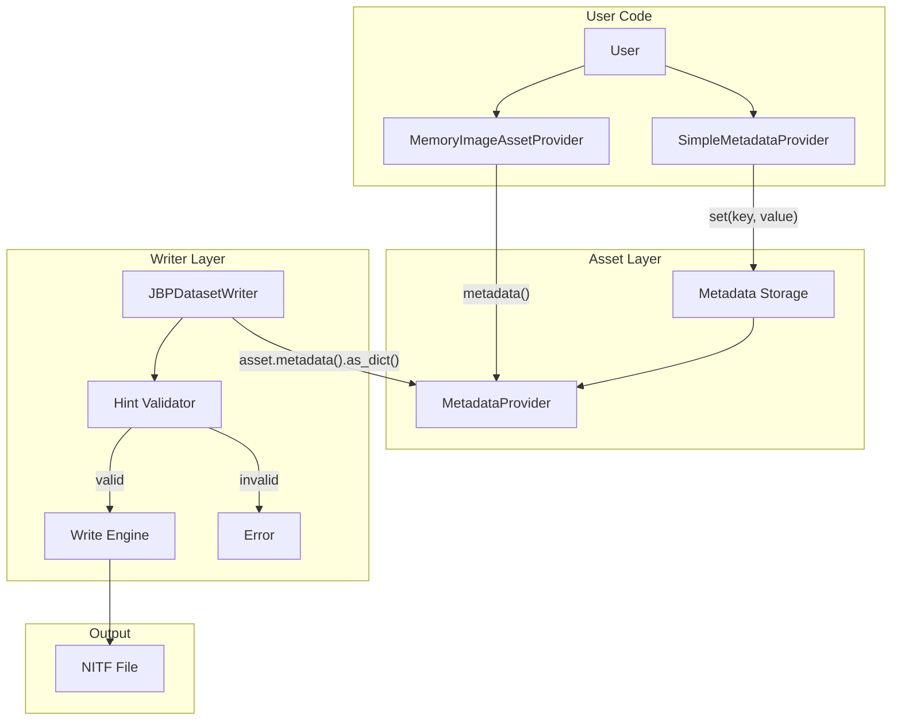

# Design Document: Dataset Writer Encoding Hints

## Overview

This design describes the implementation of encoding hints for the dataset writer system. The feature allows users to pass format-specific encoding options (like NITF's IMODE, IC, NPPBH, NPPBV, COMRAT) through the existing MetadataProvider interface, rather than polluting abstract interfaces with format-specific parameters.

The key insight is that the writer already has access to asset metadata via `asset.metadata()`. By reading encoding hints from this metadata using the same field names that come from parsing files, we achieve:
1. Clean abstraction boundaries (no format-specific params in generic interfaces)
2. Seamless metadata copying from reader to writer
3. Consistent field naming throughout the API

## Architecture



### Data Flow

1. User creates `SimpleMetadataProvider` and sets encoding hints
2. User creates `MemoryImageAssetProvider` with the metadata provider
3. User adds asset to `JBPDatasetWriter`
4. Writer calls `asset.metadata().as_dict(None)` to get all metadata
5. Writer extracts known encoding hint fields (IMODE, IC, etc.)
6. Writer validates hint values
7. Writer uses hints (or defaults) when writing image subheader

## Components and Interfaces

### SimpleMetadataProvider

A mutable implementation of `MetadataProvider` that stores key-value pairs in a thread-safe HashMap.

```rust
/// A mutable metadata provider that stores string key-value pairs.
/// 
/// This provider allows programmatic setting of metadata values,
/// making it useful for creating assets with custom encoding hints.
pub struct SimpleMetadataProvider {
    /// Thread-safe storage for metadata key-value pairs
    data: RwLock<HashMap<String, serde_json::Value>>,
}

impl SimpleMetadataProvider {
    /// Create a new empty SimpleMetadataProvider.
    pub fn new() -> Self;
    
    /// Create a SimpleMetadataProvider initialized from an existing MetadataProvider.
    /// 
    /// This copies all key-value pairs from the source provider, allowing
    /// users to duplicate metadata and selectively update fields.
    pub fn from_provider(source: &dyn MetadataProvider) -> Self;
    
    /// Set a string value for the given key.
    /// 
    /// If the key already exists, its value is replaced.
    pub fn set(&self, key: &str, value: &str);
    
    /// Get the value for the given key, if it exists.
    pub fn get(&self, key: &str) -> Option<String>;
    
    /// Remove a key-value pair.
    pub fn remove(&self, key: &str) -> Option<String>;
    
    /// Clear all stored metadata.
    pub fn clear(&self);
}

impl MetadataProvider for SimpleMetadataProvider {
    fn raw(&self) -> &[u8];
    fn as_dict(&self, name: Option<&str>) -> HashMap<String, serde_json::Value>;
}
```

### MemoryImageAssetProvider Updates

The `MemoryImageAssetProvider` will be updated to:
1. Accept an optional `MetadataProvider` during construction
2. Remove the `imode` field from `MemoryImageConfig` (IMODE comes from metadata)

```rust
impl MemoryImageAssetProvider {
    /// Create a new memory image asset provider with custom metadata.
    pub fn with_metadata(
        key: &str, 
        config: MemoryImageConfig,
        metadata: Arc<dyn MetadataProvider>,
    ) -> Self;
}

// MemoryImageConfig changes:
pub struct MemoryImageConfig {
    pub num_columns: u32,
    pub num_rows: u32,
    pub num_bands: u32,
    pub block_width: u32,
    pub block_height: u32,
    pub pixel_type: PixelType,
    pub bits_per_pixel: u32,
    pub actual_bits_per_pixel: u32,
    // REMOVED: pub imode: String,
    pub irep: String,
}
```

### JBPDatasetWriter Encoding Hint Extraction

The writer will extract encoding hints from asset metadata:

```rust
/// Encoding hints extracted from asset metadata.
#[derive(Debug, Clone)]
struct EncodingHints {
    /// Band interleave mode (B, P, R, S)
    imode: String,
    /// Image compression code
    ic: String,
    /// Pixels per block horizontal
    nppbh: u32,
    /// Pixels per block vertical
    nppbv: u32,
    /// Compression ratio (for compressed images)
    comrat: Option<String>,
}

impl JBPDatasetWriter {
    /// Extract encoding hints from asset metadata.
    /// 
    /// Returns hints with defaults for any missing fields.
    fn extract_encoding_hints(
        &self,
        asset: &QueuedAsset,
        image_props: &ImageProperties,
    ) -> Result<EncodingHints, CodecError>;
    
    /// Validate encoding hints.
    /// 
    /// Returns an error for invalid values, or adjusted hints
    /// if auto-correction is possible (e.g., block size > image size).
    fn validate_encoding_hints(
        &self,
        hints: &EncodingHints,
        image_props: &ImageProperties,
    ) -> Result<EncodingHints, CodecError>;
}
```

### Python Bindings

```python
# PySimpleMetadataProvider
class SimpleMetadataProvider:
    """A mutable metadata provider for setting encoding hints."""
    
    def __init__(self, source: MetadataProvider = None) -> None:
        """Create a new SimpleMetadataProvider.
        
        Args:
            source: Optional existing MetadataProvider to copy from.
        """
        ...
    
    def set(self, key: str, value: str) -> None:
        """Set a metadata value."""
        ...
    
    def get(self, key: str) -> Optional[str]:
        """Get a metadata value."""
        ...
    
    def remove(self, key: str) -> Optional[str]:
        """Remove a metadata value."""
        ...
    
    def clear(self) -> None:
        """Clear all metadata."""
        ...
    
    @property
    def raw(self) -> BytesIO:
        """Get raw metadata bytes."""
        ...
    
    def as_dict(self, name: str = None) -> dict:
        """Get metadata as a dictionary."""
        ...


# Updated MemoryImageAssetProvider.create()
class MemoryImageAssetProvider:
    @staticmethod
    def create(
        key: str,
        num_columns: int = 512,
        num_rows: int = 512,
        num_bands: int = 1,
        block_width: int = 256,
        block_height: int = 256,
        pixel_type: PixelType = PixelType.UInt8,
        actual_bits_per_pixel: int = None,
        # REMOVED: imode: str = "B",
        metadata: MetadataProvider = None,  # NEW
        title: str = None,
        description: str = None,
    ) -> MemoryImageAssetProvider:
        ...
```

## Data Models

### Encoding Hint Fields

Field names use lowercase to match the .ksy parser output, ensuring consistency between reader and writer APIs.

| Field | Type | Valid Values | Default | Description |
|-------|------|--------------|---------|-------------|
| imode | String | "B", "P", "R", "S" | "B" | Band interleave mode |
| ic | String | "NC", "NM", "C1", "C3", "C4", "C5", "C6", "C7", "C8", "M1", "M3", "M4", "M5", "M8", "I1" | "NC" | Compression code |
| nppbh | Integer | 1-8192 | image width | Pixels per block horizontal |
| nppbv | Integer | 1-8192 | image height | Pixels per block vertical |
| comrat | String | varies by ic | None | Compression ratio |

### Validation Rules

| Condition | Action |
|-----------|--------|
| imode not in {B, P, R, S} | Return error |
| ic requires unavailable codec | Return error |
| nppbh < 1 or > 8192 | Return error |
| nppbv < 1 or > 8192 | Return error |
| nppbh > image width | Auto-adjust to image width, log warning |
| nppbv > image height | Auto-adjust to image height, log warning |
| ic is compressed but comrat missing | Use default comrat for ic type |

### Conflict Resolution

| Conflict | Resolution |
|----------|------------|
| Provider num_bands ≠ metadata nbands | Use provider value |
| Provider pixel_type ≠ metadata pvtype | Use provider value |
| Provider dimensions ≠ metadata nrows/ncols | Use provider value |
| Metadata irep inconsistent with num_bands | Use provider band count, log warning |


## Correctness Properties

*A property is a characteristic or behavior that should hold true across all valid executions of a system—essentially, a formal statement about what the system should do. Properties serve as the bridge between human-readable specifications and machine-verifiable correctness guarantees.*

### Property 1: SimpleMetadataProvider Set/Get Round-Trip

*For any* key-value pair (k, v) where k and v are non-empty strings, if `set(k, v)` is called on a SimpleMetadataProvider, then `get(k)` SHALL return `Some(v)`.

**Validates: Requirements 1.2, 1.3**

### Property 2: SimpleMetadataProvider as_dict Completeness

*For any* set of N distinct key-value pairs stored in a SimpleMetadataProvider, calling `as_dict(None)` SHALL return a HashMap containing exactly those N pairs.

**Validates: Requirements 1.4**

### Property 3: SimpleMetadataProvider Prefix Filtering

*For any* set of stored key-value pairs and any prefix string P, calling `as_dict(Some(P))` SHALL return only those pairs where the key starts with P, and SHALL include all such pairs.

**Validates: Requirements 1.5**

### Property 4: SimpleMetadataProvider from_provider Copies All Pairs

*For any* MetadataProvider M with N key-value pairs, creating a SimpleMetadataProvider via `from_provider(M)` SHALL result in a provider where `as_dict(None)` returns all N pairs from M.

**Validates: Requirements 1.8**

### Property 5: MemoryImageAssetProvider Metadata Round-Trip

*For any* SimpleMetadataProvider M with key-value pairs, if a MemoryImageAssetProvider is created with M, then calling `metadata().as_dict(None)` on the provider SHALL return the same key-value pairs as `M.as_dict(None)`.

**Validates: Requirements 2.2**

### Property 6: Encoding Hints Applied to Output

*For any* valid encoding hint values (imode ∈ {B, P, R, S}, nppbh ∈ [1, 8192], nppbv ∈ [1, 8192]) set in asset metadata, when the asset is written by JBPDatasetWriter and the resulting file is read back, the image subheader SHALL contain those hint values.

**Validates: Requirements 3.2, 3.4, 3.5**

### Property 7: Invalid imode Values Cause Errors

*For any* string S that is not in the set {B, P, R, S}, if S is set as the "imode" metadata value and the asset is written, JBPDatasetWriter SHALL return an error.

**Validates: Requirements 4.1**

### Property 8: Invalid Block Size Values Cause Errors

*For any* integer N where N < 1 or N > 8192, if N is set as the "nppbh" or "nppbv" metadata value and the asset is written, JBPDatasetWriter SHALL return an error.

**Validates: Requirements 4.3, 4.4**

### Property 9: Block Sizes Auto-Adjusted to Image Dimensions

*For any* image with dimensions (W, H) and block size hints (nppbh, nppbv) where nppbh > W or nppbv > H, when the asset is written and read back, the actual block sizes in the output SHALL be min(nppbh, W) and min(nppbv, H) respectively.

**Validates: Requirements 4.5**

### Property 10: Provider Structural Properties Override Metadata

*For any* MemoryImageAssetProvider with num_bands=B and metadata containing a different nbands value, when written by JBPDatasetWriter and read back, the output SHALL have B bands.

**Validates: Requirements 5.1, 5.3**

### Property 11: Metadata Field Names Consistent Between Reader and Writer

*For any* NITF file read by JBPDatasetReader, if the metadata is copied to a SimpleMetadataProvider and used to write a new file, the field names in the output file's metadata SHALL match the original field names without transformation.

**Validates: Requirements 6.1, 6.3, 7.1, 7.2**

## Error Handling

### Error Types

The following error conditions are handled:

| Error Condition | Error Type | Message Format |
|-----------------|------------|----------------|
| Invalid imode value | `CodecError::InvalidParameter` | "Invalid imode value '{value}': must be B, P, R, or S" |
| Invalid nppbh value | `CodecError::InvalidParameter` | "Invalid nppbh value '{value}': must be between 1 and 8192" |
| Invalid nppbv value | `CodecError::InvalidParameter` | "Invalid nppbv value '{value}': must be between 1 and 8192" |
| Unsupported ic value | `CodecError::UnsupportedFeature` | "Compression code '{value}' requires unavailable codec" |
| Metadata parse error | `CodecError::InvalidParameter` | "Failed to parse encoding hint '{field}': {details}" |

### Warning Conditions

The following conditions generate warnings but do not fail:

| Condition | Warning Message |
|-----------|-----------------|
| Block size > image dimension | "nppbh {value} exceeds image width {width}, adjusting to {width}" |
| irep inconsistent with band count | "irep '{irep}' inconsistent with {bands} bands, using provider band count" |

### Error Recovery

- Block size auto-adjustment: When block sizes exceed image dimensions, they are automatically clamped to image dimensions
- Missing hints: When encoding hints are not present, sensible defaults are used
- Type coercion: String values for numeric fields (NPPBH, NPPBV) are parsed; parse failures result in errors

## Testing Strategy

### Unit Tests

Unit tests verify specific examples and edge cases:

1. **SimpleMetadataProvider construction**
   - Empty provider has no keys
   - Provider from existing MetadataProvider copies all keys

2. **SimpleMetadataProvider operations**
   - Set and get single value
   - Set overwrites existing value
   - Get non-existent key returns None
   - Remove returns previous value
   - Clear removes all keys

3. **MemoryImageAssetProvider with metadata**
   - Construction with metadata succeeds
   - Construction without metadata uses empty provider
   - Metadata is accessible via metadata() method

4. **Encoding hint validation**
   - Valid imode values accepted
   - Invalid imode values rejected
   - Valid block sizes accepted
   - Invalid block sizes rejected
   - Block sizes auto-adjusted when > image size

5. **Python bindings**
   - SimpleMetadataProvider accessible from Python
   - set/get/remove/clear work from Python
   - as_dict returns Python dict
   - MemoryImageAssetProvider accepts metadata parameter

### Property-Based Tests

Property-based tests use randomized inputs to verify universal properties. Each test runs minimum 100 iterations.

| Property | Test Description | Generator |
|----------|------------------|-----------|
| P1 | Set/get round-trip | Random (key, value) string pairs |
| P2 | as_dict completeness | Random sets of key-value pairs |
| P3 | Prefix filtering | Random keys with common prefixes |
| P4 | from_provider copy | Random MetadataProvider contents |
| P5 | Metadata round-trip | Random metadata through provider |
| P6 | Encoding hints applied | Random valid imode, nppbh, nppbv |
| P7 | Invalid imode errors | Random strings not in {B,P,R,S} |
| P8 | Invalid block size errors | Random integers outside [1,8192] |
| P9 | Block size auto-adjust | Random block sizes > image dims |
| P10 | Provider overrides metadata | Random conflicting values |
| P11 | Field name consistency | Read/write round-trip |

### Test Configuration

- Property-based testing library: `proptest` (Rust), `hypothesis` (Python)
- Minimum iterations per property: 100
- Test tag format: `Feature: dataset-writer-hints, Property N: {property_text}`

### Functional Tests (Documented for Future Implementation)

Functional test scenarios are documented in `docs/TODO_FUNCTIONAL_TESTS.md` for future implementation:

1. **Read-modify-write workflow**
   - Read NITF file
   - Copy metadata to SimpleMetadataProvider
   - Modify encoding hints
   - Write new file
   - Verify hints applied

2. **Synthetic image with hints**
   - Create MemoryImageAssetProvider with encoding hints
   - Write to NITF
   - Read back and verify hints
