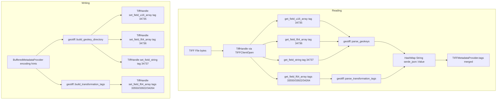

# Design Document: GeoTIFF Metadata

## Overview

This feature adds GeoTIFF metadata parsing and writing to osml-imagery-io, enabling the library to read and expose geospatial coordinate reference system (CRS) information from GeoTIFF files and write it back through the existing `DatasetWriter` interface. GeoTIFF extends TIFF with three special tags — a GeoKey directory (tag 34735), double parameters (tag 34736), and ASCII parameters (tag 34737) — plus transformation tags (ModelTiepointTag 33922, ModelPixelScaleTag 33550, ModelTransformationTag 34264) that map pixel coordinates to CRS coordinates.

The implementation parses these tags in pure Rust (no libgeotiff dependency), maps GeoKeys to human-readable metadata fields prefixed with `"Geo"`, and exposes everything through the existing `MetadataProvider` interface. GeoTransform computation (deriving GDAL-convention affine transforms) is out of scope — the IO module only parses and exposes raw metadata values.

This is Phase 3 of the TIFF roadmap, building on Phase 1 (libtiff FFI + reading) and Phase 2 (writing) already implemented in `src/tiff/`.

## Architecture

### High-Level Data Flow



### Module Responsibilities

The feature touches four existing modules and adds one new module:

| Module | Change | Responsibility |
|--------|--------|----------------|
| `src/tiff/ffi.rs` | Extended | Add array tag getters/setters (`get_field_u16_array`, `get_field_f64_array`, `set_field_u16_array`, `set_field_f64_array`, `set_field_string`) |
| `src/tiff/tags.rs` | Extended | Add GeoTIFF tag constants and GeoKey ID constants |
| `src/tiff/geotiff.rs` | **New** | GeoKey directory parsing, key-to-metadata mapping, transformation tag parsing, directory assembly for writing |
| `src/tiff/metadata.rs` | Extended | Call geotiff parser during `from_handle()`, merge GeoTIFF fields into tags map, update `as_dict` section filtering |
| `src/tiff/writer.rs` | Extended | Parse GeoTIFF encoding hints, call geotiff builder to assemble and write GeoTIFF tags |
| `src/tiff/reader.rs` | Unchanged | Already delegates metadata to `TIFFMetadataProvider::from_handle()` |

### Design Decisions

1. **Pure Rust GeoKey parsing** — The GeoKey directory spec (OGC GeoTIFF Standard §7.1) is a simple array of 4-SHORT entries. Implementing in Rust avoids a libgeotiff dependency and its potential licensing complications.

2. **Native `serde_json::Value` types** — Metadata values use the most appropriate JSON type: strings for labels (`"Projected"`), numbers for EPSG codes (`32618`), arrays of numbers for coordinate data (`[0.5, 0.5, 0.0]`). This avoids the "everything is a string" anti-pattern and makes values directly usable without parsing.

3. **`"Geo"` prefix for all GeoTIFF keys** — All GeoTIFF metadata fields are prefixed with `"Geo"` (e.g., `"GeoModelType"`, `"GeoPixelScale"`, `"GeoKey_1024"`). This enables `as_dict` section filtering by key prefix and clearly distinguishes GeoTIFF fields from standard TIFF tags.

4. **Unmapped GeoKeys use `"GeoKey_{KeyID}"` format** — Only the four most common GeoKeys (1024, 1025, 2048, 3072) get human-readable names. All other GeoKeys are exposed as `"GeoKey_{KeyID}"` with their raw value, ensuring no metadata is silently dropped.

5. **GeoTransform computation is out of scope** — The IO module exposes raw `GeoPixelScale`, `GeoTiepoints`, and `GeoTransformation` values. Deriving GDAL-convention 6-element affine transforms belongs in a higher-level library.

6. **libtiff handles array tag I/O** — For GeoTIFF tags like 34735 (SHORT array) and 34736 (DOUBLE array), libtiff's `TIFFGetField`/`TIFFSetField` with count+pointer semantics handles the actual TIFF I/O. Our FFI layer adds safe wrappers that manage pointer lifetimes.


## Components and Interfaces

### 1. FFI Extensions (`src/tiff/ffi.rs`)

New methods on `TiffHandle`:

```rust
impl TiffHandle {
    /// Read a SHORT array tag. libtiff returns (count, *u16) for variable-length
    /// SHORT arrays like GeoKeyDirectoryTag.
    pub fn get_field_u16_array(&self, tag: u32, count: u16) -> Result<Vec<u16>, CodecError>;

    /// Read a DOUBLE array tag. libtiff returns (count, *f64) for variable-length
    /// DOUBLE arrays like GeoDoubleParamsTag, ModelTiepointTag, etc.
    pub fn get_field_f64_array(&self, tag: u32, count: u32) -> Result<Vec<f64>, CodecError>;

    /// Write a SHORT array tag.
    pub fn set_field_u16_array(&self, tag: u32, data: &[u16]) -> Result<(), CodecError>;

    /// Write a DOUBLE array tag.
    pub fn set_field_f64_array(&self, tag: u32, data: &[f64]) -> Result<(), CodecError>;

    /// Write an ASCII string tag.
    pub fn set_field_string(&self, tag: u32, value: &str) -> Result<(), CodecError>;
}
```

**FFI details for array tags**: libtiff's `TIFFGetField` for variable-count tags like 34735 uses the signature `TIFFGetField(tif, tag, &count, &ptr)` where count is a `u16` for SHORT arrays and `u32` for DOUBLE arrays, and ptr is a pointer to the array data owned by libtiff. The safe wrapper copies the data into a `Vec` before returning. For `TIFFSetField`, the signature is `TIFFSetField(tif, tag, count, ptr)`.

### 2. GeoTIFF Tag Constants (`src/tiff/tags.rs`)

New constants added to the existing tags module:

```rust
// GeoTIFF TIFF Tags
pub const GEO_KEY_DIRECTORY_TAG: u32 = 34735;
pub const GEO_DOUBLE_PARAMS_TAG: u32 = 34736;
pub const GEO_ASCII_PARAMS_TAG: u32 = 34737;
pub const MODEL_TIEPOINT_TAG: u32 = 33922;
pub const MODEL_PIXEL_SCALE_TAG: u32 = 33550;
pub const MODEL_TRANSFORMATION_TAG: u32 = 34264;

// GeoKey IDs
pub const GT_MODEL_TYPE_GEO_KEY: u16 = 1024;
pub const GT_RASTER_TYPE_GEO_KEY: u16 = 1025;
pub const GEOGRAPHIC_TYPE_GEO_KEY: u16 = 2048;
pub const PROJECTED_CS_TYPE_GEO_KEY: u16 = 3072;

// GTModelTypeGeoKey values
pub const MODEL_TYPE_PROJECTED: u16 = 1;
pub const MODEL_TYPE_GEOGRAPHIC: u16 = 2;

// GTRasterTypeGeoKey values
pub const RASTER_PIXEL_IS_AREA: u16 = 1;
pub const RASTER_PIXEL_IS_POINT: u16 = 2;
```

### 3. GeoTIFF Parser Module (`src/tiff/geotiff.rs`)

This is the core new module. It contains pure functions that operate on data read from `TiffHandle`, with no direct FFI calls.

```rust
/// A single parsed GeoKey entry.
struct GeoKeyEntry {
    key_id: u16,
    tiff_tag_location: u16,
    count: u16,
    value_offset: u16,
}

/// Parse the GeoKey directory and resolve all key values to metadata fields.
///
/// Arguments:
/// - `directory`: raw u16 array from tag 34735
/// - `double_params`: optional f64 array from tag 34736
/// - `ascii_params`: optional string from tag 34737
///
/// Returns a HashMap of "Geo"-prefixed metadata fields.
pub fn parse_geokeys(
    directory: &[u16],
    double_params: Option<&[f64]>,
    ascii_params: Option<&str>,
) -> Result<HashMap<String, Value>, CodecError>;

/// Parse transformation tags into metadata fields.
///
/// Reads ModelPixelScaleTag, ModelTiepointTag, and ModelTransformationTag
/// values and produces "GeoPixelScale", "GeoTiepoints", "GeoTransformation" fields.
pub fn parse_transformation_tags(
    pixel_scale: Option<&[f64]>,
    tiepoints: Option<&[f64]>,
    transformation: Option<&[f64]>,
) -> Result<HashMap<String, Value>, CodecError>;

/// Build a GeoKey directory and associated parameter arrays from metadata fields.
///
/// This is the inverse of parse_geokeys — takes "Geo"-prefixed metadata fields
/// and assembles the raw arrays needed for tags 34735, 34736, 34737.
///
/// Returns (directory_u16_array, Option<double_params>, Option<ascii_params>).
pub fn build_geokey_directory(
    metadata: &HashMap<String, Value>,
) -> Result<(Vec<u16>, Option<Vec<f64>>, Option<String>), CodecError>;

/// Extract transformation tag values from metadata fields.
///
/// Returns (Option<pixel_scale_3>, Option<tiepoints_flat>, Option<transformation_16>).
pub fn extract_transformation_tags(
    metadata: &HashMap<String, Value>,
) -> Result<(Option<Vec<f64>>, Option<Vec<f64>>, Option<Vec<f64>>), CodecError>;
```

**GeoKey resolution logic** (in `parse_geokeys`):

1. Validate directory length ≥ 4 (header: KeyDirectoryVersion, KeyRevision, MinorRevision, NumberOfKeys)
2. Read NumberOfKeys from header[3]
3. For each key entry (4 SHORTs starting at offset 4 + i*4):
   - If `TIFFTagLocation == 0`: inline SHORT value from `Value_Offset`
   - If `TIFFTagLocation == 34736`: read `Count` doubles from `double_params` at offset `Value_Offset`
   - If `TIFFTagLocation == 34737`: read `Count` chars from `ascii_params` at offset `Value_Offset`, strip trailing `|`
4. Map known KeyIDs to human-readable names:
   - 1024 → `"GeoModelType"` with `"Projected"` (1) or `"Geographic"` (2)
   - 1025 → `"GeoRasterType"` with `"PixelIsArea"` (1) or `"PixelIsPoint"` (2)
   - 2048 → `"GeoGeographicCRS"` with numeric EPSG code
   - 3072 → `"GeoProjectedCRS"` with numeric EPSG code
5. Unknown KeyIDs → `"GeoKey_{KeyID}"` with raw value (number or string)

### 4. Metadata Integration (`src/tiff/metadata.rs`)

Changes to `TIFFMetadataProvider::from_handle()`:

```rust
pub fn from_handle(handle: &TiffHandle, ifd_index: u16) -> Result<Self, CodecError> {
    handle.set_directory(ifd_index)?;
    let mut tags = HashMap::new();

    // ... existing TIFF tag reading (unchanged) ...

    // GeoTIFF: attempt to read GeoKey directory
    if let Ok(directory) = handle.get_field_u16_array(tags::GEO_KEY_DIRECTORY_TAG, /* count from tag */) {
        let double_params = handle.get_field_f64_array(tags::GEO_DOUBLE_PARAMS_TAG, ...).ok();
        let ascii_params = handle.get_field_string(tags::GEO_ASCII_PARAMS_TAG).ok();

        let geokeys = geotiff::parse_geokeys(
            &directory,
            double_params.as_deref(),
            ascii_params.as_deref(),
        )?;
        tags.extend(geokeys);
    }

    // GeoTIFF transformation tags (can exist independently of GeoKey directory)
    let pixel_scale = handle.get_field_f64_array(tags::MODEL_PIXEL_SCALE_TAG, 3).ok();
    let tiepoints = handle.get_field_f64_array(tags::MODEL_TIEPOINT_TAG, ...).ok();
    let transformation = handle.get_field_f64_array(tags::MODEL_TRANSFORMATION_TAG, 16).ok();

    // Only parse if at least one transformation tag is present
    if pixel_scale.is_some() || tiepoints.is_some() || transformation.is_some() {
        let transform_meta = geotiff::parse_transformation_tags(
            pixel_scale.as_deref(),
            tiepoints.as_deref(),
            transformation.as_deref(),
        )?;
        tags.extend(transform_meta);
    }

    Ok(Self { tags, raw_bytes: Vec::new() })
}
```

**Section filtering update** for `as_dict`:

```rust
fn as_dict(&self, name: Option<&str>) -> HashMap<String, Value> {
    match name {
        None => self.tags.clone(),
        Some("tiff") => self.tags.iter()
            .filter(|(k, _)| !k.starts_with("Geo"))
            .map(|(k, v)| (k.clone(), v.clone()))
            .collect(),
        Some(prefix) => self.tags.iter()
            .filter(|(k, _)| k.starts_with(prefix))
            .map(|(k, v)| (k.clone(), v.clone()))
            .collect(),
        // Note: as_dict(Some("Geo")) returns all GeoTIFF fields
    }
}
```

### 5. Writer Integration (`src/tiff/writer.rs`)

Changes to `TIFFDatasetWriter::write_image_ifd()` and `close()`:

After writing standard TIFF tags and before writing tile data, the writer checks for GeoTIFF encoding hints in the metadata:

```rust
// In write_image_ifd or close, after setting standard tags:
if let Some(meta) = &self.metadata {
    let dict = meta.as_dict(None);

    // Build and write GeoKey directory
    let (directory, double_params, ascii_params) = geotiff::build_geokey_directory(&dict)?;
    if !directory.is_empty() {
        handle.set_field_u16_array(tags::GEO_KEY_DIRECTORY_TAG, &directory)?;
        if let Some(doubles) = double_params {
            handle.set_field_f64_array(tags::GEO_DOUBLE_PARAMS_TAG, &doubles)?;
        }
        if let Some(ascii) = ascii_params {
            handle.set_field_string(tags::GEO_ASCII_PARAMS_TAG, &ascii)?;
        }
    }

    // Write transformation tags
    let (pixel_scale, tiepoints, transformation) = geotiff::extract_transformation_tags(&dict)?;
    if let Some(ps) = pixel_scale {
        handle.set_field_f64_array(tags::MODEL_PIXEL_SCALE_TAG, &ps)?;
    }
    if let Some(tp) = tiepoints {
        handle.set_field_f64_array(tags::MODEL_TIEPOINT_TAG, &tp)?;
    }
    if let Some(tf) = transformation {
        handle.set_field_f64_array(tags::MODEL_TRANSFORMATION_TAG, &tf)?;
    }
}
```

## Data Models

### GeoKey Directory Structure (Tag 34735)

The GeoKeyDirectoryTag is a `SHORT` array with the following layout:

```
Header (4 SHORTs):
  [0] KeyDirectoryVersion = 1
  [1] KeyRevision = 1
  [2] MinorRevision = 1
  [3] NumberOfKeys = N

Key Entries (N × 4 SHORTs each):
  [4+i*4+0] KeyID           (e.g., 1024 for GTModelTypeGeoKey)
  [4+i*4+1] TIFFTagLocation (0=inline, 34736=double, 34737=ascii)
  [4+i*4+2] Count           (number of values)
  [4+i*4+3] Value_Offset    (inline value or offset into params array)
```

Total array length: `4 + N * 4` SHORTs.

### Metadata Field Mapping

| Source | Metadata Key | Value Type | Example |
|--------|-------------|------------|---------|
| GeoKey 1024 value=1 | `"GeoModelType"` | `Value::String` | `"Projected"` |
| GeoKey 1024 value=2 | `"GeoModelType"` | `Value::String` | `"Geographic"` |
| GeoKey 1025 value=1 | `"GeoRasterType"` | `Value::String` | `"PixelIsArea"` |
| GeoKey 1025 value=2 | `"GeoRasterType"` | `Value::String` | `"PixelIsPoint"` |
| GeoKey 2048 | `"GeoGeographicCRS"` | `Value::Number` | `4326` |
| GeoKey 3072 | `"GeoProjectedCRS"` | `Value::Number` | `32618` |
| GeoKey other (inline) | `"GeoKey_{KeyID}"` | `Value::Number` | `6` |
| GeoKey other (double) | `"GeoKey_{KeyID}"` | `Value::Number` | `1.5` |
| GeoKey other (ascii) | `"GeoKey_{KeyID}"` | `Value::String` | `"WGS 84"` |
| Tag 33550 | `"GeoPixelScale"` | `Value::Array` of 3 Numbers | `[0.5, 0.5, 0.0]` |
| Tag 33922 | `"GeoTiepoints"` | `Value::Array` of 6-element Arrays | `[[0,0,0,300000,4500000,0]]` |
| Tag 34264 | `"GeoTransformation"` | `Value::Array` of 16 Numbers | `[0.5, 0, 0, ...]` |

### Encoding Hints (Writer Input)

The writer recognizes these `"Geo"`-prefixed keys in the `BufferedMetadataProvider`:

| Key | Expected Value | Written As |
|-----|---------------|------------|
| `"GeoModelType"` | `"Projected"` or `"Geographic"` | GeoKey 1024 in directory |
| `"GeoRasterType"` | `"PixelIsArea"` or `"PixelIsPoint"` | GeoKey 1025 in directory |
| `"GeoProjectedCRS"` | JSON number (e.g., `32618`) | GeoKey 3072 in directory |
| `"GeoGeographicCRS"` | JSON number (e.g., `4326`) | GeoKey 2048 in directory |
| `"GeoPixelScale"` | JSON array of 3 numbers | Tag 33550 |
| `"GeoTiepoints"` | JSON array of 6-element arrays | Tag 33922 (flattened) |
| `"GeoTransformation"` | JSON array of 16 numbers | Tag 34264 |


## Correctness Properties

*A property is a characteristic or behavior that should hold true across all valid executions of a system — essentially, a formal statement about what the system should do. Properties serve as the bridge between human-readable specifications and machine-verifiable correctness guarantees.*

### Property 1: GeoTIFF metadata write-read round-trip

*For any* valid combination of GeoTIFF metadata fields (GeoModelType ∈ {"Projected", "Geographic"}, GeoRasterType ∈ {"PixelIsArea", "PixelIsPoint"}, GeoProjectedCRS or GeoGeographicCRS as a valid u16 EPSG code, GeoPixelScale as 3 positive doubles, GeoTiepoints as N×6 doubles, GeoTransformation as 16 doubles), writing a GeoTIFF file via `TIFFDatasetWriter` with these fields as encoding hints and reading it back via `TIFFDatasetReader` should produce metadata fields with identical `serde_json::Value` representations.

This is the end-to-end roundtrip property that exercises the full pipeline: encoding hint parsing → GeoKey directory assembly → libtiff FFI write → libtiff FFI read → GeoKey directory parsing → metadata field production. This subsumes the GeoKey parse-build roundtrip, transformation tag parse-extract roundtrip, and Geo prefix invariant — if the end-to-end roundtrip works, the intermediate steps must also be correct.

**Validates: Requirements 1.1, 1.2, 1.3, 1.4, 1.5, 3.1, 3.2, 3.3, 3.4, 3.5, 4.1, 4.2, 4.3, 4.4, 4.5, 4.6, 4.7, 5.1, 5.2, 5.3, 6.1, 6.2, 6.3, 6.4, 7.1, 7.2, 7.3, 7.4, 7.5, 7.6, 7.7, 7.8, 8.1, 8.2, 8.3, 8.4, 9.1, 9.2, 9.3, 9.4, 9.5, 9.6**

### Property 2: Idempotent GeoTIFF encoding

*For any* valid GeoTIFF file produced by the writer, reading its metadata and writing a new file with those metadata values as encoding hints should produce a file whose GeoTIFF metadata is identical to the original. That is, the write-read-write cycle is idempotent with respect to GeoTIFF metadata.

This validates that no metadata is lost or transformed during the read-back process, and that the writer produces stable output from the reader's output.

**Validates: Requirements 8.5**

## Error Handling

### Parse Errors (Reading)

| Condition | Error Type | Message |
|-----------|-----------|---------|
| GeoKey directory array length < 4 | `CodecError::Decode` | "GeoKey directory too short: expected at least 4 values (header), got {n}" |
| GeoKey references tag 34736 but tag absent | `CodecError::Decode` | "GeoKey {key_id} references GeoDoubleParamsTag (34736) but tag is not present" |
| GeoKey references tag 34737 but tag absent | `CodecError::Decode` | "GeoKey {key_id} references GeoAsciiParamsTag (34737) but tag is not present" |
| GeoKey double param offset+count exceeds array | `CodecError::Decode` | "GeoKey {key_id} references double params at offset {off} count {cnt} but array has {len} elements" |
| GeoKey ASCII param offset+count exceeds string | `CodecError::Decode` | "GeoKey {key_id} references ASCII params at offset {off} count {cnt} but string has {len} chars" |
| ModelTiepointTag length not a multiple of 6 | `CodecError::Decode` | "ModelTiepointTag has {n} values, expected a multiple of 6" |
| Array tag not present in IFD | `CodecError::Decode` | "TIFF tag {tag} not found or not a {type} array" |

### Encoding Errors (Writing)

| Condition | Error Type | Message |
|-----------|-----------|---------|
| GeoProjectedCRS value not a valid u16 | `CodecError::Encode` | "GeoProjectedCRS value {v} is not a valid EPSG code (must be a u16 integer)" |
| GeoGeographicCRS value not a valid u16 | `CodecError::Encode` | "GeoGeographicCRS value {v} is not a valid EPSG code (must be a u16 integer)" |
| GeoPixelScale not a 3-element number array | `CodecError::Encode` | "GeoPixelScale must be a JSON array of exactly 3 numbers, got {v}" |
| GeoTiepoints not an array of 6-element arrays | `CodecError::Encode` | "GeoTiepoints must be a JSON array of 6-element number arrays, got {v}" |
| GeoTransformation not a 16-element number array | `CodecError::Encode` | "GeoTransformation must be a JSON array of exactly 16 numbers, got {v}" |

### Graceful Degradation

- If tag 34735 is absent, the file is treated as a plain TIFF — no error, no Geo-prefixed fields.
- If transformation tags (33550, 33922, 34264) are absent, the corresponding metadata fields are simply omitted.
- Unknown GeoKey IDs are preserved as `"GeoKey_{KeyID}"` rather than causing errors.
- The parser is tolerant of extra data in the GeoKey directory beyond what NumberOfKeys indicates (ignores trailing data).

## Testing Strategy

### Property-Based Tests (Python, Hypothesis)

Property tests validate the two correctness properties defined above. Each test runs a minimum of 100 iterations with randomly generated inputs.

**Library**: `hypothesis` (already a dev dependency)

**New strategies** (in `tests/property/strategies.py`):

- `geotiff_model_type()` — draws from `["Projected", "Geographic"]`
- `geotiff_raster_type()` — draws from `["PixelIsArea", "PixelIsPoint"]`
- `epsg_codes()` — draws valid u16 EPSG codes (1–32767 range)
- `pixel_scale()` — draws 3-element arrays of positive floats
- `tiepoint_tuples()` — draws lists of 6-element float arrays (1–4 tiepoints)
- `transformation_matrix()` — draws 16-element float arrays
- `geotiff_metadata()` — composite strategy combining the above into valid GeoTIFF encoding hints

**Test modules**:

- `tests/property/test_geotiff_roundtrip.py`:
  - `test_geotiff_metadata_roundtrip` — Property 1: write GeoTIFF with random metadata, read back, verify identical values. Tag: `Feature: geotiff-metadata, Property 1: GeoTIFF metadata write-read round-trip`
  - `test_geotiff_idempotent_encoding` — Property 2: write, read, write again, verify metadata identical. Tag: `Feature: geotiff-metadata, Property 2: Idempotent GeoTIFF encoding`

### Unit Tests (Rust)

Inline `#[cfg(test)]` in `src/tiff/geotiff.rs`:

- Parse a minimal GeoKey directory with inline SHORT values only
- Parse a GeoKey directory with double and ASCII parameter references
- Verify GTModelTypeGeoKey mapping for values 1 and 2
- Verify GTRasterTypeGeoKey mapping for values 1 and 2
- Verify ProjectedCSTypeGeoKey and GeographicTypeGeoKey produce numeric values
- Verify unmapped GeoKey IDs produce `"GeoKey_{KeyID}"` format
- Verify malformed directory (length < 4) returns error
- Verify missing double params tag returns error
- Verify missing ASCII params tag returns error
- Verify ModelTiepointTag with non-multiple-of-6 length returns error
- Verify ModelPixelScaleTag produces 3-element array
- Verify ModelTransformationTag produces 16-element array

Inline `#[cfg(test)]` in `src/tiff/ffi.rs`:

- Write and read back a u16 array tag
- Write and read back a f64 array tag
- Write and read back a string tag
- Read a missing array tag returns error

### Unit Tests (Python)

`tests/test_tiff_geotiff.py`:

- Read a synthetic GeoTIFF (constructed in-memory or from `data/unit/`) and verify GeoTIFF metadata fields
- Write GeoTIFF metadata via writer, read back, verify all fields match
- Verify plain TIFF has no Geo-prefixed metadata fields
- Verify `as_dict(Some("Geo"))` returns only GeoTIFF fields
- Verify `as_dict(None)` returns both TIFF and GeoTIFF fields

### Integration Tests (Python)

`tests/test_tiff_geotiff_integration.py`:

- Read real-world GeoTIFF files from `data/integration/`
- Verify expected metadata fields are present with plausible values
- Marked with `pytest.mark.integration`
- Skip gracefully when integration data is unavailable

### Test Configuration

- Property tests: minimum 100 iterations per test
- Rust property tests use `proptest` (already a dev dependency)
- Python property tests use `hypothesis` (already a dev dependency)
- Each property test includes a comment referencing its design document property number and title
- Property tests are marked with `pytest.mark.property` for selective execution
