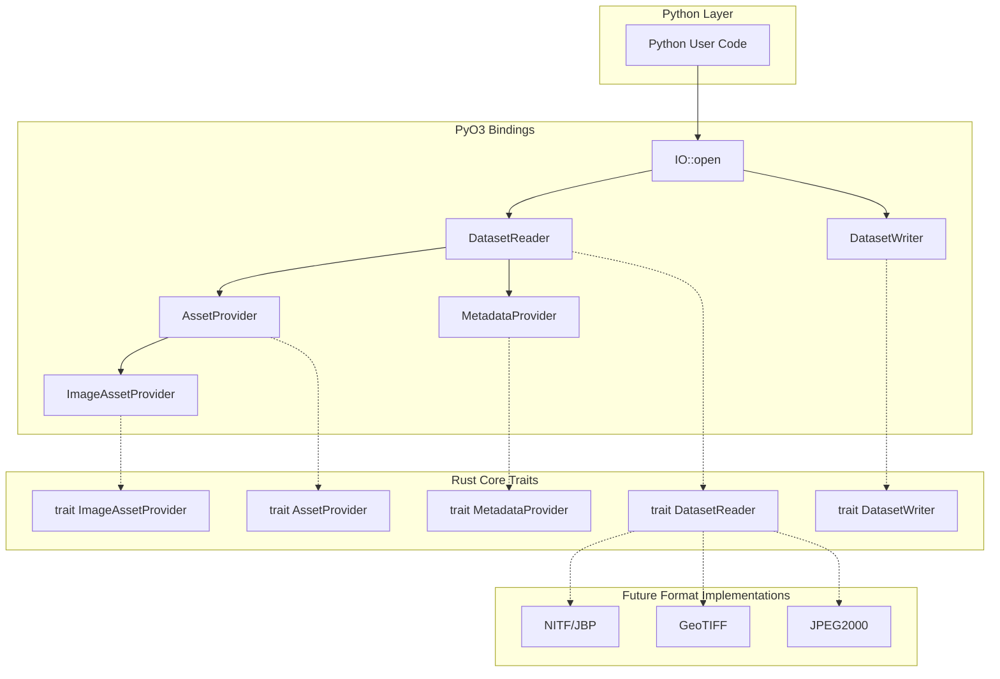

# Design Document: Image IO API

## Overview

This design document describes the foundational image IO API and data structures for the aws-osml-io library. The architecture establishes abstract traits and types in Rust that define the contract for geospatial dataset access, with Python bindings via PyO3. The design follows STAC (SpatioTemporal Asset Catalog) patterns where datasets are collections of keyed assets with rich metadata.

The core design principles are:
1. **Trait-based abstraction**: Rust traits define interfaces that format-specific implementations will fulfill
2. **Asset-centric model**: All content is accessed through typed asset providers with semantic keys
3. **Blocked image access**: Large imagery is accessed tile-by-tile for memory efficiency
4. **Python-first ergonomics**: The API is designed for natural use from Python while leveraging Rust performance

## Architecture



The architecture separates concerns into three layers:
- **Python Layer**: User-facing API with Pythonic conventions
- **PyO3 Bindings**: Bridge layer exposing Rust types to Python
- **Rust Core Traits**: Abstract interfaces defining the contract

## Components and Interfaces

### AssetType Enumeration

```rust
/// Categorizes assets within a dataset
#[pyclass]
#[derive(Clone, Copy, PartialEq, Eq, Hash)]
pub enum AssetType {
    Image,
    Text,
    Graphics,
    Data,
}
```

### MetadataProvider Trait

```rust
/// Provides access to raw and structured metadata
pub trait MetadataProvider: Send + Sync {
    /// Returns raw metadata bytes
    fn raw(&self) -> &[u8];
    
    /// Returns metadata as a dictionary, optionally filtered by section name
    fn as_dict(&self, name: Option<&str>) -> HashMap<String, serde_json::Value>;
}
```

Python binding wrapper:
```rust
#[pyclass]
pub struct PyMetadataProvider {
    inner: Arc<dyn MetadataProvider>,
}

#[pymethods]
impl PyMetadataProvider {
    #[getter]
    fn raw(&self, py: Python<'_>) -> PyResult<PyObject> {
        // Return as BytesIO
    }
    
    #[pyo3(signature = (name=None))]
    fn as_dict(&self, name: Option<&str>) -> PyResult<HashMap<String, PyObject>> {
        // Convert to Python dict
    }
}
```

### AssetProvider Trait

```rust
/// Base trait for all asset types
pub trait AssetProvider: Send + Sync {
    /// Unique identifier for this asset within the dataset
    fn key(&self) -> &str;
    
    /// Human-readable title
    fn title(&self) -> &str;
    
    /// Detailed description
    fn description(&self) -> &str;
    
    /// MIME type of the asset content
    fn media_type(&self) -> &str;
    
    /// Semantic roles (e.g., "data", "thumbnail", "metadata")
    fn roles(&self) -> &[String];
    
    /// Asset category
    fn asset_type(&self) -> AssetType;
    
    /// Raw asset bytes
    fn raw_asset(&self) -> Result<Vec<u8>, CodecError>;
    
    /// Asset-level metadata
    fn metadata(&self) -> Arc<dyn MetadataProvider>;
}
```

### ImageAssetProvider Trait

```rust
/// Trait for blocked/tiled image access
pub trait ImageAssetProvider: AssetProvider {
    /// Check if a block exists at the given coordinates
    fn has_block(&self, block_row: u32, block_col: u32, resolution_level: u32) -> bool;
    
    /// Retrieve block data as a contiguous array
    /// Returns (data, shape) where shape is (rows, cols, bands)
    fn get_block(
        &self,
        block_row: u32,
        block_col: u32,
        resolution_level: u32,
        bands: Option<&[u32]>,
    ) -> Result<(Vec<u8>, [u32; 3]), CodecError>;
    
    /// Number of resolution levels in the image pyramid
    fn num_resolution_levels(&self) -> u32;
    
    /// Number of spectral bands
    fn num_bands(&self) -> u32;
    
    /// Image height at full resolution
    fn num_rows(&self) -> u32;
    
    /// Image width at full resolution
    fn num_columns(&self) -> u32;
    
    /// Block width in pixels
    fn num_pixels_per_block_horizontal(&self) -> u32;
    
    /// Block height in pixels
    fn num_pixels_per_block_vertical(&self) -> u32;
    
    /// Nominal bits per pixel
    fn num_bits_per_pixel(&self) -> u32;
    
    /// Actual bits per pixel (may differ from nominal)
    fn actual_bits_per_pixel(&self) -> u32;
    
    /// Pixel data type identifier
    fn pixel_value_type(&self) -> PixelType;
    
    /// Value used for padding incomplete edge blocks
    fn pad_pixel_value(&self) -> f64;
    
    /// Image dimensions as (rows, columns, bands)
    fn image_shape(&self) -> (u32, u32, u32) {
        (self.num_rows(), self.num_columns(), self.num_bands())
    }
    
    /// Block dimensions as (rows, columns, bands)
    fn block_shape(&self) -> (u32, u32, u32) {
        (
            self.num_pixels_per_block_vertical(),
            self.num_pixels_per_block_horizontal(),
            self.num_bands(),
        )
    }
    
    /// Number of blocks in each dimension as (rows, cols)
    fn block_grid_size(&self) -> (u32, u32) {
        let (h, w, _) = self.image_shape();
        let (bh, bw, _) = self.block_shape();
        ((h + bh - 1) / bh, (w + bw - 1) / bw)
    }
}
```

### PixelType Enumeration

```rust
/// Supported pixel data types
#[pyclass]
#[derive(Clone, Copy, PartialEq, Eq)]
pub enum PixelType {
    UInt8,
    UInt16,
    UInt32,
    Int8,
    Int16,
    Int32,
    Float32,
    Float64,
}

impl PixelType {
    /// Convert to numpy dtype string
    pub fn to_numpy_dtype(&self) -> &'static str {
        match self {
            PixelType::UInt8 => "uint8",
            PixelType::UInt16 => "uint16",
            PixelType::UInt32 => "uint32",
            PixelType::Int8 => "int8",
            PixelType::Int16 => "int16",
            PixelType::Int32 => "int32",
            PixelType::Float32 => "float32",
            PixelType::Float64 => "float64",
        }
    }
    
    /// Bytes per pixel for this type
    pub fn bytes_per_pixel(&self) -> usize {
        match self {
            PixelType::UInt8 | PixelType::Int8 => 1,
            PixelType::UInt16 | PixelType::Int16 => 2,
            PixelType::UInt32 | PixelType::Int32 | PixelType::Float32 => 4,
            PixelType::Float64 => 8,
        }
    }
}
```

### TextAssetProvider Trait

```rust
/// Trait for text content access
pub trait TextAssetProvider: AssetProvider {
    /// Decoded text content
    fn text(&self) -> Result<String, CodecError>;
    
    /// Character encoding (e.g., "UTF-8", "ASCII")
    fn encoding(&self) -> &str;
    
    /// Text format identifier
    fn format(&self) -> &str;
}
```

### DataAssetProvider Trait

```rust
/// Trait for structured data access
pub trait DataAssetProvider: AssetProvider {
    /// MIME type of the data
    fn mime_type(&self) -> &str;
    
    /// Parse content as XML, returns serialized XML string
    fn parse_as_xml(&self) -> Result<String, CodecError>;
    
    /// Parse content as JSON
    fn parse_as_json(&self) -> Result<serde_json::Value, CodecError>;
}
```

### GraphicsAssetProvider Trait

```rust
/// Trait for vector graphics access
pub trait GraphicsAssetProvider: AssetProvider {
    // Graphics-specific methods to be defined by format implementations
    // Base access is through AssetProvider::raw_asset()
}
```

### DatasetReader Trait

```rust
/// Trait for reading datasets
pub trait DatasetReader: Send + Sync {
    /// Get an asset by key
    fn get_asset(&self, key: &str) -> Result<Arc<dyn AssetProvider>, CodecError>;
    
    /// Get asset keys, optionally filtered by type and/or roles
    fn get_asset_keys(
        &self,
        asset_type: Option<AssetType>,
        roles: Option<&[String]>,
    ) -> Vec<String>;
    
    /// Check if an asset exists
    fn has_asset(&self, key: &str) -> bool;
    
    /// Get dataset-level metadata
    fn metadata(&self) -> Arc<dyn MetadataProvider>;
    
    /// Release resources
    fn close(&mut self) -> Result<(), CodecError>;
}
```

Python binding wrapper:
```rust
#[pyclass]
pub struct PyDatasetReader {
    inner: Option<Box<dyn DatasetReader>>,
}

#[pymethods]
impl PyDatasetReader {
    fn get_asset(&self, key: &str) -> PyResult<PyObject> {
        // Return appropriate Python wrapper based on asset type
    }
    
    #[pyo3(signature = (asset_type=None, roles=None))]
    fn get_asset_keys(
        &self,
        asset_type: Option<AssetType>,
        roles: Option<Vec<String>>,
    ) -> PyResult<Vec<String>> {
        // Delegate to inner
    }
    
    fn has_asset(&self, key: &str) -> bool {
        // Delegate to inner
    }
    
    fn get_metadata(&self) -> PyResult<PyMetadataProvider> {
        // Wrap and return
    }
    
    fn close(&mut self) -> PyResult<()> {
        // Close and clear inner
    }
    
    fn __enter__(slf: Py<Self>) -> Py<Self> {
        slf
    }
    
    fn __exit__(
        &mut self,
        _exc_type: Option<PyObject>,
        _exc_val: Option<PyObject>,
        _exc_tb: Option<PyObject>,
    ) -> PyResult<bool> {
        self.close()?;
        Ok(false)
    }
}
```

### DatasetWriter Trait

```rust
/// Trait for writing datasets
pub trait DatasetWriter: Send + Sync {
    /// Add an asset to the dataset
    fn add_asset(
        &mut self,
        key: &str,
        provider: Arc<dyn AssetProvider>,
        title: &str,
        description: &str,
        roles: &[String],
    ) -> Result<(), CodecError>;
    
    /// Set dataset-level metadata
    fn set_metadata(&mut self, metadata: Arc<dyn MetadataProvider>) -> Result<(), CodecError>;
    
    /// Finalize and close the dataset
    fn close(&mut self) -> Result<(), CodecError>;
}
```

### IO Factory

```rust
/// Factory for opening datasets
#[pyclass]
pub struct IO;

#[pymethods]
impl IO {
    /// Open a dataset for reading or writing
    #[staticmethod]
    #[pyo3(signature = (uri, mode="r"))]
    fn open(uri: &str, mode: &str) -> PyResult<PyObject> {
        // Parse URI scheme (file://, s3://, or plain path)
        // Detect format from extension/magic bytes
        // Return appropriate reader or writer
    }
}
```

## Data Models

### Error Types

```rust
#[derive(Error, Debug)]
pub enum CodecError {
    #[error("IO error: {0}")]
    Io(#[from] std::io::Error),

    #[error("Invalid format: {0}")]
    InvalidFormat(String),

    #[error("Unsupported feature: {0}")]
    Unsupported(String),

    #[error("Decode error: {0}")]
    Decode(String),

    #[error("Encode error: {0}")]
    Encode(String),
    
    #[error("Asset not found: {0}")]
    AssetNotFound(String),
    
    #[error("Invalid block coordinates: row={0}, col={1}, level={2}")]
    InvalidBlockCoordinates(u32, u32, u32),
    
    #[error("Invalid resolution level: {0}")]
    InvalidResolutionLevel(u32),
    
    #[error("Parse error: {0}")]
    Parse(String),
    
    #[error("Duplicate asset key: {0}")]
    DuplicateKey(String),
}
```

Python exception mapping:
```rust
impl From<CodecError> for PyErr {
    fn from(err: CodecError) -> PyErr {
        match err {
            CodecError::AssetNotFound(key) => PyKeyError::new_err(key),
            CodecError::DuplicateKey(key) => PyValueError::new_err(format!("Duplicate key: {}", key)),
            CodecError::InvalidBlockCoordinates(r, c, l) => {
                PyIndexError::new_err(format!("Invalid block: row={}, col={}, level={}", r, c, l))
            }
            CodecError::InvalidResolutionLevel(l) => {
                PyValueError::new_err(format!("Invalid resolution level: {}", l))
            }
            CodecError::Parse(msg) => PyValueError::new_err(format!("Parse error: {}", msg)),
            _ => PyIOError::new_err(err.to_string()),
        }
    }
}
```

### Module Structure

```
src/
├── lib.rs              # PyO3 module definition
├── error.rs            # CodecError and Python exception mapping
├── types.rs            # AssetType, PixelType enumerations
├── traits/
│   ├── mod.rs
│   ├── metadata.rs     # MetadataProvider trait
│   ├── asset.rs        # AssetProvider trait
│   ├── image.rs        # ImageAssetProvider trait
│   ├── text.rs         # TextAssetProvider trait
│   ├── data.rs         # DataAssetProvider trait
│   ├── graphics.rs     # GraphicsAssetProvider trait
│   ├── reader.rs       # DatasetReader trait
│   └── writer.rs       # DatasetWriter trait
├── bindings/
│   ├── mod.rs
│   ├── metadata.rs     # PyMetadataProvider
│   ├── asset.rs        # PyAssetProvider, PyImageAssetProvider
│   ├── reader.rs       # PyDatasetReader
│   ├── writer.rs       # PyDatasetWriter
│   └── io.rs           # IO factory
└── util.rs             # Shared utilities
```


## Correctness Properties

*A property is a characteristic or behavior that should hold true across all valid executions of a system—essentially, a formal statement about what the system should do. Properties serve as the bridge between human-readable specifications and machine-verifiable correctness guarantees.*

### Property 1: Asset Key Consistency

*For any* DatasetReader and any key returned by `get_asset_keys()`, calling `has_asset(key)` SHALL return true, and calling `get_asset(key)` SHALL return a valid AssetProvider without raising an exception.

**Validates: Requirements 1.2, 1.3**

### Property 2: Asset Type Filtering

*For any* DatasetReader and any AssetType filter, `get_asset_keys(asset_type=T)` SHALL return only keys whose corresponding assets have `get_asset_type() == T`.

**Validates: Requirements 1.2, 10.2**

### Property 3: Non-Existent Key Error

*For any* DatasetReader and any string key that is not in the set returned by `get_asset_keys()`, calling `get_asset(key)` SHALL raise a KeyError.

**Validates: Requirements 1.7**

### Property 4: Duplicate Key Error

*For any* DatasetWriter and any key that has already been added via `add_asset()`, calling `add_asset()` again with the same key SHALL raise a ValueError.

**Validates: Requirements 2.5**

### Property 5: IO Factory Mode Dispatch

*For any* valid URI, calling `IO.open(uri, mode="r")` SHALL return an object that implements the DatasetReader interface, and calling `IO.open(uri, mode="w")` SHALL return an object that implements the DatasetWriter interface.

**Validates: Requirements 3.2, 3.3**

### Property 6: Image Shape Consistency

*For any* ImageAssetProvider:
- `image_shape` SHALL equal `(num_rows, num_columns, num_bands)`
- `block_shape` SHALL equal `(num_pixels_per_block_vertical, num_pixels_per_block_horizontal, num_bands)`
- `block_grid_size` SHALL equal `(ceil(num_rows / num_pixels_per_block_vertical), ceil(num_columns / num_pixels_per_block_horizontal))`

**Validates: Requirements 5.10, 5.11, 5.12**

### Property 7: Image Property Invariants

*For any* ImageAssetProvider:
- `num_resolution_levels` SHALL be >= 1
- `num_bands` SHALL be >= 1
- `num_rows` SHALL be > 0
- `num_columns` SHALL be > 0
- `num_pixels_per_block_horizontal` SHALL be > 0
- `num_pixels_per_block_vertical` SHALL be > 0
- `num_bits_per_pixel` SHALL be > 0
- `actual_bits_per_pixel` SHALL be > 0

**Validates: Requirements 5.3, 5.4, 5.5, 5.6, 5.7**

### Property 8: Block Coordinate Validation

*For any* ImageAssetProvider and any block coordinates (row, col) where `row >= block_grid_size[0]` or `col >= block_grid_size[1]`, calling `get_block(row, col, 0)` SHALL raise an IndexError.

**Validates: Requirements 5.13**

### Property 9: Resolution Level Validation

*For any* ImageAssetProvider and any resolution level `L >= num_resolution_levels`, calling `get_block(0, 0, L)` SHALL raise a ValueError.

**Validates: Requirements 5.14**

### Property 10: Block Data Shape

*For any* ImageAssetProvider and any valid block coordinates (row, col, level), the ndarray returned by `get_block(row, col, level)` SHALL have shape `(block_height, block_width, num_bands)` where block_height <= num_pixels_per_block_vertical and block_width <= num_pixels_per_block_horizontal (edge blocks may be smaller).

**Validates: Requirements 5.2**

### Property 11: Metadata Filtering

*For any* MetadataProvider with multiple named sections:
- `as_dict(name=N)` SHALL return a dictionary containing only the section named N
- `as_dict()` SHALL return a dictionary containing all sections

**Validates: Requirements 6.3, 6.4**

### Property 12: Parse Error Handling

*For any* DataAssetProvider whose content is not valid XML, calling `parse_as_xml()` SHALL raise a ParseError. *For any* DataAssetProvider whose content is not valid JSON, calling `parse_as_json()` SHALL raise a ParseError.

**Validates: Requirements 8.4, 8.5**

### Property 13: Python Exception Mapping

*For any* CodecError raised by the Rust implementation:
- `AssetNotFound` SHALL map to Python `KeyError`
- `DuplicateKey` SHALL map to Python `ValueError`
- `InvalidBlockCoordinates` SHALL map to Python `IndexError`
- `InvalidResolutionLevel` SHALL map to Python `ValueError`
- `Parse` SHALL map to Python `ValueError`
- All other errors SHALL map to Python `IOError`

**Validates: Requirements 11.4**

## Error Handling

### Error Categories

1. **IO Errors**: File not found, permission denied, network failures
   - Mapped to Python `IOError`
   - Include original error message for debugging

2. **Format Errors**: Invalid file format, corrupted data
   - `InvalidFormat` for unrecognized file types
   - `Decode` for corrupted or malformed data
   - Mapped to Python `IOError`

3. **Access Errors**: Invalid keys, coordinates, or parameters
   - `AssetNotFound` → Python `KeyError`
   - `InvalidBlockCoordinates` → Python `IndexError`
   - `InvalidResolutionLevel` → Python `ValueError`
   - `DuplicateKey` → Python `ValueError`

4. **Parse Errors**: XML/JSON parsing failures
   - `Parse` → Python `ValueError`
   - Include parse location when available

### Error Context

All errors should include sufficient context for debugging:
- File path or URI when applicable
- Asset key for asset-related errors
- Block coordinates for block access errors
- Original error message from underlying libraries

## Testing Strategy

### Unit Tests

Unit tests verify specific examples and edge cases:

1. **Enumeration tests**: Verify AssetType and PixelType variants exist and are comparable
2. **Error construction tests**: Verify CodecError variants can be created with appropriate messages
3. **PixelType conversion tests**: Verify `to_numpy_dtype()` and `bytes_per_pixel()` return correct values
4. **Context manager tests**: Verify `__enter__` and `__exit__` work correctly

### Property-Based Tests

Property-based tests verify universal properties across generated inputs. Use the `proptest` crate for Rust and `hypothesis` for Python integration tests.

**Configuration**: Minimum 100 iterations per property test.

**Tag format**: `Feature: image-io-api, Property {number}: {property_text}`

Property tests to implement:

1. **Property 1 test**: Generate mock datasets with random assets, verify key consistency
2. **Property 2 test**: Generate datasets with mixed asset types, verify filtering
3. **Property 3 test**: Generate random non-existent keys, verify KeyError
4. **Property 4 test**: Generate random keys, add twice, verify ValueError
5. **Property 6 test**: Generate random image dimensions, verify shape consistency
6. **Property 7 test**: Generate random ImageAssetProvider configs, verify invariants
7. **Property 8 test**: Generate out-of-bounds coordinates, verify IndexError
8. **Property 9 test**: Generate invalid resolution levels, verify ValueError
9. **Property 10 test**: Generate valid coordinates, verify block shape
10. **Property 13 test**: Generate each CodecError variant, verify Python exception type

### Integration Tests

Integration tests verify end-to-end behavior with real files:

1. **Round-trip test**: Write dataset, read back, verify content matches
2. **Context manager test**: Verify resources are released after `with` block
3. **Python interop test**: Verify numpy arrays are correctly passed between Rust and Python
