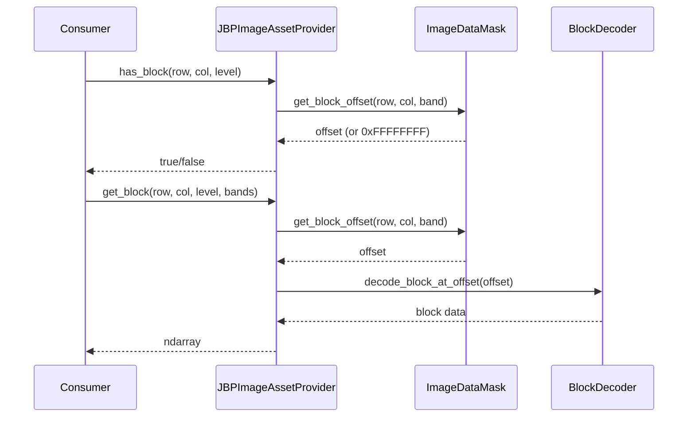
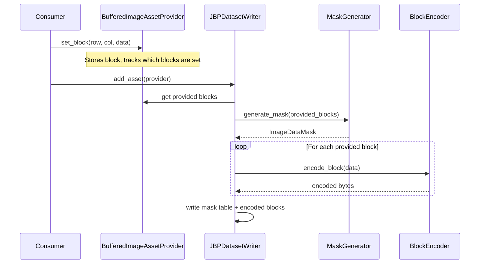

# Design Document: Phase 6 - Image Masking

## Overview

This design document describes the implementation of image masking support for the osml-imagery-io library. Image masking enables NITF files to efficiently store sparse or irregular imagery where some blocks may be empty (masked out) or contain pad pixels.

The implementation adds support for:
- Parsing the Image Data Mask table (JBP Table 5.13-9)
- Reading masked images with IC values: NM, M1, M3, M4, M5, M7, M8, M9, MA, MB, MC, MD, ME
- Writing masked images with automatic mask table generation
- Masked JPEG 2000 variants (M8, MD) building on Phase 5's J2K support

The design maintains backward compatibility with the existing `ImageAssetProvider` interface - consumers use `has_block()` to check block availability and `get_block()` to retrieve data, regardless of whether the underlying image is masked.

## Architecture

The masking implementation integrates into the existing JBP module hierarchy:

```
src/jbp/
├── image/
│   ├── mod.rs
│   ├── decoder.rs      # BlockDecoder trait, UncompressedBlockDecoder
│   ├── encoder.rs      # BlockEncoder trait, UncompressedBlockEncoder
│   ├── mask.rs         # NEW: ImageDataMask struct and parsing/writing
│   ├── types.rs        # Existing image types
│   └── ...
├── asset.rs            # JBPImageAssetProvider (updated for masking)
├── writer.rs           # JBPDatasetWriter (updated for mask generation)
└── ...
```

### Data Flow - Reading Masked Images



### Data Flow - Writing Masked Images



## Components and Interfaces

### ImageDataMask Struct

The core data structure for mask information, located in `src/jbp/image/mask.rs`:

```rust
/// Image Data Mask table as defined in JBP Table 5.13-9.
///
/// This structure contains block offsets and pad pixel information for
/// masked images. It is present when the IC field contains a masked
/// compression type (NM, M1, M3, M4, M5, M7, M8, M9, MA, MB, MC, MD, ME).
#[derive(Debug, Clone)]
pub struct ImageDataMask {
    /// Offset from start of mask to start of image data (IMDATOFF)
    pub image_data_offset: u32,
    
    /// Length of each block mask record in bytes (BMRLNTH)
    /// 0 = no block mask, 4 = 32-bit offsets
    pub block_mask_record_length: u16,
    
    /// Length of each pad pixel mask record in bytes (TMRLNTH)
    pub pad_pixel_mask_record_length: u16,
    
    /// Number of bits in pad pixel code (TPXCDLNTH)
    pub pad_pixel_code_length: u16,
    
    /// Pad pixel code value (TPXCD)
    /// Only present if pad_pixel_code_length > 0
    pub pad_pixel_code: Option<u32>,
    
    /// Block mask records: offsets for each block
    /// Indexed as [block_index] where block_index = row * num_blocks_per_row + col
    /// For IMODE=S, indexed as [block_index * num_bands + band]
    /// Value of 0xFFFFFFFF indicates an empty (masked) block
    pub block_offsets: Vec<u32>,
    
    /// Pad pixel mask records (if TMRLNTH > 0)
    pub pad_pixel_offsets: Vec<u32>,
}

/// Sentinel value indicating an empty (masked) block
pub const EMPTY_BLOCK_OFFSET: u32 = 0xFFFFFFFF;
```

### ImageDataMask Methods

```rust
impl ImageDataMask {
    /// Parse an Image Data Mask from binary data.
    ///
    /// # Arguments
    /// * `data` - Raw bytes starting at the mask table
    /// * `num_blocks` - Total number of blocks (NBPR * NBPC)
    /// * `num_bands` - Number of bands in the image
    /// * `imode` - Interleave mode (affects block count for IMODE=S)
    ///
    /// # Returns
    /// Parsed ImageDataMask and the number of bytes consumed
    pub fn parse(
        data: &[u8],
        num_blocks: u32,
        num_bands: u32,
        imode: InterleaveMode,
    ) -> Result<(Self, usize), CodecError>;

    /// Write the Image Data Mask to binary format.
    ///
    /// # Returns
    /// Serialized mask table bytes
    pub fn to_bytes(&self) -> Vec<u8>;

    /// Check if a block is present (not masked).
    ///
    /// # Arguments
    /// * `block_row` - Block row index
    /// * `block_col` - Block column index
    /// * `num_blocks_per_row` - Number of blocks per row (NBPR)
    /// * `band` - Band index (only used for IMODE=S)
    /// * `imode` - Interleave mode
    ///
    /// # Returns
    /// true if block has valid data, false if masked (empty)
    pub fn has_block(
        &self,
        block_row: u32,
        block_col: u32,
        num_blocks_per_row: u32,
        band: u32,
        imode: InterleaveMode,
    ) -> bool;

    /// Get the offset to a block's data.
    ///
    /// # Returns
    /// Some(offset) if block is present, None if masked
    pub fn get_block_offset(
        &self,
        block_row: u32,
        block_col: u32,
        num_blocks_per_row: u32,
        band: u32,
        imode: InterleaveMode,
    ) -> Option<u64>;

    /// Get the pad pixel value if defined.
    pub fn pad_pixel_value(&self) -> Option<u32>;

    /// Create a new mask from a set of provided block indices.
    ///
    /// # Arguments
    /// * `provided_blocks` - Set of (row, col) tuples for blocks that have data
    /// * `num_blocks_per_row` - Number of blocks per row (NBPR)
    /// * `num_blocks_per_col` - Number of blocks per column (NBPC)
    /// * `num_bands` - Number of bands
    /// * `imode` - Interleave mode
    ///
    /// # Returns
    /// New ImageDataMask with offsets set to 0 for provided blocks
    /// and 0xFFFFFFFF for missing blocks. Actual offsets are updated
    /// during encoding.
    pub fn from_provided_blocks(
        provided_blocks: &HashSet<(u32, u32)>,
        num_blocks_per_row: u32,
        num_blocks_per_col: u32,
        num_bands: u32,
        imode: InterleaveMode,
    ) -> Self;
}
```

### IC Field Classification

Helper functions to classify IC values:

```rust
/// Check if an IC value indicates a masked image.
pub fn is_masked_ic(ic: &str) -> bool {
    matches!(ic, "NM" | "M1" | "M3" | "M4" | "M5" | "M7" | "M8" | "M9" | "MA" | "MB" | "MC" | "MD" | "ME")
}

/// Get the non-masked equivalent of a masked IC value.
pub fn unmask_ic(ic: &str) -> &str {
    match ic {
        "NM" => "NC",
        "M1" => "C1",
        "M3" => "C3",
        "M4" => "C4",
        "M5" => "C5",
        "M7" => "C7",
        "M8" => "C8",
        "M9" => "C9",
        "MA" => "CA",
        "MB" => "CB",
        "MC" => "CC",
        "MD" => "CD",
        "ME" => "CE",
        other => other,
    }
}

/// Get the masked equivalent of a non-masked IC value.
pub fn mask_ic(ic: &str) -> &str {
    match ic {
        "NC" => "NM",
        "C1" => "M1",
        "C3" => "M3",
        "C4" => "M4",
        "C5" => "M5",
        "C7" => "M7",
        "C8" => "M8",
        "C9" => "M9",
        "CA" => "MA",
        "CB" => "MB",
        "CC" => "MC",
        "CD" => "MD",
        "CE" => "ME",
        other => other,
    }
}
```

### Updated JBPImageAssetProvider

The existing `JBPImageAssetProvider` is updated to use the mask when present:

```rust
impl JBPImageAssetProvider {
    // Existing fields...
    
    /// Image data mask (present for masked IC values)
    mask: Option<ImageDataMask>,
}

impl ImageAssetProvider for JBPImageAssetProvider {
    fn has_block(&self, block_row: u32, block_col: u32, resolution_level: u32) -> bool {
        // For non-masked images, check bounds only
        if self.mask.is_none() {
            return self.is_valid_block_coordinate(block_row, block_col, resolution_level);
        }
        
        // For masked images, check the mask
        let mask = self.mask.as_ref().unwrap();
        mask.has_block(block_row, block_col, self.num_blocks_per_row, 0, self.imode)
    }
    
    fn get_block(
        &self,
        block_row: u32,
        block_col: u32,
        resolution_level: u32,
        bands: Option<&[u32]>,
    ) -> Result<Array3<T>, CodecError> {
        // Validate block exists
        if !self.has_block(block_row, block_col, resolution_level) {
            return Err(CodecError::BlockNotFound { row: block_row, col: block_col });
        }
        
        // For masked images, use offset from mask
        if let Some(mask) = &self.mask {
            let offset = mask.get_block_offset(
                block_row, block_col, self.num_blocks_per_row, 0, self.imode
            ).ok_or(CodecError::BlockNotFound { row: block_row, col: block_col })?;
            
            return self.decoder.decode_block_at_offset(offset, block_row, block_col, bands);
        }
        
        // Non-masked: use standard block offset calculation
        self.decoder.decode_block(block_row, block_col, resolution_level, bands)
    }
    
    fn pad_pixel_value(&self) -> Option<Number> {
        self.mask.as_ref()
            .and_then(|m| m.pad_pixel_value())
            .map(|v| Number::from(v))
    }
}
```

### Updated BlockDecoder Trait

The `BlockDecoder` trait is extended to support offset-based decoding:

```rust
pub trait BlockDecoder: Send + Sync {
    // Existing methods...
    
    /// Decode a block at a specific byte offset.
    ///
    /// This is used for masked images where block offsets come from
    /// the Image Data Mask rather than being calculated.
    fn decode_block_at_offset(
        &self,
        offset: u64,
        block_row: u32,
        block_col: u32,
        bands: Option<&[u32]>,
    ) -> Result<Array3<T>, CodecError>;
}
```

### Updated JBPDatasetWriter

The writer is updated to handle masked IC values and generate mask tables:

```rust
impl JBPDatasetWriter {
    fn write_image_segment(
        &mut self,
        provider: &dyn ImageAssetProvider,
        metadata: &dyn MetadataProvider,
    ) -> Result<(), CodecError> {
        let ic = metadata.get("IC").unwrap_or("NC");
        let is_masked = is_masked_ic(ic);
        
        // Collect which blocks are provided
        let provided_blocks = self.collect_provided_blocks(provider);
        let total_blocks = provider.block_grid_size().0 * provider.block_grid_size().1;
        
        // Validate: non-masked IC requires all blocks
        if !is_masked && provided_blocks.len() < total_blocks as usize {
            return Err(CodecError::MissingBlocks {
                expected: total_blocks,
                provided: provided_blocks.len() as u32,
                ic: ic.to_string(),
            });
        }
        
        // Generate mask if needed
        let mask = if is_masked {
            Some(ImageDataMask::from_provided_blocks(
                &provided_blocks,
                provider.block_grid_size().1,
                provider.block_grid_size().0,
                provider.num_bands() as u32,
                self.get_imode(metadata),
            ))
        } else {
            None
        };
        
        // Write image subheader, mask table, and encoded blocks
        self.write_image_subheader(provider, metadata)?;
        if let Some(ref mask) = mask {
            self.write_mask_table(mask)?;
        }
        self.write_image_blocks(provider, mask.as_ref())?;
        
        Ok(())
    }
    
    fn collect_provided_blocks(
        &self,
        provider: &dyn ImageAssetProvider,
    ) -> HashSet<(u32, u32)> {
        let (grid_rows, grid_cols) = provider.block_grid_size();
        let mut provided = HashSet::new();
        
        for row in 0..grid_rows {
            for col in 0..grid_cols {
                if provider.has_block(row, col, 0) {
                    provided.insert((row, col));
                }
            }
        }
        
        provided
    }
}
```

### Updated BufferedImageAssetProvider

The buffered provider tracks which blocks have been set:

```rust
impl BufferedImageAssetProvider {
    /// Set of block coordinates that have been set via set_block()
    provided_blocks: HashSet<(u32, u32)>,
}

impl BufferedImageAssetProvider {
    pub fn set_block(&mut self, block_row: u32, block_col: u32, data: &[u8]) -> Result<(), CodecError> {
        // Existing implementation...
        self.provided_blocks.insert((block_row, block_col));
        Ok(())
    }
    
    pub fn has_block(&self, block_row: u32, block_col: u32, _resolution_level: u32) -> bool {
        self.provided_blocks.contains(&(block_row, block_col))
    }
}
```

## Data Models

### Image Data Mask Binary Format (JBP Table 5.13-9)

The mask table has the following binary layout:

| Field | Size | Type | Description |
|-------|------|------|-------------|
| IMDATOFF | 4 bytes | u32 BE | Offset to image data from start of mask |
| BMRLNTH | 2 bytes | u16 BE | Block mask record length (0 or 4) |
| TMRLNTH | 2 bytes | u16 BE | Pad pixel mask record length |
| TPXCDLNTH | 2 bytes | u16 BE | Pad pixel code length in bits |
| TPXCD | variable | binary | Pad pixel code (if TPXCDLNTH > 0) |
| BMRnBNDm | 4 bytes each | u32 BE | Block offsets (if BMRLNTH > 0) |
| TMRnBNDm | variable | binary | Pad pixel offsets (if TMRLNTH > 0) |

### Block Offset Indexing

For IMODE B, P, R (band-interleaved modes):
- Number of block mask records = NBPR × NBPC
- Index = block_row × NBPR + block_col

For IMODE S (band-sequential mode):
- Number of block mask records = NBPR × NBPC × NBANDS
- Index = (block_row × NBPR + block_col) × NBANDS + band

### IC Value Mapping

| Non-Masked | Masked | Compression Type |
|------------|--------|------------------|
| NC | NM | Uncompressed |
| C1 | M1 | Bi-level |
| C3 | M3 | JPEG DCT |
| C4 | M4 | Vector Quantization |
| C5 | M5 | Lossless JPEG |
| C7 | M7 | SARzip |
| C8 | M8 | JPEG 2000 |
| C9 | M9 | H.264 |
| CA | MA | H.265 |
| CB | MB | Multi-frame J2K |
| CC | MC | ZLIB |
| CD | MD | HTJ2K |
| CE | ME | Multi-frame HTJ2K |


## Correctness Properties

*A property is a characteristic or behavior that should hold true across all valid executions of a system—essentially, a formal statement about what the system should do. Properties serve as the bridge between human-readable specifications and machine-verifiable correctness guarantees.*

Based on the acceptance criteria analysis, the following correctness properties must be validated:

### Property 1: Mask Roundtrip Consistency

*For any* valid ImageDataMask, serializing to bytes then parsing back SHALL produce an equivalent ImageDataMask with identical field values (IMDATOFF, BMRLNTH, TMRLNTH, TPXCDLNTH, TPXCD, block_offsets, pad_pixel_offsets).

**Validates: Requirements 1.2, 4.5, 8.1**

### Property 2: has_block Correctness for Masked Blocks

*For any* masked image and *for any* block coordinate, has_block() SHALL return false if and only if the block's offset in the mask equals 0xFFFFFFFF (the empty block sentinel).

**Validates: Requirements 2.1, 2.2, 6.5, 8.2, 8.4**

### Property 3: Valid Block Decoding in Masked Images

*For any* masked image and *for any* block where has_block() returns true, get_block() SHALL return block data that matches the original data provided during writing.

**Validates: Requirements 2.4, 8.1**

### Property 4: Mask Generation from Sparse Data

*For any* set of provided blocks (via set_block()) with a masked IC value, the generated ImageDataMask SHALL have valid offsets for provided blocks and 0xFFFFFFFF for missing blocks.

**Validates: Requirements 4.2, 4.3, 5.2, 5.3**

### Property 5: Non-Masked IC Validation

*For any* non-masked IC value (NC, C8, CD, etc.) and *for any* image where not all blocks are provided, the writer SHALL raise a missing-block error.

**Validates: Requirements 7.2, 7.3**

### Property 6: Pad Pixel Value Preservation

*For any* masked image with a defined pad pixel code (TPXCDLNTH > 0), writing then reading SHALL preserve the pad pixel value exactly.

**Validates: Requirements 3.1, 3.3, 8.3**

### Property 7: Masked Block Pattern Preservation

*For any* masked image, the set of block coordinates where has_block() returns false SHALL be identical before writing and after reading.

**Validates: Requirements 8.2, 8.4**

## Error Handling

### Error Types

The following error variants are added to `CodecError`:

```rust
pub enum CodecError {
    // Existing variants...
    
    /// Block not found (masked or out of bounds)
    BlockNotFound {
        row: u32,
        col: u32,
    },
    
    /// Missing blocks when non-masked IC is used
    MissingBlocks {
        expected: u32,
        provided: u32,
        ic: String,
    },
    
    /// Invalid mask table format
    InvalidMaskTable {
        reason: String,
    },
    
    /// Block offset out of bounds
    BlockOffsetOutOfBounds {
        offset: u64,
        data_length: u64,
    },
}
```

### Error Scenarios

| Scenario | Error | Recovery |
|----------|-------|----------|
| get_block() on masked block | BlockNotFound | Check has_block() first |
| Non-masked IC with missing blocks | MissingBlocks | Use masked IC or provide all blocks |
| Corrupt mask table | InvalidMaskTable | File is invalid, cannot recover |
| Block offset beyond data | BlockOffsetOutOfBounds | File is corrupt, cannot recover |

### Validation Rules

1. **Mask presence validation**: When IC is masked, mask table MUST be present
2. **Block count validation**: Number of block offsets MUST equal NBPR × NBPC (or × NBANDS for IMODE=S)
3. **Offset bounds validation**: Non-empty block offsets MUST be within image data bounds
4. **IMDATOFF validation**: IMDATOFF MUST equal the calculated mask table size

## Testing Strategy

### Dual Testing Approach

Testing combines unit tests for specific examples and edge cases with property-based tests for universal correctness properties.

**Unit Tests** focus on:
- Specific mask table binary formats
- Edge cases (single block, all blocks masked, no blocks masked)
- Error conditions (corrupt mask, invalid offsets)
- IC value classification functions

**Property Tests** focus on:
- Roundtrip consistency across many generated inputs
- has_block() correctness for random mask patterns
- Block data preservation through encode/decode cycles

### Property-Based Testing Configuration

- **Library**: Hypothesis (Python) for integration tests, proptest (Rust) for unit tests
- **Minimum iterations**: 100 per property test
- **Tag format**: `Feature: image-masking, Property N: {property_text}`

### Test Strategies

New Hypothesis strategies for masked image generation:

```python
# tests/property/strategies.py additions

@st.composite
def mask_patterns(draw, num_block_rows: int, num_block_cols: int):
    """Strategy for generating block mask patterns.
    
    Returns a set of (row, col) tuples indicating which blocks are present.
    """
    pattern_type = draw(st.sampled_from([
        "all_present",      # No blocks masked
        "all_masked",       # All blocks masked (edge case)
        "checkerboard",     # Alternating pattern
        "border_only",      # Only edge blocks present
        "random",           # Random subset of blocks
        "single_block",     # Only one block present
    ]))
    
    all_blocks = {(r, c) for r in range(num_block_rows) for c in range(num_block_cols)}
    
    if pattern_type == "all_present":
        return all_blocks
    elif pattern_type == "all_masked":
        return set()
    elif pattern_type == "checkerboard":
        return {(r, c) for r, c in all_blocks if (r + c) % 2 == 0}
    elif pattern_type == "border_only":
        return {(r, c) for r, c in all_blocks 
                if r == 0 or r == num_block_rows - 1 or c == 0 or c == num_block_cols - 1}
    elif pattern_type == "single_block":
        return {draw(st.sampled_from(list(all_blocks)))} if all_blocks else set()
    else:  # random
        return set(draw(st.lists(st.sampled_from(list(all_blocks)), unique=True)))


@st.composite  
def masked_image(
    draw,
    min_size: int = 32,
    max_size: int = 128,
    min_bands: int = 1,
    max_bands: int = 3,
) -> Tuple[np.ndarray, PixelType, int, int, int, Set[Tuple[int, int]], str]:
    """Strategy for generating masked images with metadata.
    
    Returns:
        Tuple of (array, pixel_type, num_bands, num_rows, num_cols, 
                  provided_blocks, ic_value)
    """
    # Generate base image parameters
    pixel_type = draw(pixel_types())
    num_rows, num_cols = draw(image_dimensions(min_size=min_size, max_size=max_size))
    num_bands = draw(band_counts(min_bands=min_bands, max_bands=max_bands))
    block_height, block_width = draw(block_sizes())
    
    # Calculate block grid
    num_block_rows = (num_rows + block_height - 1) // block_height
    num_block_cols = (num_cols + block_width - 1) // block_width
    
    # Generate mask pattern
    provided_blocks = draw(mask_patterns(num_block_rows, num_block_cols))
    
    # Choose IC value (masked variant)
    ic_value = draw(st.sampled_from(["NM", "M8"]))
    
    # Generate image data
    dtype = get_numpy_dtype(pixel_type)
    array = draw(arrays(dtype=dtype, shape=(num_bands, num_rows, num_cols)))
    
    return (array, pixel_type, num_bands, num_rows, num_cols, 
            provided_blocks, ic_value, block_height, block_width)
```

### Test File Organization

```
tests/
├── property/
│   ├── strategies.py          # Updated with mask_patterns, masked_image
│   ├── test_roundtrip.py      # Updated to include masked image roundtrip
│   ├── test_block_access.py   # Updated to include masked block access
│   └── test_masking.py        # NEW: Mask-specific property tests
└── test_jbp_masking.py        # NEW: Unit tests for masking
```

### Synthetic Image Generator Updates

The `scripts/generate_synthetic_image.py` script is extended with masking options:

```bash
# Generate masked image with checkerboard pattern
python scripts/generate_synthetic_image.py output.ntf --masked --mask-pattern checkerboard

# Generate masked image with random pattern (50% blocks masked)
python scripts/generate_synthetic_image.py output.ntf --masked --mask-pattern random --mask-ratio 0.5

# Generate masked J2K image
python scripts/generate_synthetic_image.py output.ntf --masked --compression C8
```

New command-line arguments:
- `--masked`: Enable masked output (uses NM for uncompressed, M8 for J2K)
- `--mask-pattern`: Pattern type (checkerboard, border, random, single)
- `--mask-ratio`: For random pattern, fraction of blocks to mask (0.0-1.0)
