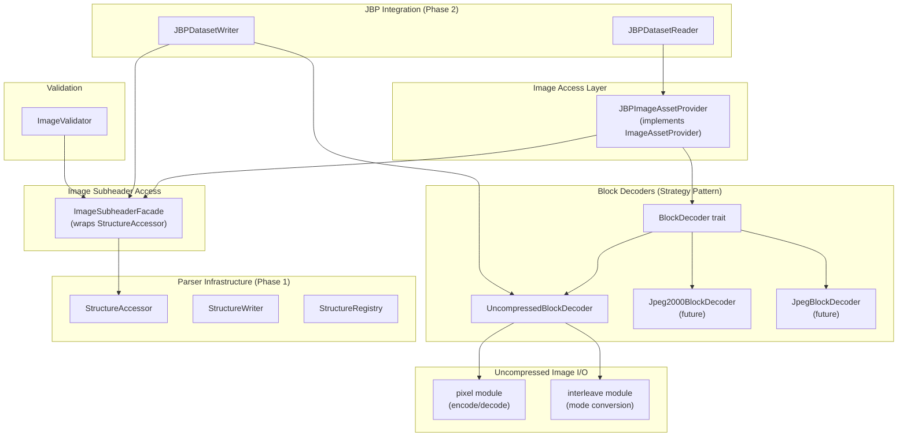

# Design Document: Image Segment Structure

## Overview

This design describes the Image Segment Structure support for Phase 4 of the JBP implementation. The design enables parsing, validation, and writing of NITF image subheaders, along with reading and writing uncompressed imagery with single and multi-band support. The implementation leverages the data-driven parser infrastructure from Phase 1 and integrates with the JBPDatasetReader/Writer from Phase 2.

### Key Design Decisions

1. **Facade Pattern over StructureAccessor**: Instead of creating a separate `ImageSubheader` struct, we use an `ImageSubheaderFacade` that wraps `StructureAccessor` and provides typed access to image-specific fields. This maintains flexibility for different NITF versions while providing a convenient API.

2. **Strategy Pattern for Image Decoders**: Image data decoding uses a `BlockDecoder` trait with implementations for different compression types. This phase implements `UncompressedBlockDecoder`; future phases will add `Jpeg2000BlockDecoder`, `JpegBlockDecoder`, etc.

3. **Extend JBPImageAssetProvider**: The existing `JBPImageAssetProvider` is extended to implement the `ImageAssetProvider` trait, delegating to the appropriate `BlockDecoder` based on the IC field.

4. **Pixel Codec Module**: A new `pixel` module handles encoding/decoding of all PVTYPE values with proper byte ordering.

5. **Interleave Conversion**: A new `interleave` module provides utilities for converting between IMODE formats.

6. **Validation Integration**: Image validation integrates with the existing validation infrastructure from Phase 0.

## Architecture



## Components and Interfaces

### ImageSubheaderFacade

A facade that wraps `StructureAccessor` to provide typed, convenient access to image subheader fields. This pattern allows the underlying structure definition to vary (e.g., NITF 2.0 vs 2.1) while presenting a consistent API.

```rust
/// Facade providing typed access to image subheader fields via StructureAccessor
pub struct ImageSubheaderFacade<'a> {
    accessor: StructureAccessor<'a>,
}

impl<'a> ImageSubheaderFacade<'a> {
    /// Create a facade from a StructureAccessor
    pub fn new(accessor: StructureAccessor<'a>) -> Self;
    
    /// Create from raw bytes using the appropriate structure definition
    pub fn from_bytes(
        data: &'a [u8],
        registry: &StructureRegistry,
        format: NitfFormat,
    ) -> Result<Self, CodecError>;
    
    // Identification fields
    pub fn iid1(&self) -> Result<&str, CodecError>;
    pub fn iid2(&self) -> Result<&str, CodecError>;
    pub fn idatim(&self) -> Result<&str, CodecError>;
    pub fn tgtid(&self) -> Result<&str, CodecError>;
    pub fn isorce(&self) -> Result<&str, CodecError>;
    
    // Dimension fields
    pub fn nrows(&self) -> Result<u32, CodecError>;
    pub fn ncols(&self) -> Result<u32, CodecError>;
    
    // Pixel characteristics
    pub fn pvtype(&self) -> Result<PixelValueType, CodecError>;
    pub fn irep(&self) -> Result<ImageRepresentation, CodecError>;
    pub fn icat(&self) -> Result<&str, CodecError>;
    pub fn abpp(&self) -> Result<u8, CodecError>;
    pub fn nbpp(&self) -> Result<u8, CodecError>;
    pub fn pjust(&self) -> Result<PixelJustification, CodecError>;
    
    // Blocking parameters
    pub fn nbpr(&self) -> Result<u32, CodecError>;
    pub fn nbpc(&self) -> Result<u32, CodecError>;
    pub fn nppbh(&self) -> Result<u32, CodecError>;
    pub fn nppbv(&self) -> Result<u32, CodecError>;
    pub fn imode(&self) -> Result<InterleaveMode, CodecError>;
    
    // Band information
    pub fn band_count(&self) -> Result<usize, CodecError>;
    pub fn band_info(&self, index: usize) -> Result<BandInfoFacade<'a>, CodecError>;
    
    // Compression
    pub fn ic(&self) -> Result<&str, CodecError>;
    pub fn comrat(&self) -> Result<Option<&str>, CodecError>;
    
    // Computed helpers
    pub fn bytes_per_pixel(&self) -> Result<usize, CodecError>;
    pub fn block_size_bytes(&self) -> Result<usize, CodecError>;
    pub fn image_data_size(&self) -> Result<u64, CodecError>;
    pub fn is_uncompressed(&self) -> Result<bool, CodecError> {
        let ic = self.ic()?;
        Ok(ic == "NC" || ic == "NM")
    }
    
    /// Get the underlying accessor for direct field access
    pub fn accessor(&self) -> &StructureAccessor<'a>;
}
```

### BandInfoFacade

A facade for accessing per-band metadata.

```rust
/// Facade for per-band metadata access
pub struct BandInfoFacade<'a> {
    accessor: &'a StructureAccessor<'a>,
    index: usize,
    use_extended: bool, // true if using band_info_extended (XBANDS)
}

impl<'a> BandInfoFacade<'a> {
    pub fn irepband(&self) -> Result<&str, CodecError>;
    pub fn isubcat(&self) -> Result<&str, CodecError>;
    pub fn ifc(&self) -> Result<char, CodecError>;
    pub fn imflt(&self) -> Result<&str, CodecError>;
    pub fn nluts(&self) -> Result<u8, CodecError>;
    pub fn nelut(&self) -> Result<Option<u32>, CodecError>;
    pub fn lut_data(&self, lut_index: usize) -> Result<Option<&[u8]>, CodecError>;
}
```

### BlockDecoder Trait (Strategy Pattern)

The `BlockDecoder` trait defines the interface for decoding image blocks. Different compression formats implement this trait, allowing `JBPImageAssetProvider` to delegate to the appropriate decoder.

```rust
/// Trait for decoding image blocks from various compression formats
pub trait BlockDecoder: Send + Sync {
    /// Decode a single block of image data
    fn decode_block(
        &self,
        image_data: &[u8],
        block_row: u32,
        block_col: u32,
        bands: Option<&[u32]>,
    ) -> Result<(Vec<u8>, [u32; 3]), CodecError>;
    
    /// Check if a block exists (for masked images)
    fn has_block(&self, block_row: u32, block_col: u32) -> bool;
    
    /// Get the compression type identifier
    fn compression_type(&self) -> &str;
    
    /// Get the number of resolution levels (1 for uncompressed)
    fn num_resolution_levels(&self) -> u32;
}

/// Factory function to create the appropriate decoder based on IC field
pub fn create_block_decoder(
    subheader: &ImageSubheaderFacade,
    image_data: Arc<[u8]>,
) -> Result<Box<dyn BlockDecoder>, CodecError>;
```

### UncompressedBlockDecoder

Implementation of `BlockDecoder` for uncompressed imagery (IC=NC, NM).

```rust
/// Block decoder for uncompressed NITF imagery
pub struct UncompressedBlockDecoder {
    image_data: Arc<[u8]>,
    nrows: u32,
    ncols: u32,
    nbpr: u32,
    nbpc: u32,
    nppbh: u32,
    nppbv: u32,
    nbands: u32,
    nbpp: u8,
    abpp: u8,
    pvtype: PixelValueType,
    pjust: PixelJustification,
    imode: InterleaveMode,
}

impl UncompressedBlockDecoder {
    /// Create from image subheader facade
    pub fn new(
        subheader: &ImageSubheaderFacade,
        image_data: Arc<[u8]>,
    ) -> Result<Self, CodecError>;
    
    /// Calculate byte offset for a block
    fn block_offset(&self, block_row: u32, block_col: u32) -> u64;
    
    /// Calculate block size in bytes
    fn block_size(&self) -> usize;
}

impl BlockDecoder for UncompressedBlockDecoder {
    fn decode_block(
        &self,
        image_data: &[u8],
        block_row: u32,
        block_col: u32,
        bands: Option<&[u32]>,
    ) -> Result<(Vec<u8>, [u32; 3]), CodecError> {
        // 1. Validate block coordinates
        // 2. Calculate block offset based on IMODE
        // 3. Read raw block data
        // 4. Convert interleave to band-sequential if needed
        // 5. Apply band selection if specified
        // 6. Handle edge blocks (partial blocks)
        // 7. Return (data, [rows, cols, bands])
    }
    
    fn has_block(&self, block_row: u32, block_col: u32) -> bool {
        block_row < self.nbpc && block_col < self.nbpr
    }
    
    fn compression_type(&self) -> &str { "NC" }
    
    fn num_resolution_levels(&self) -> u32 { 1 }
}
```

### Future Block Decoders (Extension Points)

```rust
// Future Phase: JPEG 2000 compression
pub struct Jpeg2000BlockDecoder {
    // Will wrap OpenJPEG or similar library
    // Supports multiple resolution levels
}

// Future Phase: JPEG DCT compression  
pub struct JpegBlockDecoder {
    // Will wrap libjpeg or similar library
}

// Future Phase: Masked imagery
pub struct MaskedBlockDecoder<D: BlockDecoder> {
    inner: D,
    mask: ImageDataMask,
}
```

### LookUpTable Struct

Represents a single look-up table.

```rust
/// Look-up table for indexed color mapping
#[derive(Debug, Clone)]
pub struct LookUpTable {
    /// LUT entries (raw bytes)
    pub entries: Vec<u8>,
}

impl LookUpTable {
    /// Create from raw bytes
    pub fn from_bytes(data: &[u8]) -> Self;
    
    /// Apply LUT to a pixel value
    pub fn apply(&self, value: u8) -> Result<u8, CodecError>;
    
    /// Get the number of entries
    pub fn len(&self) -> usize {
        self.entries.len()
    }
}
```

### Pixel Value Types

```rust
/// Pixel value type (PVTYPE field)
#[derive(Debug, Clone, Copy, PartialEq, Eq)]
pub enum PixelValueType {
    /// Unsigned integer (INT)
    UnsignedInt,
    /// Signed integer (SI)
    SignedInt,
    /// IEEE floating-point (R)
    Real,
    /// Complex (C) - pairs of floats
    Complex,
    /// Bi-level (B) - 1-bit values
    BiLevel,
}

impl PixelValueType {
    /// Parse from PVTYPE string
    pub fn from_str(s: &str) -> Result<Self, CodecError>;
    
    /// Convert to PVTYPE string
    pub fn to_str(&self) -> &'static str;
    
    /// Convert to PixelType for the ImageAssetProvider trait
    pub fn to_pixel_type(&self, nbpp: u8) -> PixelType;
}
```

### Image Representation

```rust
/// Image representation (IREP field)
#[derive(Debug, Clone, Copy, PartialEq, Eq)]
pub enum ImageRepresentation {
    Mono,
    Rgb,
    RgbLut,
    Multi,
    NoDisplay,
    NVector,
    Polar,
    Vph,
    YCbCr601,
}

impl ImageRepresentation {
    /// Parse from IREP string
    pub fn from_str(s: &str) -> Result<Self, CodecError>;
    
    /// Convert to IREP string
    pub fn to_str(&self) -> &'static str;
    
    /// Get expected band count for this representation
    pub fn expected_band_count(&self) -> Option<usize>;
}
```

### Interleave Mode

```rust
/// Image interleave mode (IMODE field)
#[derive(Debug, Clone, Copy, PartialEq, Eq)]
pub enum InterleaveMode {
    /// Band interleaved by block
    B,
    /// Band interleaved by pixel
    P,
    /// Band interleaved by row
    R,
    /// Band sequential
    S,
}

impl InterleaveMode {
    /// Parse from IMODE character
    pub fn from_char(c: char) -> Result<Self, CodecError>;
    
    /// Convert to IMODE character
    pub fn to_char(&self) -> char;
}
```

### pixel Module (Uncompressed I/O)

Handles pixel value encoding and decoding for uncompressed imagery.

```rust
pub mod pixel {
    /// Decode pixel values from raw bytes
    pub fn decode(
        data: &[u8],
        pvtype: PixelValueType,
        nbpp: u8,
        abpp: u8,
        pjust: PixelJustification,
    ) -> Result<Vec<f64>, CodecError>;
    
    /// Encode pixel values to raw bytes
    pub fn encode(
        values: &[f64],
        pvtype: PixelValueType,
        nbpp: u8,
        abpp: u8,
        pjust: PixelJustification,
    ) -> Result<Vec<u8>, CodecError>;
    
    /// Get bytes per pixel for given PVTYPE and NBPP
    pub fn bytes_per_pixel(pvtype: PixelValueType, nbpp: u8) -> usize;
    
    /// Decode a single pixel value
    pub fn decode_pixel(
        data: &[u8],
        pvtype: PixelValueType,
        nbpp: u8,
    ) -> Result<f64, CodecError>;
    
    /// Encode a single pixel value
    pub fn encode_pixel(
        value: f64,
        pvtype: PixelValueType,
        nbpp: u8,
    ) -> Result<Vec<u8>, CodecError>;
}
```

### interleave Module (Uncompressed I/O)

Handles conversion between interleave modes for uncompressed imagery.

```rust
pub mod interleave {
    /// Convert image data from one interleave mode to another
    pub fn convert(
        data: &[u8],
        from_mode: InterleaveMode,
        to_mode: InterleaveMode,
        nrows: u32,
        ncols: u32,
        nbands: u32,
        bytes_per_pixel: usize,
    ) -> Result<Vec<u8>, CodecError>;
    
    /// Convert to band-sequential format (standard for processing)
    pub fn to_band_sequential(
        data: &[u8],
        from_mode: InterleaveMode,
        nrows: u32,
        ncols: u32,
        nbands: u32,
        bytes_per_pixel: usize,
    ) -> Result<Vec<u8>, CodecError>;
    
    /// Convert from band-sequential to target mode
    pub fn from_band_sequential(
        data: &[u8],
        to_mode: InterleaveMode,
        nrows: u32,
        ncols: u32,
        nbands: u32,
        bytes_per_pixel: usize,
    ) -> Result<Vec<u8>, CodecError>;
}
```

### Extended JBPImageAssetProvider

The existing `JBPImageAssetProvider` is extended to implement `ImageAssetProvider`, delegating to the appropriate `BlockDecoder`.

```rust
pub struct JBPImageAssetProvider {
    key: String,
    subheader_bytes: Arc<[u8]>,
    image_data: Arc<[u8]>,
    metadata: Arc<dyn MetadataProvider>,
    registry: Arc<StructureRegistry>,
    format: NitfFormat,
    // Lazy-initialized block decoder
    decoder: OnceCell<Box<dyn BlockDecoder>>,
}

impl JBPImageAssetProvider {
    /// Get or create the block decoder
    fn decoder(&self) -> Result<&dyn BlockDecoder, CodecError> {
        self.decoder.get_or_try_init(|| {
            let facade = ImageSubheaderFacade::from_bytes(
                &self.subheader_bytes,
                &self.registry,
                self.format,
            )?;
            create_block_decoder(&facade, self.image_data.clone())
        }).map(|d| d.as_ref())
    }
    
    /// Get the subheader facade for metadata access
    fn subheader(&self) -> Result<ImageSubheaderFacade, CodecError> {
        ImageSubheaderFacade::from_bytes(
            &self.subheader_bytes,
            &self.registry,
            self.format,
        )
    }
}

impl ImageAssetProvider for JBPImageAssetProvider {
    fn has_block(&self, block_row: u32, block_col: u32, resolution_level: u32) -> bool {
        if resolution_level != 0 {
            // Check if decoder supports multiple resolution levels
            if let Ok(decoder) = self.decoder() {
                if resolution_level >= decoder.num_resolution_levels() {
                    return false;
                }
            } else {
                return false;
            }
        }
        self.decoder()
            .map(|d| d.has_block(block_row, block_col))
            .unwrap_or(false)
    }
    
    fn get_block(
        &self,
        block_row: u32,
        block_col: u32,
        resolution_level: u32,
        bands: Option<&[u32]>,
    ) -> Result<(Vec<u8>, [u32; 3]), CodecError> {
        let decoder = self.decoder()?;
        if resolution_level >= decoder.num_resolution_levels() {
            return Err(CodecError::InvalidResolutionLevel { level: resolution_level });
        }
        decoder.decode_block(&self.image_data, block_row, block_col, bands)
    }
    
    fn num_resolution_levels(&self) -> u32 {
        self.decoder().map(|d| d.num_resolution_levels()).unwrap_or(1)
    }
    
    fn num_bands(&self) -> u32 {
        self.subheader().map(|s| s.band_count().unwrap_or(1) as u32).unwrap_or(1)
    }
    
    fn num_rows(&self) -> u32 {
        self.subheader().and_then(|s| s.nrows()).unwrap_or(0)
    }
    
    fn num_columns(&self) -> u32 {
        self.subheader().and_then(|s| s.ncols()).unwrap_or(0)
    }
    
    fn num_pixels_per_block_horizontal(&self) -> u32 {
        self.subheader().and_then(|s| s.nppbh()).unwrap_or(0)
    }
    
    fn num_pixels_per_block_vertical(&self) -> u32 {
        self.subheader().and_then(|s| s.nppbv()).unwrap_or(0)
    }
    
    fn num_bits_per_pixel(&self) -> u32 {
        self.subheader().and_then(|s| s.nbpp()).map(|n| n as u32).unwrap_or(8)
    }
    
    fn actual_bits_per_pixel(&self) -> u32 {
        self.subheader().and_then(|s| s.abpp()).map(|n| n as u32).unwrap_or(8)
    }
    
    fn pixel_value_type(&self) -> PixelType {
        self.subheader()
            .and_then(|s| {
                let pvtype = s.pvtype()?;
                let nbpp = s.nbpp()?;
                Ok(pvtype.to_pixel_type(nbpp))
            })
            .unwrap_or(PixelType::UInt8)
    }
    
    fn pad_pixel_value(&self) -> f64 { 0.0 }
}
```

### ImageValidator

Validates image subheader fields using the facade.

```rust
pub struct ImageValidator;

impl ImageValidator {
    /// Validate an image subheader
    pub fn validate(
        subheader: &ImageSubheaderFacade,
        clevel: u8,
    ) -> Vec<ValidationResult>;
    
    /// Validate dimensions
    fn validate_dimensions(
        subheader: &ImageSubheaderFacade,
        clevel: u8,
    ) -> Vec<ValidationResult>;
    
    /// Validate blocking parameters
    fn validate_blocking(subheader: &ImageSubheaderFacade) -> Vec<ValidationResult>;
    
    /// Validate pixel type consistency
    fn validate_pixel_type(subheader: &ImageSubheaderFacade) -> Vec<ValidationResult>;
    
    /// Validate band configuration
    fn validate_bands(subheader: &ImageSubheaderFacade) -> Vec<ValidationResult>;
    
    /// Validate LUT configuration
    fn validate_luts(subheader: &ImageSubheaderFacade) -> Vec<ValidationResult>;
}
```

### ImageSubheaderBuilder (for Writing)

Builder pattern for constructing image subheaders when writing NITF files.

```rust
/// Builder for constructing image subheaders
pub struct ImageSubheaderBuilder {
    fields: HashMap<String, Value>,
    bands: Vec<BandInfoBuilder>,
}

impl ImageSubheaderBuilder {
    pub fn new() -> Self;
    
    // Fluent setters
    pub fn iid1(mut self, value: &str) -> Self;
    pub fn iid2(mut self, value: &str) -> Self;
    pub fn nrows(mut self, value: u32) -> Self;
    pub fn ncols(mut self, value: u32) -> Self;
    pub fn pvtype(mut self, value: PixelValueType) -> Self;
    pub fn irep(mut self, value: ImageRepresentation) -> Self;
    pub fn nbpp(mut self, value: u8) -> Self;
    pub fn abpp(mut self, value: u8) -> Self;
    pub fn imode(mut self, value: InterleaveMode) -> Self;
    pub fn ic(mut self, value: &str) -> Self;
    
    // Block size (NPPBH, NPPBV) - NBPR/NBPC calculated automatically
    pub fn block_size(mut self, width: u32, height: u32) -> Self;
    
    // Add band
    pub fn add_band(mut self, band: BandInfoBuilder) -> Self;
    
    // Build and write
    pub fn build(self, writer: &mut StructureWriter) -> Result<(), CodecError>;
}

/// Builder for band information
pub struct BandInfoBuilder {
    irepband: String,
    isubcat: String,
    ifc: char,
    imflt: String,
    luts: Vec<LookUpTable>,
}
```

## Data Models

### Compression Type Registry

The system uses a registry pattern for compression types, allowing future extensions:

| IC Code | Compression Type | BlockDecoder Implementation | Phase |
|---------|------------------|----------------------------|-------|
| NC | No compression | `UncompressedBlockDecoder` | 4 |
| NM | No compression with mask | `MaskedBlockDecoder<UncompressedBlockDecoder>` | 5 |
| C8 | JPEG 2000 | `Jpeg2000BlockDecoder` | Future |
| M8 | JPEG 2000 with mask | `MaskedBlockDecoder<Jpeg2000BlockDecoder>` | Future |
| C3 | JPEG DCT | `JpegBlockDecoder` | Future |
| M3 | JPEG DCT with mask | `MaskedBlockDecoder<JpegBlockDecoder>` | Future |

### CLEVEL Dimension Limits

| CLEVEL | Max Rows | Max Cols | Max File Size |
|--------|----------|----------|---------------|
| 03 | 2048 | 2048 | 50 MB |
| 05 | 8192 | 8192 | 1 GB |
| 06 | 65536 | 65536 | 2 GB |
| 07 | 99999999 | 99999999 | 10 GB |
| 09 | No limit | No limit | No limit |

### PVTYPE to PixelType Mapping

| PVTYPE | NBPP | PixelType |
|--------|------|-----------|
| INT | 8 | UInt8 |
| INT | 16 | UInt16 |
| INT | 32 | UInt32 |
| SI | 8 | Int8 |
| SI | 16 | Int16 |
| SI | 32 | Int32 |
| R | 32 | Float32 |
| R | 64 | Float64 |
| C | 64 | Complex (Float32 pairs) |
| B | 1 | UInt8 (packed) |

### IREP Band Requirements

| IREP | Required Bands | IREPBANDn Values |
|------|----------------|------------------|
| MONO | 1 | M or blank |
| RGB | 3 | R, G, B |
| RGB/LUT | 1 | LU |
| MULTI | Any | Any |
| YCbCr601 | 3 | Y, Cb, Cr |

### Block Data Layout by IMODE

**IMODE B (Band Interleaved by Block)**:
```
Block[0,0]: Band0_pixels, Band1_pixels, Band2_pixels
Block[0,1]: Band0_pixels, Band1_pixels, Band2_pixels
...
```

**IMODE P (Band Interleaved by Pixel)**:
```
Block[0,0]: Pixel[0,0]_B0B1B2, Pixel[0,1]_B0B1B2, ...
```

**IMODE R (Band Interleaved by Row)**:
```
Block[0,0]: Row0_B0, Row0_B1, Row0_B2, Row1_B0, Row1_B1, Row1_B2, ...
```

**IMODE S (Band Sequential)**:
```
Band0: Block[0,0], Block[0,1], ..., Block[1,0], ...
Band1: Block[0,0], Block[0,1], ..., Block[1,0], ...
...
```

## Correctness Properties

*A property is a characteristic or behavior that should hold true across all valid executions of a system-essentially, a formal statement about what the system should do. Properties serve as the bridge between human-readable specifications and machine-verifiable correctness guarantees.*

### Property 1: Image Subheader Round-Trip

*For any* valid image subheader configuration, writing the subheader to bytes and then parsing it back SHALL produce an equivalent `ImageSubheader` struct with identical field values.

**Validates: Requirements 1.1-1.10, 2.1-2.5, 7.1-7.8, 17.1**

### Property 2: Band Information Round-Trip

*For any* valid band configuration (1-9 bands or 10+ bands via XBANDS), writing band information and then parsing it back SHALL produce equivalent `BandInfo` structs for all bands.

**Validates: Requirements 3.1-3.9, 9.1-9.9**

### Property 3: LUT Data Round-Trip

*For any* valid LUT configuration (1-4 LUTs per band with valid entry counts), writing LUT data and then parsing it back SHALL produce byte-identical LUT entries.

**Validates: Requirements 4.1, 4.2, 4.5**

### Property 4: Pixel Data Round-Trip per IMODE

*For any* valid image pixel data and interleave mode (B, P, R, S), writing the pixel data and then reading it back with the same IMODE SHALL produce byte-identical output.

**Validates: Requirements 5.1-5.6, 10.1-10.8, 17.2**

### Property 5: Pixel Value Type Round-Trip

*For any* valid pixel value and PVTYPE/NBPP combination, encoding the value and then decoding it SHALL produce an equivalent value (within floating-point tolerance for R and C types).

**Validates: Requirements 5.7-5.12, 11.1-11.10**

### Property 6: Block Access Returns Correct Data

*For any* valid block coordinates and image data, the data returned by `get_block()` SHALL contain the correct pixel values for that block region, with shape [block_rows, block_cols, bands].

**Validates: Requirements 6.1, 6.2, 6.5**

### Property 7: Invalid Block Coordinates Return Error

*For any* block coordinates outside the valid range (block_row >= NBPC or block_col >= NBPR), `get_block()` SHALL return an `InvalidBlockCoordinates` error.

**Validates: Requirements 6.3, 6.4**

### Property 8: Blocking Parameters Cover Image Dimensions

*For any* image dimensions (NROWS, NCOLS) and block sizes (NPPBH, NPPBV), the calculated blocking parameters SHALL satisfy: NBPR × NPPBH ≥ NCOLS and NBPC × NPPBV ≥ NROWS.

**Validates: Requirements 8.1-8.8, 13.5, 13.6**

### Property 9: Interleave Conversion Preserves Pixel Values

*For any* valid image data and source/target interleave mode pair, converting from source to target and back to source SHALL produce byte-identical output.

**Validates: Requirements 12.1-12.5**

### Property 10: Zero Dimension Validation

*For any* image subheader with NROWS=0 or NCOLS=0, validation SHALL return an error.

**Validates: Requirements 13.1, 13.2**

### Property 11: Pixel Type Validation

*For any* invalid PVTYPE/NBPP combination (e.g., PVTYPE=R with NBPP=8), validation SHALL return an error.

**Validates: Requirements 14.1-14.5**

### Property 12: Band Configuration Validation

*For any* IREP with a required band count (RGB=3, MONO=1, RGB/LUT=1), validation SHALL return an error if the actual band count doesn't match.

**Validates: Requirements 15.1-15.5**

### Property 13: LUT Configuration Validation

*For any* LUT configuration with NLUTSn > 4 or NELUTn = 0 when NLUTSn > 0, validation SHALL return an error.

**Validates: Requirements 16.1-16.4**

### Property 14: ImageAssetProvider Trait Compliance

*For any* `JBPImageAssetProvider` instance, the trait methods SHALL return values consistent with the underlying `ImageSubheader`: `num_rows()` = NROWS, `num_columns()` = NCOLS, `num_bands()` = band count, etc.

**Validates: Requirements 18.1-18.7**

## Error Handling

| Error | Condition | Context |
|-------|-----------|---------|
| `InvalidImageMarker` | IM field is not "IM" | Actual value |
| `InvalidPixelValueType` | PVTYPE not in {INT, SI, R, C, B} | PVTYPE value |
| `InvalidInterleaveMode` | IMODE not in {B, P, R, S} | IMODE value |
| `InvalidBlockCoordinates` | Block row/col out of range | Coordinates, grid size |
| `InvalidResolutionLevel` | Resolution level >= num_resolution_levels | Level value |
| `UnsupportedCompression` | IC code not supported | IC value |
| `DimensionValidationError` | NROWS or NCOLS is 0 | Field name |
| `BlockingValidationError` | NBPR × NPPBH < NCOLS | Calculated vs required |
| `PixelTypeValidationError` | ABPP > NBPP or invalid PVTYPE/NBPP | Field values |
| `BandConfigurationError` | Band count doesn't match IREP | IREP, band count |
| `LutValidationError` | Invalid LUT configuration | NLUTSn, NELUTn |
| `PixelDecodeError` | Failed to decode pixel value | PVTYPE, NBPP, offset |
| `PixelEncodeError` | Failed to encode pixel value | PVTYPE, NBPP, value |

## Testing Strategy

### Property-Based Testing

- **Library**: `proptest` (Rust)
- **Minimum iterations**: 100 per property test
- **Tag format**: `Feature: image-segment-structure, Property {N}: {property_text}`

### Test Categories

1. **Subheader Tests**: Parse/write round-trip for all field combinations
2. **Band Tests**: Multi-band configurations, NBANDS vs XBANDS
3. **LUT Tests**: LUT parsing, application, and round-trip
4. **Pixel Tests**: All PVTYPE/NBPP combinations
5. **Interleave Tests**: All IMODE conversions
6. **Block Tests**: Block access, edge blocks, invalid coordinates
7. **Validation Tests**: All validation rules

### Unit Testing Balance

- Unit tests focus on specific examples and edge cases (zero dimensions, max values)
- Property tests cover the space of valid inputs comprehensively
- Integration tests use JITC test files for real-world validation

### Test Data

- **Unit test data**: `data/unit/image/` - Synthetic image segment data
- **Integration data**: `data/integration/JITC/Segments/Test Files/NITF_IMG_POS_*.ntf`
- **Reference data**: `data/integration/JITC/Segments/Text Files/NITF_IMG_POS_*.txt`
