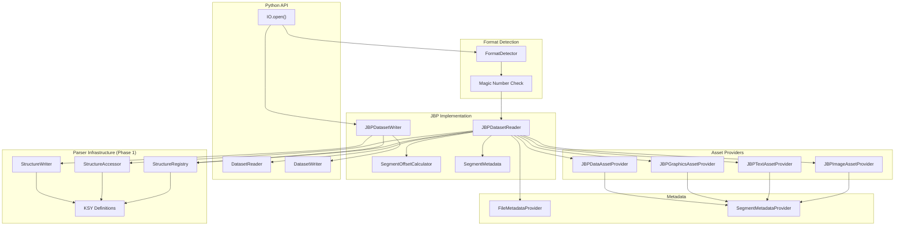

# Design Document: JBP Dataset Integration

## Overview

This design describes the integration of the data-driven binary parser (Phase 1) with the DatasetReader/DatasetWriter interfaces to create JBP-specific implementations for NITF/NSIF file access. The JBPDatasetReader and JBPDatasetWriter provide asset-based access to NITF imagery files, mapping segments to discoverable assets with meaningful keys and metadata.

The key innovation is using the StructureAccessor and StructureWriter from Phase 1 to parse and generate NITF headers without hardcoding format details. Structure definitions (KSY files) describe the binary layout, enabling the same code to handle NITF 2.1 and NSIF 1.0 variants.

### Key Design Decisions

1. **Lazy Segment Parsing**: Segment subheaders are parsed on-demand when assets are accessed, not during file open. This enables efficient access to specific segments without parsing the entire file.

2. **Offset Pre-calculation**: Segment offsets are calculated from the file header during initialization, enabling direct seeks to any segment without sequential parsing.

3. **Format Abstraction**: Python users interact only with abstract DatasetReader/DatasetWriter interfaces. Format detection and implementation selection happen internally.

4. **Two-Pass Writing**: The writer collects all assets first, then writes the file header with correct lengths followed by segment data.

5. **Optional Validation**: File length validation is optional to support partial file access (e.g., reading only metadata from cloud storage).

## Architecture



### Component Interactions

1. **Opening Flow**: IO.open() → FormatDetector → JBPDatasetReader → parse file header → calculate segment offsets
2. **Asset Access Flow**: get_asset(key) → lookup segment offset → parse subheader on-demand → return AssetProvider
3. **Writing Flow**: add_asset() → queue segment → close() → calculate lengths → write header → write segments

## Components and Interfaces

### JBPDatasetReader

Implements DatasetReader for NITF/NSIF files using the data-driven parser.

```rust
/// Reader for NITF/NSIF files implementing the DatasetReader trait.
pub struct JBPDatasetReader {
    /// Memory-mapped file data or byte buffer
    data: Arc<[u8]>,
    /// Parsed file header accessor
    file_header: StructureAccessor<'static>,
    /// Detected format (NITF 2.1 or NSIF 1.0)
    format: NitfFormat,
    /// Pre-calculated segment offsets
    segment_offsets: SegmentOffsets,
    /// Cached segment subheaders (parsed on demand)
    segment_cache: RwLock<HashMap<String, Arc<dyn AssetProvider>>>,
    /// File-level metadata provider
    file_metadata: Arc<JBPFileMetadataProvider>,
    /// Validation mode flag
    validate_file_length: bool,
    /// Collected validation warnings
    warnings: RwLock<Vec<ValidationWarning>>,
}

/// Detected NITF format variant
#[derive(Debug, Clone, Copy, PartialEq, Eq)]
pub enum NitfFormat {
    /// NITF 2.1 (FHDR="NITF", FVER="02.10")
    Nitf21,
    /// NSIF 1.0 (FHDR="NSIF", FVER="01.00")
    Nsif10,
}

impl JBPDatasetReader {
    /// Create a new reader from file path
    pub fn open(path: impl AsRef<Path>) -> Result<Self, CodecError>;
    
    /// Create a new reader from byte slice
    pub fn from_bytes(data: &[u8]) -> Result<Self, CodecError>;
    
    /// Create with validation options
    pub fn with_options(
        path: impl AsRef<Path>,
        options: JBPReaderOptions,
    ) -> Result<Self, CodecError>;
    
    /// Get validation warnings collected during parsing
    pub fn warnings(&self) -> Vec<ValidationWarning>;
    
    /// Get the detected format
    pub fn format(&self) -> NitfFormat;
}

/// Options for JBPDatasetReader
#[derive(Debug, Clone, Default)]
pub struct JBPReaderOptions {
    /// Whether to validate file length against FL field
    pub validate_file_length: bool,
}

impl DatasetReader for JBPDatasetReader {
    fn get_asset(&self, key: &str) -> Result<Arc<dyn AssetProvider>, CodecError>;
    fn get_asset_keys(&self, asset_type: Option<AssetType>, roles: Option<&[String]>) -> Vec<String>;
    fn has_asset(&self, key: &str) -> bool;
    fn metadata(&self) -> Arc<dyn MetadataProvider>;
    fn close(&mut self) -> Result<(), CodecError>;
}
```

### SegmentOffsets

Pre-calculated offsets for all segments in the file.

```rust
/// Pre-calculated segment offsets for direct access
pub struct SegmentOffsets {
    /// Image segment offsets: (subheader_offset, subheader_len, data_offset, data_len)
    pub images: Vec<SegmentLocation>,
    /// Graphic segment offsets
    pub graphics: Vec<SegmentLocation>,
    /// Text segment offsets
    pub text: Vec<SegmentLocation>,
    /// DES segment offsets
    pub des: Vec<SegmentLocation>,
    /// Reserved extension segment offsets
    pub res: Vec<SegmentLocation>,
}

/// Location information for a single segment
#[derive(Debug, Clone, Copy)]
pub struct SegmentLocation {
    /// Byte offset of subheader from file start
    pub subheader_offset: u64,
    /// Length of subheader in bytes
    pub subheader_length: u64,
    /// Byte offset of data from file start
    pub data_offset: u64,
    /// Length of data in bytes
    pub data_length: u64,
}

impl SegmentOffsets {
    /// Calculate segment offsets from file header accessor
    pub fn from_header(header: &StructureAccessor) -> Result<Self, CodecError>;
    
    /// Get total number of segments
    pub fn total_segments(&self) -> usize;
    
    /// Get segment location by type and index
    pub fn get(&self, segment_type: SegmentType, index: usize) -> Option<&SegmentLocation>;
}

/// Type of NITF segment
#[derive(Debug, Clone, Copy, PartialEq, Eq)]
pub enum SegmentType {
    Image,
    Graphic,
    Text,
    DataExtension,
    ReservedExtension,
}
```

### JBPDatasetWriter

Implements DatasetWriter for creating NITF/NSIF files.

```rust
/// Writer for NITF/NSIF files implementing the DatasetWriter trait.
pub struct JBPDatasetWriter {
    /// Output path
    path: PathBuf,
    /// Output format
    format: NitfFormat,
    /// Queued assets in order
    assets: Vec<QueuedAsset>,
    /// File-level metadata
    file_metadata: Option<Arc<dyn MetadataProvider>>,
    /// Structure registry for definitions
    registry: Arc<StructureRegistry>,
}

/// An asset queued for writing
struct QueuedAsset {
    key: String,
    provider: Arc<dyn AssetProvider>,
    title: String,
    description: String,
    roles: Vec<String>,
}

impl JBPDatasetWriter {
    /// Create a new writer for the specified path and format
    pub fn new(path: impl AsRef<Path>, format: NitfFormat) -> Result<Self, CodecError>;
    
    /// Create with custom structure registry
    pub fn with_registry(
        path: impl AsRef<Path>,
        format: NitfFormat,
        registry: Arc<StructureRegistry>,
    ) -> Result<Self, CodecError>;
}

impl DatasetWriter for JBPDatasetWriter {
    fn add_asset(
        &mut self,
        key: &str,
        provider: Arc<dyn AssetProvider>,
        title: &str,
        description: &str,
        roles: &[String],
    ) -> Result<(), CodecError>;
    
    fn set_metadata(&mut self, metadata: Arc<dyn MetadataProvider>) -> Result<(), CodecError>;
    
    fn close(&mut self) -> Result<(), CodecError>;
}
```

### JBPFileMetadataProvider

Provides access to file-level metadata from the NITF header.

```rust
/// Metadata provider for NITF file header fields
pub struct JBPFileMetadataProvider {
    /// Structure accessor for file header
    accessor: StructureAccessor<'static>,
    /// Raw header bytes
    raw_bytes: Arc<[u8]>,
}

impl JBPFileMetadataProvider {
    /// Create from file header accessor
    pub fn new(accessor: StructureAccessor<'static>, raw_bytes: Arc<[u8]>) -> Self;
}

impl MetadataProvider for JBPFileMetadataProvider {
    fn raw(&self) -> &[u8] {
        &self.raw_bytes
    }
    
    fn as_dict(&self, name: Option<&str>) -> HashMap<String, serde_json::Value> {
        // If name is Some(prefix), return only fields starting with prefix
        // If name is None, return all fields
        let mut result = HashMap::new();
        for field_path in self.accessor.fields() {
            if let Some(prefix) = name {
                if !field_path.starts_with(prefix) {
                    continue;
                }
            }
            if let Ok(value) = self.accessor.get(&field_path) {
                result.insert(field_path, value_to_json(&value));
            }
        }
        result
    }
}
```

### JBPSegmentMetadataProvider

Provides access to segment-level metadata from subheaders.

```rust
/// Metadata provider for NITF segment subheader fields
pub struct JBPSegmentMetadataProvider {
    /// Structure accessor for segment subheader
    accessor: StructureAccessor<'static>,
    /// Raw subheader bytes
    raw_bytes: Arc<[u8]>,
}

impl MetadataProvider for JBPSegmentMetadataProvider {
    fn raw(&self) -> &[u8] {
        &self.raw_bytes
    }
    
    fn as_dict(&self, name: Option<&str>) -> HashMap<String, serde_json::Value> {
        // Same prefix-based filtering as file metadata
        let mut result = HashMap::new();
        for field_path in self.accessor.fields() {
            if let Some(prefix) = name {
                if !field_path.starts_with(prefix) {
                    continue;
                }
            }
            if let Ok(value) = self.accessor.get(&field_path) {
                result.insert(field_path, value_to_json(&value));
            }
        }
        result
    }
}
```

### Asset Providers

Asset providers for each NITF segment type.

```rust
/// Asset provider for NITF image segments
pub struct JBPImageAssetProvider {
    key: String,
    title: String,
    description: String,
    roles: Vec<String>,
    /// Segment location in file
    location: SegmentLocation,
    /// Parsed subheader accessor
    subheader: StructureAccessor<'static>,
    /// Reference to file data
    data: Arc<[u8]>,
    /// Segment metadata provider
    metadata: Arc<JBPSegmentMetadataProvider>,
}

impl AssetProvider for JBPImageAssetProvider {
    fn key(&self) -> &str { &self.key }
    fn title(&self) -> &str { &self.title }
    fn description(&self) -> &str { &self.description }
    fn media_type(&self) -> &str { "application/vnd.nitf.image" }
    fn roles(&self) -> &[String] { &self.roles }
    fn asset_type(&self) -> AssetType { AssetType::Image }
    fn raw_asset(&self) -> Result<Vec<u8>, CodecError>;
    fn metadata(&self) -> Arc<dyn MetadataProvider>;
}

/// Asset provider for NITF text segments
pub struct JBPTextAssetProvider {
    key: String,
    title: String,
    description: String,
    roles: Vec<String>,
    location: SegmentLocation,
    subheader: StructureAccessor<'static>,
    data: Arc<[u8]>,
    metadata: Arc<JBPSegmentMetadataProvider>,
}

impl AssetProvider for JBPTextAssetProvider {
    fn key(&self) -> &str { &self.key }
    fn title(&self) -> &str { &self.title }
    fn description(&self) -> &str { &self.description }
    fn media_type(&self) -> &str { "text/plain" }
    fn roles(&self) -> &[String] { &self.roles }
    fn asset_type(&self) -> AssetType { AssetType::Text }
    fn raw_asset(&self) -> Result<Vec<u8>, CodecError>;
    fn metadata(&self) -> Arc<dyn MetadataProvider>;
}

/// Asset provider for NITF graphic segments
pub struct JBPGraphicsAssetProvider {
    key: String,
    title: String,
    description: String,
    roles: Vec<String>,
    location: SegmentLocation,
    subheader: StructureAccessor<'static>,
    data: Arc<[u8]>,
    metadata: Arc<JBPSegmentMetadataProvider>,
}

impl AssetProvider for JBPGraphicsAssetProvider {
    fn key(&self) -> &str { &self.key }
    fn title(&self) -> &str { &self.title }
    fn description(&self) -> &str { &self.description }
    fn media_type(&self) -> &str { "image/cgm" }
    fn roles(&self) -> &[String] { &self.roles }
    fn asset_type(&self) -> AssetType { AssetType::Graphics }
    fn raw_asset(&self) -> Result<Vec<u8>, CodecError>;
    fn metadata(&self) -> Arc<dyn MetadataProvider>;
}

/// Asset provider for NITF DES segments
pub struct JBPDataAssetProvider {
    key: String,
    title: String,
    description: String,
    roles: Vec<String>,
    location: SegmentLocation,
    subheader: StructureAccessor<'static>,
    data: Arc<[u8]>,
    metadata: Arc<JBPSegmentMetadataProvider>,
}

impl AssetProvider for JBPDataAssetProvider {
    fn key(&self) -> &str { &self.key }
    fn title(&self) -> &str { &self.title }
    fn description(&self) -> &str { &self.description }
    fn media_type(&self) -> &str { "application/octet-stream" }
    fn roles(&self) -> &[String] { &self.roles }
    fn asset_type(&self) -> AssetType { AssetType::Data }
    fn raw_asset(&self) -> Result<Vec<u8>, CodecError>;
    fn metadata(&self) -> Arc<dyn MetadataProvider>;
}
```

### DateTime Parser Utility

Utility for parsing NITF date/time strings.

```rust
/// Parse NITF FDT (File Date Time) format string to datetime components.
/// 
/// Format: CCYYMMDDhhmmss (14 characters)
/// - CCYY: 4-digit year
/// - MM: 2-digit month (01-12) or "--" for unknown
/// - DD: 2-digit day (01-31) or "--" for unknown
/// - hh: 2-digit hour (00-23) or "--" for unknown
/// - mm: 2-digit minute (00-59) or "--" for unknown
/// - ss: 2-digit second (00-59) or "--" for unknown
pub fn parse_nitf_datetime(fdt: &str) -> Result<NitfDateTime, DateTimeParseError>;

/// Parsed NITF datetime with optional components
#[derive(Debug, Clone)]
pub struct NitfDateTime {
    pub year: u16,
    pub month: Option<u8>,
    pub day: Option<u8>,
    pub hour: Option<u8>,
    pub minute: Option<u8>,
    pub second: Option<u8>,
}

impl NitfDateTime {
    /// Convert to chrono::NaiveDateTime if all components are present
    pub fn to_naive_datetime(&self) -> Option<chrono::NaiveDateTime>;
    
    /// Convert to ISO 8601 string representation
    pub fn to_iso8601(&self) -> String;
}

/// Error parsing NITF datetime
#[derive(Debug, thiserror::Error)]
pub enum DateTimeParseError {
    #[error("Invalid datetime length: expected 14, got {0}")]
    InvalidLength(usize),
    
    #[error("Invalid year: {0}")]
    InvalidYear(String),
    
    #[error("Invalid month: {0} (expected 01-12 or --)")]
    InvalidMonth(String),
    
    #[error("Invalid day: {0} (expected 01-31 or --)")]
    InvalidDay(String),
    
    #[error("Invalid hour: {0} (expected 00-23 or --)")]
    InvalidHour(String),
    
    #[error("Invalid minute: {0} (expected 00-59 or --)")]
    InvalidMinute(String),
    
    #[error("Invalid second: {0} (expected 00-59 or --)")]
    InvalidSecond(String),
}
```

### Format Detector

Detects NITF format from file extension (to avoid reading large files) and validates magic number during parsing.

```rust
/// Detect if a file path indicates a NITF/NSIF file based on extension
pub fn is_nitf_extension(path: &Path) -> bool {
    path.extension()
        .and_then(|ext| ext.to_str())
        .map(|ext| {
            let lower = ext.to_lowercase();
            lower == "ntf" || lower == "nitf" || lower == "nsif"
        })
        .unwrap_or(false)
}

/// Validate NITF magic number from file header bytes
/// Called during reader initialization, not during format detection
pub fn validate_nitf_magic(data: &[u8]) -> Result<NitfFormat, CodecError> {
    if data.len() < 9 {
        return Err(CodecError::InvalidFormat {
            message: "File too small for NITF header".to_string(),
        });
    }
    
    let magic = &data[0..9];
    match magic {
        b"NITF02.10" => Ok(NitfFormat::Nitf21),
        b"NSIF01.00" => Ok(NitfFormat::Nsif10),
        _ => Err(CodecError::InvalidFormat {
            message: format!(
                "Invalid NITF magic number: expected 'NITF02.10' or 'NSIF01.00', got '{}'",
                String::from_utf8_lossy(&magic[..std::cmp::min(9, magic.len())])
            ),
        }),
    }
}
```

### IO Factory

Factory for creating readers and writers with extension-based format detection.

```rust
/// Factory for creating dataset readers and writers
pub struct IO;

impl IO {
    /// Open a dataset for reading, selecting reader based on file extension.
    /// 
    /// Supported extensions (case-insensitive):
    /// - .ntf, .nitf → JBPDatasetReader
    /// - .nsif → JBPDatasetReader
    /// 
    /// The reader will validate the magic number when it parses the header,
    /// raising an error if the file content doesn't match the expected format.
    pub fn open(path: impl AsRef<Path>) -> Result<Box<dyn DatasetReader>, CodecError> {
        let path = path.as_ref();
        
        if is_nitf_extension(path) {
            // Create JBP reader - magic number validated during header parse
            Ok(Box::new(JBPDatasetReader::open(path)?))
        } else {
            Err(CodecError::UnsupportedFormat {
                format: path.extension()
                    .and_then(|e| e.to_str())
                    .unwrap_or("unknown")
                    .to_string(),
            })
        }
    }
    
    /// Open a dataset for reading with explicit format specification.
    /// Use this when the file extension doesn't match the content.
    pub fn open_as(
        path: impl AsRef<Path>,
        format: &str,
    ) -> Result<Box<dyn DatasetReader>, CodecError> {
        match format.to_lowercase().as_str() {
            "nitf" | "nitf21" | "nitf2.1" | "nsif" | "nsif10" | "nsif1.0" | "jbp" => {
                Ok(Box::new(JBPDatasetReader::open(path)?))
            }
            _ => Err(CodecError::UnsupportedFormat {
                format: format.to_string(),
            }),
        }
    }
    
    /// Open a dataset for writing with specified format
    pub fn create(
        path: impl AsRef<Path>,
        format: &str,
    ) -> Result<Box<dyn DatasetWriter>, CodecError> {
        let nitf_format = match format.to_lowercase().as_str() {
            "nitf" | "nitf21" | "nitf2.1" => NitfFormat::Nitf21,
            "nsif" | "nsif10" | "nsif1.0" => NitfFormat::Nsif10,
            _ => return Err(CodecError::UnsupportedFormat {
                format: format.to_string(),
            }),
        };
        
        Ok(Box::new(JBPDatasetWriter::new(path, nitf_format)?))
    }
}
```

## Data Models

### Asset Key Generation

Asset keys follow a consistent naming pattern:

```
{segment_type}_segment_{index}
```

Examples:
- `image_segment_0` - First image segment
- `image_segment_1` - Second image segment
- `text_segment_0` - First text segment
- `graphic_segment_0` - First graphic segment
- `des_segment_0` - First DES segment

```rust
/// Generate asset key from segment type and index
fn generate_asset_key(segment_type: SegmentType, index: usize) -> String {
    let type_name = match segment_type {
        SegmentType::Image => "image",
        SegmentType::Graphic => "graphic",
        SegmentType::Text => "text",
        SegmentType::DataExtension => "des",
        SegmentType::ReservedExtension => "res",
    };
    format!("{}_segment_{}", type_name, index)
}

/// Parse asset key to segment type and index
fn parse_asset_key(key: &str) -> Option<(SegmentType, usize)> {
    let parts: Vec<&str> = key.split('_').collect();
    if parts.len() != 3 || parts[1] != "segment" {
        return None;
    }
    
    let segment_type = match parts[0] {
        "image" => SegmentType::Image,
        "graphic" => SegmentType::Graphic,
        "text" => SegmentType::Text,
        "des" => SegmentType::DataExtension,
        "res" => SegmentType::ReservedExtension,
        _ => return None,
    };
    
    let index = parts[2].parse().ok()?;
    Some((segment_type, index))
}
```

### Segment Offset Calculation

Segment offsets are calculated from the file header length arrays:

```rust
impl SegmentOffsets {
    pub fn from_header(header: &StructureAccessor) -> Result<Self, CodecError> {
        // Get header length (HL field)
        let hl: u64 = header.get("HL")?.as_str()?.parse()?;
        
        // Get segment counts
        let numi: usize = header.get("NUMI")?.as_str()?.parse()?;
        let nums: usize = header.get("NUMS")?.as_str()?.parse()?;
        let numt: usize = header.get("NUMT")?.as_str()?.parse()?;
        let numdes: usize = header.get("NUMDES")?.as_str()?.parse()?;
        let numres: usize = header.get("NUMRES")?.as_str()?.parse()?;
        
        let mut current_offset = hl;
        let mut images = Vec::with_capacity(numi);
        let mut graphics = Vec::with_capacity(nums);
        let mut text = Vec::with_capacity(numt);
        let mut des = Vec::with_capacity(numdes);
        let mut res = Vec::with_capacity(numres);
        
        // Calculate image segment offsets
        for i in 0..numi {
            let lish: u64 = header.get(&format!("LISH_{}", i))?.as_str()?.parse()?;
            let li: u64 = header.get(&format!("LI_{}", i))?.as_str()?.parse()?;
            
            images.push(SegmentLocation {
                subheader_offset: current_offset,
                subheader_length: lish,
                data_offset: current_offset + lish,
                data_length: li,
            });
            current_offset += lish + li;
        }
        
        // Calculate graphic segment offsets
        for i in 0..nums {
            let lssh: u64 = header.get(&format!("LSSH_{}", i))?.as_str()?.parse()?;
            let ls: u64 = header.get(&format!("LS_{}", i))?.as_str()?.parse()?;
            
            graphics.push(SegmentLocation {
                subheader_offset: current_offset,
                subheader_length: lssh,
                data_offset: current_offset + lssh,
                data_length: ls,
            });
            current_offset += lssh + ls;
        }
        
        // Calculate text segment offsets
        for i in 0..numt {
            let ltsh: u64 = header.get(&format!("LTSH_{}", i))?.as_str()?.parse()?;
            let lt: u64 = header.get(&format!("LT_{}", i))?.as_str()?.parse()?;
            
            text.push(SegmentLocation {
                subheader_offset: current_offset,
                subheader_length: ltsh,
                data_offset: current_offset + ltsh,
                data_length: lt,
            });
            current_offset += ltsh + lt;
        }
        
        // Calculate DES segment offsets
        for i in 0..numdes {
            let ldsh: u64 = header.get(&format!("LDSH_{}", i))?.as_str()?.parse()?;
            let ld: u64 = header.get(&format!("LD_{}", i))?.as_str()?.parse()?;
            
            des.push(SegmentLocation {
                subheader_offset: current_offset,
                subheader_length: ldsh,
                data_offset: current_offset + ldsh,
                data_length: ld,
            });
            current_offset += ldsh + ld;
        }
        
        // Calculate RES segment offsets
        for i in 0..numres {
            let lresh: u64 = header.get(&format!("LRESH_{}", i))?.as_str()?.parse()?;
            let lre: u64 = header.get(&format!("LRE_{}", i))?.as_str()?.parse()?;
            
            res.push(SegmentLocation {
                subheader_offset: current_offset,
                subheader_length: lresh,
                data_offset: current_offset + lresh,
                data_length: lre,
            });
            current_offset += lresh + lre;
        }
        
        Ok(Self { images, graphics, text, des, res })
    }
}
```

### Structure Definition Naming

Structure definitions follow the naming convention from Phase 1:

| Definition Name | Description |
|-----------------|-------------|
| `NITF_02.10_FileHeader` | NITF 2.1 file header |
| `NITF_02.10_ImageSubheader` | NITF 2.1 image segment subheader |
| `NITF_02.10_GraphicSubheader` | NITF 2.1 graphic segment subheader |
| `NITF_02.10_TextSubheader` | NITF 2.1 text segment subheader |
| `NITF_02.10_DESSubheader` | NITF 2.1 DES subheader |
| `NSIF_01.00_FileHeader` | NSIF 1.0 file header |

### Validation Warning Model

```rust
/// A validation warning collected during parsing
#[derive(Debug, Clone)]
pub struct ValidationWarning {
    /// Warning code for programmatic handling
    pub code: ValidationCode,
    /// Human-readable message
    pub message: String,
    /// Field path where warning occurred
    pub field: Option<String>,
    /// Expected value (if applicable)
    pub expected: Option<String>,
    /// Actual value found
    pub actual: Option<String>,
}

/// Validation warning codes
#[derive(Debug, Clone, Copy, PartialEq, Eq)]
pub enum ValidationCode {
    /// File length mismatch
    FileLengthMismatch,
    /// Invalid complexity level
    InvalidComplexityLevel,
    /// Segment count mismatch
    SegmentCountMismatch,
}
```


## Correctness Properties

*A property is a characteristic or behavior that should hold true across all valid executions of a system—essentially, a formal statement about what the system should do. Properties serve as the bridge between human-readable specifications and machine-verifiable correctness guarantees.*

### Property 1: Extension-Based Format Selection

*For any* file path with extension .ntf, .nitf, or .nsif (case-insensitive), `IO.open()` SHALL select the JBP reader. For other extensions, it SHALL return UnsupportedFormat error.

**Validates: Requirements 1.3, 1.4, 19.3**

### Property 2: Magic Number Validation During Parse

*For any* file opened by JBPDatasetReader, if the first 9 bytes are not "NITF02.10" or "NSIF01.00", the reader SHALL return an InvalidFormat error with the actual bytes found.

**Validates: Requirements 1.5, 12.1, 12.2, 12.3**

### Property 3: Segment Offset Cumulative Calculation

*For any* valid NITF file with N segments of any type, the calculated offset for segment i SHALL equal the header length plus the sum of all (subheader_length + data_length) for segments 0 through i-1.

**Validates: Requirements 2.1, 2.2, 2.3, 2.4, 2.5**

### Property 4: Asset Key Enumeration Completeness

*For any* NITF file with segment counts (NUMI, NUMS, NUMT, NUMDES, NUMRES), the `get_asset_keys(None, None)` SHALL return exactly NUMI + NUMS + NUMT + NUMDES + NUMRES keys, and each key SHALL match the pattern `{type}_segment_{index}`.

**Validates: Requirements 3.1, 3.6**

### Property 5: Asset Key Type Filtering

*For any* NITF file and any asset type filter, `get_asset_keys(Some(type), None)` SHALL return only keys whose segment type matches the filter, and the count SHALL equal the corresponding segment count field (NUMI for Image, NUMS for Graphics, etc.).

**Validates: Requirements 3.2, 3.3, 3.4, 3.5**

### Property 6: Asset Key Existence Consistency

*For any* asset key, `has_asset(key)` SHALL return true if and only if `get_asset(key)` returns Ok.

**Validates: Requirements 3.7, 4.7**

### Property 7: Segment Subheader Parsing

*For any* valid NITF file and any valid asset key, `get_asset(key)` SHALL return an AssetProvider whose metadata contains all fields defined in the corresponding subheader structure definition.

**Validates: Requirements 4.1, 4.2, 4.3, 4.4**

### Property 8: Metadata Prefix Filtering

*For any* MetadataProvider and any prefix string, `as_dict(Some(prefix))` SHALL return only entries whose keys start with the given prefix, and `as_dict(None)` SHALL return all entries.

**Validates: Requirements 5.2, 5.3, 6.5**

### Property 9: Raw Metadata Identity

*For any* MetadataProvider, the bytes returned by `raw()` SHALL be identical to the original header/subheader bytes from the file.

**Validates: Requirements 5.4**

### Property 10: Asset Addition Type Mapping

*For any* AssetProvider added via `add_asset()`, the resulting segment type in the output file SHALL match the provider's asset_type (Image → image segment, Text → text segment, etc.).

**Validates: Requirements 8.1, 8.2, 8.3, 8.4**

### Property 11: Duplicate Key Rejection

*For any* JBPDatasetWriter, calling `add_asset()` with a key that was already added SHALL return a DuplicateKey error.

**Validates: Requirements 8.5**

### Property 12: Asset Order Preservation

*For any* sequence of `add_asset()` calls, the segments in the output file SHALL appear in the same order as the calls were made.

**Validates: Requirements 8.6**

### Property 13: File Header Length Consistency

*For any* NITF file written by JBPDatasetWriter, the FL field SHALL equal the actual file size, and the sum of HL plus all segment lengths SHALL equal FL.

**Validates: Requirements 9.1, 9.2, 9.4**

### Property 14: Segment Count Consistency

*For any* NITF file, the segment count fields (NUMI, NUMS, NUMT, NUMDES, NUMRES) SHALL equal the number of corresponding segment info entries in the header.

**Validates: Requirements 14.1, 14.2, 14.3, 14.4, 14.5**

### Property 15: File Length Validation (When Enabled)

*For any* JBPDatasetReader with validation enabled, if the calculated file length differs from the FL field or actual file size, a ValidationError SHALL be returned.

**Validates: Requirements 15.2, 15.3, 15.4, 15.5**

### Property 16: File Length Validation Skip (When Disabled)

*For any* JBPDatasetReader with validation disabled, file length mismatches SHALL NOT cause errors, allowing partial file access.

**Validates: Requirements 15.6**

### Property 17: DateTime Parsing Round-Trip

*For any* valid NITF datetime string (CCYYMMDDhhmmss format), parsing with DateTime_Parser and converting back to string SHALL produce an equivalent representation.

**Validates: Requirements 16.1, 16.2**

### Property 18: DateTime Partial Date Handling

*For any* datetime string with "--" components, DateTime_Parser SHALL return a NitfDateTime with None for the unknown components.

**Validates: Requirements 16.3**

### Property 19: DateTime Invalid Input Error

*For any* string that is not a valid NITF datetime format (wrong length, invalid characters, out-of-range values), DateTime_Parser SHALL return a DateTimeParseError.

**Validates: Requirements 16.4**

### Property 20: Dataset Round-Trip Consistency

*For any* valid dataset written with JBPDatasetWriter, reading it back with JBPDatasetReader SHALL produce equivalent metadata and asset data.

**Validates: Requirements 17.1, 17.2, 17.3**

### Property 21: CLEVEL Validation

*For any* NITF file, if CLEVEL is not one of (03, 05, 06, 07, 09), the reader SHALL add a warning but continue parsing.

**Validates: Requirements 13.1, 13.2, 13.3**

### Property 22: Warning Collection

*For any* NITF file with validation issues, the reader SHALL collect all warnings and make them available via `warnings()` method.

**Validates: Requirements 18.1, 18.2, 18.4**

### Property 23: Python Format Auto-Detection

*For any* NITF or NSIF file opened via Python `IO.open()`, the returned reader SHALL be able to access all segments without the caller specifying the format.

**Validates: Requirements 19.3**

## Error Handling

### Error Types

```rust
/// Errors specific to JBP dataset operations
#[derive(Debug, thiserror::Error)]
pub enum JBPError {
    #[error("Invalid NITF format: {message}")]
    InvalidFormat { message: String },
    
    #[error("Asset not found: {key}")]
    AssetNotFound { key: String },
    
    #[error("Duplicate asset key: {key}")]
    DuplicateKey { key: String },
    
    #[error("Validation error: {message}")]
    ValidationError { message: String },
    
    #[error("Segment parse error at offset {offset}: {message}")]
    SegmentParseError { offset: u64, message: String },
    
    #[error("Structure definition not found: {name}")]
    DefinitionNotFound { name: String },
    
    #[error("IO error: {source}")]
    IoError {
        #[from]
        source: std::io::Error,
    },
    
    #[error("Parser error: {source}")]
    ParserError {
        #[from]
        source: crate::parser::AccessError,
    },
}

impl From<JBPError> for CodecError {
    fn from(err: JBPError) -> Self {
        match err {
            JBPError::InvalidFormat { message } => CodecError::InvalidFormat { message },
            JBPError::AssetNotFound { key } => CodecError::AssetNotFound { key },
            JBPError::DuplicateKey { key } => CodecError::DuplicateKey { key },
            _ => CodecError::Other { message: err.to_string() },
        }
    }
}
```

### Error Context

All errors include contextual information:
- File path or byte offset where error occurred
- Expected vs actual values for validation errors
- Field names for parsing errors
- Asset keys for asset-related errors

### Warning vs Error Classification

| Condition | Classification | Behavior |
|-----------|---------------|----------|
| Invalid magic number | Fatal Error | Cannot continue |
| Segment count mismatch | Fatal Error | Cannot continue |
| File length mismatch | Warning (if validation enabled) | Continue with warning |
| Invalid CLEVEL | Warning | Continue with warning |
| Segment parse failure | Error | Skip segment, continue |

## Testing Strategy

### Unit Tests

Unit tests verify specific examples and edge cases:

1. **Format Detection**
   - Detect NITF 2.1 from valid header
   - Detect NSIF 1.0 from valid header
   - Reject invalid magic numbers
   - Handle truncated files

2. **Segment Offset Calculation**
   - Calculate offsets for single image segment
   - Calculate offsets for multiple segments of same type
   - Calculate offsets for mixed segment types
   - Handle zero-segment files

3. **Asset Key Generation**
   - Generate correct keys for each segment type
   - Parse keys back to segment type and index
   - Handle edge cases (index 0, large indices)

4. **DateTime Parsing**
   - Parse complete datetime strings
   - Parse partial dates with "--" components
   - Reject invalid formats
   - Handle boundary values (month 12, day 31, etc.)

5. **Metadata Filtering**
   - Filter by prefix "FS" returns security fields
   - Filter by prefix "O" returns originator fields
   - Empty prefix returns all fields
   - Non-matching prefix returns empty dict

### Property-Based Tests

Property-based tests verify universal properties using the `proptest` crate:

```rust
use proptest::prelude::*;

proptest! {
    /// Feature: jbp-dataset-integration, Property 1: Extension-Based Format Selection
    #[test]
    fn prop_extension_format_selection(ext in "(ntf|nitf|nsif|NTF|NITF|NSIF|txt|jpg|png)") {
        let path = PathBuf::from(format!("test.{}", ext));
        let is_nitf = is_nitf_extension(&path);
        
        let lower = ext.to_lowercase();
        let expected = lower == "ntf" || lower == "nitf" || lower == "nsif";
        prop_assert_eq!(is_nitf, expected);
    }
    
    /// Feature: jbp-dataset-integration, Property 2: Magic Number Validation During Parse
    #[test]
    fn prop_magic_number_validation(bytes in prop::collection::vec(any::<u8>(), 0..100)) {
        let result = validate_nitf_magic(&bytes);
        
        if bytes.len() >= 9 {
            match &bytes[0..9] {
                b"NITF02.10" => prop_assert!(matches!(result, Ok(NitfFormat::Nitf21))),
                b"NSIF01.00" => prop_assert!(matches!(result, Ok(NitfFormat::Nsif10))),
                _ => prop_assert!(matches!(result, Err(_))),
            }
        } else {
            prop_assert!(matches!(result, Err(_)));
        }
    }
    
    /// Feature: jbp-dataset-integration, Property 4: Asset Key Enumeration Completeness
    #[test]
    fn prop_asset_key_completeness(
        numi in 0usize..10,
        nums in 0usize..10,
        numt in 0usize..10,
        numdes in 0usize..10,
    ) {
        let file = create_synthetic_nitf(numi, nums, numt, numdes, 0);
        let reader = JBPDatasetReader::from_bytes(&file).unwrap();
        
        let keys = reader.get_asset_keys(None, None);
        prop_assert_eq!(keys.len(), numi + nums + numt + numdes);
        
        for key in &keys {
            prop_assert!(key.contains("_segment_"));
        }
    }
    
    /// Feature: jbp-dataset-integration, Property 20: Dataset Round-Trip Consistency
    #[test]
    fn prop_round_trip_consistency(
        metadata in arbitrary_metadata(),
        assets in prop::collection::vec(arbitrary_asset(), 1..5),
    ) {
        let temp_path = tempfile::NamedTempFile::new().unwrap();
        
        // Write
        let mut writer = JBPDatasetWriter::new(temp_path.path(), NitfFormat::Nitf21).unwrap();
        writer.set_metadata(Arc::new(metadata.clone())).unwrap();
        for (i, asset) in assets.iter().enumerate() {
            writer.add_asset(&format!("asset_{}", i), asset.clone(), "", "", &[]).unwrap();
        }
        writer.close().unwrap();
        
        // Read back
        let reader = JBPDatasetReader::open(temp_path.path()).unwrap();
        let read_metadata = reader.metadata().as_dict(None);
        
        // Compare
        for (key, value) in metadata.as_dict(None) {
            prop_assert_eq!(read_metadata.get(&key), Some(&value));
        }
    }
}
```

### Integration Tests

Integration tests use JITC test files from `data/integration/JITC/`:

```rust
#[test]
#[ignore] // Requires JITC test data
fn test_jitc_format_positive() {
    let test_dir = std::env::var("OSML_IO_INTEGRATION_DATA")
        .unwrap_or_else(|_| "data/integration".to_string());
    
    for entry in glob(&format!("{}/JITC/**/Format/POS/*.NTF", test_dir)).unwrap() {
        let path = entry.unwrap();
        let reader = JBPDatasetReader::open(&path);
        assert!(reader.is_ok(), "Failed to open {:?}: {:?}", path, reader.err());
    }
}

#[test]
#[ignore] // Requires JITC test data
fn test_jitc_format_negative() {
    let test_dir = std::env::var("OSML_IO_INTEGRATION_DATA")
        .unwrap_or_else(|_| "data/integration".to_string());
    
    for entry in glob(&format!("{}/JITC/**/Format/NEG/*.NTF", test_dir)).unwrap() {
        let path = entry.unwrap();
        let reader = JBPDatasetReader::open(&path);
        // Negative tests should either fail or produce warnings
        if let Ok(r) = reader {
            assert!(!r.warnings().is_empty(), "Expected warnings for {:?}", path);
        }
    }
}
```

### Python Integration Tests

```python
import pytest
from pathlib import Path
from aws.osml.io import IO

def test_open_nitf_file():
    """Test opening a NITF file through the abstract interface."""
    with IO.open("data/unit/sample.ntf") as dataset:
        assert dataset is not None
        keys = dataset.get_asset_keys()
        assert len(keys) > 0

def test_metadata_prefix_filtering():
    """Test metadata filtering by prefix."""
    with IO.open("data/unit/sample.ntf") as dataset:
        all_meta = dataset.metadata().as_dict()
        fs_meta = dataset.metadata().as_dict("FS")
        
        # All FS keys should be in filtered result
        for key in fs_meta:
            assert key.startswith("FS")
        
        # Filtered should be subset of all
        assert len(fs_meta) <= len(all_meta)

def test_context_manager():
    """Test context manager protocol."""
    with IO.open("data/unit/sample.ntf") as dataset:
        _ = dataset.get_asset_keys()
    # Should not raise after exiting context

def test_create_nitf_file(tmp_path):
    """Test creating a NITF file."""
    output_path = tmp_path / "output.ntf"
    
    with IO.create(output_path, format="nitf") as writer:
        # Add assets...
        pass
    
    # Verify file was created
    assert output_path.exists()
```

### Test Configuration

- Property tests run with minimum 100 iterations
- Each property test is tagged with its design document property number
- Unit test data in `data/unit/` (checked into git)
- Integration tests require JITC data in `data/integration/JITC/` (gitignored)
- Integration tests marked with `#[ignore]` and `@pytest.mark.integration`
