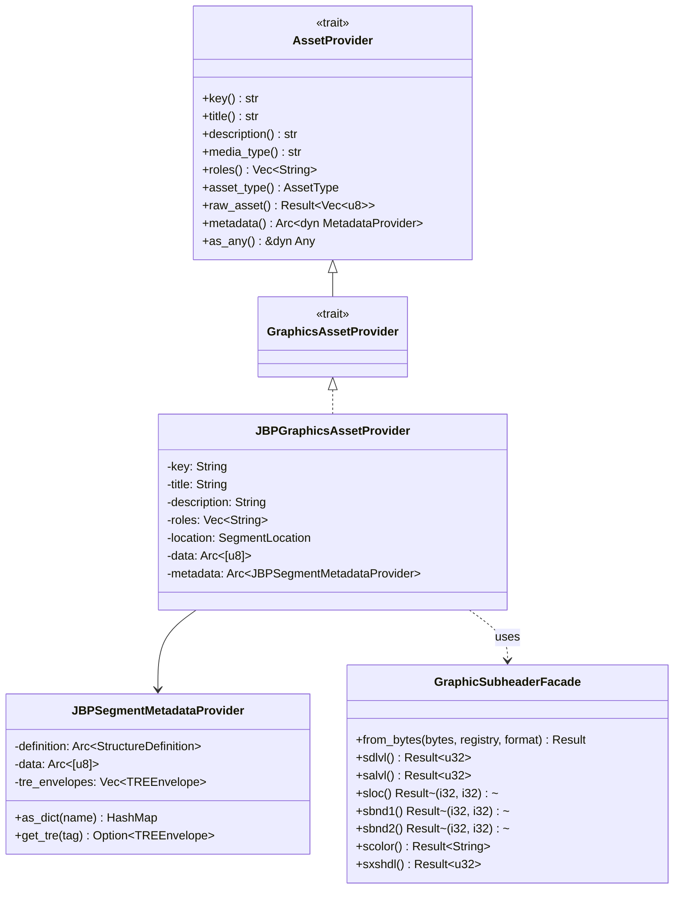
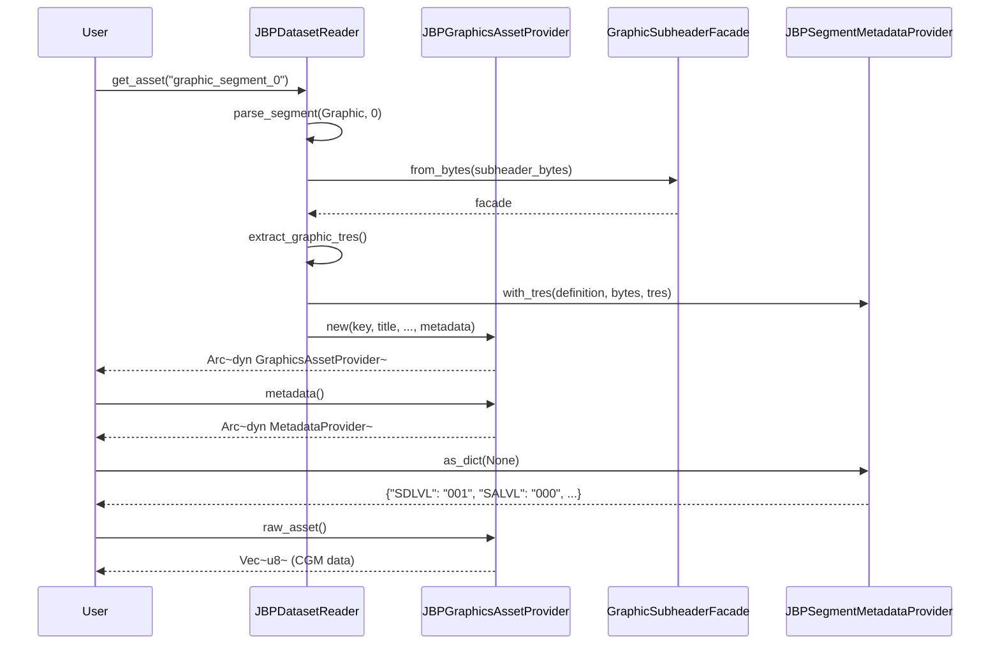

# Design Document: JBP Graphic Segments

## Overview

This design document describes the implementation of JBP Graphic Segments support in the osml-imagery-io library. The implementation extends the existing `JBPGraphicsAssetProvider` to fully implement the `GraphicsAssetProvider` trait and adds comprehensive graphic subheader parsing based on JBP Table 5.15-1.

The design follows the existing patterns established for image, text, and DES segments, leveraging the data-driven parser infrastructure for subheader field definitions and the `JBPSegmentMetadataProvider` for metadata access.

### Key Design Decisions

1. **Minimal GraphicsAssetProvider trait**: The trait remains empty since `AssetProvider::raw_asset()` provides sufficient access to CGM data. Format-specific metadata is accessed through the standard `metadata()` provider.

2. **No CGM parsing**: The library extracts raw CGM bytes but does not parse CGM content. Users must provide their own CGM parsing libraries.

3. **Data-driven subheader parsing**: Graphic subheader fields are defined using the existing `StructureDefinition` pattern, enabling automatic field extraction and metadata exposure.

4. **TRE support**: Extended subheader data (SXSHD) is parsed as TRE envelopes using the existing TRE infrastructure.

## Architecture



### Component Interactions



## Components and Interfaces

### GraphicsAssetProvider Trait

The `GraphicsAssetProvider` trait extends `AssetProvider` but adds no additional methods. This design decision reflects that:

1. Raw CGM data access is provided by `AssetProvider::raw_asset()`
2. Graphic-specific metadata (SDLVL, SALVL, SLOC, bounds) is accessed via `metadata().as_dict()`
3. No CGM parsing is performed by the library

```rust
/// Trait for vector graphics access.
pub trait GraphicsAssetProvider: AssetProvider {
    // No additional methods - raw access via AssetProvider::raw_asset()
    // Metadata access via AssetProvider::metadata()
}
```

### JBPGraphicsAssetProvider

The existing `JBPGraphicsAssetProvider` struct already implements `AssetProvider`. The implementation will be extended to:

1. Implement the `GraphicsAssetProvider` trait (empty implementation)
2. Use a full graphic subheader definition for metadata exposure

```rust
impl GraphicsAssetProvider for JBPGraphicsAssetProvider {}
```

### GraphicSubheaderFacade

A new facade struct provides typed access to graphic subheader fields, following the pattern established by `ImageSubheaderFacade`.

```rust
pub struct GraphicSubheaderFacade<'a> {
    accessor: StructureAccessor<'a>,
}

impl<'a> GraphicSubheaderFacade<'a> {
    pub fn from_bytes(
        bytes: &'a [u8],
        registry: &StructureRegistry,
        format: NitfFormat,
    ) -> Result<Self, CodecError>;

    // Field accessors
    pub fn sy(&self) -> Result<&str, CodecError>;
    pub fn sid(&self) -> Result<&str, CodecError>;
    pub fn sname(&self) -> Result<&str, CodecError>;
    pub fn sfmt(&self) -> Result<&str, CodecError>;
    pub fn sdlvl(&self) -> Result<u32, CodecError>;
    pub fn salvl(&self) -> Result<u32, CodecError>;
    pub fn sloc(&self) -> Result<(i32, i32), CodecError>;
    pub fn sbnd1(&self) -> Result<(i32, i32), CodecError>;
    pub fn sbnd2(&self) -> Result<(i32, i32), CodecError>;
    pub fn scolor(&self) -> Result<&str, CodecError>;
    pub fn sxshdl(&self) -> Result<u32, CodecError>;
    pub fn sxsofl(&self) -> Result<u32, CodecError>;
}
```

### Graphic Subheader Structure Definition

The graphic subheader fields are defined using the data-driven parser infrastructure. The definition follows JBP Table 5.15-1:

```rust
fn create_graphic_subheader_definition() -> StructureDefinition {
    StructureDefinition::new("NITF_GraphicSubheader")
        .with_field(FieldDefinition::new("SY", FieldType::String)
            .with_size(SizeSpec::Fixed(2))
            .with_doc("File Part Type"))
        .with_field(FieldDefinition::new("SID", FieldType::String)
            .with_size(SizeSpec::Fixed(10))
            .with_doc("Graphic Identifier"))
        .with_field(FieldDefinition::new("SNAME", FieldType::String)
            .with_size(SizeSpec::Fixed(20))
            .with_doc("Graphic Name"))
        // Security fields (SSCLAS through SSDEVT) - same pattern as image segments
        .with_field(FieldDefinition::new("SSCLAS", FieldType::String)
            .with_size(SizeSpec::Fixed(1))
            .with_doc("Graphic Security Classification"))
        // ... additional security fields ...
        .with_field(FieldDefinition::new("ENCRYP", FieldType::String)
            .with_size(SizeSpec::Fixed(1))
            .with_doc("Encryption"))
        .with_field(FieldDefinition::new("SFMT", FieldType::String)
            .with_size(SizeSpec::Fixed(1))
            .with_doc("Graphic Type"))
        .with_field(FieldDefinition::new("SSTRUCT", FieldType::String)
            .with_size(SizeSpec::Fixed(13))
            .with_doc("Reserved for Future Use"))
        .with_field(FieldDefinition::new("SDLVL", FieldType::String)
            .with_size(SizeSpec::Fixed(3))
            .with_doc("Graphic Display Level"))
        .with_field(FieldDefinition::new("SALVL", FieldType::String)
            .with_size(SizeSpec::Fixed(3))
            .with_doc("Graphic Attachment Level"))
        .with_field(FieldDefinition::new("SLOC", FieldType::String)
            .with_size(SizeSpec::Fixed(10))
            .with_doc("Graphic Location"))
        .with_field(FieldDefinition::new("SBND1", FieldType::String)
            .with_size(SizeSpec::Fixed(10))
            .with_doc("First Graphic Bound Location"))
        .with_field(FieldDefinition::new("SCOLOR", FieldType::String)
            .with_size(SizeSpec::Fixed(1))
            .with_doc("Graphic Color"))
        .with_field(FieldDefinition::new("SBND2", FieldType::String)
            .with_size(SizeSpec::Fixed(10))
            .with_doc("Second Graphic Bound Location"))
        .with_field(FieldDefinition::new("SRES2", FieldType::String)
            .with_size(SizeSpec::Fixed(2))
            .with_doc("Reserved for Future Use"))
        .with_field(FieldDefinition::new("SXSHDL", FieldType::String)
            .with_size(SizeSpec::Fixed(5))
            .with_doc("Graphic Extended Subheader Data Length"))
        .with_field(FieldDefinition::new("SXSOFL", FieldType::String)
            .with_size(SizeSpec::Fixed(3))
            .with_condition("SXSHDL > 0")
            .with_doc("Graphic Extended Subheader Overflow"))
        .with_field(FieldDefinition::new("SXSHD", FieldType::Bytes)
            .with_size(SizeSpec::Expression("SXSHDL - 3"))
            .with_condition("SXSHDL > 3")
            .with_doc("Graphic Extended Subheader Data"))
}
```

### CLEVEL Validation

Aggregate graphic segment size validation is performed during writing:

```rust
pub struct CLevelValidator {
    pub fn validate_graphic_aggregate_size(
        &self,
        clevel: u8,
        total_graphic_bytes: u64,
    ) -> Result<(), ValidationError>;
}

// CLEVEL constraints for graphic segments
const CLEVEL_03_MAX_GRAPHIC_BYTES: u64 = 1_000_000;  // 1 MB
const CLEVEL_05_PLUS_MAX_GRAPHIC_BYTES: u64 = 2_000_000;  // 2 MB
```

## Data Models

### Graphic Subheader Fields

| Field | Size | Type | Description |
|-------|------|------|-------------|
| SY | 2 | BCS-A | File Part Type (always "SY") |
| SID | 10 | BCS-A | Graphic Identifier |
| SNAME | 20 | BCS-A | Graphic Name |
| SSCLAS | 1 | BCS-A | Security Classification |
| SSCLSY | 2 | BCS-A | Security Classification System |
| SSCODE | 11 | BCS-A | Codewords |
| SSCTLH | 2 | BCS-A | Control and Handling |
| SSREL | 20 | BCS-A | Releasing Instructions |
| SSDCTP | 2 | BCS-A | Declassification Type |
| SSDCDT | 8 | BCS-A | Declassification Date |
| SSDCXM | 4 | BCS-A | Declassification Exemption |
| SSDG | 1 | BCS-A | Downgrade |
| SSDGDT | 8 | BCS-A | Downgrade Date |
| SSCLTX | 43 | BCS-A | Classification Text |
| SSCATP | 1 | BCS-A | Classification Authority Type |
| SSCAUT | 40 | BCS-A | Classification Authority |
| SSCRSN | 1 | BCS-A | Classification Reason |
| SSCTLN | 15 | BCS-A | Security Control Number |
| SSDWNG | 6 | BCS-A | Security Downgrade |
| SSDEVT | 40 | BCS-A | Security Downgrade Event |
| ENCRYP | 1 | BCS-A | Encryption (must be "0") |
| SFMT | 1 | BCS-A | Graphic Type (must be "C" for CGM) |
| SSTRUCT | 13 | BCS-A | Reserved |
| SDLVL | 3 | BCS-N | Display Level (001-999) |
| SALVL | 3 | BCS-N | Attachment Level (000-998) |
| SLOC | 10 | BCS-N | Location (RRRRRCCCCC) |
| SBND1 | 10 | BCS-N | Bound 1 (RRRRRCCCCC) |
| SCOLOR | 1 | BCS-A | Color ("C" or "M") |
| SBND2 | 10 | BCS-N | Bound 2 (RRRRRCCCCC) |
| SRES2 | 2 | BCS-A | Reserved |
| SXSHDL | 5 | BCS-N | Extended Subheader Length |
| SXSOFL | 3 | BCS-N | Extended Subheader Overflow (conditional) |
| SXSHD | var | bytes | Extended Subheader Data (conditional) |

### Location/Bounding Box Format

The SLOC, SBND1, and SBND2 fields use a 10-character format: `RRRRRCCCCC` where:
- RRRRR = 5-digit row value (can be negative with leading sign)
- CCCCC = 5-digit column value (can be negative with leading sign)

Parsing logic:
```rust
fn parse_location(value: &str) -> Result<(i32, i32), CodecError> {
    if value.len() != 10 {
        return Err(CodecError::Decode("Invalid location format".into()));
    }
    let row = value[0..5].trim().parse::<i32>()?;
    let col = value[5..10].trim().parse::<i32>()?;
    Ok((row, col))
}
```

### Metadata Access Patterns

Users access graphic metadata through the standard `MetadataProvider` interface:

```python
# Python usage
with IO.open(["file.ntf"], "r") as reader:
    graphic = reader.get_asset("graphic_segment_0")
    metadata = graphic.get_metadata().as_dict()
    
    # Access display/attachment levels
    sdlvl = int(metadata["SDLVL"])  # e.g., 1
    salvl = int(metadata["SALVL"])  # e.g., 0 (unattached)
    
    # Access location (requires parsing)
    sloc = metadata["SLOC"]  # e.g., "0010000200"
    row = int(sloc[0:5])     # 100
    col = int(sloc[5:10])    # 200
    
    # Access bounding box
    sbnd1 = metadata["SBND1"]
    sbnd2 = metadata["SBND2"]
    
    # Access raw CGM data
    cgm_data = graphic.get_raw_asset().read()
```


## Correctness Properties

*A property is a characteristic or behavior that should hold true across all valid executions of a system—essentially, a formal statement about what the system should do. Properties serve as the bridge between human-readable specifications and machine-verifiable correctness guarantees.*

Based on the prework analysis, the following properties have been identified for property-based testing:

### Property 1: Subheader Field Round-Trip

*For any* valid graphic subheader bytes containing fields SY, SID, SNAME, SDLVL, SALVL, SLOC, SBND1, SBND2, SCOLOR, and security fields, parsing the subheader and accessing fields via the MetadataProvider SHALL return values equivalent to the original input bytes.

**Validates: Requirements 1.1, 2.1, 2.2, 2.3, 3.1, 4.1, 4.2, 4.3**

### Property 2: Invalid Field Validation

*For any* graphic subheader bytes where SY != "SY", SFMT != "C", or ENCRYP != "0", parsing SHALL return an appropriate error and not succeed.

**Validates: Requirements 1.2, 1.3, 1.4**

### Property 3: Invalid SALVL Reference Parsing

*For any* graphic subheader with SALVL referencing a non-existent display level, parsing SHALL succeed without validation errors (cross-reference validation is caller's responsibility).

**Validates: Requirements 3.4**

### Property 4: Invalid Bounds Parsing

*For any* graphic subheader where SBND1 row > SBND2 row OR SBND1 column > SBND2 column, parsing SHALL succeed and expose the values through metadata without error.

**Validates: Requirements 4.4, 4.5**

### Property 5: CGM Data Round-Trip

*For any* NITF file containing a graphic segment with CGM data bytes, calling raw_asset() on the JBPGraphicsAssetProvider SHALL return bytes identical to the original CGM data portion of the segment.

**Validates: Requirements 5.1**

### Property 6: Media Type Invariant

*For any* JBPGraphicsAssetProvider instance, media_type() SHALL return "image/cgm".

**Validates: Requirements 5.2**

### Property 7: Bounds Validation Error

*For any* graphic segment where the data portion extends beyond file bounds, raw_asset() SHALL return a CodecError.

**Validates: Requirements 5.3**

### Property 8: Asset Type Invariant

*For any* JBPGraphicsAssetProvider instance, asset_type() SHALL return AssetType::Graphics.

**Validates: Requirements 6.3**

### Property 9: TRE Parsing

*For any* graphic subheader with SXSHDL > 0 containing valid TRE envelope data, the MetadataProvider SHALL expose the parsed TREs through the standard TRE access interface.

**Validates: Requirements 7.1, 7.3**

### Property 10: TRE Overflow Resolution

*For any* NITF file where a graphic segment's SXSOFL indicates overflow to a DES segment, the MetadataProvider SHALL include TREs resolved from the overflow DES.

**Validates: Requirements 7.2**

### Property 11: CLEVEL Size Validation

*For any* NITF file being written at CLEVEL 03 with aggregate graphic segment size > 1 MB, OR at CLEVEL 05+ with aggregate size > 2 MB, the writer SHALL return a validation error.

**Validates: Requirements 8.1, 8.2**

### Property 12: Python API Completeness

*For any* graphic segment accessed via Python's DatasetReader.get_asset(), the returned PyGraphicsAssetProvider SHALL expose key, title, description, media_type, roles, asset_type properties, get_raw_asset() returning BytesIO, and get_metadata() returning PyMetadataProvider.

**Validates: Requirements 9.1, 9.2, 9.3, 9.4**

## Error Handling

### Parse Errors

| Error Condition | Error Type | Message |
|-----------------|------------|---------|
| SY field != "SY" | `CodecError::Decode` | "Invalid graphic segment marker: expected 'SY', got '{value}'" |
| SFMT field != "C" | `CodecError::Decode` | "Unsupported graphic format: expected 'C' (CGM), got '{value}'" |
| ENCRYP field != "0" | `CodecError::Decode` | "Encrypted graphics not supported" |
| Subheader extends beyond file | `CodecError::Decode` | "Graphic subheader extends beyond file bounds" |
| Invalid field format | `CodecError::Decode` | "Invalid {field} format: {details}" |

### Data Access Errors

| Error Condition | Error Type | Message |
|-----------------|------------|---------|
| CGM data beyond file bounds | `CodecError::Decode` | "Graphic segment data extends beyond file: offset {offset} + length {length} > file size {size}" |
| TRE parse failure | `CodecError::Decode` | "Failed to parse TRE in graphic segment: {details}" |

### Validation Errors (Writing)

| Error Condition | Error Type | Message |
|-----------------|------------|---------|
| CLEVEL 03 aggregate > 1 MB | `ValidationError::CLevelViolation` | "Aggregate graphic segment size {size} exceeds CLEVEL 03 limit of 1 MB" |
| CLEVEL 05+ aggregate > 2 MB | `ValidationError::CLevelViolation` | "Aggregate graphic segment size {size} exceeds CLEVEL {level} limit of 2 MB" |

### Error Recovery

- Parse errors are non-recoverable for the affected segment
- Other segments in the file remain accessible
- Validation errors during writing prevent file creation

## Testing Strategy

### Dual Testing Approach

This implementation uses both unit tests and property-based tests:

- **Unit tests**: Verify specific examples, edge cases, and error conditions
- **Property tests**: Verify universal properties across randomly generated inputs

### Unit Tests (Rust)

Located in `src/jbp/graphics/` module tests:

1. **Subheader parsing tests**
   - Parse minimal valid subheader
   - Parse subheader with all optional fields
   - Parse subheader with TRE data
   - Error on invalid SY marker
   - Error on invalid SFMT
   - Error on encrypted graphics

2. **Facade accessor tests**
   - SDLVL parsing (001, 500, 999)
   - SALVL parsing (000, 001, 998)
   - SLOC parsing (positive, negative, zero)
   - SBND1/SBND2 parsing
   - SCOLOR parsing ("C", "M")

3. **Asset provider tests**
   - raw_asset() returns correct bytes
   - media_type() returns "image/cgm"
   - asset_type() returns AssetType::Graphics
   - metadata() exposes all fields

4. **CLEVEL validation tests**
   - CLEVEL 03 with 1 MB graphics (pass)
   - CLEVEL 03 with 1.1 MB graphics (fail)
   - CLEVEL 05 with 2 MB graphics (pass)
   - CLEVEL 05 with 2.1 MB graphics (fail)

### Property-Based Tests (Rust - proptest)

Located in `src/jbp/graphics/property_tests.rs`:

```rust
// Property 1: Subheader field round-trip
proptest! {
    #[test]
    fn prop_subheader_field_roundtrip(
        sid in "[A-Z0-9]{10}",
        sname in "[A-Z0-9 ]{20}",
        sdlvl in 1u32..=999,
        salvl in 0u32..=998,
        sloc_row in -99999i32..=99999,
        sloc_col in -99999i32..=99999,
    ) {
        // Generate subheader bytes, parse, verify fields match
    }
}

// Property 5: CGM data round-trip
proptest! {
    #[test]
    fn prop_cgm_data_roundtrip(cgm_data in prop::collection::vec(any::<u8>(), 0..10000)) {
        // Create graphic segment, read via raw_asset(), verify bytes match
    }
}
```

### Property-Based Tests (Python - hypothesis)

Located in `tests/property/test_graphics.py`:

```python
# Feature: jbp-graphic-segments, Property 12: Python API completeness
@given(st.binary(min_size=1, max_size=1000))
@settings(max_examples=100)
def test_python_api_completeness(cgm_data):
    """Property 12: Python API exposes all required methods."""
    # Create test file with graphic segment
    # Access via DatasetReader
    # Verify all properties and methods are accessible
```

### Test Configuration

- Property tests run minimum 100 iterations
- Each property test is tagged with feature and property number
- Tag format: `Feature: jbp-graphic-segments, Property N: {property_text}`

### Test Data

- Synthetic graphic segments generated programmatically
- JITC test files (if available): `data/integration/Segments/Test Files/NITF_SYM_POS_*.ntf`
