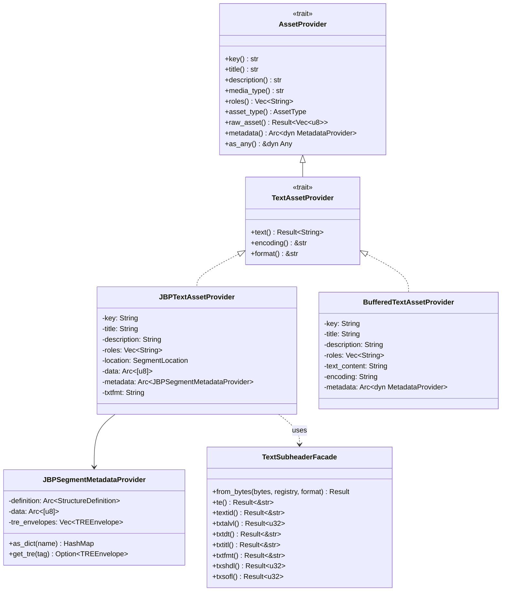
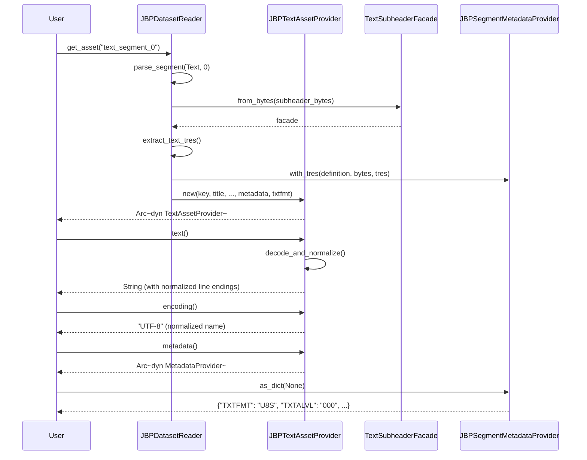

# Design Document: JBP Text Segments

## Overview

This design document describes the implementation of JBP Text Segments support in the osml-imagery-io library. The implementation extends the existing `JBPTextAssetProvider` to fully implement the `TextAssetProvider` trait and adds comprehensive text subheader parsing based on JBP Table 5.17-1.

The design follows the existing patterns established for image and graphic segments, leveraging the data-driven parser infrastructure for subheader field definitions and the `JBPSegmentMetadataProvider` for metadata access.

### Key Design Decisions

1. **Encoding-aware media types**: The `media_type()` method returns MIME types with charset parameters (e.g., `text/plain; charset=utf-8`) based on the TXTFMT field.

2. **Line delimiter normalization**: The `text()` method normalizes CR/LF to platform-native line endings when reading. The `BufferedTextAssetProvider` converts platform-native line endings to CR/LF when generating raw bytes for writing.

3. **Data-driven subheader parsing**: Text subheader fields are defined using the existing `StructureDefinition` pattern, enabling automatic field extraction and metadata exposure.

4. **TRE support**: Extended subheader data (TXSHD) is parsed as TRE envelopes using the existing TRE infrastructure.

5. **Normalized encoding names**: The `encoding()` method returns normalized encoding names ("ASCII", "UTF-8", "ECS", "MTF") while the raw TXTFMT code is available via `metadata().as_dict()["TXTFMT"]`.

## Architecture



### Component Interactions



## Components and Interfaces

### TextAssetProvider Trait

The existing `TextAssetProvider` trait in `src/traits/text.rs` defines the interface for text content access:

```rust
/// Trait for text content access.
pub trait TextAssetProvider: AssetProvider {
    /// Returns the decoded text content as a string.
    fn text(&self) -> Result<String, CodecError>;

    /// Returns the character encoding (e.g., "UTF-8", "ASCII").
    fn encoding(&self) -> &str;

    /// Returns the text format identifier.
    fn format(&self) -> &str;
}
```

### JBPTextAssetProvider

The existing `JBPTextAssetProvider` struct in `src/jbp/asset.rs` will be extended to implement `TextAssetProvider`:

```rust
pub struct JBPTextAssetProvider {
    key: String,
    title: String,
    description: String,
    roles: Vec<String>,
    location: SegmentLocation,
    data: Arc<[u8]>,
    metadata: Arc<JBPSegmentMetadataProvider>,
    txtfmt: String,  // NEW: Store TXTFMT for encoding/media_type
}

impl TextAssetProvider for JBPTextAssetProvider {
    fn text(&self) -> Result<String, CodecError> {
        let raw_bytes = self.raw_asset()?;
        decode_and_normalize(&raw_bytes, &self.txtfmt)
    }

    fn encoding(&self) -> &str {
        match self.txtfmt.as_str() {
            "STA" => "ASCII",
            "U8S" => "UTF-8",
            "UT1" => "ECS",
            "MTF" => "MTF",
            _ => "UNKNOWN",
        }
    }

    fn format(&self) -> &str {
        &self.txtfmt
    }
}
```

### BufferedTextAssetProvider

A new struct for creating text segments in memory:

```rust
pub struct BufferedTextAssetProvider {
    key: String,
    title: String,
    description: String,
    roles: Vec<String>,
    text_content: String,
    encoding: String,
    metadata: Arc<dyn MetadataProvider>,
}

impl BufferedTextAssetProvider {
    pub fn new(
        key: String,
        text_content: String,
        encoding: &str,
    ) -> Self;

    pub fn with_title(self, title: String) -> Self;
    pub fn with_description(self, description: String) -> Self;
    pub fn with_roles(self, roles: Vec<String>) -> Self;
    pub fn with_metadata(self, metadata: Arc<dyn MetadataProvider>) -> Self;
}

impl TextAssetProvider for BufferedTextAssetProvider {
    fn text(&self) -> Result<String, CodecError> {
        Ok(self.text_content.clone())
    }

    fn encoding(&self) -> &str {
        &self.encoding
    }

    fn format(&self) -> &str {
        match self.encoding.as_str() {
            "ASCII" => "STA",
            "UTF-8" => "U8S",
            "ECS" => "UT1",
            "MTF" => "MTF",
            _ => "STA",
        }
    }
}

impl AssetProvider for BufferedTextAssetProvider {
    fn raw_asset(&self) -> Result<Vec<u8>, CodecError> {
        encode_with_crlf(&self.text_content, &self.encoding)
    }
    
    fn media_type(&self) -> &str {
        match self.encoding.as_str() {
            "ASCII" => "text/plain; charset=us-ascii",
            "UTF-8" => "text/plain; charset=utf-8",
            "ECS" => "text/plain; charset=iso-8859-1",
            _ => "text/plain",
        }
    }
    // ... other methods
}
```

### TextSubheaderFacade

A new facade struct provides typed access to text subheader fields, following the pattern established by `ImageSubheaderFacade` and `GraphicSubheaderFacade`:

```rust
pub struct TextSubheaderFacade<'a> {
    accessor: StructureAccessor<'a>,
}

impl<'a> TextSubheaderFacade<'a> {
    pub fn from_bytes(
        bytes: &'a [u8],
        registry: &StructureRegistry,
        format: NitfFormat,
    ) -> Result<Self, CodecError>;

    // Field accessors
    pub fn te(&self) -> Result<&str, CodecError>;
    pub fn textid(&self) -> Result<&str, CodecError>;
    pub fn txtalvl(&self) -> Result<u32, CodecError>;
    pub fn txtdt(&self) -> Result<&str, CodecError>;
    pub fn txtitl(&self) -> Result<&str, CodecError>;
    pub fn txtfmt(&self) -> Result<&str, CodecError>;
    pub fn encryp(&self) -> Result<&str, CodecError>;
    pub fn txshdl(&self) -> Result<u32, CodecError>;
    pub fn txsofl(&self) -> Result<u32, CodecError>;
}
```

### Text Encoding/Decoding Functions

Helper functions for text encoding and line delimiter handling:

```rust
/// Decode text bytes and normalize CR/LF to platform-native line endings.
fn decode_and_normalize(bytes: &[u8], txtfmt: &str) -> Result<String, CodecError> {
    let text = match txtfmt {
        "STA" => {
            // ASCII decoding - reject non-ASCII bytes
            std::str::from_utf8(bytes)
                .map_err(|e| CodecError::Decode(format!("Invalid ASCII: {}", e)))?
                .to_string()
        }
        "U8S" => {
            // UTF-8 decoding
            String::from_utf8(bytes.to_vec())
                .map_err(|e| CodecError::Decode(format!("Invalid UTF-8: {}", e)))?
        }
        "UT1" => {
            // ECS (ISO-8859-1) decoding - each byte maps directly to Unicode
            bytes.iter().map(|&b| b as char).collect()
        }
        "MTF" => {
            // MTF is ASCII-based
            std::str::from_utf8(bytes)
                .map_err(|e| CodecError::Decode(format!("Invalid MTF: {}", e)))?
                .to_string()
        }
        _ => {
            // Unknown format - try UTF-8, fall back to lossy
            String::from_utf8_lossy(bytes).to_string()
        }
    };
    
    // Normalize CR/LF to platform-native line endings
    Ok(normalize_line_endings(&text))
}

/// Normalize CR/LF to platform-native line endings.
fn normalize_line_endings(text: &str) -> String {
    #[cfg(windows)]
    {
        // On Windows, keep CR/LF as-is
        text.to_string()
    }
    #[cfg(not(windows))]
    {
        // On Unix, convert CR/LF to LF
        text.replace("\r\n", "\n")
    }
}

/// Encode text with CR/LF line delimiters for NITF output.
fn encode_with_crlf(text: &str, encoding: &str) -> Result<Vec<u8>, CodecError> {
    // First normalize to CR/LF
    let normalized = text
        .replace("\r\n", "\n")  // Normalize any existing CR/LF
        .replace("\r", "\n")    // Normalize any standalone CR
        .replace("\n", "\r\n"); // Convert all to CR/LF
    
    match encoding {
        "ASCII" => {
            // Verify all characters are ASCII
            if !normalized.is_ascii() {
                return Err(CodecError::Encode("Text contains non-ASCII characters".into()));
            }
            Ok(normalized.into_bytes())
        }
        "UTF-8" => Ok(normalized.into_bytes()),
        "ECS" => {
            // ISO-8859-1 encoding
            normalized.chars()
                .map(|c| {
                    if c as u32 <= 255 {
                        Ok(c as u8)
                    } else {
                        Err(CodecError::Encode(format!(
                            "Character '{}' cannot be encoded in ISO-8859-1", c
                        )))
                    }
                })
                .collect()
        }
        "MTF" => {
            if !normalized.is_ascii() {
                return Err(CodecError::Encode("MTF text contains non-ASCII characters".into()));
            }
            Ok(normalized.into_bytes())
        }
        _ => Ok(normalized.into_bytes()),
    }
}
```

## Data Models

### Text Subheader Fields (JBP Table 5.17-1)

| Field | Size | Type | Description |
|-------|------|------|-------------|
| TE | 2 | BCS-A | File Part Type (always "TE") |
| TEXTID | 7 | BCS-A | Text Identifier |
| TXTALVL | 3 | BCS-N | Text Attachment Level (000-998) |
| TXTDT | 14 | BCS-A | Text Date and Time (CCYYMMDDhhmmss) |
| TXTITL | 80 | BCS-A | Text Title |
| TSCLAS | 1 | BCS-A | Text Security Classification |
| TSCLSY | 2 | BCS-A | Text Security Classification System |
| TSCODE | 11 | BCS-A | Text Codewords |
| TSCTLH | 2 | BCS-A | Text Control and Handling |
| TSREL | 20 | BCS-A | Text Releasing Instructions |
| TSDCTP | 2 | BCS-A | Text Declassification Type |
| TSDCDT | 8 | BCS-A | Text Declassification Date |
| TSDCXM | 4 | BCS-A | Text Declassification Exemption |
| TSDG | 1 | BCS-A | Text Downgrade |
| TSDGDT | 8 | BCS-A | Text Downgrade Date |
| TSCLTX | 43 | BCS-A | Text Classification Text |
| TSCATP | 1 | BCS-A | Text Classification Authority Type |
| TSCAUT | 40 | BCS-A | Text Classification Authority |
| TSCRSN | 1 | BCS-A | Text Classification Reason |
| TSCTLN | 15 | BCS-A | Text Security Control Number |
| TSDWNG | 6 | BCS-A | Text Security Downgrade |
| TSDEVT | 40 | BCS-A | Text Security Downgrade Event |
| ENCRYP | 1 | BCS-A | Encryption (must be "0") |
| TXTFMT | 3 | BCS-A | Text Format (STA, MTF, UT1, U8S) |
| TXSHDL | 5 | BCS-N | Extended Subheader Data Length |
| TXSOFL | 3 | BCS-N | Extended Subheader Overflow (conditional) |
| TXSHD | var | bytes | Extended Subheader Data (conditional) |

### Text Format Codes

| Code | Description | Encoding | Line Delimiters |
|------|-------------|----------|-----------------|
| STA | Standard BCS text | ASCII (7-bit) | CR/LF required |
| MTF | Message Text Format | ASCII (STANAG 5500) | CR/LF required |
| UT1 | Legacy ECS text | ISO-8859-1 | CR/LF required |
| U8S | UTF-8 text | UTF-8 | CR/LF required |

### Media Type Mapping

| TXTFMT | media_type() Return Value |
|--------|---------------------------|
| STA | `text/plain; charset=us-ascii` |
| U8S | `text/plain; charset=utf-8` |
| UT1 | `text/plain; charset=iso-8859-1` |
| MTF | `text/plain` |

### Metadata Access Patterns

Users access text metadata through the standard `MetadataProvider` interface:

```python
# Python usage
with IO.open(["file.ntf"], "r") as reader:
    text_asset = reader.get_asset("text_segment_0")
    
    # Access decoded text with normalized line endings
    content = text_asset.text
    
    # Access encoding information
    encoding = text_asset.encoding  # e.g., "UTF-8"
    format_code = text_asset.format  # e.g., "U8S"
    
    # Access raw metadata
    metadata = text_asset.get_metadata().as_dict()
    txtfmt = metadata["TXTFMT"]    # Raw format code: "U8S"
    txtalvl = metadata["TXTALVL"]  # Attachment level: "000"
    txtitl = metadata["TXTITL"]    # Title
    txtdt = metadata["TXTDT"]      # Date/time
    
    # Access raw bytes (no normalization)
    raw_bytes = text_asset.get_raw_asset().read()
```


## Correctness Properties

*A property is a characteristic or behavior that should hold true across all valid executions of a system—essentially, a formal statement about what the system should do. Properties serve as the bridge between human-readable specifications and machine-verifiable correctness guarantees.*

Based on the prework analysis, the following properties have been identified for property-based testing:

### Property 1: Subheader Field Round-Trip

*For any* valid text subheader bytes containing fields TE, TEXTID, TXTALVL, TXTDT, TXTITL, TXTFMT, and security fields, parsing the subheader and accessing fields via the MetadataProvider SHALL return values equivalent to the original input bytes.

**Validates: Requirements 1.1, 2.5, 3.1**

### Property 2: Invalid Field Validation

*For any* text subheader bytes where TE != "TE" or ENCRYP != "0", parsing SHALL return an appropriate error and not succeed.

**Validates: Requirements 1.2, 1.3**

### Property 3: Unknown Format Code Handling

*For any* text subheader with an unrecognized TXTFMT value (not STA, MTF, UT1, or U8S), parsing SHALL succeed and the raw format code SHALL be accessible via metadata.

**Validates: Requirements 1.4**

### Property 4: Encoding Name Mapping

*For any* JBPTextAssetProvider with TXTFMT in {STA, U8S, UT1, MTF}, the encoding() method SHALL return the corresponding normalized name {ASCII, UTF-8, ECS, MTF}.

**Validates: Requirements 2.1, 2.2, 2.3, 2.4**

### Property 5: Invalid TXTALVL Reference Parsing

*For any* text subheader with TXTALVL referencing a non-existent display level, parsing SHALL succeed without validation errors (cross-reference validation is caller's responsibility).

**Validates: Requirements 3.4**

### Property 6: Text Decoding Round-Trip

*For any* valid text content and encoding (ASCII, UTF-8, ECS), encoding the text with CR/LF line delimiters and then decoding with normalization SHALL produce text equivalent to the original (modulo line ending differences).

**Validates: Requirements 4.1, 4.2, 4.3, 4.4**

### Property 7: Invalid Encoding Error

*For any* byte sequence that is invalid for the specified encoding (e.g., invalid UTF-8 sequences for U8S, non-ASCII bytes for STA), the text() method SHALL return a CodecError.

**Validates: Requirements 4.5**

### Property 8: Raw Asset Preservation

*For any* NITF file containing a text segment, calling raw_asset() on the JBPTextAssetProvider SHALL return bytes identical to the original text data portion of the segment (no normalization applied).

**Validates: Requirements 4.6**

### Property 9: Asset Type Invariant

*For any* JBPTextAssetProvider instance, asset_type() SHALL return AssetType::Text.

**Validates: Requirements 5.3**

### Property 10: Media Type Mapping

*For any* JBPTextAssetProvider with TXTFMT in {STA, U8S, UT1, MTF}, the media_type() method SHALL return the corresponding MIME type with charset parameter.

**Validates: Requirements 5.4, 5.5, 5.6, 5.7**

### Property 11: TRE Parsing

*For any* text subheader with TXSHDL > 0 containing valid TRE envelope data, the MetadataProvider SHALL expose the parsed TREs through the standard TRE access interface.

**Validates: Requirements 6.1, 6.3**

### Property 12: TRE Overflow Resolution

*For any* NITF file where a text segment's TXSOFL indicates overflow to a DES segment, the MetadataProvider SHALL include TREs resolved from the overflow DES.

**Validates: Requirements 6.2**

### Property 13: Line Delimiter Normalization (Write)

*For any* text content with any combination of line endings (LF, CR, CR/LF), the BufferedTextAssetProvider's raw_asset() method SHALL return bytes with all line endings converted to CR/LF.

**Validates: Requirements 7.4, 7.5, 7.6**

### Property 14: Python API Completeness

*For any* text segment accessed via Python's DatasetReader.get_asset(), the returned PyTextAssetProvider SHALL expose key, title, description, media_type, roles, asset_type properties, get_raw_asset() returning BytesIO, get_metadata() returning PyMetadataProvider, and text, encoding, format properties.

**Validates: Requirements 8.1, 8.2, 8.3, 8.4, 8.5, 8.6, 8.7**

## Error Handling

### Parse Errors

| Error Condition | Error Type | Message |
|-----------------|------------|---------|
| TE field != "TE" | `CodecError::Decode` | "Invalid text segment marker: expected 'TE', got '{value}'" |
| ENCRYP field != "0" | `CodecError::Decode` | "Encrypted text not supported" |
| Subheader extends beyond file | `CodecError::Decode` | "Text subheader extends beyond file bounds" |
| Invalid field format | `CodecError::Decode` | "Invalid {field} format: {details}" |

### Text Decoding Errors

| Error Condition | Error Type | Message |
|-----------------|------------|---------|
| Invalid ASCII bytes (STA) | `CodecError::Decode` | "Invalid ASCII: {details}" |
| Invalid UTF-8 bytes (U8S) | `CodecError::Decode` | "Invalid UTF-8: {details}" |
| Invalid MTF bytes | `CodecError::Decode` | "Invalid MTF: {details}" |
| Text data beyond file bounds | `CodecError::Decode` | "Text segment data extends beyond file: offset {offset} + length {length} > file size {size}" |

### Text Encoding Errors (BufferedTextAssetProvider)

| Error Condition | Error Type | Message |
|-----------------|------------|---------|
| Non-ASCII in ASCII encoding | `CodecError::Encode` | "Text contains non-ASCII characters" |
| Non-ISO-8859-1 in ECS encoding | `CodecError::Encode` | "Character '{char}' cannot be encoded in ISO-8859-1" |
| Non-ASCII in MTF encoding | `CodecError::Encode` | "MTF text contains non-ASCII characters" |

### TRE Errors

| Error Condition | Error Type | Message |
|-----------------|------------|---------|
| TRE parse failure | `CodecError::Decode` | "Failed to parse TRE in text segment: {details}" |
| Overflow DES not found | `CodecError::Decode` | "TRE overflow DES segment not found" |

### Error Recovery

- Parse errors are non-recoverable for the affected segment
- Other segments in the file remain accessible
- Unknown TXTFMT values do not cause errors; the raw value is preserved

## Testing Strategy

### Dual Testing Approach

This implementation uses both unit tests and property-based tests:

- **Unit tests**: Verify specific examples, edge cases, and error conditions
- **Property tests**: Verify universal properties across randomly generated inputs

### Unit Tests (Rust)

Located in `src/jbp/text/` module tests:

1. **Subheader parsing tests**
   - Parse minimal valid subheader
   - Parse subheader with all optional fields
   - Parse subheader with TRE data
   - Error on invalid TE marker
   - Error on encrypted text (ENCRYP != "0")
   - Success on unknown TXTFMT

2. **Facade accessor tests**
   - TEXTID parsing
   - TXTALVL parsing (000, 001, 998)
   - TXTDT parsing
   - TXTITL parsing
   - TXTFMT parsing (STA, MTF, UT1, U8S)

3. **Text decoding tests**
   - ASCII decoding (STA)
   - UTF-8 decoding (U8S)
   - ECS/ISO-8859-1 decoding (UT1)
   - MTF decoding
   - Line ending normalization (CR/LF → LF on Unix)
   - Invalid encoding error handling

4. **Asset provider tests**
   - text() returns decoded content
   - encoding() returns normalized name
   - format() returns TXTFMT code
   - media_type() returns correct MIME type with charset
   - asset_type() returns AssetType::Text
   - raw_asset() returns unmodified bytes

5. **BufferedTextAssetProvider tests**
   - Construction with various encodings
   - Line ending conversion to CR/LF
   - raw_asset() produces correct bytes
   - Round-trip: create → raw_asset → decode

### Property-Based Tests (Rust - proptest)

Located in `src/jbp/text/property_tests.rs`:

```rust
// Property 1: Subheader field round-trip
proptest! {
    #[test]
    fn prop_subheader_field_roundtrip(
        textid in "[A-Z0-9]{7}",
        txtalvl in 0u32..=998,
        txtfmt in prop_oneof!["STA", "MTF", "UT1", "U8S"],
    ) {
        // Generate subheader bytes, parse, verify fields match
    }
}

// Property 6: Text decoding round-trip
proptest! {
    #[test]
    fn prop_text_roundtrip(
        text in "[a-zA-Z0-9 \\n]{1,1000}",
        encoding in prop_oneof!["ASCII", "UTF-8"],
    ) {
        // Encode with CR/LF, decode, verify content matches
    }
}

// Property 13: Line delimiter normalization
proptest! {
    #[test]
    fn prop_line_delimiter_normalization(
        text in "[a-zA-Z0-9 \\r\\n]{1,500}",
    ) {
        // Create BufferedTextAssetProvider, verify raw_asset() has CR/LF only
    }
}
```

### Property-Based Tests (Python - hypothesis)

Located in `tests/property/test_text.py`:

```python
# Feature: jbp-text-segments, Property 14: Python API completeness
@given(st.text(alphabet=string.printable, min_size=1, max_size=1000))
@settings(max_examples=100)
def test_python_api_completeness(text_content):
    """Property 14: Python API exposes all required methods."""
    # Create test file with text segment
    # Access via DatasetReader
    # Verify all properties and methods are accessible
```

### Test Configuration

- Property tests run minimum 100 iterations
- Each property test is tagged with feature and property number
- Tag format: `Feature: jbp-text-segments, Property N: {property_text}`

### Test Data

- Synthetic text segments generated programmatically
- JITC test files (if available): `data/integration/Segments/Test Files/NITF_TXT_POS_*.ntf`
