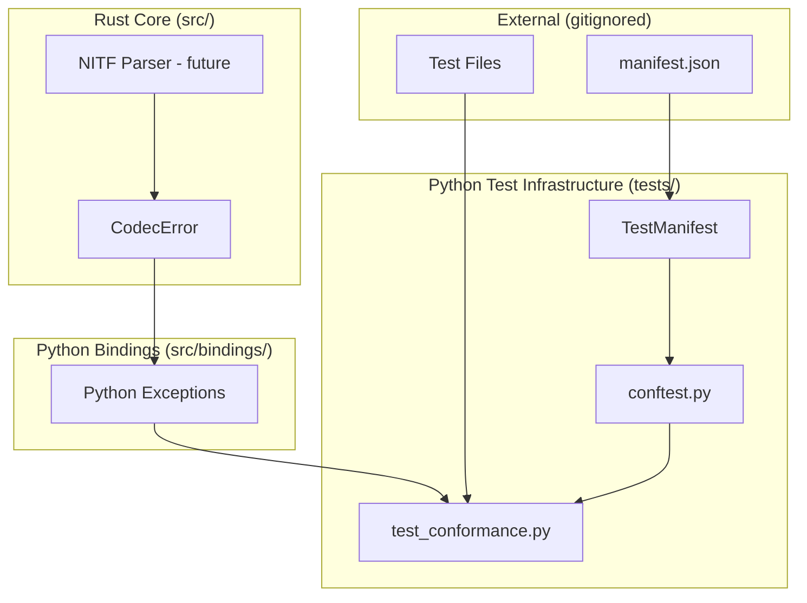

# Design Document: JBP Validation Infrastructure

## Overview

This design establishes the testing framework for validating JBP (Joint BIIF Profile) implementation in osml-io. The infrastructure is entirely Python-based and provides:

1. **Test Manifest** - JSON-based test expectations stored outside the repository (gitignored)
2. **Pytest Integration** - Dynamic test generation from manifests using pytest's parametrize feature
3. **Error Interpretation** - Python utilities to interpret Rust `CodecError` exceptions and map them to specification requirements

The Rust implementation will use the existing `CodecError` type for reporting errors. The Python test infrastructure interprets these errors and validates them against expected outcomes defined in the manifest.

### Design Principles

- **No new Rust validation types** - Use existing `CodecError` for all error reporting
- **Python-only test harness** - All test logic in Python using pytest
- **Manifest-driven testing** - Expected outcomes stored in gitignored files
- **Graceful degradation** - Tests skip when data is unavailable

## Architecture



### Component Responsibilities

**Rust Core** (existing):
- `CodecError` enum in `src/error.rs` - already exists, will be extended with NITF-specific variants
- Future NITF parser code raises `CodecError` on validation failures

**Python Bindings** (existing):
- `CodecError` converts to Python exceptions via PyO3
- No new binding code needed for validation infrastructure

**Python Test Infrastructure** (`tests/`):
- `conftest.py`: Manifest loading, pytest fixtures, test case generation
- `test_conformance.py`: Parametrized tests using pytest
- Standard pytest exception checking with `pytest.raises()`

### Data Flow

1. **Error Flow**: Rust NITF parser raises `CodecError` → PyO3 converts to Python exception
2. **Test Flow**: pytest loads manifest → generates test cases → calls Python API → verifies exceptions match expectations

## Components and Interfaces

### Existing Rust Error Type

The existing `CodecError` in `src/error.rs` will be extended with NITF-specific variants as parsing is implemented in future phases. For Phase 0, no Rust changes are needed.

```rust
// src/error.rs - existing, will be extended in future phases
#[derive(Error, Debug)]
pub enum CodecError {
    // ... existing variants ...
    
    // Future NITF variants (Phase 1+):
    // #[error("NITF format error: {0}")]
    // NitfFormat(String),
}
```

### Python Test Infrastructure

The test harness is implemented entirely in Python using pytest with standard exception verification.

#### Test Manifest Schema

```python
# tests/conftest.py - Manifest loading and fixtures

@dataclass
class TestFileEntry:
    """Single test file entry from manifest."""
    path: str                              # Relative path to test file
    expected_valid: bool                   # True if validation should pass
    expected_exception: str | None = None  # Expected exception type name
    expected_message: str | None = None    # Substring expected in error message
    category: str | None = None            # Optional category for filtering
    description: str | None = None         # Optional description

@dataclass  
class TestManifest:
    """Collection of test file entries."""
    entries: list[TestFileEntry]
    base_path: Path                     # Base directory for resolving paths
    
    @classmethod
    def load(cls, manifest_path: Path, base_path: Path) -> "TestManifest":
        """Load manifest from JSON file. Returns empty manifest if file not found."""
        
    def get_entry(self, path: str) -> TestFileEntry | None:
        """Look up entry by path."""
        
    def entries_by_category(self, category: str) -> list[TestFileEntry]:
        """Filter entries by category."""
        
    def to_json(self) -> str:
        """Serialize manifest to JSON string."""
    
    @classmethod
    def from_json(cls, json_str: str, base_path: Path) -> "TestManifest":
        """Deserialize manifest from JSON string."""
```

#### Manifest JSON Format

```json
{
  "entries": [
    {
      "path": "subdir/valid_file.ntf",
      "expected_valid": true,
      "category": "format",
      "description": "Valid NITF 2.1 file header"
    },
    {
      "path": "subdir/invalid_file.ntf",
      "expected_valid": false,
      "expected_exception": "ValueError",
      "expected_message": "Invalid magic number",
      "category": "format",
      "description": "Invalid magic number"
    }
  ]
}
```

#### Pytest Test Generation

```python
# tests/test_conformance.py

import pytest
from pathlib import Path
from tests.conftest import TestManifest, TestFileEntry

def get_integration_data_path() -> Path:
    """Get integration data path from env or default."""
    import os
    return Path(os.environ.get("OSML_IO_INTEGRATION_DATA", "data/integration"))

def get_manifest_path() -> Path:
    """Get manifest path within integration data."""
    return get_integration_data_path() / "manifest.json"

def load_test_cases() -> list[tuple[str, TestFileEntry]]:
    """Load test cases for parametrization."""
    manifest_path = get_manifest_path()
    if not manifest_path.exists():
        return []
    manifest = TestManifest.load(manifest_path, get_integration_data_path())
    return [(e.path, e) for e in manifest.entries]

@pytest.mark.integration
@pytest.mark.parametrize("path,entry", load_test_cases(), ids=lambda x: x if isinstance(x, str) else x.path)
def test_conformance(path: str, entry: TestFileEntry):
    """Run conformance test for a single file."""
    file_path = get_integration_data_path() / path
    if not file_path.exists():
        pytest.skip(f"Test file not found: {path}")
    
    # Import the NITF reader from osml-io (to be implemented in future phases)
    # from aws.osml.io import NitfReader
    
    if entry.expected_valid:
        # Should not raise any exception
        # reader = NitfReader(file_path)
        pass  # Placeholder until NITF reader is implemented
    else:
        # Should raise an exception
        with pytest.raises(Exception) as exc_info:
            # reader = NitfReader(file_path)
            raise NotImplementedError("NITF reader not yet implemented")
        
        # Verify exception type if specified
        if entry.expected_exception:
            assert type(exc_info.value).__name__ == entry.expected_exception, \
                f"Expected {entry.expected_exception}, got {type(exc_info.value).__name__}"
        
        # Verify message contains expected substring if specified
        if entry.expected_message:
            assert entry.expected_message in str(exc_info.value), \
                f"Expected message to contain '{entry.expected_message}', got '{exc_info.value}'"
```

## Data Models

### TestFileEntry Fields

| Field | Type | Required | Description |
|-------|------|----------|-------------|
| `path` | `str` | Yes | Relative path to test file |
| `expected_valid` | `bool` | Yes | True if file should parse without error |
| `expected_exception` | `str` | No | Expected exception class name |
| `expected_message` | `str` | No | Substring expected in error message |
| `category` | `str` | No | Category for filtering tests |
| `description` | `str` | No | Human-readable description |

### Test Manifest File Location

The manifest file location follows this resolution order:

1. `$OSML_IO_INTEGRATION_DATA/manifest.json` if env var is set
2. `data/integration/manifest.json` (default)

The manifest file itself is gitignored and must be created by users with access to test data.


## Correctness Properties

*A property is a characteristic or behavior that should hold true across all valid executions of a system—essentially, a formal statement about what the system should do. Properties serve as the bridge between human-readable specifications and machine-verifiable correctness guarantees.*

### Property 1: Manifest JSON Round-Trip

*For any* valid list of `TestFileEntry` objects, serializing to JSON and deserializing back SHALL produce an equivalent list of entries with all fields preserved.

**Validates: Requirements 2.3**

### Property 2: Manifest Lookup Returns Correct Entry

*For any* `TestManifest` containing entries, looking up a path that exists in the manifest SHALL return the corresponding `TestFileEntry` with all fields matching the original.

**Validates: Requirements 2.5**

### Property 3: Test Pass/Fail Determination Is Correct

*For any* combination of `expected_valid` boolean and exception occurrence:
- If `expected_valid` is `true` and an exception was raised, the test SHALL fail
- If `expected_valid` is `true` and no exception was raised, the test SHALL pass
- If `expected_valid` is `false` and an exception was raised, the test SHALL pass
- If `expected_valid` is `false` and no exception was raised, the test SHALL fail

**Validates: Requirements 4.4, 4.5**

### Property 4: Exception Type Matching Is Correct

*For any* expected exception type name and actual exception, the type check SHALL pass if and only if the actual exception's class name equals the expected type name.

**Validates: Requirements 4.6**

### Property 5: Message Substring Matching Is Correct

*For any* expected message substring and actual exception message, the message check SHALL pass if and only if the expected substring appears in the actual message.

**Validates: Requirements 4.7**

### Property 6: Environment Variable Override Takes Precedence

*For any* value set in `OSML_IO_INTEGRATION_DATA`, the test harness SHALL use that path instead of the default `data/integration/` path.

**Validates: Requirements 6.4, 6.5**

## Error Handling

### Rust Error Handling (Future Phases)

The existing `CodecError` type in `src/error.rs` will be extended with NITF-specific variants as parsing is implemented. For Phase 0, no Rust changes are needed.

### Manifest Loading Errors

| Scenario | Behavior |
|----------|----------|
| Manifest file not found | Return empty manifest, log warning |
| Invalid JSON syntax | Raise exception with parse error details |
| Missing required fields | Raise exception identifying missing field |
| Test file not found | Skip test via `pytest.skip()`, continue |

## Testing Strategy

### Testing Approach

This feature uses pytest for all testing. Since the infrastructure is Python-only, we use:

- **Unit tests**: Verify manifest loading, test logic
- **Property tests**: Verify manifest round-trip, lookup correctness, pass/fail logic

### Python Unit Tests

Located in `tests/` directory:

```python
# tests/test_manifest.py
import pytest
from pathlib import Path
from tests.conftest import TestManifest, TestFileEntry

def test_manifest_load_missing_file():
    """Empty manifest returned when file doesn't exist."""
    manifest = TestManifest.load(Path("/nonexistent/manifest.json"), Path("."))
    assert len(manifest.entries) == 0

def test_manifest_load_valid_json(tmp_path):
    """Manifest loads entries from valid JSON."""
    manifest_file = tmp_path / "manifest.json"
    manifest_file.write_text('''{"entries": [
        {"path": "test.ntf", "expected_valid": true}
    ]}''')
    manifest = TestManifest.load(manifest_file, tmp_path)
    assert len(manifest.entries) == 1
    assert manifest.entries[0].path == "test.ntf"

def test_entry_lookup_found():
    """Lookup returns entry when path exists."""
    entry = TestFileEntry(path="test.ntf", expected_valid=True)
    manifest = TestManifest(entries=[entry], base_path=Path("."))
    found = manifest.get_entry("test.ntf")
    assert found is not None
    assert found.path == "test.ntf"

def test_entry_lookup_not_found():
    """Lookup returns None when path doesn't exist."""
    manifest = TestManifest(entries=[], base_path=Path("."))
    assert manifest.get_entry("missing.ntf") is None
```

### Python Property-Based Tests

Using `hypothesis` for property-based testing:

```python
# tests/test_manifest_properties.py
import pytest
from hypothesis import given, strategies as st, settings
from pathlib import Path
from tests.conftest import TestManifest, TestFileEntry

# Feature: jbp-validation-infrastructure, Property 1: Manifest JSON round-trip
@settings(max_examples=100)
@given(st.lists(st.builds(
    TestFileEntry,
    path=st.text(min_size=1, alphabet=st.characters(blacklist_categories=('Cs',))),
    expected_valid=st.booleans(),
    expected_exception=st.one_of(st.none(), st.text(min_size=1)),
    expected_message=st.one_of(st.none(), st.text()),
    category=st.one_of(st.none(), st.text()),
    description=st.one_of(st.none(), st.text())
), max_size=20))
def test_manifest_roundtrip(entries: list[TestFileEntry]):
    """Manifest survives JSON serialization round-trip."""
    manifest = TestManifest(entries=entries, base_path=Path("."))
    json_str = manifest.to_json()
    loaded = TestManifest.from_json(json_str, Path("."))
    assert len(loaded.entries) == len(entries)
    for orig, loaded_entry in zip(entries, loaded.entries):
        assert orig.path == loaded_entry.path
        assert orig.expected_valid == loaded_entry.expected_valid
        assert orig.expected_exception == loaded_entry.expected_exception
        assert orig.expected_message == loaded_entry.expected_message

# Feature: jbp-validation-infrastructure, Property 2: Manifest lookup returns correct entry
@settings(max_examples=100)
@given(
    st.lists(st.builds(
        TestFileEntry,
        path=st.text(min_size=1, alphabet=st.characters(blacklist_categories=('Cs',))),
        expected_valid=st.booleans()
    ), min_size=1, max_size=20, unique_by=lambda e: e.path)
)
def test_manifest_lookup_correct(entries: list[TestFileEntry]):
    """Looking up a path returns the correct entry."""
    manifest = TestManifest(entries=entries, base_path=Path("."))
    for entry in entries:
        found = manifest.get_entry(entry.path)
        assert found is not None
        assert found.path == entry.path
        assert found.expected_valid == entry.expected_valid

# Feature: jbp-validation-infrastructure, Property 3: Test pass/fail determination
@settings(max_examples=100)
@given(
    expected_valid=st.booleans(),
    exception_raised=st.booleans()
)
def test_pass_fail_determination(expected_valid: bool, exception_raised: bool):
    """Pass/fail logic is correct for all combinations."""
    # Test should pass when:
    # - expected_valid=True and no exception
    # - expected_valid=False and exception raised
    should_pass = (expected_valid and not exception_raised) or (not expected_valid and exception_raised)
    
    # Simulate the test logic
    if expected_valid:
        test_passed = not exception_raised
    else:
        test_passed = exception_raised
    
    assert test_passed == should_pass

# Feature: jbp-validation-infrastructure, Property 4: Exception type matching
@settings(max_examples=100)
@given(
    expected_type=st.text(min_size=1),
    actual_type=st.text(min_size=1)
)
def test_exception_type_matching(expected_type: str, actual_type: str):
    """Exception type matching is correct."""
    match_passed = (actual_type == expected_type)
    assert match_passed == (expected_type == actual_type)

# Feature: jbp-validation-infrastructure, Property 5: Message substring matching
@settings(max_examples=100)
@given(
    expected_substring=st.text(),
    actual_message=st.text()
)
def test_message_substring_matching(expected_substring: str, actual_message: str):
    """Message substring matching is correct."""
    match_passed = expected_substring in actual_message
    assert match_passed == (expected_substring in actual_message)
```

### Test Configuration

Property-based tests are configured to run minimum 100 iterations:
- Python: `@settings(max_examples=100)`

Each property test includes a comment tag referencing the design property:
```
Feature: jbp-validation-infrastructure, Property N: {property_text}
```
