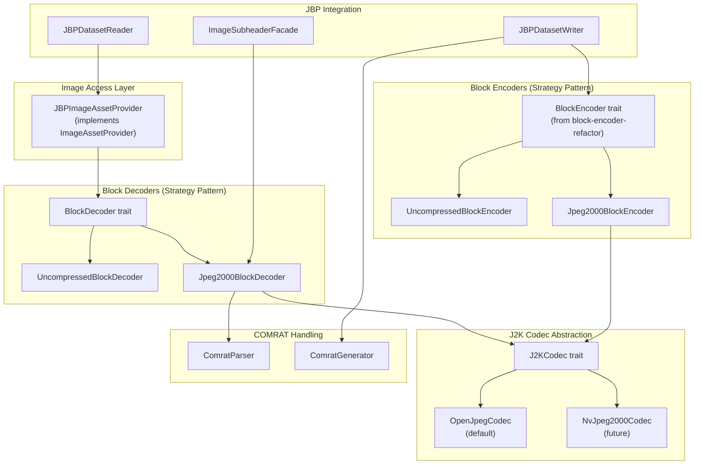

# Design Document: JPEG 2000 Compression

## Overview

This design describes the JPEG 2000 compression support for Phase 5 of the JBP implementation. The design enables reading and writing of JPEG 2000 compressed imagery (IC=C8, CD) in NITF files, which is the most common compression format in modern NITF imagery.

### Key Design Decisions

1. **Pluggable Codec Abstraction**: A `J2KCodec` trait abstracts JPEG 2000 encoding/decoding operations, allowing different backend implementations (OpenJPEG, NVIDIA nvJPEG2000, etc.) to be swapped without changing application code.

2. **Zero-Copy Buffer Interface**: The codec interface accepts byte slices (`&[u8]`) for decoding, enabling direct use of memory-mapped files or pointers to NITF image segment data without copying.

3. **Strategy Pattern Extension**: The existing `BlockDecoder` trait from Phase 4 is extended with `Jpeg2000BlockDecoder`, which delegates to the configured `J2KCodec` implementation.

4. **OpenJPEG Default**: The OpenJPEG library (libopenjp2) provides the default codec implementation via Rust FFI bindings.

5. **Feature Flags for Backends**: Cargo feature flags control which codec backends are compiled, allowing users to include only the backends they need.

6. **Resolution Level Support**: The design exposes JPEG 2000's native multi-resolution capability through the existing `num_resolution_levels()` API.

## Architecture

### Design Rationale: Symmetric Block-Based I/O

The architecture uses symmetric block-based interfaces for both reading and writing, leveraging the traits established in the block-encoder-refactor:

1. **Reading uses BlockDecoder**: The `BlockDecoder` trait (from Phase 4) enables reading arbitrary blocks without loading the entire image into memory.

2. **Writing uses BlockEncoder**: The `BlockEncoder` trait (from block-encoder-refactor) enables writing images tile-by-tile. The `Jpeg2000BlockEncoder` implements this trait.

3. **JPEG 2000 supports tile-based encoding**: The OpenJPEG library provides `opj_write_tile()` for incremental tile encoding. This allows encoding large images without loading them entirely into memory.

4. **Tile size from NITF parameters**: The output tile size is determined by NPPBH/NPPBV from the NITF image subheader, passed to the encoder via `block_dimensions()`.

For JPEG 2000 writing, the flow is:
```
JBPDatasetWriter → Jpeg2000BlockEncoder.encode_block() → J2KCodec.encode_tile() → finalize() → NITF file
```



## Components and Interfaces

### J2KCodec Trait

The core abstraction for JPEG 2000 encoding and decoding operations. Implementations can wrap different libraries (OpenJPEG, nvJPEG2000, etc.).

```rust
/// Capabilities reported by a J2K codec implementation
/// 
/// Used for error messages and validation before attempting operations.
#[derive(Debug, Clone)]
pub struct J2KCodecCapabilities {
    /// Maximum supported bit depth
    pub max_bit_depth: u8,
    /// Whether HTJ2K (Part 15) decoding is supported
    pub htj2k_decode: bool,
    /// Whether HTJ2K (Part 15) encoding is supported
    pub htj2k_encode: bool,
    /// Human-readable codec name (for error messages)
    pub name: &'static str,
}

/// Parameters for JPEG 2000 decoding
#[derive(Debug, Clone, Default)]
pub struct J2KDecodeParams {
    /// Target resolution level (0 = full resolution)
    pub resolution_level: u32,
    /// Optional region of interest (x, y, width, height)
    pub region: Option<(u32, u32, u32, u32)>,
}

/// Parameters for JPEG 2000 encoding
#[derive(Debug, Clone)]
pub struct J2KEncodeParams {
    /// Image width in pixels
    pub width: u32,
    /// Image height in pixels
    pub height: u32,
    /// Number of components (bands)
    pub num_components: u32,
    /// Bits per component
    pub bits_per_component: u8,
    /// Whether components are signed
    pub is_signed: bool,
    /// Target compression ratio (e.g., 10.0 for 10:1)
    pub compression_ratio: Option<f64>,
    /// Lossless encoding flag
    pub lossless: bool,
    /// Number of decomposition levels (resolution levels - 1)
    pub num_decomposition_levels: u8,
    /// Number of quality layers
    pub num_quality_layers: u8,
    /// Use HTJ2K (Part 15) encoding
    pub htj2k: bool,
    /// Tile width (for incremental encoding)
    pub tile_width: u32,
    /// Tile height (for incremental encoding)
    pub tile_height: u32,
}

impl Default for J2KEncodeParams {
    fn default() -> Self {
        Self {
            width: 0,
            height: 0,
            num_components: 1,
            bits_per_component: 8,
            is_signed: false,
            compression_ratio: Some(10.0),
            lossless: false,
            num_decomposition_levels: 5,
            num_quality_layers: 1,
            htj2k: false,
            tile_width: 1024,  // Default tile size
            tile_height: 1024,
        }
    }
}

/// Result of decoding a JPEG 2000 codestream
#[derive(Debug)]
pub struct J2KDecodeResult {
    /// Decoded pixel data in band-sequential format
    pub data: Vec<u8>,
    /// Image width at decoded resolution
    pub width: u32,
    /// Image height at decoded resolution
    pub height: u32,
    /// Number of components (bands)
    pub num_components: u32,
    /// Bits per component
    pub bits_per_component: u8,
    /// Whether components are signed
    pub is_signed: bool,
    /// Number of available resolution levels
    pub num_resolution_levels: u32,
}

/// Trait for JPEG 2000 codec implementations
pub trait J2KCodec: Send + Sync {
    /// Get codec capabilities
    fn capabilities(&self) -> J2KCodecCapabilities;
    
    /// Decode a JPEG 2000 codestream from a byte slice
    ///
    /// # Arguments
    /// * `codestream` - Byte slice containing the J2K codestream (can be memory-mapped)
    /// * `params` - Decoding parameters
    ///
    /// # Returns
    /// Decoded image data and metadata
    fn decode(
        &self,
        codestream: &[u8],
        params: &J2KDecodeParams,
    ) -> Result<J2KDecodeResult, CodecError>;
    
    /// Start encoding a new JPEG 2000 codestream
    ///
    /// # Arguments
    /// * `params` - Encoding parameters including dimensions and tile size
    ///
    /// # Returns
    /// Encoder state for subsequent tile writes
    fn start_encode(&self, params: &J2KEncodeParams) -> Result<Box<dyn J2KEncodeState>, CodecError>;
    
    /// Get the number of resolution levels in a codestream without full decode
    fn get_resolution_levels(&self, codestream: &[u8]) -> Result<u32, CodecError>;
    
    /// Get image dimensions from codestream header without full decode
    fn get_dimensions(&self, codestream: &[u8]) -> Result<(u32, u32, u32), CodecError>;
}

/// State for incremental JPEG 2000 encoding
pub trait J2KEncodeState: Send {
    /// Encode a single tile
    ///
    /// # Arguments
    /// * `tile_index` - Index of the tile (row-major order)
    /// * `data` - Pixel data for this tile in band-sequential format
    fn encode_tile(&mut self, tile_index: u32, data: &[u8]) -> Result<(), CodecError>;
    
    /// Finalize encoding and return the complete codestream
    fn finalize(self: Box<Self>) -> Result<Vec<u8>, CodecError>;
}
```

### OpenJpegCodec

The default implementation using the OpenJPEG library via FFI.

```rust
/// OpenJPEG-based J2K codec implementation
pub struct OpenJpegCodec {
    // Configuration options
    num_threads: usize,
}

impl OpenJpegCodec {
    /// Create a new OpenJPEG codec with default settings
    pub fn new() -> Self {
        Self {
            num_threads: num_cpus::get(),
        }
    }
    
    /// Create with specific thread count
    pub fn with_threads(num_threads: usize) -> Self {
        Self { num_threads }
    }
}

impl Default for OpenJpegCodec {
    fn default() -> Self {
        Self::new()
    }
}

impl J2KCodec for OpenJpegCodec {
    fn capabilities(&self) -> J2KCodecCapabilities {
        J2KCodecCapabilities {
            max_bit_depth: 38,
            htj2k_decode: false, // OpenJPEG doesn't support HTJ2K
            htj2k_encode: false,
            name: "OpenJPEG",
        }
    }
    
    fn decode(
        &self,
        codestream: &[u8],
        params: &J2KDecodeParams,
    ) -> Result<J2KDecodeResult, CodecError> {
        // FFI calls to openjp2 library
        // 1. Create decoder
        // 2. Set decode parameters (resolution level, region)
        // 3. Read header to get image info
        // 4. Decode image data
        // 5. Convert to band-sequential format
        // 6. Return result
        todo!("OpenJPEG FFI implementation")
    }
    
    fn encode(
        &self,
        data: &[u8],
        params: &J2KEncodeParams,
    ) -> Result<Vec<u8>, CodecError> {
        // FFI calls to openjp2 library
        // 1. Create encoder
        // 2. Set encoding parameters
        // 3. Create image structure from input data
        // 4. Encode to codestream
        // 5. Return codestream bytes
        todo!("OpenJPEG FFI implementation")
    }
    
    fn get_resolution_levels(&self, codestream: &[u8]) -> Result<u32, CodecError> {
        // Read COD marker to get decomposition levels
        todo!("OpenJPEG FFI implementation")
    }
    
    fn get_dimensions(&self, codestream: &[u8]) -> Result<(u32, u32, u32), CodecError> {
        // Read SIZ marker to get dimensions
        todo!("OpenJPEG FFI implementation")
    }
}
```

### Jpeg2000BlockDecoder

Implementation of `BlockDecoder` for JPEG 2000 compressed imagery.

```rust
/// Block decoder for JPEG 2000 compressed NITF imagery (IC=C8, CD)
pub struct Jpeg2000BlockDecoder {
    /// The J2K codestream data (from image segment)
    codestream: Arc<[u8]>,
    /// Image dimensions from subheader
    nrows: u32,
    ncols: u32,
    /// Number of bands
    nbands: u32,
    /// Bits per pixel
    nbpp: u8,
    /// Pixel value type
    pvtype: PixelValueType,
    /// Compression type (C8 or CD)
    ic: String,
    /// COMRAT value
    comrat: Option<String>,
    /// The J2K codec to use for decoding
    codec: Arc<dyn J2KCodec>,
    /// Cached resolution level count
    num_resolution_levels: OnceCell<u32>,
}

impl Jpeg2000BlockDecoder {
    /// Create from image subheader facade and codestream data
    pub fn new(
        subheader: &ImageSubheaderFacade,
        codestream: Arc<[u8]>,
        codec: Arc<dyn J2KCodec>,
    ) -> Result<Self, CodecError> {
        // Validate J2K constraints
        let ic = subheader.ic()?.trim().to_string();
        let imode = subheader.imode()?;
        
        // BPJ2K01.20: IMODE must be B for J2K
        if imode != InterleaveMode::B {
            return Err(CodecError::InvalidFormat(
                "JPEG 2000 images must have IMODE=B".to_string()
            ));
        }
        
        let nbpp = subheader.nbpp()?;
        let abpp = subheader.abpp()?;
        
        // BPJ2K01.20: ABPP must equal NBPP for J2K
        if abpp != nbpp {
            return Err(CodecError::InvalidFormat(
                format!("JPEG 2000 images must have ABPP={} equal to NBPP={}", abpp, nbpp)
            ));
        }
        
        // BPJ2K01.20: NBPP must be 1-38 for J2K
        if nbpp < 1 || nbpp > 38 {
            return Err(CodecError::InvalidFormat(
                format!("JPEG 2000 NBPP must be 1-38, got {}", nbpp)
            ));
        }
        
        // Check codec capabilities for HTJ2K
        if ic == "CD" && !codec.capabilities().htj2k_decode {
            return Err(CodecError::Unsupported(
                format!("Codec '{}' does not support HTJ2K decoding", 
                        codec.capabilities().name)
            ));
        }
        
        Ok(Self {
            codestream,
            nrows: subheader.nrows()?,
            ncols: subheader.ncols()?,
            nbands: subheader.band_count()? as u32,
            nbpp,
            pvtype: subheader.pvtype()?,
            ic,
            comrat: subheader.comrat()?.map(|s| s.to_string()),
            codec,
            num_resolution_levels: OnceCell::new(),
        })
    }
    
    /// Get or compute the number of resolution levels
    fn resolution_levels(&self) -> Result<u32, CodecError> {
        self.num_resolution_levels.get_or_try_init(|| {
            self.codec.get_resolution_levels(&self.codestream)
        }).copied()
    }
}

impl BlockDecoder for Jpeg2000BlockDecoder {
    fn decode_block(
        &self,
        block_row: u32,
        block_col: u32,
        bands: Option<&[u32]>,
    ) -> Result<(Vec<u8>, [u32; 3]), CodecError> {
        // For J2K, the entire image is typically one "block"
        // We decode the full image and extract the requested region
        
        // Validate block coordinates (J2K images are single-block)
        if block_row != 0 || block_col != 0 {
            return Err(CodecError::InvalidBlockCoordinates(block_row, block_col, 0));
        }
        
        let params = J2KDecodeParams::default();
        let result = self.codec.decode(&self.codestream, &params)?;
        
        // Validate decoded dimensions match subheader
        if result.width != self.ncols || result.height != self.nrows {
            return Err(CodecError::Decode(format!(
                "Decoded dimensions {}x{} don't match subheader {}x{}",
                result.width, result.height, self.ncols, self.nrows
            )));
        }
        
        // Apply band selection if specified
        let (data, num_bands) = match bands {
            Some(band_indices) if !band_indices.is_empty() => {
                let selected = self.select_bands(&result.data, band_indices)?;
                (selected, band_indices.len() as u32)
            }
            _ => (result.data, result.num_components),
        };
        
        Ok((data, [result.height, result.width, num_bands]))
    }
    
    fn has_block(&self, block_row: u32, block_col: u32) -> bool {
        // J2K images are single-block
        block_row == 0 && block_col == 0
    }
    
    fn compression_type(&self) -> &str {
        &self.ic
    }
    
    fn num_resolution_levels(&self) -> u32 {
        self.resolution_levels().unwrap_or(1)
    }
}
```

### BlockEncoder Trait (Implemented)

The `BlockEncoder` trait was implemented as part of the block-encoder-refactor and is now available in `src/jbp/image/encoder.rs`. The `Jpeg2000BlockEncoder` will implement this existing trait.

```rust
/// Trait for encoding image blocks to various compression formats
/// (Already implemented in src/jbp/image/encoder.rs)
pub trait BlockEncoder: Send + Sync {
    /// Encode a single block of image data.
    ///
    /// # Arguments
    /// * `block_row` - Row index of the block in the block grid (0-indexed)
    /// * `block_col` - Column index of the block in the block grid (0-indexed)
    /// * `data` - Pixel data in band-sequential format
    /// * `shape` - Shape of the data as [rows, cols, bands]
    ///
    /// # Errors
    /// Returns `CodecError::InvalidBlockCoordinates` if coordinates are out of bounds.
    /// Returns `CodecError::Encode` if data size doesn't match shape.
    fn encode_block(
        &mut self,
        block_row: u32,
        block_col: u32,
        data: &[u8],
        shape: [u32; 3],
    ) -> Result<(), CodecError>;

    /// Finalize encoding and return the complete encoded image data.
    ///
    /// This method must be called after all blocks have been encoded.
    /// The returned data is ready to be written to the NITF image segment.
    ///
    /// # Errors
    /// Returns `CodecError::Encode` if not all blocks have been encoded.
    fn finalize(self: Box<Self>) -> Result<Vec<u8>, CodecError>;

    /// Get the compression type identifier.
    ///
    /// # Returns
    /// The IC field value (e.g., "NC", "C8").
    fn compression_type(&self) -> &str;

    /// Get the block grid dimensions.
    ///
    /// # Returns
    /// A tuple of (num_block_rows, num_block_cols).
    fn block_grid_size(&self) -> (u32, u32);

    /// Get the output block dimensions in pixels.
    ///
    /// # Returns
    /// A tuple of (block_height, block_width).
    fn block_dimensions(&self) -> (u32, u32);
}
```

The existing `create_block_encoder()` factory function will be extended to support J2K:

```rust
/// Factory function to create the appropriate block encoder based on IC field
/// (Extend existing function in src/jbp/image/encoder.rs)
pub fn create_block_encoder(
    ic: &str,
    nrows: u32,
    ncols: u32,
    nbands: u32,
    nbpp: u8,
    imode: InterleaveMode,
    nppbh: u32,
    nppbv: u32,
) -> Result<Box<dyn BlockEncoder>, CodecError> {
    match ic.trim() {
        "NC" => Ok(Box::new(UncompressedBlockEncoder::new(...))),
        "C8" => Ok(Box::new(Jpeg2000BlockEncoder::new(..., htj2k: false))),
        "CD" => Ok(Box::new(Jpeg2000BlockEncoder::new(..., htj2k: true))),
        _ => Err(CodecError::Unsupported(...)),
    }
}
```

### Jpeg2000BlockEncoder

Implementation of the existing `BlockEncoder` trait for JPEG 2000 compression.

```rust
/// Block encoder for JPEG 2000 compressed NITF imagery
pub struct Jpeg2000BlockEncoder {
    /// The J2K codec to use for encoding
    codec: Arc<dyn J2KCodec>,
    /// Encoding state from the codec
    encode_state: Box<dyn J2KEncodeState>,
    /// Block grid dimensions (rows, cols)
    block_grid: (u32, u32),
    /// Block dimensions in pixels (height, width)
    block_dims: (u32, u32),
    /// Compression type (C8 or CD)
    ic: String,
    /// Track which blocks have been encoded
    encoded_blocks: HashSet<(u32, u32)>,
}

impl Jpeg2000BlockEncoder {
    pub fn new(
        nrows: u32,
        ncols: u32,
        nbands: u32,
        nbpp: u8,
        pvtype: PixelValueType,
        nppbh: u32,  // block width
        nppbv: u32,  // block height
        hints: &J2KEncodingHints,
    ) -> Result<Self, CodecError> {
        let codec = get_j2k_codec();
        
        // Check codec capabilities for HTJ2K
        if hints.htj2k && !codec.capabilities().htj2k_encode {
            return Err(CodecError::Unsupported(
                format!("Codec '{}' does not support HTJ2K encoding", 
                        codec.capabilities().name)
            ));
        }
        
        let params = J2KEncodeParams {
            width: ncols,
            height: nrows,
            num_components: nbands,
            bits_per_component: nbpp,
            is_signed: matches!(pvtype, PixelValueType::SignedInt),
            compression_ratio: hints.compression_ratio,
            lossless: hints.lossless,
            num_decomposition_levels: hints.decomposition_levels,
            num_quality_layers: hints.quality_layers,
            htj2k: hints.htj2k,
            tile_width: nppbh,
            tile_height: nppbv,
        };
        
        let encode_state = codec.start_encode(&params)?;
        
        // Calculate block grid based on tile size
        let block_cols = (ncols + nppbh - 1) / nppbh;
        let block_rows = (nrows + nppbv - 1) / nppbv;
        
        Ok(Self {
            codec,
            encode_state,
            block_grid: (block_rows, block_cols),
            block_dims: (nppbv, nppbh),
            ic: if hints.htj2k { "CD" } else { "C8" }.to_string(),
            encoded_blocks: HashSet::new(),
        })
    }
}

impl BlockEncoder for Jpeg2000BlockEncoder {
    fn encode_block(
        &mut self,
        block_row: u32,
        block_col: u32,
        data: &[u8],
        shape: [u32; 3],
    ) -> Result<(), CodecError> {
        // Validate block coordinates
        if block_row >= self.block_grid.0 || block_col >= self.block_grid.1 {
            return Err(CodecError::InvalidBlockCoordinates(
                block_row, block_col, 0
            ));
        }
        
        // Calculate tile index (row-major order)
        let tile_index = block_row * self.block_grid.1 + block_col;
        
        // Encode the tile
        self.encode_state.encode_tile(tile_index, data)?;
        
        // Track encoded block
        self.encoded_blocks.insert((block_row, block_col));
        
        Ok(())
    }
    
    fn finalize(self: Box<Self>) -> Result<Vec<u8>, CodecError> {
        // Verify all blocks were encoded
        let expected_blocks = self.block_grid.0 * self.block_grid.1;
        if self.encoded_blocks.len() != expected_blocks as usize {
            return Err(CodecError::Encode(format!(
                "Incomplete encoding: {} of {} blocks encoded",
                self.encoded_blocks.len(), expected_blocks
            )));
        }
        
        self.encode_state.finalize()
    }
    
    fn compression_type(&self) -> &str {
        &self.ic
    }
    
    fn block_grid_size(&self) -> (u32, u32) {
        self.block_grid
    }
    
    fn block_dimensions(&self) -> (u32, u32) {
        self.block_dims
    }
}
```

### J2KEncodingHints

Configuration for JPEG 2000 encoding parameters, passed to the encoder via the writer.

```rust
/// Encoding hints for JPEG 2000 compression
#[derive(Debug, Clone)]
pub struct J2KEncodingHints {
    /// Target compression ratio (e.g., 10.0 for 10:1), None for lossless
    pub compression_ratio: Option<f64>,
    /// Lossless encoding
    pub lossless: bool,
    /// Number of decomposition levels (default 5)
    pub decomposition_levels: u8,
    /// Number of quality layers (default 1)
    pub quality_layers: u8,
    /// Use HTJ2K (Part 15) encoding
    pub htj2k: bool,
}

impl Default for J2KEncodingHints {
    fn default() -> Self {
        Self {
            compression_ratio: Some(10.0),
            lossless: false,
            decomposition_levels: 5,
            quality_layers: 1,
            htj2k: false,
        }
    }
}
```

### COMRAT Parser and Generator

Handles parsing and generating the COMRAT field for JPEG 2000 images.

```rust
/// Parsed COMRAT value for JPEG 2000
#[derive(Debug, Clone, PartialEq)]
pub enum J2KComrat {
    /// Numerically lossless (e.g., "N001.0")
    NumericallyLossless,
    /// Visually lossless with quality factor (e.g., "V001.5")
    VisuallyLossless(f32),
    /// Target bits per pixel (e.g., "00.5" = 0.5 bpp)
    TargetBpp(f32),
}

impl J2KComrat {
    /// Parse COMRAT string for J2K images
    pub fn parse(comrat: &str) -> Result<Self, CodecError> {
        let comrat = comrat.trim();
        
        if comrat.len() != 4 {
            return Err(CodecError::InvalidFormat(format!(
                "COMRAT must be 4 characters, got '{}'", comrat
            )));
        }
        
        if comrat.starts_with('N') {
            // Numerically lossless: "Nnnn.n"
            Ok(J2KComrat::NumericallyLossless)
        } else if comrat.starts_with('V') {
            // Visually lossless: "Vnnn.n"
            let value: f32 = comrat[1..].parse().map_err(|_| {
                CodecError::InvalidFormat(format!("Invalid COMRAT value: '{}'", comrat))
            })?;
            Ok(J2KComrat::VisuallyLossless(value))
        } else {
            // Target bpp: "nn.n"
            let value: f32 = comrat.parse().map_err(|_| {
                CodecError::InvalidFormat(format!("Invalid COMRAT value: '{}'", comrat))
            })?;
            Ok(J2KComrat::TargetBpp(value))
        }
    }
    
    /// Generate COMRAT string
    pub fn to_string(&self) -> String {
        match self {
            J2KComrat::NumericallyLossless => "N001.0".to_string(),
            J2KComrat::VisuallyLossless(v) => format!("V{:04.1}", v),
            J2KComrat::TargetBpp(bpp) => format!("{:04.1}", bpp),
        }
    }
}

/// Generate COMRAT from encoding hints
pub fn generate_comrat(hints: &J2KEncodingHints) -> String {
    if hints.lossless {
        "N001.0".to_string()
    } else if let Some(ratio) = hints.compression_ratio {
        // Convert compression ratio to approximate bpp
        // Assuming 8-bit source, ratio 10:1 = 0.8 bpp
        let bpp = 8.0 / ratio;
        format!("{:04.1}", bpp.min(99.9))
    } else {
        "N001.0".to_string() // Default to lossless if no ratio specified
    }
}
```

### Updated create_block_decoder Factory

The factory function is extended to create `Jpeg2000BlockDecoder` for J2K images.

```rust
/// Factory function to create the appropriate block decoder based on IC field
pub fn create_block_decoder(
    subheader: &ImageSubheaderFacade,
    image_data: Arc<[u8]>,
    j2k_codec: Option<Arc<dyn J2KCodec>>,
) -> Result<Box<dyn BlockDecoder>, CodecError> {
    let ic = subheader.ic()?;
    let ic_trimmed = ic.trim();

    match ic_trimmed {
        "NC" | "NM" => {
            let decoder = UncompressedBlockDecoder::new(subheader, image_data)?;
            Ok(Box::new(decoder))
        }
        "C8" | "CD" => {
            // Use provided codec or default to OpenJPEG
            let codec = j2k_codec.unwrap_or_else(|| {
                Arc::new(OpenJpegCodec::default())
            });
            let decoder = Jpeg2000BlockDecoder::new(subheader, image_data, codec)?;
            Ok(Box::new(decoder))
        }
        _ => Err(CodecError::Unsupported(format!(
            "Unsupported compression type: '{}'. Supported: NC, NM, C8, CD.",
            ic_trimmed
        ))),
    }
}
```

### Codec Configuration

The codec is selected via environment variable, making it transparent to API users. This follows the same pattern as `OSML_IO_STRUCTURE_PATH` for structure definitions.

```rust
/// Environment variable for codec selection
const J2K_CODEC_ENV: &str = "OSML_IO_J2K_CODEC";

/// Get the configured J2K codec based on environment variable
/// 
/// Checks OSML_IO_J2K_CODEC environment variable:
/// - "openjpeg" or unset: Use OpenJPEG (default)
/// - "nvjpeg2000": Use NVIDIA nvJPEG2000 (future)
/// 
/// This is an internal function - users of JBPDatasetReader/Writer
/// do not need to interact with codecs directly.
pub(crate) fn get_j2k_codec() -> Arc<dyn J2KCodec> {
    match std::env::var(J2K_CODEC_ENV).as_deref() {
        Ok("nvjpeg2000") => {
            // Future: return Arc::new(NvJpeg2000Codec::new())
            panic!("nvjpeg2000 codec not yet implemented")
        }
        _ => Arc::new(OpenJpegCodec::default()),
    }
}
```

The public API remains unchanged - users simply use `JBPDatasetReader` and `JBPDatasetWriter`:

```rust
// User code - no codec details exposed
let reader = JBPDatasetReader::open("image.ntf")?;
let image = reader.get_image_asset(0)?;
let (data, shape) = image.get_block(0, 0, 0, None)?;

// To use a different codec, set environment variable before running:
// OSML_IO_J2K_CODEC=nvjpeg2000 ./my_program
```

## Data Models

### IC Code to Codec Mapping

| IC Code | Description | Codec Type | Phase |
|---------|-------------|------------|-------|
| NC | No compression | UncompressedBlockDecoder | 4 |
| NM | No compression with mask | UncompressedBlockDecoder | 6 |
| C8 | JPEG 2000 Part 1 | Jpeg2000BlockDecoder | 5 |
| CD | JPEG 2000 Part 15 (HTJ2K) | Jpeg2000BlockDecoder | 5 |
| M8 | JPEG 2000 Part 1 with mask | Jpeg2000BlockDecoder + Mask | 6 |
| MD | HTJ2K with mask | Jpeg2000BlockDecoder + Mask | 6 |

### COMRAT Format for JPEG 2000

| Format | Example | Meaning |
|--------|---------|---------|
| Nnnn.n | N001.0 | Numerically lossless |
| Vnnn.n | V001.5 | Visually lossless, quality factor |
| nn.n | 00.5 | Target bits per pixel |

### BPJ2K01.20 Profile Constraints

| Constraint | Value | Validation |
|------------|-------|------------|
| IMODE | B | Must be band-interleaved by block |
| NBPP | 1-38 | Bit depth range |
| ABPP | = NBPP | Must equal NBPP |
| PVTYPE | INT, SI | Unsigned or signed integer |

### Resolution Level Scaling

| Level | Scale Factor | Dimensions |
|-------|--------------|------------|
| 0 | 1 | NROWS × NCOLS |
| 1 | 1/2 | NROWS/2 × NCOLS/2 |
| 2 | 1/4 | NROWS/4 × NCOLS/4 |
| N | 1/2^N | NROWS/2^N × NCOLS/2^N |

</content>
</invoke>


## Correctness Properties

*A property is a characteristic or behavior that should hold true across all valid executions of a system-essentially, a formal statement about what the system should do. Properties serve as the bridge between human-readable specifications and machine-verifiable correctness guarantees.*

### Property 1: Lossless Round-Trip Consistency

*For any* valid image data (any dimensions, any bit depth 1-38, any band count 1-99999, any PVTYPE INT or SI), encoding with lossless mode and then decoding SHALL produce byte-identical pixel data with preserved dimensions and band count.

**Validates: Requirements 15.1, 15.3, 15.4, 13.1-13.4, 14.1-14.4**

### Property 2: Lossy Round-Trip Quality Tolerance

*For any* valid image data encoded with lossy compression at a given compression ratio, decoding SHALL produce pixel data where the peak signal-to-noise ratio (PSNR) meets or exceeds the expected quality threshold for that ratio.

**Validates: Requirements 15.2**

### Property 3: Resolution Level Dimension Scaling

*For any* JPEG 2000 codestream with N decomposition levels and any valid resolution level R (0 ≤ R ≤ N), the decoded dimensions SHALL be (NROWS / 2^R, NCOLS / 2^R), rounded up to the nearest integer.

**Validates: Requirements 3.1, 3.2, 3.3, 3.5**

### Property 4: Decoded Dimensions Match Subheader

*For any* valid JPEG 2000 codestream extracted from a NITF image segment, the decoded dimensions at resolution level 0 SHALL exactly match the NROWS and NCOLS values from the image subheader.

**Validates: Requirements 2.2**

### Property 5: Band Count Preservation

*For any* multi-band JPEG 2000 codestream, the decoded band count SHALL equal the NBANDS (or XBANDS) value from the image subheader, and the output data SHALL be in band-sequential format.

**Validates: Requirements 2.4, 2.5**

### Property 6: Band Selection Correctness

*For any* valid band subset request (a non-empty subset of available bands), the returned data SHALL contain only the requested bands in the specified order, with the shape tuple reflecting the selected band count.

**Validates: Requirements 4.5**

### Property 7: Invalid Block Coordinates Error

*For any* block coordinates (row, col) where row > 0 or col > 0 (since J2K images are single-block), the decoder SHALL return an InvalidBlockCoordinates error.

**Validates: Requirements 4.4**

### Property 8: BPJ2K Profile Constraint Validation

*For any* JPEG 2000 image segment, the decoder SHALL validate that NBPP is in range [1, 38] and ABPP equals NBPP, returning a validation error if either constraint is violated.

**Validates: Requirements 6.2, 6.3**

### Property 9: COMRAT Parse-Generate Round-Trip

*For any* valid COMRAT value (numerically lossless "Nnnn.n", visually lossless "Vnnn.n", or target bpp "nn.n"), parsing and then generating SHALL produce an equivalent 4-character COMRAT string.

**Validates: Requirements 5.1, 10.4**

### Property 10: Codestream Embedding Integrity

*For any* encoded JPEG 2000 codestream written to a NITF file, the codestream SHALL be embedded at the correct offset after the image subheader, with the image data length field correctly reflecting the codestream size.

**Validates: Requirements 12.1, 12.2, 12.3, 12.4**

## Error Handling

| Error | Condition | Context |
|-------|-----------|---------|
| `UnsupportedCompression` | IC code not C8 or CD | IC value |
| `InvalidFormat` | IMODE not B for J2K | IMODE value |
| `InvalidFormat` | NBPP outside 1-38 range | NBPP value |
| `InvalidFormat` | ABPP not equal to NBPP | ABPP, NBPP values |
| `InvalidFormat` | Invalid J2K magic bytes | Byte offset, expected 0xFF4F |
| `InvalidBlockCoordinates` | Block row/col not (0,0) | Coordinates |
| `InvalidResolutionLevel` | Level >= num_resolution_levels | Level, available levels |
| `Unsupported` | Codec doesn't support HTJ2K | Codec name, IC value |
| `Unsupported` | Bit depth exceeds codec max | Bit depth, codec max |
| `Decode` | J2K decode failure | Codec error message |
| `Encode` | J2K encode failure | Codec error message, params |
| `InvalidFormat` | Invalid COMRAT format | COMRAT value |
| `InvalidFormat` | Decoded dimensions mismatch | Decoded vs subheader dims |

## Testing Strategy

### Property-Based Testing

- **Library**: `proptest` (Rust), `hypothesis` (Python)
- **Minimum iterations**: 100 per property test
- **Tag format**: `Feature: jpeg2000-compression, Property {N}: {property_text}`

### Test Categories

1. **Codec Abstraction Tests**: Verify J2KCodec trait implementations
2. **Round-Trip Tests**: Lossless and lossy encode/decode cycles
3. **Resolution Level Tests**: Multi-resolution decoding
4. **COMRAT Tests**: Parse and generate COMRAT values
5. **Validation Tests**: BPJ2K profile constraint checking
6. **Integration Tests**: End-to-end NITF read/write with J2K

### Unit Testing Balance

- Unit tests focus on specific examples: magic byte validation, COMRAT edge cases, error conditions
- Property tests cover the space of valid inputs: dimensions, bit depths, band counts, compression ratios
- Integration tests use real J2K-compressed NITF files from test suite

### Test Data

- **Unit test data**: `data/unit/j2k/` - Synthetic J2K codestreams
- **Integration data**: `data/integration/JITC/` - J2K compressed NITF files
- **Generated data**: Property tests generate random images for round-trip testing

### Codec Backend Testing

Each codec backend (OpenJPEG, future nvJPEG2000) should have:
- Capability reporting tests
- Basic encode/decode tests
- Error handling tests
- Performance benchmarks (optional)

### Python Integration Tests

```python
# Example test structure
def test_j2k_read_resolution_levels():
    """Test reading J2K image at different resolution levels."""
    reader = JBPDatasetReader("test_j2k.ntf")
    image = reader.get_asset("image_segment_0")
    
    assert image.num_resolution_levels() > 1
    
    # Full resolution
    block_0, shape_0 = image.get_block(0, 0, resolution_level=0)
    
    # Half resolution
    block_1, shape_1 = image.get_block(0, 0, resolution_level=1)
    
    assert shape_1[0] == shape_0[0] // 2
    assert shape_1[1] == shape_0[1] // 2

def test_j2k_write_lossless():
    """Test writing lossless J2K image."""
    # Create test image
    data = np.random.randint(0, 255, (256, 256, 3), dtype=np.uint8)
    
    # Write with lossless J2K
    writer = JBPDatasetWriter("output.ntf", NitfFormat.Nitf21)
    writer.add_image(data, ic="C8", lossless=True)
    writer.close()
    
    # Read back and verify
    reader = JBPDatasetReader("output.ntf")
    image = reader.get_asset("image_segment_0")
    block, shape = image.get_block(0, 0)
    
    np.testing.assert_array_equal(block.reshape(shape), data)
```

### Custom OpenJPEG FFI Bindings

The OpenJPEG integration uses custom FFI bindings rather than third-party crates (like `openjpeg-sys` or `openjpeg2-sys`) for licensing reasons. The bindings are organized into two layers:

#### sys.rs - Raw FFI Declarations

The `sys.rs` module contains raw `extern "C"` declarations for the OpenJPEG 2.x API. Key function groups:

**Codec Lifecycle:**
```rust
extern "C" {
    pub fn opj_create_decompress(format: OPJ_CODEC_FORMAT) -> *mut opj_codec_t;
    pub fn opj_create_compress(format: OPJ_CODEC_FORMAT) -> *mut opj_codec_t;
    pub fn opj_destroy_codec(p_codec: *mut opj_codec_t);
}
```

**Stream Management:**
```rust
extern "C" {
    pub fn opj_stream_create(p_buffer_size: OPJ_SIZE_T, p_is_input: OPJ_BOOL) -> *mut opj_stream_t;
    pub fn opj_stream_destroy(p_stream: *mut opj_stream_t);
    pub fn opj_stream_set_read_function(p_stream: *mut opj_stream_t, p_function: opj_stream_read_fn);
    pub fn opj_stream_set_write_function(p_stream: *mut opj_stream_t, p_function: opj_stream_write_fn);
    pub fn opj_stream_set_skip_function(p_stream: *mut opj_stream_t, p_function: opj_stream_skip_fn);
    pub fn opj_stream_set_seek_function(p_stream: *mut opj_stream_t, p_function: opj_stream_seek_fn);
    pub fn opj_stream_set_user_data(p_stream: *mut opj_stream_t, p_data: *mut c_void, p_function: opj_stream_free_user_data_fn);
    pub fn opj_stream_set_user_data_length(p_stream: *mut opj_stream_t, data_length: OPJ_UINT64);
}
```

**Decoding (Full Image):**
```rust
extern "C" {
    pub fn opj_set_default_decoder_parameters(parameters: *mut opj_dparameters_t);
    pub fn opj_setup_decoder(p_codec: *mut opj_codec_t, parameters: *mut opj_dparameters_t) -> OPJ_BOOL;
    pub fn opj_read_header(p_stream: *mut opj_stream_t, p_codec: *mut opj_codec_t, p_image: *mut *mut opj_image_t) -> OPJ_BOOL;
    pub fn opj_decode(p_decompressor: *mut opj_codec_t, p_stream: *mut opj_stream_t, p_image: *mut opj_image_t) -> OPJ_BOOL;
    pub fn opj_end_decompress(p_codec: *mut opj_codec_t, p_stream: *mut opj_stream_t) -> OPJ_BOOL;
    pub fn opj_set_decode_area(p_codec: *mut opj_codec_t, p_image: *mut opj_image_t, p_start_x: OPJ_INT32, p_start_y: OPJ_INT32, p_end_x: OPJ_INT32, p_end_y: OPJ_INT32) -> OPJ_BOOL;
    pub fn opj_set_decoded_resolution_factor(p_codec: *mut opj_codec_t, res_factor: OPJ_UINT32) -> OPJ_BOOL;
}
```

**Tile-Based Decoding:**
```rust
extern "C" {
    pub fn opj_read_tile_header(
        p_codec: *mut opj_codec_t,
        p_stream: *mut opj_stream_t,
        p_tile_index: *mut OPJ_UINT32,
        p_data_size: *mut OPJ_UINT32,
        p_tile_x0: *mut OPJ_INT32,
        p_tile_y0: *mut OPJ_INT32,
        p_tile_x1: *mut OPJ_INT32,
        p_tile_y1: *mut OPJ_INT32,
        p_nb_comps: *mut OPJ_UINT32,
        p_should_go_on: *mut OPJ_BOOL,
    ) -> OPJ_BOOL;
    
    pub fn opj_decode_tile_data(
        p_codec: *mut opj_codec_t,
        p_tile_index: OPJ_UINT32,
        p_data: *mut OPJ_BYTE,
        p_data_size: OPJ_UINT32,
        p_stream: *mut opj_stream_t,
    ) -> OPJ_BOOL;
    
    pub fn opj_get_decoded_tile(
        p_codec: *mut opj_codec_t,
        p_stream: *mut opj_stream_t,
        p_image: *mut opj_image_t,
        tile_index: OPJ_UINT32,
    ) -> OPJ_BOOL;
}
```

**Encoding:**
```rust
extern "C" {
    pub fn opj_set_default_encoder_parameters(parameters: *mut opj_cparameters_t);
    pub fn opj_setup_encoder(p_codec: *mut opj_codec_t, parameters: *mut opj_cparameters_t, image: *mut opj_image_t) -> OPJ_BOOL;
    pub fn opj_start_compress(p_codec: *mut opj_codec_t, p_image: *mut opj_image_t, p_stream: *mut opj_stream_t) -> OPJ_BOOL;
    pub fn opj_encode(p_codec: *mut opj_codec_t, p_stream: *mut opj_stream_t) -> OPJ_BOOL;
    pub fn opj_end_compress(p_codec: *mut opj_codec_t, p_stream: *mut opj_stream_t) -> OPJ_BOOL;
}
```

**Tile-Based Encoding:**
```rust
extern "C" {
    pub fn opj_write_tile(
        p_codec: *mut opj_codec_t,
        p_tile_index: OPJ_UINT32,
        p_data: *mut OPJ_BYTE,
        p_data_size: OPJ_UINT32,
        p_stream: *mut opj_stream_t,
    ) -> OPJ_BOOL;
}
```

**Image Management:**
```rust
extern "C" {
    pub fn opj_image_create(numcmpts: OPJ_UINT32, cmptparms: *mut opj_image_cmptparm_t, clrspc: OPJ_COLOR_SPACE) -> *mut opj_image_t;
    pub fn opj_image_tile_create(numcmpts: OPJ_UINT32, cmptparms: *mut opj_image_cmptparm_t, clrspc: OPJ_COLOR_SPACE) -> *mut opj_image_t;
    pub fn opj_image_destroy(image: *mut opj_image_t);
    pub fn opj_image_data_alloc(size: OPJ_SIZE_T) -> *mut c_void;
    pub fn opj_image_data_free(ptr: *mut c_void);
}
```

**Codestream Info:**
```rust
extern "C" {
    pub fn opj_get_cstr_info(p_codec: *mut opj_codec_t) -> *mut opj_codestream_info_v2_t;
    pub fn opj_get_cstr_index(p_codec: *mut opj_codec_t) -> *mut opj_codestream_index_t;
    pub fn opj_destroy_cstr_info(cstr_info: *mut *mut opj_codestream_info_v2_t);
    pub fn opj_destroy_cstr_index(p_cstr_index: *mut *mut opj_codestream_index_t);
}
```

**Message Handlers and Threading:**
```rust
extern "C" {
    pub fn opj_set_info_handler(p_codec: *mut opj_codec_t, p_callback: opj_msg_callback, p_user_data: *mut c_void) -> OPJ_BOOL;
    pub fn opj_set_warning_handler(p_codec: *mut opj_codec_t, p_callback: opj_msg_callback, p_user_data: *mut c_void) -> OPJ_BOOL;
    pub fn opj_set_error_handler(p_codec: *mut opj_codec_t, p_callback: opj_msg_callback, p_user_data: *mut c_void) -> OPJ_BOOL;
    pub fn opj_codec_set_threads(p_codec: *mut opj_codec_t, num_threads: c_int) -> OPJ_BOOL;
}
```

#### ffi.rs - Safe Rust Wrappers

The `ffi.rs` module provides safe Rust abstractions over the raw FFI. The key challenge is that OpenJPEG uses an abstract stream interface with callbacks, which requires careful handling for memory buffers.

**Memory Stream Adapters:**

OpenJPEG doesn't read directly from byte arrays - it uses callback-based streams. We implement custom adapters for memory buffers:

```rust
/// User data for memory read streams
struct MemoryReadStreamData<'a> {
    data: &'a [u8],
    position: usize,
}

/// Read callback for memory streams
extern "C" fn memory_read_fn(
    p_buffer: *mut c_void,
    p_nb_bytes: OPJ_SIZE_T,
    p_user_data: *mut c_void,
) -> OPJ_SIZE_T {
    let stream_data = unsafe { &mut *(p_user_data as *mut MemoryReadStreamData) };
    let remaining = stream_data.data.len() - stream_data.position;
    let to_read = (p_nb_bytes as usize).min(remaining);
    
    if to_read == 0 {
        return usize::MAX as OPJ_SIZE_T; // EOF indicator
    }
    
    unsafe {
        std::ptr::copy_nonoverlapping(
            stream_data.data[stream_data.position..].as_ptr(),
            p_buffer as *mut u8,
            to_read,
        );
    }
    stream_data.position += to_read;
    to_read as OPJ_SIZE_T
}

/// Skip callback for memory streams
extern "C" fn memory_skip_fn(
    p_nb_bytes: OPJ_OFF_T,
    p_user_data: *mut c_void,
) -> OPJ_OFF_T {
    let stream_data = unsafe { &mut *(p_user_data as *mut MemoryReadStreamData) };
    let new_pos = (stream_data.position as i64 + p_nb_bytes)
        .max(0)
        .min(stream_data.data.len() as i64) as usize;
    let skipped = new_pos as i64 - stream_data.position as i64;
    stream_data.position = new_pos;
    skipped as OPJ_OFF_T
}

/// Seek callback for memory streams
extern "C" fn memory_seek_fn(
    p_nb_bytes: OPJ_OFF_T,
    p_user_data: *mut c_void,
) -> OPJ_BOOL {
    let stream_data = unsafe { &mut *(p_user_data as *mut MemoryReadStreamData) };
    if p_nb_bytes < 0 || p_nb_bytes as usize > stream_data.data.len() {
        return OPJ_FALSE;
    }
    stream_data.position = p_nb_bytes as usize;
    OPJ_TRUE
}

/// Create a read stream from a byte slice
pub fn create_memory_read_stream(data: &[u8]) -> Result<OwnedStream, CodecError> {
    unsafe {
        let stream = opj_stream_create(OPJ_J2K_STREAM_CHUNK_SIZE, OPJ_TRUE);
        if stream.is_null() {
            return Err(CodecError::Decode("Failed to create OpenJPEG stream".into()));
        }
        
        // Box the stream data so it has a stable address
        let stream_data = Box::new(MemoryReadStreamData { data, position: 0 });
        let stream_data_ptr = Box::into_raw(stream_data);
        
        opj_stream_set_read_function(stream, Some(memory_read_fn));
        opj_stream_set_skip_function(stream, Some(memory_skip_fn));
        opj_stream_set_seek_function(stream, Some(memory_seek_fn));
        opj_stream_set_user_data(stream, stream_data_ptr as *mut c_void, Some(free_stream_data));
        opj_stream_set_user_data_length(stream, data.len() as OPJ_UINT64);
        
        Ok(OwnedStream { ptr: stream, _phantom: PhantomData })
    }
}
```

**Write Stream for Encoding:**

```rust
/// User data for memory write streams
struct MemoryWriteStreamData {
    buffer: Vec<u8>,
    position: usize,
}

/// Write callback for memory streams
extern "C" fn memory_write_fn(
    p_buffer: *mut c_void,
    p_nb_bytes: OPJ_SIZE_T,
    p_user_data: *mut c_void,
) -> OPJ_SIZE_T {
    let stream_data = unsafe { &mut *(p_user_data as *mut MemoryWriteStreamData) };
    let bytes_to_write = p_nb_bytes as usize;
    let src = unsafe { std::slice::from_raw_parts(p_buffer as *const u8, bytes_to_write) };
    
    // Ensure buffer is large enough
    let required_len = stream_data.position + bytes_to_write;
    if stream_data.buffer.len() < required_len {
        stream_data.buffer.resize(required_len, 0);
    }
    
    stream_data.buffer[stream_data.position..stream_data.position + bytes_to_write]
        .copy_from_slice(src);
    stream_data.position += bytes_to_write;
    
    bytes_to_write as OPJ_SIZE_T
}

/// Create a write stream that accumulates to a Vec<u8>
pub fn create_memory_write_stream() -> Result<(OwnedWriteStream, *mut MemoryWriteStreamData), CodecError> {
    // Similar pattern to read stream, but with write callback
    // Returns handle to extract final buffer after encoding
}
```

**RAII Wrappers:**

```rust
/// Owned codec handle with automatic cleanup
pub struct OwnedCodec {
    ptr: *mut opj_codec_t,
}

impl Drop for OwnedCodec {
    fn drop(&mut self) {
        if !self.ptr.is_null() {
            unsafe { opj_destroy_codec(self.ptr); }
        }
    }
}

/// Owned image handle with automatic cleanup
pub struct OwnedImage {
    ptr: *mut opj_image_t,
}

impl Drop for OwnedImage {
    fn drop(&mut self) {
        if !self.ptr.is_null() {
            unsafe { opj_image_destroy(self.ptr); }
        }
    }
}
```

**Error Message Capture:**

```rust
/// Captures error messages from OpenJPEG callbacks
struct ErrorCapture {
    messages: Vec<String>,
}

extern "C" fn error_callback(msg: *const c_char, client_data: *mut c_void) {
    let capture = unsafe { &mut *(client_data as *mut ErrorCapture) };
    if let Ok(s) = unsafe { CStr::from_ptr(msg) }.to_str() {
        capture.messages.push(s.trim().to_string());
    }
}
```

This design allows the codec to work with:
- Memory-mapped NITF files (the codestream is a `&[u8]` slice into the mapped region)
- In-memory buffers from network streams
- Any source that can provide a contiguous byte slice

### Feature Flags for Codec Backends

Codec backends are enabled via Cargo feature flags. Only enabled backends are compiled.

```toml
[features]
default = ["openjpeg"]
openjpeg = []  # Custom FFI bindings, links to system libopenjp2
nvjpeg2000 = []  # Future: custom FFI bindings for nvJPEG2000
```

The build configuration uses `pkg-config` or a `build.rs` script to locate the system `libopenjp2` library:

```toml
[build-dependencies]
pkg-config = "0.3"
```

The `get_j2k_codec()` function checks which backends are available:

```rust
pub(crate) fn get_j2k_codec() -> Arc<dyn J2KCodec> {
    match std::env::var(J2K_CODEC_ENV).as_deref() {
        #[cfg(feature = "nvjpeg2000")]
        Ok("nvjpeg2000") => Arc::new(NvJpeg2000Codec::new()),
        
        #[cfg(feature = "openjpeg")]
        _ => Arc::new(OpenJpegCodec::default()),
        
        #[cfg(not(feature = "openjpeg"))]
        _ => panic!("No J2K codec available. Enable 'openjpeg' feature."),
    }
}
```
