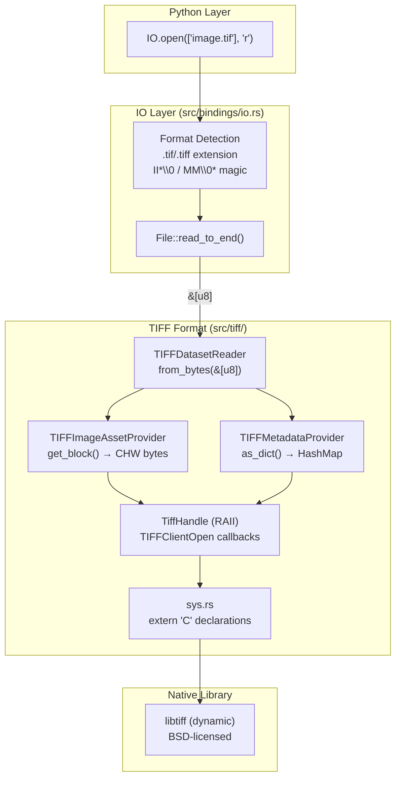
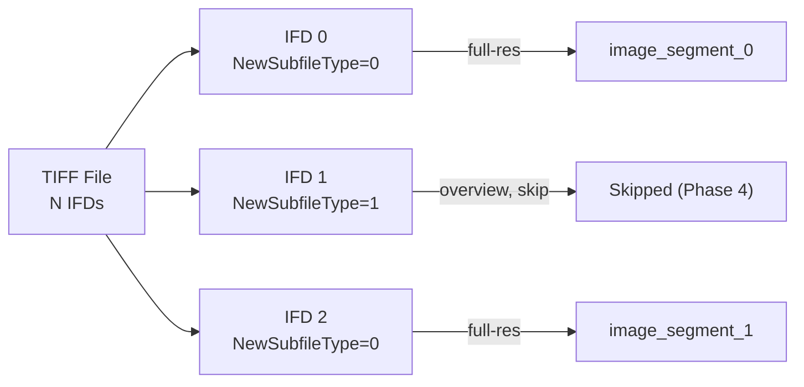

# Design Document: libtiff FFI Bindings and Basic TIFF Reading

## Overview

This design adds TIFF format reading to osml-imagery-io by integrating libtiff through custom FFI bindings, following the same architecture established by the JBP/NITF format. The implementation exposes TIFF pixel data and metadata through the existing `DatasetReader`, `ImageAssetProvider`, and `MetadataProvider` traits so that callers interact with TIFF files using the same API they use for NITF.

The core principle is that the format implementation operates on `&[u8]`, never touching the filesystem. libtiff is accessed via `TIFFClientOpen` with memory read/seek callbacks over a byte slice — the same pattern used for OpenJPEG's memory stream in `src/jbp/j2k/ffi.rs`. This means the TIFF reader automatically benefits from any future IO layer improvements (mmap, S3-backed reads) with zero code changes.

Key design decisions:
- Each full-resolution IFD becomes a separate `ImageAssetProvider` keyed as `image_segment_0`, `image_segment_1`, etc.
- Per-IFD metadata: each `ImageAssetProvider` has its own `MetadataProvider` with that IFD's tags
- Dataset-level metadata contains only file-level info (byte order, directory count, image segment count)
- Stripped TIFFs are treated as full-width blocks stacked vertically
- Feature-gated behind `#[cfg(feature = "libtiff")]`, enabled by default
- libtiff dynamically linked, BSD-licensed, custom FFI bindings (no `-sys` crates)

## Architecture

The TIFF module follows the same layered architecture as the JBP module:



The data flow is:
1. `IO.open()` detects `.tif`/`.tiff` extension, reads file to `Vec<u8>`
2. `TIFFDatasetReader::from_bytes(&[u8])` opens via `TIFFClientOpen` with memory callbacks
3. Reader enumerates IFDs, creates one `TIFFImageAssetProvider` per full-resolution IFD
4. `get_block()` calls `TIFFReadEncodedTile`/`TIFFReadEncodedStrip` through `TiffHandle`, converts to band-sequential (CHW) format
5. Metadata is extracted from TIFF tags via `TIFFGetField` and exposed as key-value dictionaries

## Components and Interfaces

### Module Layout

```
src/tiff/
├── mod.rs          # Module root, #[cfg(feature = "libtiff")] gate, re-exports
├── sys.rs          # Raw extern "C" FFI declarations for libtiff
├── ffi.rs          # Safe RAII wrapper (TiffHandle), memory callbacks, error capture
├── tags.rs         # TIFF tag constants and compression/sample format constants
├── image.rs        # TIFFImageAssetProvider (implements ImageAssetProvider)
├── reader.rs       # TIFFDatasetReader (implements DatasetReader)
└── metadata.rs     # TIFFMetadataProvider (implements MetadataProvider)
```

### Component 1: `sys.rs` — Raw FFI Declarations

Declares `extern "C"` bindings for the libtiff functions needed by the safe wrapper. Uses `*mut c_void` as the opaque `TIFF*` handle type. No safe abstractions — this module is purely declarations.

```rust
// Key function signatures (simplified)
extern "C" {
    pub fn TIFFClientOpen(
        name: *const c_char,
        mode: *const c_char,
        clientdata: *mut c_void,
        readproc: TIFFReadWriteProc,
        writeproc: TIFFReadWriteProc,
        seekproc: TIFFSeekProc,
        closeproc: TIFFCloseProc,
        sizeproc: TIFFSizeProc,
        mapproc: TIFFMapFileProc,
        unmapproc: TIFFUnmapFileProc,
    ) -> *mut c_void;
    pub fn TIFFClose(tif: *mut c_void);
    pub fn TIFFGetField(tif: *mut c_void, tag: u32, ...) -> c_int;
    pub fn TIFFReadEncodedTile(tif: *mut c_void, tile: u32, buf: *mut c_void, size: i64) -> i64;
    pub fn TIFFReadEncodedStrip(tif: *mut c_void, strip: u32, buf: *mut c_void, size: i64) -> i64;
    pub fn TIFFTileSize(tif: *mut c_void) -> i64;
    pub fn TIFFNumberOfTiles(tif: *mut c_void) -> u32;
    pub fn TIFFStripSize(tif: *mut c_void) -> i64;
    pub fn TIFFNumberOfStrips(tif: *mut c_void) -> u32;
    pub fn TIFFIsTiled(tif: *mut c_void) -> c_int;
    pub fn TIFFSetDirectory(tif: *mut c_void, dirnum: u16) -> c_int;
    pub fn TIFFCurrentDirectory(tif: *mut c_void) -> u16;
    pub fn TIFFNumberOfDirectories(tif: *mut c_void) -> u16;
    pub fn TIFFSetErrorHandler(handler: TIFFErrorHandler) -> TIFFErrorHandler;
    pub fn TIFFSetWarningHandler(handler: TIFFErrorHandler) -> TIFFErrorHandler;
}
```

Callback function pointer types:
- `TIFFReadWriteProc`: `extern "C" fn(*mut c_void, *mut c_void, i64) -> i64`
- `TIFFSeekProc`: `extern "C" fn(*mut c_void, i64, c_int) -> i64`
- `TIFFCloseProc`: `extern "C" fn(*mut c_void) -> c_int`
- `TIFFSizeProc`: `extern "C" fn(*mut c_void) -> i64`
- `TIFFMapFileProc` / `TIFFUnmapFileProc`: null pointers (memory mapping not used)
- `TIFFErrorHandler`: `extern "C" fn(*const c_char, *const c_char, ...)`

### Component 2: `ffi.rs` — Safe RAII Wrapper

The `TiffHandle` struct wraps a raw `TIFF*` pointer with automatic cleanup and provides typed, safe methods for all libtiff operations.

```rust
/// Memory read stream data for TIFFClientOpen callbacks.
/// Holds a pointer to the byte slice, total length, and current position.
pub(crate) struct MemoryReadStreamData {
    data: *const u8,
    len: usize,
    pos: usize,
}

/// Safe RAII wrapper around a libtiff TIFF* handle.
/// Drop calls TIFFClose. Implements Send (not Sync — libtiff is not thread-safe
/// for concurrent access to the same handle).
pub(crate) struct TiffHandle {
    handle: *mut c_void,
    _stream_data: Box<MemoryReadStreamData>,  // Prevent deallocation while handle is alive
}

impl TiffHandle {
    /// Open a TIFF from a byte slice using TIFFClientOpen with memory callbacks.
    pub fn from_bytes(data: &[u8]) -> Result<Self, CodecError> { ... }

    // Tag getters
    pub fn get_field_u16(&self, tag: u32) -> Result<u16, CodecError> { ... }
    pub fn get_field_u32(&self, tag: u32) -> Result<u32, CodecError> { ... }
    pub fn get_field_f32(&self, tag: u32) -> Result<f32, CodecError> { ... }
    pub fn get_field_f64(&self, tag: u32) -> Result<f64, CodecError> { ... }
    pub fn get_field_string(&self, tag: u32) -> Result<String, CodecError> { ... }

    // Tile/strip I/O
    pub fn read_encoded_tile(&self, tile_index: u32) -> Result<Vec<u8>, CodecError> { ... }
    pub fn read_encoded_strip(&self, strip_index: u32) -> Result<Vec<u8>, CodecError> { ... }
    pub fn tile_size(&self) -> i64 { ... }
    pub fn strip_size(&self) -> i64 { ... }
    pub fn is_tiled(&self) -> bool { ... }

    // IFD navigation
    pub fn set_directory(&self, index: u16) -> Result<(), CodecError> { ... }
    pub fn current_directory(&self) -> u16 { ... }
    pub fn number_of_directories(&self) -> u16 { ... }
}

impl Drop for TiffHandle {
    fn drop(&mut self) { unsafe { TIFFClose(self.handle); } }
}

unsafe impl Send for TiffHandle {}
```

Error handling follows the same thread-local callback pattern as OpenJPEG in `src/jbp/j2k/ffi.rs`:
- `TIFFSetErrorHandler` and `TIFFSetWarningHandler` are set to custom callbacks that store messages in thread-local storage
- After each libtiff call, captured errors are checked and converted to `CodecError`
- This avoids libtiff printing to stderr and gives us structured error messages

Memory callbacks for `TIFFClientOpen`:
- `tiff_read_proc`: reads from `MemoryReadStreamData`, advancing position
- `tiff_seek_proc`: adjusts position within the byte slice (supports `SEEK_SET`, `SEEK_CUR`, `SEEK_END`)
- `tiff_close_proc`: no-op (Rust owns the memory)
- `tiff_size_proc`: returns the byte slice length
- `tiff_write_proc`: returns -1 (read-only in Phase 1)
- `tiff_map_proc` / `tiff_unmap_proc`: null (not used)

### Component 3: `tags.rs` — TIFF Tag Constants

Named constants for standard TIFF tags, compression types, sample formats, photometric interpretations, and planar configurations. Avoids magic numbers throughout the codebase.

```rust
// Standard TIFF tags
pub const NEW_SUBFILE_TYPE: u32 = 254;
pub const IMAGE_WIDTH: u32 = 256;
pub const IMAGE_LENGTH: u32 = 257;
pub const BITS_PER_SAMPLE: u32 = 258;
pub const COMPRESSION: u32 = 259;
pub const PHOTOMETRIC_INTERPRETATION: u32 = 262;
pub const SAMPLES_PER_PIXEL: u32 = 277;
pub const ROWS_PER_STRIP: u32 = 278;
pub const TILE_WIDTH: u32 = 322;
pub const TILE_LENGTH: u32 = 323;
pub const SAMPLE_FORMAT: u32 = 339;
pub const PLANAR_CONFIGURATION: u32 = 284;
// ... additional tags

// Compression types
pub const COMPRESSION_NONE: u16 = 1;
pub const COMPRESSION_LZW: u16 = 5;
pub const COMPRESSION_DEFLATE: u16 = 8;
pub const COMPRESSION_PACKBITS: u16 = 32773;
pub const COMPRESSION_ADOBE_DEFLATE: u16 = 32946;

// Sample formats
pub const SAMPLE_FORMAT_UINT: u16 = 1;
pub const SAMPLE_FORMAT_INT: u16 = 2;
pub const SAMPLE_FORMAT_FLOAT: u16 = 3;

// Photometric interpretations
pub const PHOTOMETRIC_MINISBLACK: u16 = 1;
pub const PHOTOMETRIC_RGB: u16 = 2;
pub const PHOTOMETRIC_PALETTE: u16 = 3;

// Planar configurations
pub const PLANAR_CONFIG_CONTIG: u16 = 1;   // Chunky: RGBRGB...
pub const PLANAR_CONFIG_SEPARATE: u16 = 2; // Planar: RRR...GGG...BBB...
```

### Component 4: `image.rs` — TIFFImageAssetProvider

Implements `ImageAssetProvider` for a single TIFF IFD. Handles both tiled and stripped layouts, chunky-to-BSQ deinterleaving, and band subsetting.

```rust
pub(crate) struct TIFFImageAssetProvider {
    key: String,
    ifd_index: u16,
    // Image dimensions
    width: u32,
    height: u32,
    bands: u32,
    bits_per_sample: u32,
    pixel_type: PixelType,
    // Block layout
    is_tiled: bool,
    block_width: u32,   // TileWidth or ImageWidth (for strips)
    block_height: u32,  // TileLength or RowsPerStrip
    // Pixel layout
    planar_config: u16, // CONTIG (1) or SEPARATE (2)
    // Shared handle (Arc for thread-safe sharing between providers)
    handle: Arc<Mutex<TiffHandle>>,
    // Per-IFD metadata
    metadata: Arc<TIFFMetadataProvider>,
}
```

Key behaviors:
- **Tiled TIFF**: `get_block(row, col, 0, bands)` computes `tile_index = row * tiles_across + col`, calls `TIFFReadEncodedTile`, deinterleaves if chunky
- **Stripped TIFF**: `get_block(row, 0, 0, bands)` maps row to strip index, calls `TIFFReadEncodedStrip`. Block width = ImageWidth, block height = RowsPerStrip. Grid is `(ceil(ImageLength / RowsPerStrip), 1)`
- **Chunky → BSQ conversion**: For `PlanarConfiguration=1`, pixel data arrives as `RGBRGB...` and is deinterleaved to `RRR...GGG...BBB...` (CHW format)
- **Planar layout**: For `PlanarConfiguration=2`, each band's tile is read separately and concatenated into CHW format
- **Band subsetting**: When `bands` is `Some(&[0, 2])`, only the requested bands are extracted from the deinterleaved result
- **Edge blocks**: The last row/column of tiles may be smaller than `block_width × block_height`. libtiff handles padding internally; the returned shape reflects the actual pixel count

The `TiffHandle` is wrapped in `Arc<Mutex<TiffHandle>>` because libtiff is not thread-safe for concurrent access to the same handle, but multiple `TIFFImageAssetProvider`s (one per IFD) share the same handle and must call `TIFFSetDirectory` before reading. The mutex serializes access.

### Component 5: `reader.rs` — TIFFDatasetReader

Implements `DatasetReader`. The constructor enumerates all IFDs, classifies them by `NewSubfileType`, and creates one `TIFFImageAssetProvider` per full-resolution IFD.

```rust
pub struct TIFFDatasetReader {
    handle: Arc<Mutex<TiffHandle>>,
    image_assets: Vec<Arc<TIFFImageAssetProvider>>,
    asset_keys: Vec<String>,
    dataset_metadata: Arc<TIFFMetadataProvider>,
    data: Vec<u8>,  // Owns the byte buffer to keep it alive for the handle's lifetime
}

impl TIFFDatasetReader {
    pub fn from_bytes(data: &[u8]) -> Result<Self, CodecError> { ... }
    pub fn open(path: impl AsRef<Path>) -> Result<Self, CodecError> { ... }
}
```

IFD classification logic:
1. Iterate `0..number_of_directories()`
2. For each IFD, read `NewSubfileType` tag (default 0 if absent)
3. If bit 0 is 0 → full-resolution image → create `TIFFImageAssetProvider` keyed as `image_segment_{n}`
4. If bit 0 is 1 → reduced-resolution overview → skip (Phase 4)
5. Special case: if the file has only one IFD, always treat it as `image_segment_0` regardless of `NewSubfileType`

Dataset-level metadata contains only:
- `"ByteOrder"`: `"LittleEndian"` or `"BigEndian"` (detected from magic bytes `II` vs `MM`)
- `"NumberOfDirectories"`: total IFD count
- `"NumberOfImageSegments"`: count of full-resolution IFDs

### Component 6: `metadata.rs` — TIFFMetadataProvider

Implements `MetadataProvider` for both per-IFD and dataset-level metadata.

```rust
pub(crate) struct TIFFMetadataProvider {
    tags: HashMap<String, serde_json::Value>,
    raw_bytes: Vec<u8>,
}
```

Per-IFD metadata maps standard TIFF tags to string keys using libtiff naming conventions:

| TIFF Tag | Key | Value Type |
|----------|-----|------------|
| 256 | `"ImageWidth"` | JSON number |
| 257 | `"ImageLength"` | JSON number |
| 258 | `"BitsPerSample"` | JSON number |
| 277 | `"SamplesPerPixel"` | JSON number |
| 259 | `"Compression"` | JSON number |
| 262 | `"PhotometricInterpretation"` | JSON number |
| 284 | `"PlanarConfiguration"` | JSON number |
| 339 | `"SampleFormat"` | JSON number |
| 322 | `"TileWidth"` | JSON number |
| 323 | `"TileLength"` | JSON number |
| 278 | `"RowsPerStrip"` | JSON number |

Section filtering:
- `as_dict(None)` → all tags
- `as_dict(Some("tiff"))` → TIFF tags (same as all for Phase 1)
- `as_dict(Some(other))` → empty HashMap

### Component 7: Build System Integration

`build.rs` gets a new `configure_libtiff()` function following the same pattern as `configure_openjpeg()`:

1. Try pkg-config: `pkg-config --libs libtiff-4`
2. Try conda: `$CONDA_PREFIX/lib/libtiff.{dylib,so}`
3. Try system paths: `/usr/local/lib`, `/usr/lib`, `/opt/homebrew/lib`, etc.
4. Emit `cargo:rustc-link-lib=tiff` for dynamic linking
5. If not found: print warning with installation instructions

### Component 8: IO Factory Registration

Update `create_reader()` in `src/bindings/io.rs`:
- Extension detection: `.tif`, `.tiff` → `TIFFDatasetReader`
- Explicit format: `"tiff"`, `"tif"` → `TIFFDatasetReader`
- Write mode with TIFF format → `CodecError::Unsupported` (Phase 2)
- Magic byte validation happens inside `TIFFDatasetReader::from_bytes()` (libtiff validates the header)

### Component 9: Pixel Format Conversion

Mapping from TIFF `(SampleFormat, BitsPerSample)` to `PixelType`:

| SampleFormat | BitsPerSample | PixelType |
|-------------|---------------|-----------|
| 1 (uint) | 8 | `UInt8` |
| 1 (uint) | 16 | `UInt16` |
| 1 (uint) | 32 | `UInt32` |
| 2 (int) | 8 | `Int8` |
| 2 (int) | 16 | `Int16` |
| 2 (int) | 32 | `Int32` |
| 3 (float) | 32 | `Float32` |
| 3 (float) | 64 | `Float64` |

Unsupported combinations return `CodecError::Unsupported`.

Default when `SampleFormat` tag is absent: `SAMPLE_FORMAT_UINT` (per TIFF 6.0 spec).

## Data Models

### IFD Classification



### Block Grid Layout

**Tiled TIFF:**
```
Image (W × H pixels)
┌──────┬──────┬──────┐
│(0,0) │(0,1) │(0,2) │  ← TileLength rows each
├──────┼──────┼──────┤
│(1,0) │(1,1) │(1,2) │
└──────┴──────┴──────┘
  TileWidth cols each

grid_size = (ceil(H / TileLength), ceil(W / TileWidth))
```

**Stripped TIFF:**
```
Image (W × H pixels)
┌─────────────────────┐
│ strip 0  (row=0)    │  ← RowsPerStrip rows, full ImageWidth
├─────────────────────┤
│ strip 1  (row=1)    │
├─────────────────────┤
│ strip 2  (row=2)    │  ← last strip may be shorter
└─────────────────────┘

block_width = ImageWidth
block_height = RowsPerStrip
grid_size = (ceil(H / RowsPerStrip), 1)
```

### Chunky → Band-Sequential Conversion

```
Chunky input (PlanarConfiguration=1):
  [R0 G0 B0 R1 G1 B1 R2 G2 B2 ...]

Band-sequential output (CHW):
  [R0 R1 R2 ... G0 G1 G2 ... B0 B1 B2 ...]
```

For N bands and P pixels per block:
- Input stride: N bytes per pixel (for 8-bit)
- Output: N contiguous arrays of P pixels each

### Thread Safety Model

```
TIFFDatasetReader (Send + Sync)
├── Arc<Mutex<TiffHandle>> ← shared, mutex-protected
├── Arc<TIFFImageAssetProvider> for IFD 0 (Send + Sync)
│   └── Arc<Mutex<TiffHandle>> ← same handle
├── Arc<TIFFImageAssetProvider> for IFD 1 (Send + Sync)
│   └── Arc<Mutex<TiffHandle>> ← same handle
└── Arc<TIFFMetadataProvider> (Send + Sync, immutable after construction)
```

Each `get_block()` call acquires the mutex, calls `TIFFSetDirectory` to switch to the correct IFD, reads the tile/strip, then releases the mutex. Metadata is read once during construction and stored immutably, so `metadata()` calls never touch the mutex.


## Correctness Properties

*A property is a characteristic or behavior that should hold true across all valid executions of a system — essentially, a formal statement about what the system should do. Properties serve as the bridge between human-readable specifications and machine-verifiable correctness guarantees.*

### Property 1: Pixel data roundtrip

*For any* valid image configuration (pixel type drawn from {uint8, uint16, uint32, int8, int16, int32, float32, float64}, band count from 1–4, layout from {tiled, stripped}, planar configuration from {chunky, planar}, and compression from {none, LZW, Deflate, PackBits}), writing a TIFF file with known pixel data and reading it back through `TIFFImageAssetProvider.get_block()` should produce byte-identical pixel data in band-sequential (CHW) format.

**Validates: Requirements 4.2, 4.3, 4.4, 4.5, 4.8, 4.9, 9.1, 9.2, 9.3, 9.5, 10.1, 11.3**

### Property 2: Band subsetting preserves correct data

*For any* multi-band TIFF image (2+ bands) and any non-empty subset of band indices, calling `get_block()` with that band subset should return only the requested bands, and the pixel data for each returned band should match the corresponding band from a full `get_block()` call with `bands=None`.

**Validates: Requirements 4.10**

### Property 3: Block coordinate validation

*For any* TIFF image, `has_block(row, col, 0)` should return `true` for all `(row, col)` within the block grid (i.e., `row < grid_rows` and `col < grid_cols`), and `get_block(row, col, 0, None)` should return `CodecError::InvalidBlockCoordinates` for all `(row, col)` where `row >= grid_rows` or `col >= grid_cols`.

**Validates: Requirements 4.6, 4.11**

### Property 4: IFD enumeration and asset key consistency

*For any* TIFF file with N full-resolution IFDs (where `NewSubfileType` bit 0 is 0 or absent), `get_asset_keys(Some(AssetType::Image), None)` should return exactly N keys named `"image_segment_0"` through `"image_segment_{N-1}"`, each `get_asset(key)` should succeed, and each returned provider should report `num_resolution_levels() == 1`.

**Validates: Requirements 4.7, 5.4, 5.5, 5.7, 5.9**

### Property 5: Non-image asset access

*For any* TIFF file and any string key that does not match `"image_segment_{N}"` for a valid N, `get_asset(key)` should return `CodecError::AssetNotFound`. Additionally, `get_asset_keys(Some(AssetType::Text), None)` and `get_asset_keys(Some(AssetType::Graphics), None)` and `get_asset_keys(Some(AssetType::Data), None)` should all return empty lists.

**Validates: Requirements 5.8, 5.10**

### Property 6: Dataset-level metadata contains only file-level information

*For any* TIFF file, the dataset-level `MetadataProvider` (from `DatasetReader.metadata()`) should contain exactly three keys: `"ByteOrder"` (with value `"LittleEndian"` or `"BigEndian"`), `"NumberOfDirectories"` (matching the total IFD count), and `"NumberOfImageSegments"` (matching the count of full-resolution IFDs).

**Validates: Requirements 5.6, 6.9**

### Property 7: Per-IFD metadata completeness

*For any* TIFF image segment, the per-segment `MetadataProvider` (from `ImageAssetProvider.metadata()`) should contain `"ImageWidth"`, `"ImageLength"`, `"BitsPerSample"`, and `"SamplesPerPixel"` keys with JSON number values matching the actual image dimensions and pixel configuration. Calling `as_dict(None)` and `as_dict(Some("tiff"))` should return identical results.

**Validates: Requirements 4.13, 6.2, 6.3, 6.4, 6.5, 6.6, 6.8**

### Property 8: Unrecognized metadata section returns empty

*For any* TIFF metadata provider (per-IFD or dataset-level) and any section name string that is not `"tiff"`, calling `as_dict(Some(name))` should return an empty `HashMap`.

**Validates: Requirements 6.7**

### Property 9: Invalid format rejection

*For any* byte sequence whose first 4 bytes are not `[0x49, 0x49, 0x2A, 0x00]` (little-endian TIFF) or `[0x4D, 0x4D, 0x00, 0x2A]` (big-endian TIFF), `TIFFDatasetReader::from_bytes()` should return `CodecError::InvalidFormat`.

**Validates: Requirements 5.11, 8.4**

### Property 10: Stripped TIFF block dimensions

*For any* stripped TIFF (no TileWidth/TileLength tags), `num_pixels_per_block_horizontal()` should equal `ImageWidth`, `num_pixels_per_block_vertical()` should equal `RowsPerStrip`, and `block_grid_size()` should equal `(ceil(ImageLength / RowsPerStrip), 1)`.

**Validates: Requirements 11.1, 11.2**

## Error Handling

### Error Categories

All errors use the existing `CodecError` enum from `src/error.rs`:

| Scenario | Error Variant | When |
|----------|--------------|------|
| Invalid TIFF magic bytes | `CodecError::InvalidFormat` | `from_bytes()` with non-TIFF data |
| libtiff open failure | `CodecError::InvalidFormat` | `TIFFClientOpen` returns null |
| Unsupported compression | `CodecError::Unsupported` | Compression code not in {1, 5, 8, 32773, 32946} |
| Unsupported pixel format | `CodecError::Unsupported` | Invalid SampleFormat/BitsPerSample combination |
| Asset not found | `CodecError::AssetNotFound` | `get_asset()` with invalid key |
| Out-of-bounds block | `CodecError::InvalidBlockCoordinates` | `get_block()` with row/col outside grid |
| Invalid resolution level | `CodecError::InvalidResolutionLevel` | `get_block()` with level > 0 |
| Tile/strip read failure | `CodecError::Decode` | `TIFFReadEncodedTile`/`TIFFReadEncodedStrip` returns -1 |
| TIFF write not implemented | `CodecError::Unsupported` | IO factory write mode with TIFF format |

### libtiff Error Capture

libtiff communicates errors through global callback functions. The implementation uses thread-local storage to capture these messages safely:

1. Before any libtiff operation, install custom error/warning handlers via `TIFFSetErrorHandler`/`TIFFSetWarningHandler`
2. The handlers store messages in `thread_local! { static LAST_ERROR: RefCell<Option<String>> }`
3. After the libtiff call, check the thread-local for captured messages
4. Include captured messages in `CodecError` variants for diagnostic context

This is the same pattern used by the OpenJPEG FFI wrapper in `src/jbp/j2k/ffi.rs`.

### Edge Cases

- **Empty file**: `from_bytes(&[])` → `CodecError::InvalidFormat`
- **Truncated TIFF**: libtiff detects corruption → `CodecError::InvalidFormat` with captured error
- **Single-IFD file with NewSubfileType=1**: Treated as `image_segment_0` per Requirement 5.13
- **Last strip shorter than RowsPerStrip**: libtiff handles this; returned shape reflects actual row count
- **1-band image with band subset `[0]`**: Returns same data as `bands=None`

## Testing Strategy

### Dual Testing Approach

This feature uses both unit tests and property-based tests:

- **Unit tests** (Rust `#[cfg(test)]` and Python `pytest`): Verify specific examples, edge cases, error conditions, and integration points
- **Property tests** (Python `hypothesis`): Verify universal properties across many generated inputs with minimum 100 iterations per property

### Property-Based Testing Configuration

- **Library**: `hypothesis` (Python, already a project dependency)
- **Iterations**: Minimum 100 per property (configured via `pbt_settings` in `tests/property/conftest.py`)
- **Deadline**: Disabled (I/O-bound tests)
- **Marker**: `pytest -m property` to run property tests only
- **Tag format**: Each test is tagged with a comment: `# Feature: libtiff-ffi-tiff-reading, Property {N}: {title}`

Each correctness property from the design is implemented by a single `@given` test function. Property tests generate random image configurations (dimensions, pixel types, band counts, compressions, layouts) using hypothesis strategies.

### New Hypothesis Strategies

Add to `tests/property/strategies.py`:
- `tiff_compression()`: draws from `["None", "LZW", "Deflate", "PackBits"]`
- `tiff_planar_config()`: draws from `[1, 2]` (chunky, planar)
- `tiff_layout()`: draws from `["tiled", "stripped"]`
- `tiff_image_config()`: composite strategy combining pixel type, dimensions, bands, compression, layout, and planar config

### Test File Organization

**Rust unit tests** (inline `#[cfg(test)]`):
- `src/tiff/ffi.rs` — TiffHandle construction, tag reading, error capture
- `src/tiff/image.rs` — Pixel format mapping, deinterleaving, block coordinate validation
- `src/tiff/reader.rs` — IFD enumeration, asset key generation, format detection
- `src/tiff/metadata.rs` — Tag-to-metadata mapping, section filtering

**Python unit tests**:
- `tests/test_tiff_reader.py` — Read synthetic TIFF files, verify dimensions, pixel values, metadata, error conditions

**Python property tests** (under `tests/property/`):
- `tests/property/test_tiff_roundtrip.py` — Properties 1, 2, 10
- `tests/property/test_tiff_api.py` — Properties 3, 4, 5, 6, 7, 8
- `tests/property/test_tiff_format.py` — Property 9

### Test Data

- Synthetic TIFF files generated programmatically using libtiff (via the FFI wrapper itself or a Python helper)
- Small test files in `data/unit/` for Rust unit tests (checked into git)
- Property tests generate images on-the-fly using hypothesis strategies

### Relationship to Existing Tests

- Update `tests/property/test_io_contracts.py` to include TIFF format detection
- Update `tests/property/strategies.py` with TIFF-specific strategies
- Existing NITF property tests are unaffected
