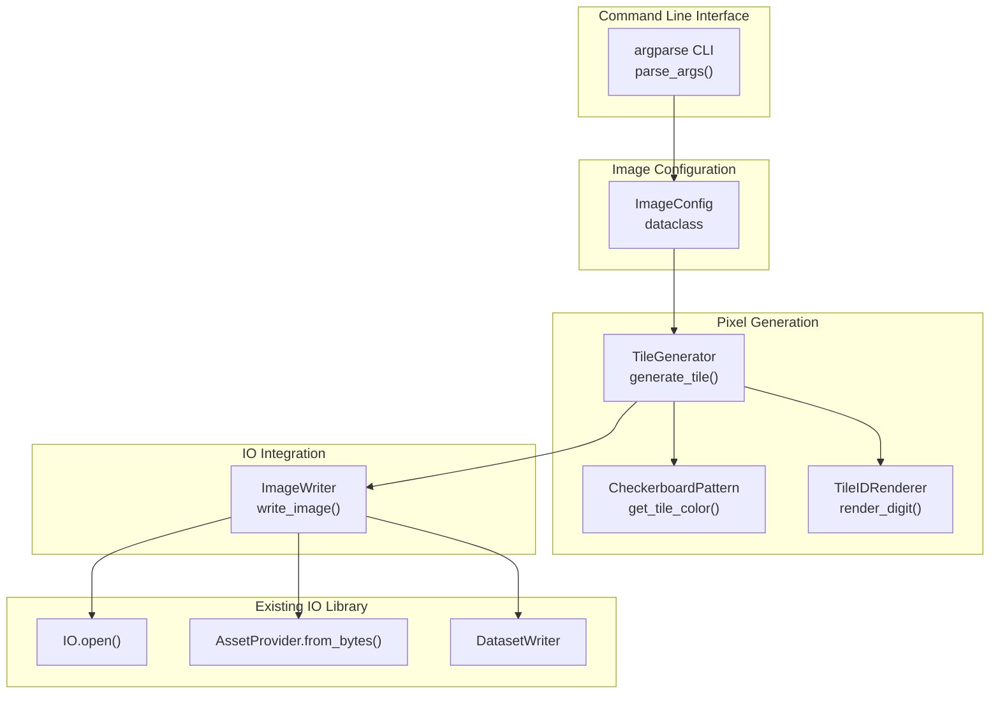

# Design Document: Synthetic Image Generator

## Overview

This design describes a Python script utility for generating synthetic NITF test images using the existing AWS OSML IO library. The generator creates tiled images with configurable dimensions, tile sizes, band configurations, pixel types, and interleave modes. Each tile displays a checkerboard pattern with a unique tile ID for visual verification of pixel correctness.

### Key Design Decisions

1. **Pure Python Implementation**: The generator is implemented entirely in Python using NumPy for pixel generation. No new Rust code is added - it uses the existing Python bindings.

2. **Script Location**: The script is placed in `scripts/generate_synthetic_image.py` alongside other utility scripts.

3. **Argparse CLI**: Standard library argparse provides the command-line interface with sensible defaults.

4. **Tile-by-Tile Generation**: Pixels are generated tile-by-tile to support large images without loading the entire image into memory.

5. **Simple Digit Rendering**: Tile IDs are rendered using a simple bitmap font embedded in the script, avoiding external font dependencies.

6. **Direct Byte Conversion**: NumPy arrays are converted directly to bytes for the AssetProvider, with interleave conversion handled by the IO library.

## Architecture



## Components and Interfaces

### ImageConfig

A dataclass holding all configuration parameters for image generation.

```python
@dataclass
class ImageConfig:
    """Configuration for synthetic image generation."""
    output_path: str
    width: int = 512
    height: int = 512
    tile_width: int = 256
    tile_height: int = 256
    num_bands: int = 1
    pixel_type: str = "uint8"  # "uint8" or "uint16"
    abpp: Optional[int] = None  # Actual bits per pixel, defaults to full range
    imode: str = "B"  # "B", "P", "R", or "S"
    
    def __post_init__(self):
        """Validate configuration and set defaults."""
        # Set ABPP to full bit depth if not specified
        if self.abpp is None:
            self.abpp = 8 if self.pixel_type == "uint8" else 16
        
        # Validate ABPP is within range for pixel type
        max_bits = 8 if self.pixel_type == "uint8" else 16
        if self.abpp > max_bits:
            raise ValueError(f"ABPP {self.abpp} exceeds max for {self.pixel_type}")
    
    @property
    def numpy_dtype(self) -> np.dtype:
        """Return the NumPy dtype for this pixel type."""
        return np.uint8 if self.pixel_type == "uint8" else np.uint16
    
    @property
    def max_pixel_value(self) -> int:
        """Return the maximum pixel value based on ABPP."""
        return (1 << self.abpp) - 1
    
    @property
    def num_tiles_x(self) -> int:
        """Number of tiles in the horizontal direction."""
        return (self.width + self.tile_width - 1) // self.tile_width
    
    @property
    def num_tiles_y(self) -> int:
        """Number of tiles in the vertical direction."""
        return (self.height + self.tile_height - 1) // self.tile_height
    
    @property
    def total_tiles(self) -> int:
        """Total number of tiles in the image."""
        return self.num_tiles_x * self.num_tiles_y
```

### CheckerboardPattern

Generates alternating colors for tiles in a checkerboard pattern.

```python
class CheckerboardPattern:
    """Generates checkerboard colors for tiles."""
    
    # Base colors for checkerboard (scaled to 8-bit)
    # Using distinct colors that work for grayscale and RGB
    LIGHT_COLOR = (200, 180, 160)  # Light tan
    DARK_COLOR = (80, 100, 120)    # Dark blue-gray
    
    @staticmethod
    def get_tile_color(
        tile_x: int, 
        tile_y: int, 
        band: int,
        config: ImageConfig
    ) -> int:
        """Get the pixel value for a tile's background color.
        
        Args:
            tile_x: Tile column index (0-based)
            tile_y: Tile row index (0-based)
            band: Band index (0-based)
            config: Image configuration
            
        Returns:
            Pixel value scaled to the configured bit depth
        """
        is_light = (tile_x + tile_y) % 2 == 0
        
        if config.num_bands == 1:
            # Grayscale: use luminance
            base = 200 if is_light else 80
        else:
            # Multi-band: use RGB components
            colors = CheckerboardPattern.LIGHT_COLOR if is_light else CheckerboardPattern.DARK_COLOR
            base = colors[band] if band < 3 else colors[0]
        
        # Scale to configured bit depth
        scale = config.max_pixel_value / 255
        return int(base * scale)
```

### TileIDRenderer

Renders numeric tile IDs using a simple bitmap font.

```python
class TileIDRenderer:
    """Renders tile ID numbers using bitmap digits."""
    
    # 5x7 bitmap font for digits 0-9
    # Each digit is a list of 7 rows, each row is 5 bits
    DIGIT_PATTERNS = {
        '0': [0b01110, 0b10001, 0b10011, 0b10101, 0b11001, 0b10001, 0b01110],
        '1': [0b00100, 0b01100, 0b00100, 0b00100, 0b00100, 0b00100, 0b01110],
        '2': [0b01110, 0b10001, 0b00001, 0b00110, 0b01000, 0b10000, 0b11111],
        '3': [0b01110, 0b10001, 0b00001, 0b00110, 0b00001, 0b10001, 0b01110],
        '4': [0b00010, 0b00110, 0b01010, 0b10010, 0b11111, 0b00010, 0b00010],
        '5': [0b11111, 0b10000, 0b11110, 0b00001, 0b00001, 0b10001, 0b01110],
        '6': [0b00110, 0b01000, 0b10000, 0b11110, 0b10001, 0b10001, 0b01110],
        '7': [0b11111, 0b00001, 0b00010, 0b00100, 0b01000, 0b01000, 0b01000],
        '8': [0b01110, 0b10001, 0b10001, 0b01110, 0b10001, 0b10001, 0b01110],
        '9': [0b01110, 0b10001, 0b10001, 0b01111, 0b00001, 0b00010, 0b01100],
    }
    
    DIGIT_WIDTH = 5
    DIGIT_HEIGHT = 7
    DIGIT_SPACING = 1
    
    @classmethod
    def render_id(
        cls,
        tile_array: np.ndarray,
        tile_id: int,
        fg_color: int,
        config: ImageConfig
    ) -> None:
        """Render a tile ID in the center of the tile array.
        
        Args:
            tile_array: NumPy array of shape (height, width, bands)
            tile_id: The tile ID number to render
            fg_color: Foreground color value
            config: Image configuration
        """
        tile_h, tile_w, num_bands = tile_array.shape
        
        # Convert ID to string
        id_str = str(tile_id)
        
        # Calculate total width of rendered text
        text_width = len(id_str) * cls.DIGIT_WIDTH + (len(id_str) - 1) * cls.DIGIT_SPACING
        text_height = cls.DIGIT_HEIGHT
        
        # Check if tile is large enough
        min_size = max(text_width + 4, text_height + 4)
        if tile_w < min_size or tile_h < min_size:
            return  # Tile too small for text
        
        # Calculate starting position (centered)
        start_x = (tile_w - text_width) // 2
        start_y = (tile_h - text_height) // 2
        
        # Render each digit
        x_offset = start_x
        for digit_char in id_str:
            pattern = cls.DIGIT_PATTERNS.get(digit_char, cls.DIGIT_PATTERNS['0'])
            
            for row_idx, row_bits in enumerate(pattern):
                for col_idx in range(cls.DIGIT_WIDTH):
                    if row_bits & (1 << (cls.DIGIT_WIDTH - 1 - col_idx)):
                        y = start_y + row_idx
                        x = x_offset + col_idx
                        if 0 <= y < tile_h and 0 <= x < tile_w:
                            tile_array[y, x, :] = fg_color
            
            x_offset += cls.DIGIT_WIDTH + cls.DIGIT_SPACING
```

### TileGenerator

Generates pixel data for individual tiles.

```python
class TileGenerator:
    """Generates pixel data for tiles."""
    
    @staticmethod
    def generate_tile(
        tile_x: int,
        tile_y: int,
        tile_id: int,
        config: ImageConfig
    ) -> np.ndarray:
        """Generate pixel data for a single tile.
        
        Args:
            tile_x: Tile column index (0-based)
            tile_y: Tile row index (0-based)
            tile_id: Sequential tile ID
            config: Image configuration
            
        Returns:
            NumPy array of shape (tile_height, tile_width, num_bands)
        """
        # Calculate actual tile dimensions (may be smaller for edge tiles)
        tile_start_x = tile_x * config.tile_width
        tile_start_y = tile_y * config.tile_height
        actual_width = min(config.tile_width, config.width - tile_start_x)
        actual_height = min(config.tile_height, config.height - tile_start_y)
        
        # Create tile array
        tile = np.zeros(
            (actual_height, actual_width, config.num_bands),
            dtype=config.numpy_dtype
        )
        
        # Fill with checkerboard background color
        for band in range(config.num_bands):
            bg_color = CheckerboardPattern.get_tile_color(
                tile_x, tile_y, band, config
            )
            tile[:, :, band] = bg_color
        
        # Calculate contrasting foreground color for text
        bg_luminance = CheckerboardPattern.get_tile_color(tile_x, tile_y, 0, config)
        fg_color = config.max_pixel_value if bg_luminance < config.max_pixel_value // 2 else 0
        
        # Render tile ID
        TileIDRenderer.render_id(tile, tile_id, fg_color, config)
        
        return tile
```

### ImageWriter

Writes the complete image using the IO library.

```python
class ImageWriter:
    """Writes synthetic images using the IO library."""
    
    @staticmethod
    def write_image(config: ImageConfig) -> None:
        """Generate and write a synthetic image.
        
        Args:
            config: Image configuration
        """
        from aws.osml.io import IO, AssetProvider, AssetType
        
        # Generate all tiles and concatenate into full image
        # For large images, this could be optimized to stream tiles
        full_image = ImageWriter._generate_full_image(config)
        
        # Convert to bytes in the appropriate interleave format
        image_bytes = ImageWriter._to_bytes(full_image, config)
        
        # Create writer
        writer = IO.open(config.output_path, "w", "nitf")
        
        # Create asset provider
        asset = AssetProvider.from_bytes(
            key="image_segment_0",
            data=image_bytes,
            asset_type=AssetType.Image,
            title="Synthetic Test Image",
            description=f"{config.width}x{config.height} {config.num_bands}-band {config.pixel_type} IMODE={config.imode}",
        )
        
        # Add asset
        writer.add_asset(
            key="image_segment_0",
            provider=asset,
            title="Synthetic Test Image",
            description="Generated checkerboard test pattern",
            roles=["data"],
        )
        
        # Close to write file
        writer.close()
    
    @staticmethod
    def _generate_full_image(config: ImageConfig) -> np.ndarray:
        """Generate the full image by assembling tiles.
        
        Args:
            config: Image configuration
            
        Returns:
            NumPy array of shape (height, width, num_bands)
        """
        full_image = np.zeros(
            (config.height, config.width, config.num_bands),
            dtype=config.numpy_dtype
        )
        
        tile_id = 0
        for tile_y in range(config.num_tiles_y):
            for tile_x in range(config.num_tiles_x):
                tile = TileGenerator.generate_tile(tile_x, tile_y, tile_id, config)
                
                # Calculate position in full image
                start_y = tile_y * config.tile_height
                start_x = tile_x * config.tile_width
                end_y = start_y + tile.shape[0]
                end_x = start_x + tile.shape[1]
                
                full_image[start_y:end_y, start_x:end_x, :] = tile
                tile_id += 1
        
        return full_image
    
    @staticmethod
    def _to_bytes(image: np.ndarray, config: ImageConfig) -> bytes:
        """Convert image array to bytes.
        
        The IO library handles interleave conversion internally,
        so we provide band-sequential format (the natural NumPy layout).
        
        Args:
            image: NumPy array of shape (height, width, bands)
            config: Image configuration
            
        Returns:
            Raw bytes in band-sequential format
        """
        # NumPy arrays are stored in row-major order
        # Transpose to (bands, height, width) for band-sequential
        bsq_image = np.transpose(image, (2, 0, 1))
        return bsq_image.tobytes()
```

## Data Models

### Command-Line Arguments

| Argument | Type | Default | Description |
|----------|------|---------|-------------|
| `output` | str | required | Output file path (.ntf) |
| `--width` | int | 512 | Image width in pixels |
| `--height` | int | 512 | Image height in pixels |
| `--tile-width` | int | 256 | Tile width in pixels |
| `--tile-height` | int | 256 | Tile height in pixels |
| `--bands` | int | 1 | Number of bands (1, 3, or 5) |
| `--pixel-type` | str | uint8 | Pixel type (uint8 or uint16) |
| `--abpp` | int | None | Actual bits per pixel |
| `--imode` | str | B | Interleave mode (B, P, R, S) |

### Pixel Value Ranges

| Pixel Type | ABPP | Min Value | Max Value |
|------------|------|-----------|-----------|
| uint8 | 8 | 0 | 255 |
| uint16 | 11 | 0 | 2047 |
| uint16 | 16 | 0 | 65535 |

### Band Configurations

| Bands | IREP | Band Meanings |
|-------|------|---------------|
| 1 | MONO | Grayscale |
| 3 | RGB | Red, Green, Blue |
| 5 | MULTI | Band 0-4 (generic multispectral) |


## Correctness Properties

*A property is a characteristic or behavior that should hold true across all valid executions of a system—essentially, a formal statement about what the system should do. Properties serve as the bridge between human-readable specifications and machine-verifiable correctness guarantees.*

### Property 1: Image Dimensions Match Configuration

*For any* valid image configuration with width W and height H, the generated image SHALL have exactly W columns and H rows of pixels.

**Validates: Requirements 2.1, 2.3**

### Property 2: Pixel Values Within Configured Range

*For any* generated image with pixel type T and ABPP bits, all pixel values SHALL be in the range [0, 2^ABPP - 1].

**Validates: Requirements 5.1, 5.2, 5.4**

### Property 3: Checkerboard Pattern Alternation

*For any* two horizontally or vertically adjacent tiles in the generated image, the background colors SHALL be different.

**Validates: Requirements 7.1**

### Property 4: Tile Background Uniformity

*For any* tile in the generated image, all pixels outside the tile ID text region SHALL have the same color value.

**Validates: Requirements 7.3**

### Property 5: Tile ID Sequential Ordering

*For any* generated image with N tiles, the tile IDs SHALL be numbered 0 through N-1 in row-major order (left-to-right, top-to-bottom).

**Validates: Requirements 8.1, 8.3, 8.4**

### Property 6: Tile ID Text Contrast

*For any* tile with a rendered tile ID, the text color SHALL have sufficient contrast with the background (either maximum or minimum value relative to background luminance).

**Validates: Requirements 8.2**

### Property 7: Color Scaling with Bit Depth

*For any* two images with the same configuration except different ABPP values, the ratio of corresponding color values SHALL be proportional to the ratio of maximum values (2^ABPP1 - 1) / (2^ABPP2 - 1).

**Validates: Requirements 7.5**

### Property 8: All Bands Populated

*For any* generated multi-band image, all bands SHALL contain non-zero pixel data.

**Validates: Requirements 4.5**

## Error Handling

### Input Validation Errors

| Error Condition | Error Message |
|-----------------|---------------|
| Missing output path | "error: the following arguments are required: output" |
| Invalid band count | "error: --bands must be 1, 3, or 5" |
| Invalid pixel type | "error: --pixel-type must be 'uint8' or 'uint16'" |
| Invalid IMODE | "error: --imode must be 'B', 'P', 'R', or 'S'" |
| ABPP exceeds pixel type | "error: ABPP {value} exceeds maximum for {pixel_type}" |
| Tile size too small | "error: tile size must be at least 16x16" |
| Tile size too large | "error: tile size must not exceed 2048x2048" |

### IO Library Errors

Errors from the IO library are propagated with additional context:

```python
try:
    writer = IO.open(config.output_path, "w", "nitf")
except Exception as e:
    raise RuntimeError(f"Failed to create NITF writer for {config.output_path}: {e}")
```

### Exit Codes

| Exit Code | Meaning |
|-----------|---------|
| 0 | Success |
| 1 | Invalid arguments |
| 2 | IO error during generation |

## Testing Strategy

### Unit Tests

Unit tests verify individual components in isolation:

1. **ImageConfig Tests**: Validate configuration parsing and defaults
2. **CheckerboardPattern Tests**: Verify color generation for different tile positions
3. **TileIDRenderer Tests**: Verify digit rendering at various positions
4. **TileGenerator Tests**: Verify tile generation with different configurations

### Integration Tests

Integration tests verify end-to-end functionality:

1. **CLI Tests**: Verify argument parsing and help text
2. **File Generation Tests**: Verify files are created with correct structure
3. **Round-Trip Tests**: Generate file, read back, verify properties

### Property-Based Tests

Property-based tests use hypothesis to verify properties across many inputs:

1. **Dimension Property**: Generate random dimensions, verify output matches
2. **Pixel Range Property**: Generate random ABPP, verify values in range
3. **Checkerboard Property**: Generate random tile positions, verify alternation
4. **Tile ID Property**: Generate random tile counts, verify sequential ordering

### Test Configuration

- Property tests: minimum 100 iterations per property
- Test framework: pytest with hypothesis for property-based testing
- Tag format: **Feature: synthetic-image-generator, Property {number}: {property_text}**
