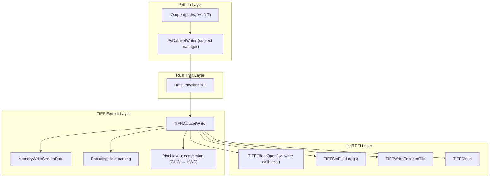
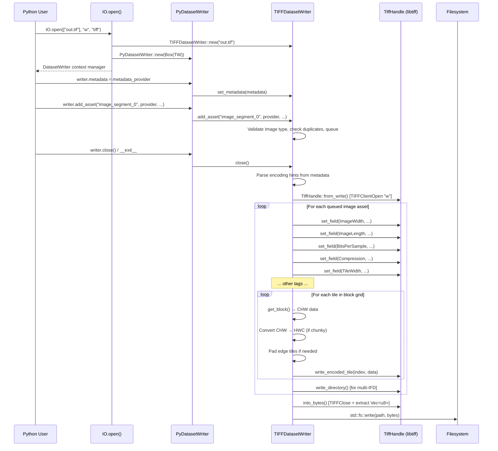

# Design Document: TIFF Writing (Phase 2)

## Overview

This design adds basic TIFF writing support to osml-imagery-io by implementing `TIFFDatasetWriter`, which implements the `DatasetWriter` trait to produce tiled TIFF files. The writer follows the same architectural pattern as the JBP writer: it assembles the TIFF file in memory via libtiff's `TIFFClientOpen` with custom write callbacks operating on a `Vec<u8>` buffer, then flushes the bytes to disk on `close()`. The format implementation never touches the filesystem directly.

The writer accepts image data through `add_asset()` using `ImageAssetProvider` instances (typically `BufferedImageAssetProvider`), reads encoding hints from a dataset-level `MetadataProvider` (typically `BufferedMetadataProvider`), and writes tiles via `TIFFWriteEncodedTile()`. It supports configurable tile dimensions, compression (None/LZW/Deflate), predictor settings, and all pixel types supported by the reader (UInt8 through Float64). Multiple images are written as separate IFDs.

Python users access the writer through `IO.open(paths, "w", "tiff")`, which returns a `DatasetWriter` context manager — the same interface used for NITF writing.

## Architecture

The writer integrates into the existing layered architecture:



### Design Decisions

1. **In-memory assembly via `TIFFClientOpen`**: The writer uses `TIFFClientOpen` in write mode (`"w"`) with custom callbacks that write into a `Vec<u8>`. This mirrors the read path (which uses `TIFFClientOpen` with read callbacks on `&[u8]`) and the JBP writer pattern (which assembles NITF bytes in memory). The format implementation never opens a file descriptor — the IO layer handles that on `close()`.

2. **Multi-IFD support**: Each `add_asset()` call queues an image for writing as a separate IFD. On `close()`, IFDs are written in the order assets were added. This matches the TIFF spec's multi-directory model and the roadmap's design principle of "multiple images per file."

3. **Encoding hints via `MetadataProvider`**: Tile size, compression, and predictor are controlled through string key-value pairs in the dataset-level `MetadataProvider`, consistent with how the JBP writer reads encoding hints (IC, IMODE, NPPBH, NPPBV) from metadata.

4. **Band-sequential to chunky conversion**: `ImageAssetProvider.get_block()` returns data in CHW (band-sequential) order. The writer converts to HWC (chunky/interleaved) by default, since chunky is the standard TIFF layout. Planar configuration is also supported via encoding hints.

5. **Reuse existing FFI infrastructure**: The writer reuses `sys.rs` (which already declares `TIFFWriteEncodedTile`, `TIFFSetField`, etc.) and extends `ffi.rs` with a `MemoryWriteStreamData` struct and write-mode callbacks. The `TiffHandle` wrapper gains a `from_write()` constructor.

6. **Non-image assets rejected**: TIFF has no concept of text, graphic, or data segments. `add_asset()` returns `CodecError::Unsupported` for non-image asset types, with a clear error message.

## Components and Interfaces

### New Rust Components

#### `src/tiff/writer.rs` — `TIFFDatasetWriter`

The core writer struct implementing `DatasetWriter`:

```rust
pub struct TIFFDatasetWriter {
    /// Output file path (written on close)
    path: PathBuf,
    /// Queued image assets in insertion order
    assets: Vec<QueuedImageAsset>,
    /// Set of asset keys for duplicate detection
    asset_keys: HashSet<String>,
    /// Dataset-level metadata (encoding hints source)
    metadata: Option<Arc<dyn MetadataProvider>>,
    /// Whether close() has been called
    closed: bool,
}

struct QueuedImageAsset {
    key: String,
    provider: Arc<dyn AssetProvider>,
    title: String,
    description: String,
    roles: Vec<String>,
}
```

Key methods:

| Method | Behavior |
|--------|----------|
| `new(path)` | Creates writer for the given output path. No libtiff handle opened yet. |
| `add_asset()` | Validates asset type is `Image`, checks for duplicate keys and closed state, queues the asset. |
| `set_metadata()` | Stores the `MetadataProvider` for encoding hint extraction during `close()`. |
| `close()` | Parses encoding hints, opens libtiff via `TIFFClientOpen` in write mode, iterates queued assets writing each as an IFD (set tags, write tiles), calls `TIFFClose`, flushes `Vec<u8>` to disk. Idempotent — second call returns `Ok(())`. |

#### `src/tiff/ffi.rs` — Write-Mode Extensions

New components added to the existing FFI module:

```rust
/// Memory write stream data for TIFFClientOpen write callbacks.
/// Holds a growable Vec<u8> buffer and current write position.
pub(crate) struct MemoryWriteStreamData {
    buffer: Vec<u8>,
    pos: usize,
}
```

New callbacks:
- `tiff_write_proc_writable()` — Writes bytes into the `Vec<u8>`, growing it as needed
- `tiff_seek_proc_writable()` — Seeks within the buffer (supports SEEK_SET/CUR/END)
- `tiff_size_proc_writable()` — Returns current buffer length

New `TiffHandle` constructor:
- `TiffHandle::from_write()` — Opens `TIFFClientOpen` in `"w"` mode with write callbacks, returns handle + owned `MemoryWriteStreamData`

New `TiffHandle` methods:
- `write_encoded_tile(tile_index, data)` — Wraps `TIFFWriteEncodedTile()`
- `set_field_u16(tag, value)` — Wraps `TIFFSetField()` for u16 values
- `set_field_u32(tag, value)` — Wraps `TIFFSetField()` for u32 values
- `write_directory()` — Wraps `TIFFWriteDirectory()` for multi-IFD support
- `into_bytes()` — Consumes the handle (calling `TIFFClose`) and returns the `Vec<u8>` buffer

#### Encoding Hints

Parsed from the dataset-level `MetadataProvider`:

```rust
struct TiffEncodingHints {
    tile_width: u32,      // default: 256
    tile_height: u32,     // default: 256
    compression: u16,     // default: COMPRESSION_DEFLATE (8)
    predictor: u16,       // default: 2 (Horizontal) for LZW/Deflate, 1 (None) for uncompressed
    planar_config: u16,   // default: PLANAR_CONFIG_CONTIG (1)
}
```

| Hint Key | Values | Default |
|----------|--------|---------|
| `"TileWidth"` | Integer string | `"256"` |
| `"TileHeight"` | Integer string | `"256"` |
| `"Compression"` | `"None"`, `"LZW"`, `"Deflate"` | `"Deflate"` |
| `"Predictor"` | `"None"`, `"Horizontal"` | `"Horizontal"` for LZW/Deflate, `"None"` for uncompressed |
| `"PlanarConfiguration"` | `"Chunky"`, `"Planar"` | `"Chunky"` |

#### Pixel Layout Conversion

The writer includes a `bsq_to_interleaved()` function that converts CHW (band-sequential) data from `get_block()` to HWC (chunky/interleaved) format for TIFF writing:

```
Input (CHW):  [R0 R1 R2 R3 | G0 G1 G2 G3 | B0 B1 B2 B3]
Output (HWC): [R0 G0 B0 | R1 G1 B1 | R2 G2 B2 | R3 G3 B3]
```

This is the inverse of the `deinterleave_chunky_to_bsq()` function already in `image.rs` for the reader.

For planar configuration, no conversion is needed — each band's data is written as a separate tile plane directly from the CHW layout.

#### Edge Tile Padding

When image dimensions are not evenly divisible by tile dimensions, edge tiles must be padded to the full tile size. The writer:

1. Allocates a full-tile-sized buffer initialized with `pad_pixel_value()` bytes
2. Copies the actual pixel data from `get_block()` into the appropriate region
3. Writes the padded buffer via `TIFFWriteEncodedTile()`

### Modified Components

#### `src/tiff/mod.rs`

Add `mod writer;` and `pub use writer::TIFFDatasetWriter;`.

#### `src/tiff/ffi.rs`

Add `MemoryWriteStreamData`, write callbacks, `TiffHandle::from_write()`, `write_encoded_tile()`, `set_field_*()`, `write_directory()`, and `into_bytes()`.

#### `src/tiff/sys.rs`

Add `TIFFWriteDirectory` FFI declaration (not currently declared):

```rust
pub fn TIFFWriteDirectory(tif: *mut c_void) -> c_int;
```

#### `src/bindings/io.rs`

Update `create_writer()` to handle `"tif"` / `"tiff"` / `"gtif"` / `"gtiff"` / `"geotiff"` format strings by creating a `TIFFDatasetWriter` instead of returning "not yet implemented":

```rust
"tif" | "tiff" | "gtif" | "gtiff" | "geotiff" => {
    let writer = TIFFDatasetWriter::new(&parsed.path)?;
    Ok(PyDatasetWriter::new(Box::new(writer)))
}
```

#### `src/tiff/tags.rs`

Add the `PREDICTOR` tag constant:

```rust
/// Tag 317: Predictor for compression pre-filtering.
pub const PREDICTOR: u32 = 317;
```

### Unchanged Components

- `src/bindings/writer.rs` — `PyDatasetWriter` is already format-agnostic; it wraps any `Box<dyn DatasetWriter>`. No changes needed.
- `src/traits/writer.rs` — The `DatasetWriter` trait is unchanged.
- `src/tiff/reader.rs` — The reader is unchanged.
- `src/tiff/image.rs` — The `TIFFImageAssetProvider` is unchanged (used for read-back verification in tests).
- `src/buffered/` — `BufferedImageAssetProvider` and `BufferedMetadataProvider` are unchanged (used as data sources by callers).

### Write Flow Sequence



## Data Models

### TIFF Tag Mapping from ImageAssetProvider

| TIFF Tag | Tag # | Source |
|----------|-------|--------|
| ImageWidth | 256 | `provider.num_columns()` |
| ImageLength | 257 | `provider.num_rows()` |
| BitsPerSample | 258 | `provider.actual_bits_per_pixel()` |
| SamplesPerPixel | 277 | `provider.num_bands()` |
| SampleFormat | 339 | Derived from `provider.pixel_value_type()`: UInt→1, Int→2, Float→3 |
| PhotometricInterpretation | 262 | `RGB` (2) if bands ≥ 3, else `MinIsBlack` (1) |
| TileWidth | 322 | From encoding hints or default 256 |
| TileLength | 323 | From encoding hints or default 256 |
| Compression | 259 | From encoding hints or default Deflate (8) |
| Predictor | 317 | From encoding hints or default Horizontal (2) for LZW/Deflate |
| PlanarConfiguration | 284 | From encoding hints or default Chunky (1) |

### Pixel Type to TIFF Tag Mapping

| PixelType | BitsPerSample | SampleFormat |
|-----------|---------------|--------------|
| UInt8 | 8 | 1 (Unsigned) |
| UInt16 | 16 | 1 (Unsigned) |
| UInt32 | 32 | 1 (Unsigned) |
| Int8 | 8 | 2 (Signed) |
| Int16 | 16 | 2 (Signed) |
| Int32 | 32 | 2 (Signed) |
| Float32 | 32 | 3 (Float) |
| Float64 | 64 | 3 (Float) |

### Compression String to Tag Value Mapping

| Hint Value | TIFF Compression Tag | Constant |
|------------|---------------------|----------|
| `"None"` | 1 | `COMPRESSION_NONE` |
| `"LZW"` | 5 | `COMPRESSION_LZW` |
| `"Deflate"` | 8 | `COMPRESSION_DEFLATE` |

### Tile Index Calculation

For chunky (interleaved) configuration:
```
tiles_across = ceil(image_width / tile_width)
tile_index = block_row * tiles_across + block_col
```

For planar (separate) configuration:
```
tiles_across = ceil(image_width / tile_width)
tiles_down = ceil(image_height / tile_height)
tiles_per_plane = tiles_across * tiles_down
tile_index = band * tiles_per_plane + block_row * tiles_across + block_col
```


## Correctness Properties

*A property is a characteristic or behavior that should hold true across all valid executions of a system — essentially, a formal statement about what the system should do. Properties serve as the bridge between human-readable specifications and machine-verifiable correctness guarantees.*

### Property 1: Lossless Pixel Roundtrip

*For any* supported pixel type (UInt8, UInt16, UInt32, Int8, Int16, Int32, Float32, Float64), *for any* band count (1 to N), *for any* valid image dimensions, *for any* supported compression (None, LZW, Deflate), and *for any* planar configuration (chunky or planar), writing an image via `TIFFDatasetWriter` and reading it back via `TIFFDatasetReader` shall produce pixel data identical to the original input.

**Validates: Requirements 1.2, 2.1, 5.1, 5.4, 6.1, 6.2, 7.1, 7.3, 9.1, 9.2**

### Property 2: Metadata Roundtrip

*For any* valid combination of encoding hints (tile width, tile height, compression type, predictor setting) and *for any* image properties (dimensions, pixel type, band count), writing a TIFF file and reading back its metadata shall report tag values that match the encoding hints and image properties used during writing. Specifically: ImageWidth matches num_columns, ImageLength matches num_rows, BitsPerSample matches actual_bits_per_pixel, SamplesPerPixel matches num_bands, SampleFormat matches pixel_value_type mapping, Compression matches the hint value, and TileWidth/TileLength match the hint values.

**Validates: Requirements 3.1, 3.2, 3.3, 3.4, 3.5, 3.6, 3.7, 4.1, 4.3, 4.5, 4.6, 4.7, 4.9, 4.10, 4.11, 6.4, 7.2, 9.3**

### Property 3: Idempotent Encoding

*For any* valid image and encoding configuration, writing the image to TIFF, reading it back, then writing it again shall produce a TIFF file with identical pixel data when read back. That is, `write → read → write → read` yields the same pixel values as `write → read`.

**Validates: Requirements 9.4**

### Property 4: Idempotent Close

*For any* `TIFFDatasetWriter` that has been populated with assets and closed, calling `close()` a second time shall return `Ok(())` and the output file shall remain unchanged (same byte content).

**Validates: Requirements 1.3**

### Property 5: Non-Image Asset Rejection

*For any* asset whose `asset_type()` is `Text`, `Graphics`, or `Data`, calling `add_asset()` on a `TIFFDatasetWriter` shall return an error, and the writer's internal state shall remain unchanged (no asset queued).

**Validates: Requirements 2.3**

### Property 6: Duplicate Key Rejection

*For any* key string, calling `add_asset()` twice with the same key on a `TIFFDatasetWriter` shall succeed on the first call and return a `DuplicateKey` error on the second call, leaving the writer with exactly one asset for that key.

**Validates: Requirements 2.4**

### Property 7: Multi-Image IFD Ordering

*For any* sequence of N image assets (where N ≥ 1) added via `add_asset()`, the resulting TIFF file shall contain exactly N IFDs, and the image data in IFD `i` shall match the pixel data from the `i`-th asset added.

**Validates: Requirements 2.2, 2.6**

## Error Handling

### Error Types and Conditions

| Condition | Error Type | When |
|-----------|-----------|------|
| Non-image asset type | `CodecError::Unsupported` | `add_asset()` with Text/Graphics/Data asset |
| Duplicate asset key | `CodecError::DuplicateKey` | `add_asset()` with key already used |
| Writer already closed | `CodecError::Io` | `add_asset()` after `close()` |
| Unwritable output path | `CodecError::Io` | `close()` when file cannot be created |
| libtiff write failure | `CodecError::Io` | `TIFFWriteEncodedTile()` returns negative |
| libtiff handle creation failure | `CodecError::Encode` | `TIFFClientOpen` returns null |
| Invalid encoding hint value | `CodecError::InvalidFormat` | Unparseable tile size or unknown compression string |

### Error Propagation Strategy

The writer follows the same error propagation pattern as the JBP writer:

1. **Validation errors** (wrong asset type, duplicate key, closed state) are returned immediately from `add_asset()` without side effects.
2. **Encoding errors** (libtiff failures) are returned from `close()` since that's when actual TIFF encoding happens. The error message includes context (e.g., which tile index failed).
3. **IO errors** (file write failures) are returned from `close()` after the in-memory TIFF has been assembled. If the TIFF assembly succeeds but the file write fails, the error is `CodecError::Io` wrapping the underlying `std::io::Error`.
4. **All errors** are converted to Python exceptions via the existing `CodecError → PyErr` conversion in `error.rs`.

### Idempotent Close Behavior

`close()` is idempotent: the first call performs the write, subsequent calls return `Ok(())` immediately. This matches the JBP writer behavior and ensures the Python context manager's `__exit__` never fails due to double-close.

## Testing Strategy

### Dual Testing Approach

Testing uses both unit tests and property-based tests:

- **Unit tests** verify specific examples, edge cases, error conditions, and API contracts
- **Property tests** verify universal properties across many randomly generated inputs (minimum 100 iterations each)
- Both are complementary — unit tests catch concrete bugs, property tests verify general correctness

### Property-Based Testing Configuration

- **Library**: `hypothesis` (Python, already a project dependency) and `proptest` (Rust, already a dev dependency)
- **Minimum iterations**: 100 per property test
- **Tag format**: `Feature: tiff-writing, Property {number}: {property_text}`
- **Each correctness property is implemented by a single property-based test**

### Rust Unit Tests (`src/tiff/writer.rs` — `#[cfg(test)]`)

| Test | Validates |
|------|-----------|
| `writer_new_creates_instance` | Constructor works |
| `writer_add_image_asset_succeeds` | Req 2.1 |
| `writer_add_non_image_asset_rejected` | Req 2.3 |
| `writer_add_duplicate_key_rejected` | Req 2.4 |
| `writer_add_asset_after_close_rejected` | Req 2.5 |
| `writer_close_idempotent` | Req 1.3 |
| `writer_set_metadata_stores_latest` | Req 10.2 |
| `writer_default_encoding_hints` | Req 4.2, 4.4, 4.8, 4.12 |
| `writer_parse_compression_none` | Req 4.5 |
| `writer_parse_compression_lzw` | Req 4.6 |
| `writer_parse_compression_deflate` | Req 4.7 |
| `writer_parse_predictor_horizontal` | Req 4.9 |
| `writer_parse_predictor_none` | Req 4.10 |
| `writer_predictor_default_with_compression` | Req 4.11 |
| `writer_predictor_default_without_compression` | Req 4.12 |
| `writer_bsq_to_interleaved_3band` | Req 6.1 |
| `writer_bsq_to_interleaved_single_band` | Req 6.1 |
| `writer_pixel_type_to_sample_format` | Req 3.5, 7.2 |
| `writer_photometric_interpretation_rgb` | Req 3.6 |
| `writer_photometric_interpretation_minisblack` | Req 3.6 |

### Rust Unit Tests (`src/tiff/ffi.rs` — `#[cfg(test)]`)

| Test | Validates |
|------|-----------|
| `test_memory_write_stream_basic` | Write callbacks work |
| `test_memory_write_stream_seek` | Seek in write mode works |
| `test_from_write_creates_handle` | TiffHandle::from_write() works |
| `test_write_encoded_tile` | TIFFWriteEncodedTile wrapper works |
| `test_set_field_u16` | TIFFSetField u16 wrapper works |
| `test_set_field_u32` | TIFFSetField u32 wrapper works |
| `test_write_directory` | TIFFWriteDirectory wrapper works |
| `test_into_bytes_returns_valid_tiff` | into_bytes() produces valid TIFF |

### Python Property Tests (`tests/property/test_tiff_write_roundtrip.py`)

| Test | Property | Tag |
|------|----------|-----|
| `test_lossless_pixel_roundtrip` | Property 1 | `Feature: tiff-writing, Property 1: Lossless pixel roundtrip` |
| `test_metadata_roundtrip` | Property 2 | `Feature: tiff-writing, Property 2: Metadata roundtrip` |
| `test_idempotent_encoding` | Property 3 | `Feature: tiff-writing, Property 3: Idempotent encoding` |
| `test_idempotent_close` | Property 4 | `Feature: tiff-writing, Property 4: Idempotent close` |
| `test_non_image_asset_rejection` | Property 5 | `Feature: tiff-writing, Property 5: Non-image asset rejection` |
| `test_duplicate_key_rejection` | Property 6 | `Feature: tiff-writing, Property 6: Duplicate key rejection` |
| `test_multi_image_ifd_ordering` | Property 7 | `Feature: tiff-writing, Property 7: Multi-image IFD ordering` |

### Python Unit Tests (`tests/test_tiff_writer.py`)

| Test | Validates |
|------|-----------|
| `test_io_open_tiff_write_mode` | Req 8.1 |
| `test_io_open_tif_write_mode` | Req 8.2 |
| `test_context_manager_produces_valid_file` | Req 8.3, 8.4 |
| `test_write_unwritable_path_raises_io_error` | Req 1.5 |
| `test_add_asset_after_close_raises` | Req 2.5 |
| `test_set_metadata_multiple_times_uses_latest` | Req 10.2 |
| `test_default_encoding_hints_applied` | Req 10.3 |

### Hypothesis Strategies (additions to `tests/property/strategies.py`)

New strategies for TIFF writing tests:

| Strategy | Generates |
|----------|-----------|
| `tiff_encoding_hints()` | Valid `BufferedMetadataProvider` with random TileWidth, TileHeight, Compression, Predictor |
| `tiff_writable_image()` | `BufferedImageAssetProvider` with random pixel type, dimensions, bands, and populated blocks |
| `output_format()` | Draws from `["nitf", "tiff"]` for cross-format roundtrip tests |

These build on the existing `pixel_types()`, `image_dimensions()`, `band_counts()`, and `block_sizes()` strategies already defined in `strategies.py`.

### Rust Property Tests (`src/tiff/writer.rs` — `#[cfg(test)]` with `proptest`)

Rust-level property tests for the pixel layout conversion function:

| Test | Property |
|------|----------|
| `prop_bsq_to_interleaved_roundtrip` | For any pixel data in CHW format, converting to HWC and back produces the original data |
| `prop_bsq_to_interleaved_preserves_length` | For any input, the output has the same byte length |

### Test Data

No new test data files are needed in `data/unit/`. The property tests generate synthetic images via `BufferedImageAssetProvider`, and the roundtrip tests write to temporary files that are cleaned up after each test.
