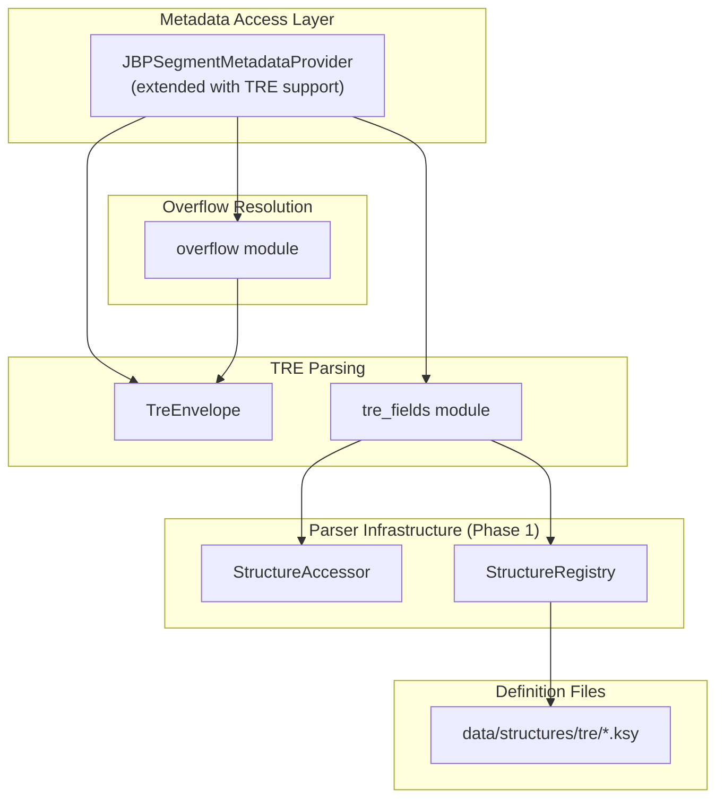

# Design Document: TRE and DES Support

## Overview

This design describes the Tagged Record Extension (TRE) and Data Extension Segment (DES) support for Phase 3 of the JBP implementation. The design leverages the data-driven parser infrastructure from Phase 1 to handle TRE and DES metadata using runtime-loaded `.ksy` definition files, enabling new TRE types to be supported without code changes.

The key innovation is treating TREs as first-class metadata that integrates seamlessly with the existing MetadataProvider interface. TRE fields are exposed through the same dictionary interface as header fields, using the CETAG as a namespace prefix (e.g., `GEOLOB.ARV`).

### Key Design Decisions

1. **Runtime TRE Definitions**: TRE field layouts are loaded from `.ksy` files at runtime via the Structure Registry, not hardcoded.

2. **Unified Metadata Interface**: TRE fields are exposed through the existing MetadataProvider `as_dict()` interface with CETAG prefixes.

3. **Unknown TRE Preservation**: TREs without definitions are preserved as raw bytes for round-trip fidelity.

4. **Extend Existing Classes**: Extend `JBPSegmentMetadataProvider` to include TRE data rather than creating new classes.

5. **Lazy TRE Parsing**: TRE fields are parsed on-demand when accessed via `as_dict()`.

6. **Direct Overflow Lookup**: Overflow TREs are resolved by following the overflow index field in segment subheaders (UDOFL, IXSOFL, etc.), not by scanning DES segments.

## Architecture



## Components and Interfaces

### TreEnvelope

The only new struct needed. Represents the raw TRE envelope structure.

```rust
/// Raw TRE envelope containing tag, length, and data
#[derive(Debug, Clone)]
pub struct TreEnvelope {
    /// 6-character TRE type tag (CETAG)
    pub tag: String,
    /// Raw extension data (CEDATA)
    pub data: Vec<u8>,
}

impl TreEnvelope {
    /// Parse a single TRE envelope from bytes, returns (envelope, bytes_consumed)
    pub fn parse(data: &[u8]) -> Result<(Self, usize), CodecError>;
    
    /// Parse all TRE envelopes from a byte slice
    pub fn parse_all(data: &[u8]) -> Result<Vec<Self>, CodecError>;
    
    /// Serialize the envelope to bytes (CETAG + CEL + CEDATA)
    pub fn to_bytes(&self) -> Vec<u8>;
    
    /// Get the total envelope size (11 + data.len())
    pub fn envelope_size(&self) -> usize {
        11 + self.data.len() // CETAG(6) + CEL(5) + CEDATA
    }
}
```

### tre_fields Module

Helper functions for TRE field access using `StructureAccessor`.

```rust
pub mod tre_fields {
    /// Create a StructureAccessor for a TRE's CEDATA
    /// Returns None if no definition exists for this TRE tag
    pub fn create_accessor<'a>(
        registry: &StructureRegistry,
        tag: &str,
        cedata: &'a [u8],
    ) -> Result<Option<StructureAccessor<'a>>, CodecError>;
    
    /// Check if a TRE definition exists
    pub fn has_definition(registry: &StructureRegistry, tag: &str) -> bool;
}
```

### overflow Module

Helper functions for resolving TRE overflow via segment subheader fields.

```rust
pub mod overflow {
    /// Get overflow DES indices from an image subheader
    /// Returns (udofl, ixsofl) - both 0 if no overflow
    pub fn get_image_overflow_indices(
        accessor: &StructureAccessor
    ) -> Result<(u16, u16), CodecError>;
    
    /// Fetch TRE envelopes from a DES segment by 1-based index
    /// Returns empty vec if index is 0 (no overflow)
    pub fn fetch_overflow_tres(
        des_index: u16,
        des_locations: &[SegmentLocation],
        file_data: &[u8],
    ) -> Result<Vec<TreEnvelope>, CodecError>;
}
```

### Extended JBPSegmentMetadataProvider

The existing `JBPSegmentMetadataProvider` is extended to support TRE fields.

```rust
pub struct JBPSegmentMetadataProvider {
    definition: Arc<StructureDefinition>,
    raw_bytes: Arc<[u8]>,
    /// NEW: TRE envelopes from this segment (inline + overflow)
    tre_envelopes: Vec<TreEnvelope>,
    /// NEW: Structure registry for TRE definitions
    registry: Arc<StructureRegistry>,
}

impl JBPSegmentMetadataProvider {
    /// Create with TRE support
    pub fn with_tres(
        definition: Arc<StructureDefinition>,
        raw_bytes: Arc<[u8]>,
        tre_envelopes: Vec<TreEnvelope>,
        registry: Arc<StructureRegistry>,
    ) -> Self;
}

impl MetadataProvider for JBPSegmentMetadataProvider {
    fn as_dict(&self, name: Option<&str>) -> HashMap<String, serde_json::Value> {
        let mut result = HashMap::new();
        
        // Add subheader fields (existing logic)
        // ...
        
        // Add TRE fields with CETAG prefix
        for envelope in &self.tre_envelopes {
            let tag = envelope.tag.trim();
            if let Ok(Some(tre_accessor)) = tre_fields::create_accessor(&self.registry, tag, &envelope.data) {
                for field_path in tre_accessor.fields() {
                    let full_path = format!("{}.{}", tag, field_path);
                    // Apply prefix filter and add to result
                }
            }
        }
        
        result
    }
}
```

### Writing Support

For writing TREs, we use `StructureWriter` directly with TRE definitions. When TREs exceed header field limits, a TRE_OVERFLOW DES is created.

```rust
/// Source header type for TRE overflow (used when writing TRE_OVERFLOW DES)
#[derive(Debug, Clone, Copy)]
pub enum OverflowSource {
    FileHeaderUdhd,
    FileHeaderXhd,
    ImageUdid,
    ImageIxshd,
    GraphicSxshd,
    TextTxshd,
}

impl OverflowSource {
    pub fn to_desoflw(&self) -> &'static str;
}

/// Write TRE envelopes to bytes
pub fn write_tre_envelopes(envelopes: &[TreEnvelope]) -> Vec<u8>;

/// Create a TRE_OVERFLOW DES for excess TREs
pub fn create_overflow_des(
    source: OverflowSource,
    segment_index: u16,
    tres: &[TreEnvelope],
    security_fields: &HashMap<String, Value>,
) -> Result<(Vec<u8>, Vec<u8>), CodecError>;
```

## Data Models

### TRE Definition File Format

TRE definitions use the Kaitai Struct YAML format, stored in `data/structures/tre/`:

```yaml
# tre/geolob.ksy
meta:
  id: tre_geolob
  title: Geographic Location TRE
  endian: be

seq:
  - id: arv
    type: str
    size: 9
    encoding: BCS-N
    doc: Longitude density
  - id: brv
    type: str
    size: 9
    encoding: BCS-N
    doc: Latitude density
  # ... more fields
```

### Metadata Field Naming

TRE fields are exposed in metadata with CETAG prefix:

| TRE | Field | Metadata Key |
|-----|-------|--------------|
| GEOLOB | ARV | `GEOLOB.ARV` |
| BANDSB | COUNT | `BANDSB.COUNT` |
| BANDSB | BANDID_0 | `BANDSB.BANDID_0` |

### Error Types

```rust
#[derive(Debug, thiserror::Error)]
pub enum TreDesError {
    #[error("Invalid CETAG format: {tag}")]
    InvalidCetag { tag: String },
    
    #[error("TRE length mismatch: CETAG={tag}, CEL={cel}, actual={actual}")]
    LengthMismatch { tag: String, cel: usize, actual: usize },
    
    #[error("Invalid overflow index: {index}")]
    InvalidOverflowIndex { index: u16 },
    
    #[error("TRE definition not found: {name}")]
    DefinitionNotFound { name: String },
}
```


## Correctness Properties

*A property is a characteristic or behavior that should hold true across all valid executions of a system.*

### Property 1: TRE Envelope Round-Trip

*For any* valid TRE envelope (CETAG + CEL + CEDATA), parsing the envelope and then writing it back SHALL produce byte-identical output.

**Validates: Requirements 1.1, 1.2, 1.3, 9.1, 9.2, 9.3, 9.4, 17.1**

### Property 2: Unknown TRE Preservation

*For any* TRE with a CETAG that has no definition in the Structure Registry, reading the TRE and then writing it SHALL preserve the complete envelope byte-for-byte.

**Validates: Requirements 2.3, 4.1, 4.2, 4.3, 17.3**

### Property 3: Known TRE Field Extraction

*For any* TRE with a known definition, parsing the CEDATA SHALL produce a field map where each field path returns the correct value according to the definition.

**Validates: Requirements 2.1, 2.2, 2.4, 2.5**

### Property 4: TRE Field Value Round-Trip

*For any* valid map of TRE field values, writing the TRE and then parsing it back SHALL produce an equivalent field map.

**Validates: Requirements 8.1, 8.2, 8.3, 17.2**

### Property 5: TRE Overflow Resolution via Index

*For any* segment with a non-zero overflow field (UDOFL, IXSOFL, etc.), the overflow field value SHALL be a valid 1-based DES segment index, and parsing that DES segment's data as TRE envelopes SHALL succeed.

**Validates: Requirements 6.1, 6.2, 6.3, 6.4, 6.5, 6.6**

### Property 6: TRE Location Extraction

*For any* NITF file, TREs SHALL be extractable from all valid locations (UDHD, XHD, UDID, IXSHD, SXSHD, TXSHD), and the extracted TREs SHALL match the TREs present in those locations.

**Validates: Requirements 3.1, 3.2, 3.3, 3.4, 3.5, 3.6, 3.7**

### Property 7: Metadata Interface TRE Access

*For any* segment with TREs, calling `as_dict(None)` SHALL return all TRE fields with CETAG-prefixed keys, and calling `as_dict("GEOLOB")` SHALL return only fields from the GEOLOB TRE.

**Validates: Requirements 18.1, 18.2, 18.3, 18.4**

### Property 8: TRE Validation Error Handling

*For any* TRE with invalid CETAG format or mismatched CEL/CEDATA length, the parser SHALL return an appropriate error.

**Validates: Requirements 1.4, 1.5, 16.1, 16.2**

## Error Handling

| Error | Condition | Context |
|-------|-----------|---------|
| `InvalidCetag` | CETAG contains invalid characters | Tag value |
| `LengthMismatch` | CEL doesn't match CEDATA length | Tag, CEL, actual |
| `InvalidOverflowIndex` | Overflow index exceeds DES count | Index value |
| `DefinitionNotFound` | No definition for TRE type | Tag name |

## Testing Strategy

### Property-Based Testing

- **Library**: `proptest` (Rust), `hypothesis` (Python)
- **Minimum iterations**: 100 per property test
- **Tag format**: `Feature: tre-des-support, Property {N}: {property_text}`

### Test Categories

1. **TRE Envelope Tests**: Parse/write round-trip, invalid CETAG handling
2. **TRE Field Tests**: Known TRE field extraction, unknown TRE preservation
3. **Overflow Tests**: Direct index lookup, invalid index handling
4. **Metadata Tests**: CETAG prefix filtering, combined header+TRE fields

### Test Data

- **Unit test data**: `data/unit/tre/` - Synthetic TRE binary data
- **Integration data**: `data/integration/JITC/` - JITC test files with TREs
- **Definition files**: `data/structures/tre/` - TRE definitions for testing
