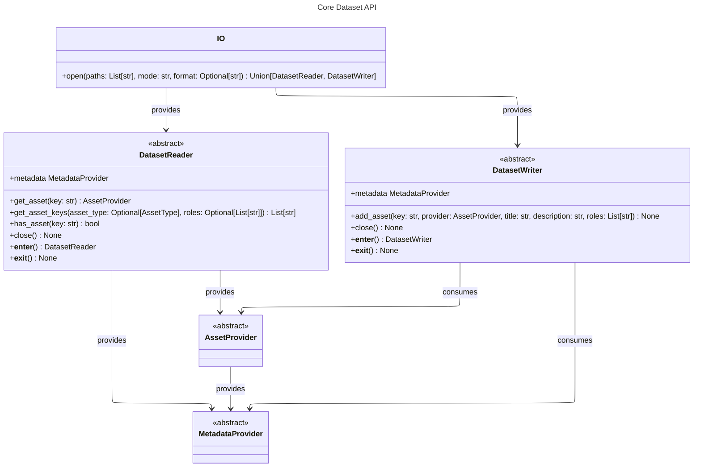
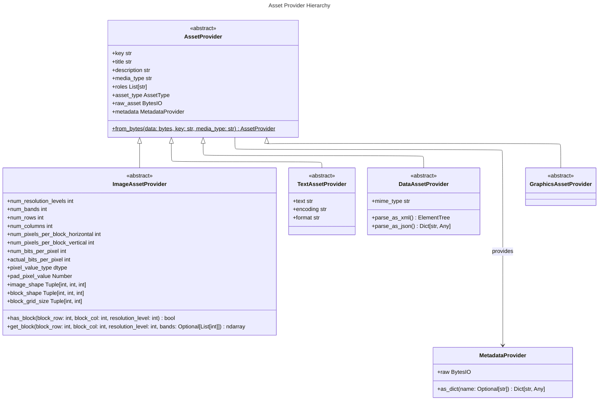
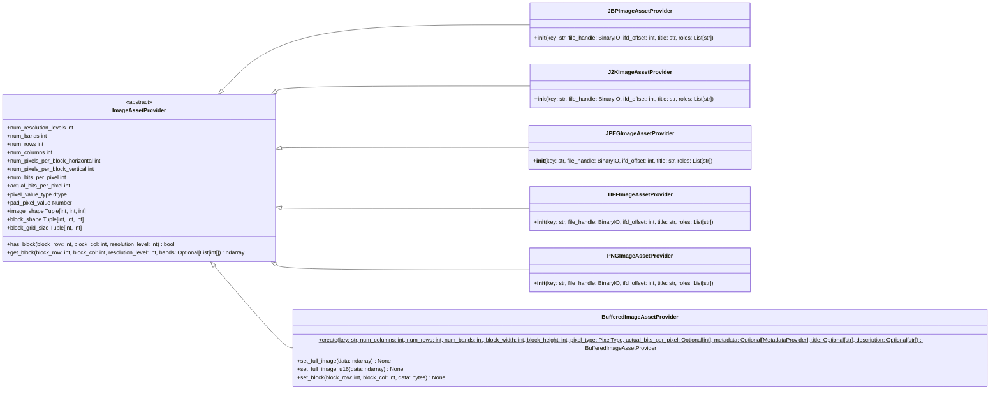
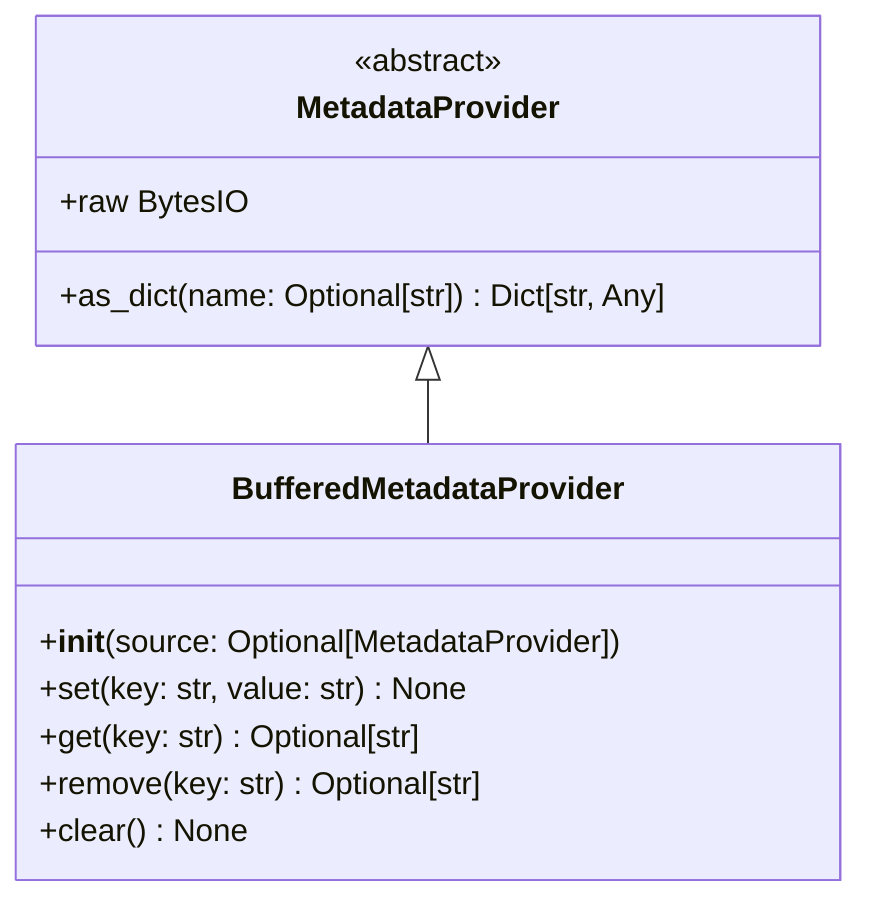
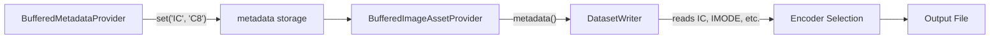
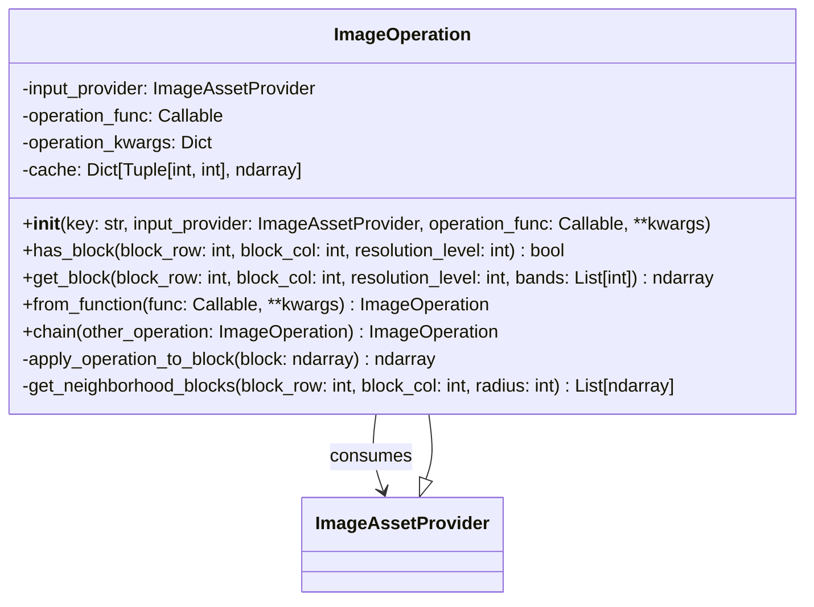
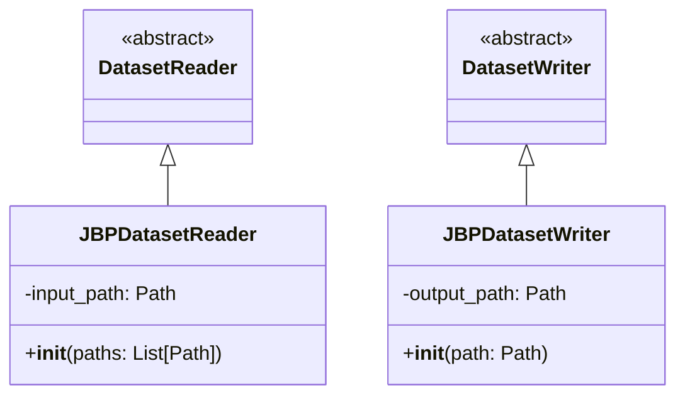
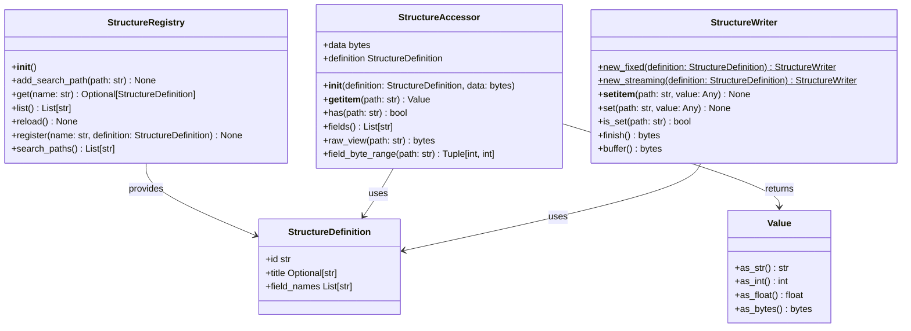

# OversightML Imagery IO API Design: Tiled Image Pyramid Access

This document presents the API design for OversightML's low-level access to large tiled image pyramids. The API combines concepts from the National Imagery Transmission Format (NITF) specification with ideas from SpatioTemporal Asset Catalogs (STAC) to provide a framework for geospatial imagery access.

## Overview

## Core API Structure

The API models **Datasets** as collections of related assets (images, graphics, text, data), each with its own metadata. Assets are accessed by string keys rather than numeric indices, enabling discovery and categorization while remaining flexible enough to represent format-specific data models like the Joint BIIF Profile (JBP).

The `DatasetReader` and `DatasetWriter` abstract classes provide the main entry points, while the `IO` class serves as a factory that selects the appropriate implementation based on file format detection.



## Asset Provider Hierarchy

The Asset Provider hierarchy handles different content types found in geospatial datasets. The base `AssetProvider` class establishes common metadata and organizational elements that all assets share, including keys, titles, descriptions, media types, and roles for discovery and categorization. Specialized providers extend this with type-specific functionality: `ImageAssetProvider` offers blocked access for processing large imagery, `TextAssetProvider` handles encoding and format-specific text retrieval, `DataAssetProvider` provides parsing for structured data like XML and JSON, and `GraphicsAssetProvider` manages vector graphics and annotations. This hierarchy allows datasets to function as self-describing collections. 



## ImageAssetProvider Hierarchy

The ImageAssetProvider hierarchy supports multiple image compression formats and data sources through a common blocked access interface. Each concrete implementation handles the decoding and access patterns required for its format while presenting a consistent API for blocked image data retrieval. The `BufferedImageAssetProvider` enables in-memory processing workflows, while format-specific providers like `JBPImageAssetProvider`, `J2KImageAssetProvider`, and `TIFFImageAssetProvider` provide lazy decoding and encoding for specific compression schemes and file structures. This design allows applications to work with different image formats—JPEG 2000 compressed imagery in NITF files, standard TIFF pyramids, or data generated in memory—through the same interface.



### Accessing Image Blocks with get_block()

The `get_block()` method retrieves a rectangular tile of image data from the underlying image. Large geospatial images are typically stored as grids of blocks (tiles) to enable efficient random access without loading the entire image into memory.

```python
def get_block(
    block_row: int,
    block_col: int,
    resolution_level: int = 0,
    bands: Optional[List[int]] = None
) -> ndarray
```

**Parameters:**

| Parameter | Type | Description |
|-----------|------|-------------|
| `block_row` | int | Row index of the block in the block grid (0-indexed from top) |
| `block_col` | int | Column index of the block in the block grid (0-indexed from left) |
| `resolution_level` | int | Resolution level to retrieve (0 = full resolution, higher = reduced) |
| `bands` | Optional[List[int]] | Specific bands to retrieve, or None for all bands |

**Resolution Levels:**

The `resolution_level` parameter selects from a pyramid of progressively smaller versions of the block. Level 0 is always the full-resolution. Each subsequent level reduces the dimensions by a factor of 2 in each direction:

| Level | Scale Factor | Dimension Reduction |
|-------|--------------|---------------------|
| 0 | 1:1 | Full resolution |
| 1 | 1:2 | Half resolution |
| 2 | 1:4 | Quarter resolution |
| 3 | 1:8 | Eighth resolution |
| n | 1:2^n | 2^n times smaller |

**Example: Block Shapes at Different Resolution Levels**

Consider an image with blocks of size 2048×2048 pixels and 3 bands. The returned ndarray shape varies by resolution level:

```python
from aws.osml.io import IO

with IO.open(["image.ntf"], "r") as dataset:
    image = dataset.get_asset("image_segment_001")
    
    # Full resolution block: shape is (bands, rows, cols)
    block_r0 = image.get_block(0, 0, resolution_level=0)
    print(block_r0.shape)  # (3, 2048, 2048)
    
    # Half resolution: dimensions halved
    block_r1 = image.get_block(0, 0, resolution_level=1)
    print(block_r1.shape)  # (3, 1024, 1024)
    
    # Quarter resolution
    block_r2 = image.get_block(0, 0, resolution_level=2)
    print(block_r2.shape)  # (3, 512, 512)
    
    # Eighth resolution
    block_r3 = image.get_block(0, 0, resolution_level=3)
    print(block_r3.shape)  # (3, 256, 256)
    
    # Check available resolution levels
    print(f"Available levels: {image.num_resolution_levels}")
```

**Use Cases for Resolution Levels:**

- **Level 0**: Full-quality processing, analysis, and output generation
- **Level 1-2**: Interactive visualization, quick previews
- **Level 3+**: Thumbnail generation, overview displays, rapid navigation

The number of available resolution levels depends on the image format and how it was encoded. Use `num_resolution_levels` to check how many levels are available before requesting a specific level.

### Image Data Format: Band-Sequential (Channels First)

This library uses band-sequential (BSQ) ordering for image data, where NumPy arrays have shape `(bands, rows, cols)`. This is also known as "channels first" or CHW format.

| Library | Format | Shape |
|---------|--------|-------|
| **osml-io** | Channels First (CHW) | `(bands, rows, cols)` |
| **PyTorch** | Channels First (NCHW) | `(batch, channels, height, width)` |
| **OpenCV** | Channels Last (HWC) | `(rows, cols, channels)` |
| **Pillow/PIL** | Channels Last (HWC) | `(height, width, channels)` |
| **scikit-image** | Channels Last (HWC) | `(height, width, channels)` |
| **TensorFlow** | Channels Last (NHWC) | `(batch, height, width, channels)` |

This design decision aligns with PyTorch's native tensor format and provides natural support for remote sensing workflows where bands are often processed independently. Multispectral analysis frequently involves per-band operations (e.g., computing vegetation indices from specific bands), and band-sequential ordering provides better memory locality for these access patterns.

**Interoperability with OpenCV and Pillow:**

When working with libraries that expect channels-last format, use `np.transpose` to convert:

```python
import numpy as np
import cv2
from PIL import Image
from aws.osml.io import IO

with IO.open(["image.ntf"], "r") as dataset:
    image_asset = dataset.get_asset("image_segment_001")
    
    # Get block in band-sequential format: (bands, rows, cols)
    block_chw = image_asset.get_block(0, 0, resolution_level=0)
    
    # Convert to channels-last for OpenCV/Pillow: (rows, cols, bands)
    block_hwc = np.transpose(block_chw, (1, 2, 0))
    
    # Now compatible with OpenCV (note: OpenCV uses BGR, not RGB)
    block_bgr = cv2.cvtColor(block_hwc, cv2.COLOR_RGB2BGR)
    cv2.imwrite("output.png", block_bgr)
    
    # Or with Pillow
    pil_image = Image.fromarray(block_hwc)
    pil_image.save("output.png")
```

**Converting from channels-last to band-sequential:**

```python
import numpy as np
from aws.osml.io import BufferedImageAssetProvider, PixelType

# Image from OpenCV or Pillow in HWC format: (rows, cols, bands)
image_hwc = np.zeros((512, 512, 3), dtype=np.uint8)

# Convert to band-sequential for osml-io: (bands, rows, cols)
image_chw = np.transpose(image_hwc, (2, 0, 1))

# Create buffered provider and set data
provider = BufferedImageAssetProvider.create(
    key="converted_image",
    num_columns=512,
    num_rows=512,
    num_bands=3,
    block_width=256,
    block_height=256,
    pixel_type=PixelType.UInt8,
)
provider.set_full_image(image_chw)
```

## Working with In-Memory (Buffered) Imagery

Buffered implementations allow creating and manipulating imagery entirely in memory. These classes support synthetic image generation, testing workflows, and scenarios where you need to create or modify images programmatically before writing them to disk.

### BufferedMetadataProvider

The `BufferedMetadataProvider` is a mutable implementation of `MetadataProvider` that allows programmatic setting of key-value pairs. It can be used to pass encoding hints to the dataset writer when creating new images from scratch.



**Construction:**

```python
from aws.osml.io import BufferedMetadataProvider

# Create empty provider
provider = BufferedMetadataProvider()

# Or create from existing provider (copies all metadata)
copied = BufferedMetadataProvider(source=existing_provider)
```

**Methods:**

| Method | Description |
|--------|-------------|
| `set(key, value)` | Set a string value for the given key. Replaces existing value if key exists. |
| `get(key)` | Get the value for a key, or `None` if not found. |
| `remove(key)` | Remove a key-value pair. Returns the previous value or `None`. |
| `clear()` | Remove all stored metadata. |
| `as_dict(name)` | Inherited from MetadataProvider. Returns all pairs, or filtered by prefix if `name` is provided. |

**Setting Encoding Hints:**

```python
from aws.osml.io import BufferedMetadataProvider

# Create provider with encoding hints for NITF writing
metadata = BufferedMetadataProvider()
metadata.set("IMODE", "B")      # Band interleave mode
metadata.set("IC", "NC")        # No compression
metadata.set("NPPBH", "256")    # Block width
metadata.set("NPPBV", "256")    # Block height
metadata.set("COMRAT", "01.0")  # Compression ratio

# Get all metadata as dict
all_metadata = metadata.as_dict()  # {"IMODE": "B", "IC": "NC", ...}

# Get metadata filtered by prefix
block_params = metadata.as_dict("NPP")  # {"NPPBH": "256", "NPPBV": "256"}
```

**Copying and Modifying Metadata:**

```python
from aws.osml.io import IO, BufferedMetadataProvider

# Read metadata from existing file
with IO.open(["input.ntf"], "r") as reader:
    original_metadata = reader.metadata
    
    # Copy to mutable provider
    modified = BufferedMetadataProvider(source=original_metadata)
    
    # Modify specific fields
    modified.set("IMODE", "P")  # Change to pixel interleave
    modified.remove("COMRAT")   # Remove compression ratio
```

### BufferedImageAssetProvider

The `BufferedImageAssetProvider` allows creating images in memory with configurable dimensions, tile sizes, pixel types, and band configurations. It uses a static `create()` method for construction and provides methods for setting image data.

**Construction:**

```python
from aws.osml.io import BufferedImageAssetProvider, PixelType

# Create a 512x512 RGB image with 256x256 tiles
provider = BufferedImageAssetProvider.create(
    key="synthetic_image",
    num_columns=512,
    num_rows=512,
    num_bands=3,
    block_width=256,
    block_height=256,
    pixel_type=PixelType.UInt8,
)
```

**Parameters:**

| Parameter | Type | Default | Description |
|-----------|------|---------|-------------|
| `key` | str | required | Unique identifier for this asset |
| `num_columns` | int | 512 | Image width in pixels |
| `num_rows` | int | 512 | Image height in pixels |
| `num_bands` | int | 1 | Number of spectral bands |
| `block_width` | int | 256 | Block/tile width in pixels |
| `block_height` | int | 256 | Block/tile height in pixels |
| `pixel_type` | PixelType | UInt8 | Pixel data type |
| `actual_bits_per_pixel` | int | None | Actual bits per pixel (uses full range if None) |
| `metadata` | MetadataProvider | None | Optional metadata for encoding hints |
| `title` | str | None | Human-readable title |
| `description` | str | None | Detailed description |

**Setting Image Data:**

Image data is provided as NumPy arrays in band-sequential format with shape `(bands, rows, cols)`:

```python
import numpy as np

# Create image data with shape (bands, rows, cols)
image_data = np.zeros((3, 512, 512), dtype=np.uint8)

# Set the full image
provider.set_full_image(image_data)

# Or set individual blocks
block_data = np.zeros((3, 256, 256), dtype=np.uint8)
provider.set_block(block_row=0, block_col=0, data=block_data)
```

### Combining Buffered Providers

The buffered providers work together to create fully-specified in-memory images with encoding hints:

```python
from aws.osml.io import BufferedImageAssetProvider, BufferedMetadataProvider, PixelType
import numpy as np

# Create metadata provider with encoding hints
metadata = BufferedMetadataProvider()
metadata.set("IMODE", "P")      # Pixel interleave mode
metadata.set("NPPBH", "256")    # Block width
metadata.set("IC", "NC")        # No compression

# Create image provider with metadata
provider = BufferedImageAssetProvider.create(
    key="synthetic_image",
    num_columns=512,
    num_rows=512,
    num_bands=3,
    block_width=256,
    block_height=256,
    pixel_type=PixelType.UInt8,
    metadata=metadata,
)

# Set image data
image_data = np.zeros((3, 512, 512), dtype=np.uint8)
provider.set_full_image(image_data)
```

## Writer API: Chipping and Transcoding Workflows

The writer side of the API uses the same `BufferedMetadataProvider` pattern to control how images are encoded when written to disk. This enables powerful workflows like:

- **Chipping**: Extract a region from a large image and write it as a new file
- **Transcoding**: Read an image in one compression format and write it in another
- **Metadata modification**: Copy an image while changing specific metadata fields

### How the Writer Uses Encoding Hints

When you call `writer.add_asset()`, the writer reads encoding hints from `asset.metadata()` to determine how to encode the output:



The writer looks for specific field names that match the output format's native field names. For NITF files:

| Field | Description | Example Values |
|-------|-------------|----------------|
| `IC` | Image compression | `NC` (none), `C8` (JPEG 2000), `CD` (HTJ2K) |
| `IMODE` | Band interleave mode | `B` (block), `P` (pixel), `R` (row), `S` (sequential) |
| `NPPBH` | Block width in pixels | `256`, `512`, `1024` |
| `NPPBV` | Block height in pixels | `256`, `512`, `1024` |
| `COMRAT` | Compression ratio | `N001.0` (lossless), `01.0` (target bpp) |

For JPEG 2000 compression, COMRAT controls lossless/lossy mode and compression ratio. Additional hints control encoder parameters:

| Field | Description | Example Values |
|-------|-------------|----------------|
| `COMRAT` | Compression ratio (NITF-native) | `N001.0` (lossless), `V020.0` (visually lossless), `01.0` (1.0 bpp) |
| `J2K_DECOMPOSITION_LEVELS` | Resolution pyramid depth | `5` (default), `3`, `6` |
| `J2K_QUALITY_LAYERS` | Progressive quality layers | `1` (default) |

**COMRAT Format:**
- `Nnnn.n` - Numerically lossless (e.g., "N001.0")
- `Vnnn.n` - Visually lossless with quality factor
- `nn.n` - Target bits per pixel (e.g., "01.0" = 1.0 bpp, "00.5" = 0.5 bpp)

### Chipping Workflow

Extract a region from a large image and write it as a new file:

```python
from aws.osml.io import IO, BufferedImageAssetProvider, BufferedMetadataProvider

with IO.open(["large_image.ntf"], "r") as reader:
    image_asset = reader.get_asset("image_segment_0")
    original_meta = image_asset.metadata.as_dict()
    
    # Read a specific block or region
    # For large images, read only the blocks you need
    block = image_asset.get_block(block_row=2, block_col=3, resolution_level=0)
    
    # Create metadata for the chip - preserve relevant fields
    metadata = BufferedMetadataProvider()
    for field in ["IID1", "IID2", "TGTID", "ISORCE", "IREP"]:
        if field in original_meta:
            metadata.set(field, str(original_meta[field]))
    
    # Keep same encoding or change it
    metadata.set("IC", original_meta.get("IC", "NC"))
    metadata.set("IMODE", "B")
    
    # Create provider for the chip
    rows, cols, bands = block.shape[1], block.shape[2], block.shape[0]
    provider = BufferedImageAssetProvider.create(
        key="chip",
        num_columns=cols,
        num_rows=rows,
        num_bands=bands,
        pixel_type=image_asset.pixel_value_type,
        metadata=metadata,
    )
    provider.set_full_image(block)

with IO.open(["chip.ntf"], "w") as writer:
    writer.add_asset("image_0", provider)
```

### Transcoding Workflow

Read an uncompressed image and write it with JPEG 2000 compression:

```python
from aws.osml.io import IO, BufferedImageAssetProvider, BufferedMetadataProvider

with IO.open(["uncompressed.ntf"], "r") as reader:
    image_asset = reader.get_asset("image_segment_0")
    original_meta = image_asset.metadata.as_dict()
    
    # Read the full image (or process block by block for large images)
    image_data = image_asset.get_block(0, 0, resolution_level=0)
    
    # Create metadata with JPEG 2000 encoding hints
    metadata = BufferedMetadataProvider()
    
    # Preserve descriptive metadata
    for field in ["IID1", "IID2", "TGTID", "ISORCE", "IREP", "ICAT"]:
        if field in original_meta:
            metadata.set(field, str(original_meta[field]))
    
    # Set JPEG 2000 compression parameters
    metadata.set("IC", "C8")                      # JPEG 2000 Part 1
    metadata.set("COMRAT", "00.5")                # Target 0.5 bpp (~16:1 compression)
    metadata.set("J2K_DECOMPOSITION_LEVELS", "5") # 5 resolution levels
    metadata.set("NPPBH", "1024")                 # 1024x1024 tiles
    metadata.set("NPPBV", "1024")
    
    # Create provider
    provider = BufferedImageAssetProvider.create(
        key="compressed",
        num_columns=image_asset.num_columns,
        num_rows=image_asset.num_rows,
        num_bands=image_asset.num_bands,
        pixel_type=image_asset.pixel_value_type,
        metadata=metadata,
    )
    provider.set_full_image(image_data)

with IO.open(["compressed.ntf"], "w") as writer:
    writer.add_asset("image_0", provider)
```

### Lossless JPEG 2000 Encoding

For archival or when pixel-perfect preservation is required:

```python
metadata = BufferedMetadataProvider()
metadata.set("IC", "C8")
metadata.set("COMRAT", "N001.0")               # Numerically lossless
metadata.set("J2K_DECOMPOSITION_LEVELS", "6")  # More resolution levels for large images
```

### Working with Masked (Sparse) Images

Masked images allow efficient storage of sparse imagery where some blocks are empty. This is useful for:
- Satellite imagery with irregular boundaries
- Cloud-masked regions
- Partial coverage areas

NITF supports masked variants of compression types. The IC (Image Compression) field indicates masking:

| Non-Masked | Masked | Description |
|------------|--------|-------------|
| NC | NM | Uncompressed with mask |
| C8 | M8 | JPEG 2000 with mask |
| CD | MD | HTJ2K with mask |

When using a masked IC value, you only need to provide blocks that contain actual data. Missing blocks are automatically marked as empty (masked) in the output file.

#### Writing Sparse Images with Masked IC

To create a sparse image, use `set_block()` to provide only the blocks that contain data:

```python
from aws.osml.io import IO, BufferedImageAssetProvider, BufferedMetadataProvider, PixelType
import numpy as np

# Create metadata with masked IC value
metadata = BufferedMetadataProvider()
metadata.set("IC", "NM")  # Uncompressed with mask (or "M8" for JPEG 2000)

# Create image provider
provider = BufferedImageAssetProvider.create(
    key="sparse_image",
    num_columns=1024,
    num_rows=1024,
    num_bands=3,
    block_width=256,
    block_height=256,
    pixel_type=PixelType.UInt8,
    metadata=metadata,
)

# Only set blocks that contain actual data
# Block grid is 4x4 (1024/256 = 4)
# Here we only provide blocks in a checkerboard pattern
for block_row in range(4):
    for block_col in range(4):
        if (block_row + block_col) % 2 == 0:  # Checkerboard pattern
            # Create block data (bands, rows, cols)
            block_data = np.random.randint(0, 255, (3, 256, 256), dtype=np.uint8)
            provider.set_block(block_row, block_col, block_data)

# Write to file - blocks not set will be marked as masked
with IO.open(["sparse_output.ntf"], "w", "nitf") as writer:
    writer.add_asset(
        key="image_segment_0",
        provider=provider,
        title="Sparse Image",
        description="Image with masked blocks",
        roles=["data"],
    )
```

#### Reading Masked Images and Iterating Over Valid Blocks

When reading a masked image, use `has_block()` to check which blocks contain data before attempting to read them:

```python
from aws.osml.io import IO

with IO.open(["sparse_image.ntf"], "r") as reader:
    asset = reader.get_asset("image_segment_0")
    
    # Get block grid dimensions
    block_grid_rows, block_grid_cols = asset.block_grid_size
    
    # Iterate over all possible blocks
    valid_blocks = []
    masked_blocks = []
    
    for block_row in range(block_grid_rows):
        for block_col in range(block_grid_cols):
            if asset.has_block(block_row, block_col, resolution_level=0):
                # Block has data - safe to read
                valid_blocks.append((block_row, block_col))
                block_data = asset.get_block(block_row, block_col, resolution_level=0)
                # Process block_data...
            else:
                # Block is masked (empty) - skip it
                masked_blocks.append((block_row, block_col))
    
    print(f"Valid blocks: {len(valid_blocks)}")
    print(f"Masked blocks: {len(masked_blocks)}")
    
    # Access pad pixel value if defined
    pad_value = asset.pad_pixel_value
    print(f"Pad pixel value: {pad_value}")
```

#### Masked JPEG 2000 Images

For compressed sparse images, use IC=M8 (JPEG 2000 with mask):

```python
from aws.osml.io import IO, BufferedImageAssetProvider, BufferedMetadataProvider, PixelType
import numpy as np

# Create metadata for masked JPEG 2000
metadata = BufferedMetadataProvider()
metadata.set("IC", "M8")                       # JPEG 2000 with mask
metadata.set("COMRAT", "N001.0")               # Lossless compression
metadata.set("J2K_DECOMPOSITION_LEVELS", "5")  # Resolution levels

# Create provider
provider = BufferedImageAssetProvider.create(
    key="sparse_j2k_image",
    num_columns=2048,
    num_rows=2048,
    num_bands=1,
    block_width=512,
    block_height=512,
    pixel_type=PixelType.UInt16,
    metadata=metadata,
)

# Set only border blocks (simulating irregular coverage)
block_grid_rows = 4  # 2048/512
block_grid_cols = 4

for block_row in range(block_grid_rows):
    for block_col in range(block_grid_cols):
        # Only set border blocks
        is_border = (block_row == 0 or block_row == block_grid_rows - 1 or
                     block_col == 0 or block_col == block_grid_cols - 1)
        if is_border:
            block_data = np.random.randint(0, 65535, (1, 512, 512), dtype=np.uint16)
            provider.set_block(block_row, block_col, block_data)

# Write sparse J2K image
with IO.open(["sparse_j2k.ntf"], "w", "nitf") as writer:
    writer.add_asset("image_segment_0", provider)
```

#### Important Notes on Masked Images

1. **IC value determines behavior**: Using a masked IC (NM, M8, MD) allows sparse data. Using a non-masked IC (NC, C8, CD) requires all blocks to be provided.

2. **Error on missing blocks with non-masked IC**: If you use a non-masked IC value but don't provide all blocks, the writer will raise a `MissingBlocks` error.

3. **has_block() is essential**: Always check `has_block()` before calling `get_block()` on masked images to avoid errors.

4. **Block offsets**: The mask table stores offsets for each block. Empty blocks have offset `0xFFFFFFFF`.

### Why Encoding Hints Use Metadata

This design keeps format-specific parameters out of abstract interfaces:

1. **Clean abstractions**: `BufferedImageAssetProvider` doesn't need NITF-specific parameters
2. **Seamless copying**: Metadata from a reader can flow directly to a writer
3. **Consistent naming**: The same field names used when reading are used when writing
4. **Format flexibility**: Different output formats read different hint fields

The writer knows what format it's writing, so it knows which metadata fields to look for. This allows the same `BufferedImageAssetProvider` to be written to NITF, GeoTIFF, or other formats by simply changing the writer and the encoding hints.

## ImageOperation Pattern for Large Image Processing

The ImageOperation pattern applies image processing algorithms to large geospatial imagery without loading entire images into memory. This design implements the ImageAssetProvider interface, allowing operations to be chained and composed while maintaining the same blocked access patterns as the underlying data sources. The `ImageOperation` class wraps any callable function (such as scikit-image filters) and applies it block-by-block as data is requested, enabling integration with existing image processing libraries. The pattern supports both simple per-block operations and neighborhood-based algorithms through its caching and block retrieval mechanisms, allowing processing pipelines that scale to large imagery datasets.



## Format-Specific Implementations

The abstract DatasetReader/DatasetWriter and AssetProvider interfaces enable support for different geospatial formats through concrete implementations. Each format provides its own reader/writer classes and asset providers that handle format-specific encoding details.

The Joint BIIF Profile (JBP) format, which includes NITF and NSIF files, demonstrates how the abstract interfaces work with a multi-asset format that supports various compression schemes. In these formats multiple assets are represented as segments of a single combined file.



## Parser Infrastructure (PyStructure Classes)

The parser infrastructure provides a data-driven approach to reading and writing binary structures. Instead of hand-coding parsers for each format, structure definitions are loaded from KSY (Kaitai Struct YAML) files and used to parse binary data at runtime. This enables maintainable parsing of formats like NITF headers and TRE extensions.



### StructureRegistry

The `StructureRegistry` manages loading, caching, and lookup of structure definitions from KSY files.

```python
from aws.osml.io import StructureRegistry

# Create registry with default search paths
registry = StructureRegistry()

# Add custom search path (higher priority)
registry.add_search_path("/custom/structures")

# Get a structure definition
definition = registry.get("NITF_02.10_FileHeader")

# List all available structures
for name in registry.list():
    print(name)

# Reload definitions from disk
registry.reload()
```

### StructureDefinition

A read-only wrapper around parsed KSY file content.

```python
# Get definition from registry
definition = registry.get("TRE_GEOLOB")

# Access definition properties
print(definition.id)           # "TRE_GEOLOB"
print(definition.title)        # Human-readable title
print(definition.field_names)  # ["arv", "brv", "lso", "pso"]
print(len(definition))         # Number of fields
```

### StructureAccessor

Provides lazy, dict-like access to parsed field values from binary data.

```python
from aws.osml.io import StructureRegistry, StructureAccessor

registry = StructureRegistry()
definition = registry.get("NITF_02.10_FileHeader")

# Parse binary data
with open("image.ntf", "rb") as f:
    header_data = f.read(1024)

accessor = StructureAccessor(definition, header_data)

# Access fields using bracket notation
fhdr = accessor["fhdr"].as_str()      # "NITF"
fver = accessor["fver"].as_str()      # "02.10"
numi = accessor["numi"].as_int()      # Number of images

# Check if field exists
if accessor.has("optional_field"):
    value = accessor["optional_field"]

# Use 'in' operator
if "numi" in accessor:
    print("Has image count field")

# Iterate over all accessible fields
for path in accessor.fields():
    print(f"{path}: {accessor[path].as_str()}")

# Get raw bytes for a field
raw_bytes = accessor.raw_view("fhdr")

# Get byte offset and length
offset, length = accessor.field_byte_range("fhdr")
```

### Value

Wrapper for parsed field values with type conversion methods.

```python
value = accessor["some_field"]

# Convert to different types
string_val = value.as_str()    # Trimmed string
int_val = value.as_int()       # Parsed integer
float_val = value.as_float()   # Parsed float
raw_bytes = value.as_bytes()   # Raw bytes

# Get length
print(len(value))

# String representation
print(repr(value))  # Value('NITF')
```

### StructureWriter

Encodes values according to a structure definition.

```python
from aws.osml.io import StructureRegistry, StructureWriter

registry = StructureRegistry()
definition = registry.get("NITF_02.10_FileHeader")

# Fixed-size mode: fields can be written in any order
writer = StructureWriter.new_fixed(definition)
writer["fhdr"] = "NITF"
writer["fver"] = "02.10"
writer["numi"] = 1

# Or use set() method
writer.set("clevel", "03")

# Check if field has been written
if not writer.is_set("stype"):
    writer["stype"] = "BF01"

# Finalize and get encoded bytes
encoded_data = writer.finish()

# Streaming mode: fields must be written in definition order
streaming_writer = StructureWriter.new_streaming(definition)
streaming_writer["fhdr"] = "NITF"
streaming_writer["fver"] = "02.10"
# ... write remaining fields in order
data = streaming_writer.finish()
```

### Complete Example: Reading and Writing TRE Data

```python
from aws.osml.io import StructureRegistry, StructureAccessor, StructureWriter

registry = StructureRegistry()

# Read existing TRE
tre_def = registry.get("TRE_GEOLOB")
with open("geolob.tre", "rb") as f:
    tre_data = f.read()

accessor = StructureAccessor(tre_def, tre_data)
arv = accessor["arv"].as_int()  # Longitude density
brv = accessor["brv"].as_int()  # Latitude density
lso = accessor["lso"].as_float()  # Longitude origin
pso = accessor["pso"].as_float()  # Latitude origin

print(f"Grid: {arv}x{brv}, Origin: ({lso}, {pso})")

# Create new TRE with modified values
writer = StructureWriter.new_fixed(tre_def)
writer["arv"] = arv * 2  # Double resolution
writer["brv"] = brv * 2
writer["lso"] = lso
writer["pso"] = pso

new_tre_data = writer.finish()
```


## Usage Examples

### Basic Blocked Image Access

```python
from aws.osml.io import IO
import numpy as np

# Open a dataset
with IO.open(["large_image.nitf"], "r") as dataset:

    # Access the metadata for the full dataset
    file_metadata = dataset.metadata.as_dict()

    # Discover available assets
    image_keys = dataset.get_asset_keys(asset_type="image")
    print(f"Available images: {image_keys}")
    
    # Access the first image asset
    main_image = dataset.get_asset(image_keys[0])  # "image_segment_001"
    
    # Get image specific metadata
    image_metadata = main_image.metadata.as_dict()
    
    # Get image properties (CHW format: bands, rows, cols)
    bands, height, width = main_image.image_shape
    _, block_height, block_width = main_image.block_shape
    
    # Read specific blocks
    for block_row in range(main_image.block_grid_size[0]):
        for block_col in range(main_image.block_grid_size[1]):
            if main_image.has_block(block_row, block_col, resolution_level=0):
                block_data = main_image.get_block(block_row, block_col, resolution_level=0)
                # Process block_data...
```

### Image Processing with Scikit-Image

```python
from aws.osml.io import IO
from skimage import filters, morphology
from aws.osml.io.operations import ImageOperation

# Open source dataset
with IO.open(["input.nitf"], "r") as source:
    # Get the main data asset
    original_asset = source.get_asset("main_data")
    
    # Create processing chain with meaningful keys
    gaussian_op = ImageOperation(
        key="gaussian_filtered",
        input_provider=original_asset,
        operation_func=filters.gaussian,
        sigma=2.0, 
        preserve_range=True
    )
    
    sobel_op = ImageOperation(
        key="edge_detected", 
        input_provider=gaussian_op,
        operation_func=filters.sobel
    )
    
    # Write processed result
    with IO.open(["output.nitf"], "w") as writer:
        writer.add_asset("processed_image", sobel_op,
                        title="Edge Detected Image",
                        description="Sobel edge detection applied after Gaussian blur",
                        roles=["data", "processed"])
```

### Multi-Asset Access

```python
from aws.osml.io import IO

with IO.open(["complex_dataset.nitf"], "r") as dataset:
    # Access different asset types
    image_keys = dataset.get_asset_keys(asset_type="image")
    text_keys = dataset.get_asset_keys(asset_type="text")
    graphics_keys = dataset.get_asset_keys(asset_type="graphics")
    data_keys = dataset.get_asset_keys(asset_type="data")
    
    print(f"Found {len(image_keys)} images, {len(text_keys)} text assets, "
          f"{len(graphics_keys)} graphics, {len(data_keys)} data assets")
    
    # Process all images
    for key in image_keys:
        image_asset = dataset.get_asset(key)
        print(f"Processing image '{key}': {image_asset.title}")
        # Process image...
    
    # Process text assets
    for key in text_keys:
        text_asset = dataset.get_asset(key)
        text_content = text_asset.text
        print(f"Text asset '{key}': {text_content}")
    
    # Process data assets (e.g., XML metadata)
    for key in data_keys:
        data_asset = dataset.get_asset(key)
        if data_asset.mime_type == "application/xml":
            xml_tree = data_asset.parse_as_xml()
            # Process XML...
    
    # Find assets by role 
    thumbnail_keys = dataset.get_asset_keys(roles=["thumbnail"])
```

### Creating Datasets from Memory

```python
from aws.osml.io import IO, BufferedImageAssetProvider, PixelType
import numpy as np

# Create image data in memory with shape (bands, rows, cols)
image_data = np.random.randint(0, 255, (3, 1024, 1024), dtype=np.uint8)

# Create memory asset provider using create() static method
memory_asset = BufferedImageAssetProvider.create(
    key="synthetic_image",
    num_columns=1024,
    num_rows=1024,
    num_bands=3,
    block_width=256,
    block_height=256,
    pixel_type=PixelType.UInt8,
    title="Synthetic Test Image",
)

# Set the image data
memory_asset.set_full_image(image_data)

# Write to file using add_asset (works with all AssetProvider types)
with IO.open(["output.nitf"], "w") as writer:
    writer.add_asset("main_image", memory_asset,
                     title="Synthetic RGB Image",
                     description="Randomly generated test image for validation",
                     roles=["data", "synthetic"])
```

### Using BufferedMetadataProvider for Encoding Hints

```python
from aws.osml.io import IO, BufferedImageAssetProvider, BufferedMetadataProvider, PixelType
import numpy as np

# Create metadata provider with encoding hints for NITF writing
metadata = BufferedMetadataProvider()
metadata.set("IMODE", "B")      # Band interleave mode
metadata.set("IC", "NC")        # No compression
metadata.set("NPPBH", "256")    # Block width
metadata.set("NPPBV", "256")    # Block height

# Create image data
image_data = np.zeros((3, 512, 512), dtype=np.uint8)

# Create memory asset provider with encoding hints
memory_asset = BufferedImageAssetProvider.create(
    key="encoded_image",
    num_columns=512,
    num_rows=512,
    num_bands=3,
    block_width=256,
    block_height=256,
    pixel_type=PixelType.UInt8,
    metadata=metadata,  # Pass encoding hints
)
memory_asset.set_full_image(image_data)

# Write to file
with IO.open(["output_with_hints.nitf"], "w") as writer:
    writer.add_asset("main_image", memory_asset,
                     title="Image with Encoding Hints",
                     description="Image created with specific NITF encoding parameters",
                     roles=["data"])

# Copy and modify metadata from existing file
with IO.open(["input.ntf"], "r") as reader:
    original_metadata = reader.metadata
    
    # Copy to mutable provider and modify
    modified = BufferedMetadataProvider(source=original_metadata)
    modified.set("IMODE", "P")  # Change to pixel interleave
    modified.remove("COMRAT")   # Remove compression ratio
    
    # Use modified metadata for new image
    new_asset = BufferedImageAssetProvider.create(
        key="modified_image",
        num_columns=512,
        num_rows=512,
        metadata=modified,
    )
```

### Working with PyStructure Classes

```python
from aws.osml.io import StructureRegistry, StructureAccessor, StructureWriter

# Create registry and load structure definitions
registry = StructureRegistry()

# Parse binary data from a NITF file header
definition = registry.get("NITF_02.10_FileHeader")
with open("image.ntf", "rb") as f:
    header_data = f.read(1024)

accessor = StructureAccessor(definition, header_data)

# Read field values
file_type = accessor["fhdr"].as_str()      # "NITF"
version = accessor["fver"].as_str()        # "02.10"
num_images = accessor["numi"].as_int()     # Number of images

print(f"File: {file_type} {version}, Images: {num_images}")

# Iterate over all fields
for field_name in accessor.fields():
    value = accessor[field_name]
    print(f"  {field_name}: {value.as_str()}")

# Create new binary data using StructureWriter
tre_def = registry.get("TRE_GEOLOB")
writer = StructureWriter.new_fixed(tre_def)

# Set field values (can be in any order with fixed mode)
writer["arv"] = 360000  # Longitude density
writer["brv"] = 360000  # Latitude density
writer["lso"] = -180.0  # Longitude origin
writer["pso"] = 90.0    # Latitude origin

# Get encoded binary data
tre_bytes = writer.finish()
```


## Key Benefits

1. **Large Image Handling**: Tiled access enables processing of images larger than memory
2. **Format Flexibility**: Abstract interfaces work across NITF, GeoTIFF, and future formats
3. **Processing Integration**: ImageOperation pattern enables scikit-image integration
4. **Provider Pattern**: Writers are decoupled from data sources
5. **Multi-Resolution Support**: All providers support pyramid access for visualization
6. **STAC-Aligned Asset Model**: Metadata and key-based access following industry standards
7. **Asset Discovery**: Find assets by type, role, or key without knowing file structure
8. **Asset Type Support**: Support for all NITF-style asset types while remaining format-agnostic

This API design provides a foundation for geospatial imagery processing workflows. The asset-based approach with metadata makes datasets self-describing and discoverable.
