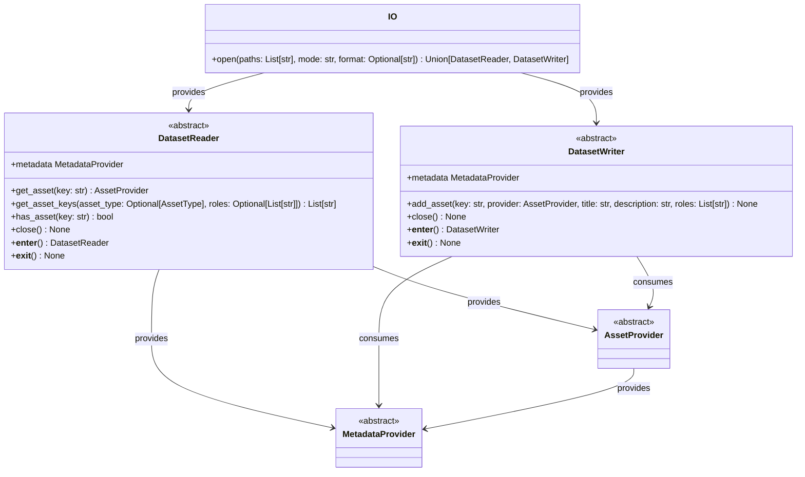
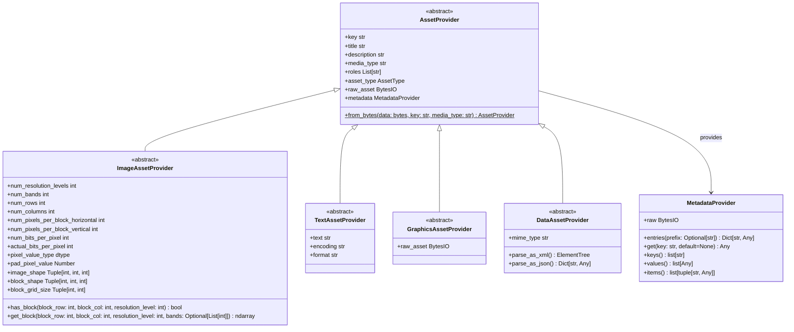
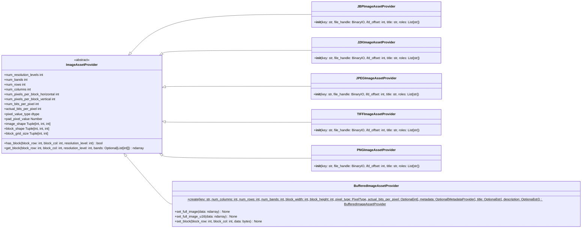
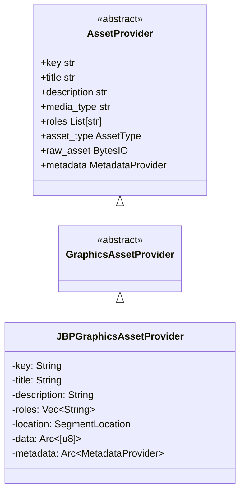
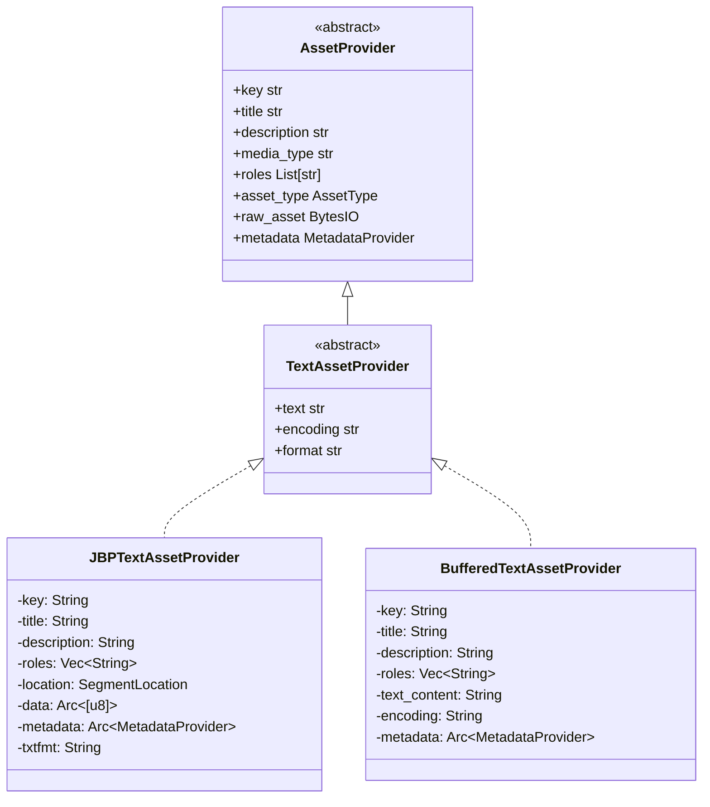
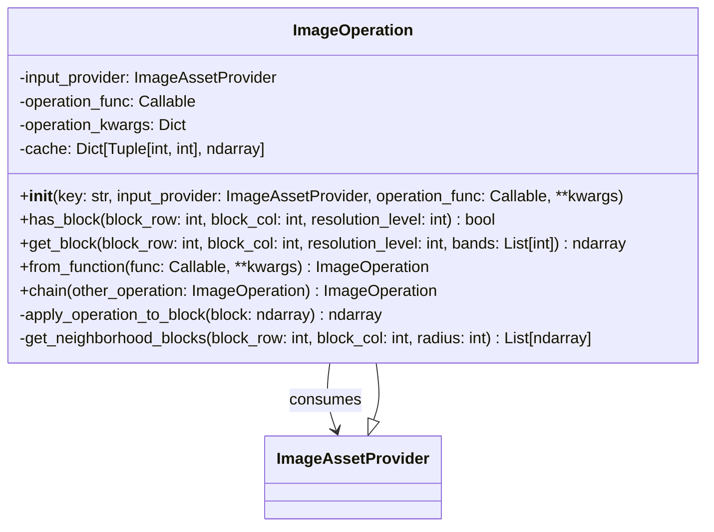
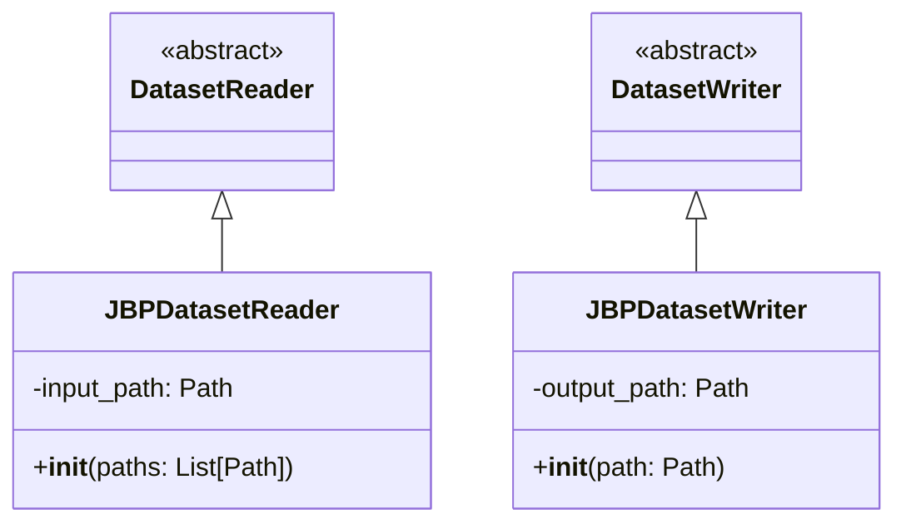
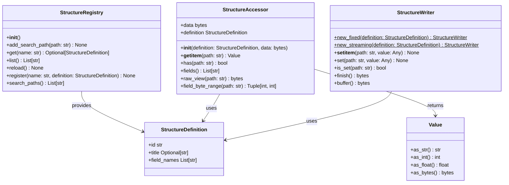

# OversightML Imagery IO API Design: Tiled Image Pyramid Access

This document presents the API design for OversightML's low-level access to large tiled image pyramids. The API combines concepts from the National Imagery Transmission Format (NITF) specification with ideas from SpatioTemporal Asset Catalogs (STAC) to provide a framework for geospatial imagery access.

For usage examples and practical guidance, see the [User Guide](../user-guide/index.md).

## Overview

## Core API Structure

The API models **Datasets** as collections of related assets (images, graphics, text, data), each with its own metadata. Assets are accessed by string keys rather than numeric indices, enabling discovery and categorization while remaining flexible enough to represent format-specific data models like the Joint BIIF Profile (JBP).

The `DatasetReader` and `DatasetWriter` abstract classes provide the main entry points, while the `IO` class serves as a factory that selects the appropriate implementation based on file format detection.

## Asset Provider Hierarchy

The Asset Provider hierarchy handles different content types found in geospatial datasets. The base `AssetProvider` class establishes common metadata and organizational elements that all assets share, including keys, titles, descriptions, media types, and roles for discovery and categorization. Specialized providers extend this with type-specific functionality: `ImageAssetProvider` offers blocked access for processing large imagery, `TextAssetProvider` handles encoding and format-specific text retrieval, `DataAssetProvider` provides parsing for structured data like XML and JSON, and `GraphicsAssetProvider` manages vector graphics and annotations. This hierarchy allows datasets to function as self-describing collections. 

## ImageAssetProvider Hierarchy

The ImageAssetProvider hierarchy supports multiple image compression formats and data sources through a common blocked access interface. Each concrete implementation handles the decoding and access patterns required for its format while presenting a consistent API for blocked image data retrieval. The `BufferedImageAssetProvider` enables in-memory processing workflows, while format-specific providers like `JBPImageAssetProvider`, `J2KImageAssetProvider`, and `TIFFImageAssetProvider` provide lazy decoding and encoding for specific compression schemes and file structures. This design allows applications to work with different image formats—JPEG 2000 compressed imagery in NITF files, standard TIFF pyramids, or data generated in memory—through the same interface.

For block access patterns, resolution levels, and pixel data format details, see the [Image Assets](../user-guide/image-assets.md) and [Working with Pixels](../user-guide/working-with-pixels.md) user guides.

## GraphicsAssetProvider

The `GraphicsAssetProvider` interface provides access to vector graphics data within geospatial datasets. In NITF files, graphic segments contain CGM (Computer Graphics Metafile) data representing annotations, overlays, and vector graphics that can be rendered on top of imagery.

### Interface Design

The `GraphicsAssetProvider` trait extends `AssetProvider` without adding additional methods. This minimal design reflects that:

1. Raw CGM data is accessed through the inherited `raw_asset()` method
2. Graphic-specific metadata (display level, attachment level, location, bounds) is accessed via the `metadata()` Mapping interface
3. The library extracts raw CGM bytes but does not parse CGM content—users provide their own CGM parsing libraries

For usage examples, see the [Graphics Assets](../user-guide/graphics-assets.md) user guide.

## TextAssetProvider

The `TextAssetProvider` interface provides access to text content within geospatial datasets. In NITF files, text segments contain textual data with associated metadata for character encoding and display properties. The interface handles encoding-aware text retrieval and line delimiter normalization.

### Interface Design

The `TextAssetProvider` trait extends `AssetProvider` with text-specific methods for accessing decoded content and encoding information:

For usage examples, see the [Text Assets](../user-guide/text-assets.md) user guide.

## Writer API: Why Encoding Hints Use Metadata

The writer side of the API uses `BufferedMetadataProvider` to control how images are encoded when written to disk. This design keeps format-specific parameters out of abstract interfaces:

1. **Clean abstractions**: `BufferedImageAssetProvider` doesn't need NITF-specific parameters
2. **Seamless copying**: Metadata from a reader can flow directly to a writer
3. **Consistent naming**: The same field names used when reading are used when writing
4. **Format flexibility**: Different output formats read different hint fields

The writer knows what format it's writing, so it knows which metadata fields to look for. This allows the same `BufferedImageAssetProvider` to be written to NITF, GeoTIFF, or other formats by simply changing the writer and the encoding hints.

For encoding options, chipping/transcoding workflows, and masked image support, see the [Writing Imagery Assets](../user-guide/image-assets-writing.md) user guide.

## ImageOperation Pattern for Large Image Processing

The ImageOperation pattern applies image processing algorithms to large geospatial imagery without loading entire images into memory. This design implements the ImageAssetProvider interface, allowing operations to be chained and composed while maintaining the same blocked access patterns as the underlying data sources. The `ImageOperation` class wraps any callable function (such as scikit-image filters) and applies it block-by-block as data is requested, enabling integration with existing image processing libraries. The pattern supports both simple per-block operations and neighborhood-based algorithms through its caching and block retrieval mechanisms, allowing processing pipelines that scale to large imagery datasets.

## Format-Specific Implementations

The abstract DatasetReader/DatasetWriter and AssetProvider interfaces enable support for different geospatial formats through concrete implementations. Each format provides its own reader/writer classes and asset providers that handle format-specific encoding details.

The Joint BIIF Profile (JBP) format, which includes NITF and NSIF files, demonstrates how the abstract interfaces work with a multi-asset format that supports various compression schemes. In these formats multiple assets are represented as segments of a single combined file.

## Parser Infrastructure (PyStructure Classes)

The parser infrastructure provides a data-driven approach to reading and writing binary structures. Instead of hand-coding parsers for each format, structure definitions are loaded from KSY (Kaitai Struct YAML) files and used to parse binary data at runtime. This enables maintainable parsing of formats like NITF headers and TRE extensions.

For parser usage examples and structure definition authoring, see the [Metadata](../user-guide/metadata.md) user guide.
