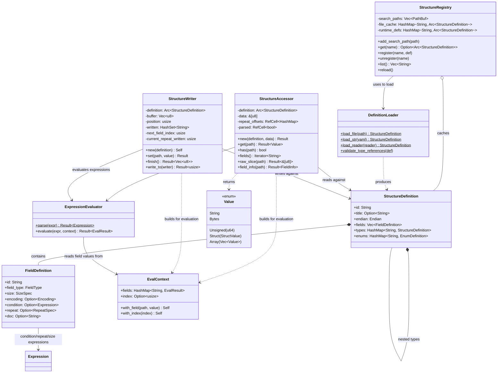

# Data-Driven Binary Parser

This document describes the data-driven binary parser infrastructure in `src/parser/`. The parser uses declarative YAML-based structure definitions inspired by [Kaitai Struct](https://kaitai.io/) to parse and write binary data without hardcoding format details.

## Relationship to Kaitai Struct

Our definition format is inspired by Kaitai Struct's `.ksy` YAML format but is not fully compatible. We implement a subset of Kaitai features tailored for NITF parsing, with some extensions (like NITF-specific character encodings) and some omissions (like `instances` and `params`).

Key differences from Kaitai Struct:

| Aspect | Kaitai Struct | Our Implementation |
|--------|---------------|-------------------|
| Execution model | Compiles to target language code | Runtime interpretation |
| Expression syntax | Full Kaitai expression language | Subset (see below) |
| `instances` | Supported | Not implemented |
| `params` | Supported | Not implemented |
| Array indexing | `arr[0]` bracket syntax | `arr_0` indexed paths (internal); `Value::Array` (public API) |
| NITF encodings | Not built-in | BCS-A, BCS-N, BCS-NPI, ECS-A support |
| Writing support | Limited | Full bidirectional read/write |

Our definition files use the `.ksy` extension for familiarity but should be considered a Kaitai-inspired format rather than true Kaitai Struct files. They may not work with the official Kaitai Struct compiler.

## Architecture Overview

The parser is organized around six key types that separate concerns between schema definition, reading, writing, expression evaluation, and definition management.



### Key Types

- **`StructureRegistry`** is the top-level manager that loads and caches `StructureDefinition`s from KSY (Kaitai Struct YAML) files on disk, delegating parsing to `DefinitionLoader`. It supports multiple search paths with last-wins priority, runtime registration of definitions, and lazy loading with caching.

- **`DefinitionLoader`** deserializes KSY YAML into intermediate `Raw*` structs via `serde_yaml`, then converts them to the final `StructureDefinition` type. All methods are static — the loader is stateless.

- **`StructureDefinition`** / **`FieldDefinition`** form the schema layer — a declarative description of a binary format's fields, types, sizes, conditions, and repeats. Definitions can contain nested type definitions and enum mappings.

- **`StructureAccessor`** is the read path. Given a definition and a byte slice, it lazily parses field offsets via a single O(n) pass on first access, caching repeat element offsets for efficient indexed access. All subsequent field accesses are O(1) lookups. It provides a map-like `get(path)` interface returning `Value` instances, with repeated fields returned as `Value::Array`. It uses `ExpressionEvaluator` to resolve dynamic sizes and conditional fields.

- **`StructureWriter`** is the write path. It uses streaming mode where fields must be written in definition order. It accepts field values via `set(path, value)` and serializes them into bytes according to the definition. For repeated fields, callers can pass a `WriteValue::Array` with all elements at once, or write elements sequentially with indexed paths.

- **`ExpressionEvaluator`** + **`EvalContext`** handle the expression language (arithmetic, comparisons, bitwise operations, field references) used in conditional fields, computed sizes, and repeat counts. Both the accessor and writer build an `EvalContext` from already-parsed fields to evaluate expressions.

- **`Value`** is the parsed field value enum with conversion methods that handle NITF's ASCII-numeric conventions (e.g., parsing `"003"` as integer 3 via `.as_i64()`).

## Key Components

### 1. Structure Definitions

Structure definitions are loaded from YAML files using `serde_yaml`. The `DefinitionLoader` deserializes into intermediate `Raw*` structs, then converts to the final `StructureDefinition` type.

```rust
// Loading a definition
let def = DefinitionLoader::load_file(Path::new("nitf_file_header.ksy"))?;
let def = DefinitionLoader::load_str(yaml_string)?;
```

#### Supported KSY Features

| Feature | Status | Notes |
|---------|--------|-------|
| `meta.id`, `meta.title`, `meta.endian` | ✓ | Required id, optional title |
| `seq` fields | ✓ | Sequential field definitions |
| `types` (nested) | ✓ | Recursive type definitions |
| `enums` | ✓ | Integer-to-name mappings |
| Field types: `u1-u8`, `s1-s8`, `str` | ✓ | Integer and string types |
| Endian-specific types: `u2be`, `u4le` | ✓ | Parsed but endian from meta |
| `size` (fixed and expression) | ✓ | Fixed integer or expression |
| `encoding` | ✓ | ASCII, BCS-A, BCS-N, BCS-NPI, ECS-A |
| `pad-right` | ✓ | Padding character |
| `if` (conditional) | ✓ | Expression-based conditions |
| `repeat: expr` | ✓ | Expression-based count |
| `repeat: until` | ✓ | Condition-based termination |
| `repeat: eos` | ✓ | Read until end of stream |
| `doc` | ✓ | Documentation strings |
| `instances` | ✗ | Not implemented |
| `params` | ✗ | Not implemented |
| Bit fields (`b1`, `b4`) | Partial | Parsed as bytes |

### 2. StructureAccessor (Reading)

The `StructureAccessor` provides lazy, map-like access to binary data. On first field access, a single O(n) pass walks all fields and caches repeat element offsets. All subsequent accesses are O(1) lookups.

```rust
let accessor = StructureAccessor::new(Arc::new(def), &data)?;

// Access fields by path
let version = accessor.get("fver")?.as_str()?;
let num_images = accessor.get("numi")?.as_i64()?;

// Repeated fields return Value::Array
let all_info = accessor.get("image_info")?;  // Returns Value::Array
if let Value::Array(entries) = all_info {
    for entry in &entries {
        // Each entry is a Value::Struct with nested fields
    }
}

// Indexed access for individual repeated elements
let first_len = accessor.get("image_info_0.li")?.as_str()?;

// Check field existence (including conditional evaluation)
if accessor.has("optional_field") { ... }

// Zero-copy raw slice access
let raw_bytes: &[u8] = accessor.raw_slice("data_field")?;

// Iterate all accessible fields (skips false conditionals)
for field_path in accessor.fields() { ... }
```

#### Offset Calculation

Field offsets are computed in a single pass on first access:
1. Fixed-size fields: offset computed from preceding field sizes
2. Variable-size fields: preceding fields parsed to determine sizes
3. Conditional fields: condition evaluated to determine presence (skipped if false)
4. Repeated fields: repeat count evaluated, each element's offset cached internally

The single-pass result is cached in a repeat offset map for efficient indexed access. The `fields()` iterator returns base field names only — repeated fields appear once (not once per element).

### 3. StructureWriter (Writing)

The `StructureWriter` uses streaming mode where fields must be written in definition order:

```rust
// Create a writer
let mut writer = StructureWriter::new(Arc::new(def));
writer.set("field_a", "value")?;  // Must be in definition order
writer.set("field_b", 42i64)?;
let bytes = writer.finish()?;

// Write directly to an io::Write target
let bytes_written = writer.write_to(&mut output_file)?;
```

For repeated fields, pass a `WriteValue::Array` with all elements:

```rust
writer.set("items", vec!["AAA", "BBB", "CCC"])?;
```

The streaming writer supports expression-based sizes and repeat counts by evaluating them against previously written values. Fields must be written in the order they appear in the definition.

### 4. Expression Evaluator

The expression system parses and evaluates Kaitai Struct-style expressions using a hand-written recursive descent parser:

```rust
let expr = ExpressionEvaluator::parse("numi.to_i * 16 + 388")?;
let evaluator = ExpressionEvaluator::new();
let result = evaluator.evaluate(&expr, &context)?;
```

#### Supported Expression Syntax

| Category | Syntax | Example |
|----------|--------|---------|
| Literals | integers, floats, strings, booleans | `42`, `3.14`, `"text"`, `true` |
| Hex literals | `0x` prefix | `0xFF`, `0x1A` |
| Field references | dot-notation paths | `header.version`, `items_0.value` |
| Arithmetic | `+`, `-`, `*`, `/`, `%` | `width * height` |
| Comparison | `==`, `!=`, `<`, `>`, `<=`, `>=` | `version >= 2` |
| Logical | `and`, `or`, `not` | `a > 0 and b < 10` |
| Bitwise | `&`, `\|`, `^`, `~`, `<<`, `>>` | `flags & 0xFF`, `mask \| 0x01` |
| Methods | `.to_i`, `.to_s`, `.length` | `numi.to_i`, `data.length` |
| Special vars | `_index` | Current repeat index |
| Parentheses | `(expr)` | `(a + b) * c` |
| Unary | `-`, `not`, `~` | `-offset`, `~mask` |

#### Operator Precedence (lowest to highest)

1. `or`
2. `and`
3. `==`, `!=`, `<`, `>`, `<=`, `>=`
4. `|` (bitwise OR)
5. `^` (bitwise XOR)
6. `&` (bitwise AND)
7. `+`, `-`
8. `*`, `/`, `%`
9. Unary `-`, `not`, `~`
10. Postfix `.method`, `.field`

#### Not Supported

- `_root`, `_parent`, `_io` (parsed but not evaluated)
- Ternary operator: `a ? b : c`

#### Why a Custom Expression Evaluator?

We use a hand-written expression evaluator rather than a third-party library for several reasons:

1. **Kaitai-specific syntax**: The `.to_i`, `.to_s`, and `.length` method call syntax is specific to Kaitai Struct. Generic expression libraries like `meval` don't support method calls, and adapting them would require significant preprocessing.

2. **License constraints**: This project requires Apache-2.0, MIT, BSD, ISC, Zlib, or public domain licenses. Some expression evaluation crates (e.g., `evalexpr`) use AGPL licensing which is incompatible.

3. **NITF-specific needs**: NITF fields are often ASCII strings representing numbers (e.g., `"003"` for the count 3). The `.to_i` method handles this conversion naturally. Generic evaluators would need custom type coercion.

4. **Minimal dependencies**: The custom evaluator adds no external dependencies and is well-tested code organized into lexer, parser, evaluator, and operator modules.

### 5. Structure Registry

The registry manages loading and caching of structure definitions:

```rust
let mut registry = StructureRegistry::new();
registry.add_search_path("data/structures/tre");

// Get definition (loads from search paths and caches)
let def = registry.get("TRE_GEOLOB");

// Mutable access (loads and caches if not already present)
let def = registry.get_mut("TRE_GEOLOB");

// Runtime registration (takes priority over file-loaded definitions)
registry.register("CUSTOM", custom_def);

// List all available definitions (file + runtime)
for name in registry.list() { ... }

// Reload file-based definitions (preserves runtime registrations)
registry.reload()?;
```

#### Naming Convention

| Prefix | Example | File Path |
|--------|---------|-----------|
| `TRE_` | `TRE_GEOLOB` | `tre/tre_geolob.ksy` |
| `DES_` | `DES_TRE_OVERFLOW` | `des/des_tre_overflow.ksy` |
| `NITF_` | `NITF_02.10_FileHeader` | `nitf/nitf_02.10_file_header.ksy` |
| `NSIF_` | `NSIF_01.00_FileHeader` | `nsif/nsif_01.00_file_header.ksy` |

### 6. NITF Character Set Encoding

The `encoding` module validates NITF-specific character sets:

| Encoding | Description | Valid Bytes |
|----------|-------------|-------------|
| BCS-A | Basic Character Set - Alphanumeric | `0x20`–`0x7E` |
| BCS-N | Basic Character Set - Numeric | `0x20`, `0x2B`–`0x2F`, `0x30`–`0x39` |
| BCS-NPI | Basic Character Set - Numeric Positive Integer | `0x20`, `0x30`–`0x39` |
| ECS-A | Extended Character Set - Alphanumeric | `0x20`+ |

Each encoding provides `validate()` for bulk validation and `is_valid_byte()` for per-byte checks. The `validate_*_detailed()` functions return a `ValidationResult` with the index and byte of the first invalid character.

## Value Type

The `Value` enum represents parsed field values with conversion methods:

```rust
pub enum Value<'a> {
    String(Cow<'a, str>),      // String fields
    Bytes(&'a [u8]),           // Raw byte fields
    Unsigned(u64),             // Unsigned integers
    Struct(StructValue<'a>),   // Nested structures
    Array(Vec<Value<'a>>),     // Repeated fields
}

// Conversions (handle NITF's ASCII-numeric fields)
value.as_str()?      // Trims padding
value.as_i64()?      // Parses numeric strings or casts unsigned
value.as_u64()?      // Parses unsigned strings or casts unsigned
value.as_f64()?      // Parses float strings or casts unsigned
value.as_bytes()     // Raw bytes (always succeeds)
```

## Error Types

```rust
LoadError       // Definition loading errors (YAML, missing fields, invalid types, undefined type refs)
AccessError     // Reading errors (unknown field, EOF, conditional not present, encoding, expression)
WriteError      // Writing errors (out of order, too large, missing required, validation, conversion)
ConversionError // Value conversion errors (type mismatch, parse failure)
ExpressionError // Expression errors (syntax, unknown field, type error, division by zero)
```

## Dependencies

| Crate | Purpose |
|-------|---------|
| `serde_yaml` | YAML deserialization for KSY files |
| `serde` | Derive macros for deserialization |
| `thiserror` | Error type derivation |

## Repeated Field Access

Repeated fields are accessed primarily through the base field name, which returns a `Value::Array`. Individual elements can also be accessed via `{field_id}_{index}` indexed paths (zero-based) for convenience.

```yaml
seq:
  - id: num_segments
    type: u2
  - id: segment_info
    type: segment_entry
    repeat: expr
    repeat-expr: num_segments
```

If `num_segments` is 3:
- `segment_info` — Entire array as `Value::Array` (preferred)
- `segment_info_0` — First entry (indexed access)
- `segment_info_0.offset` — Nested field access on first entry
- `segment_info_1` — Second entry
- `segment_info_2` — Third entry

For writing, pass arrays directly:
```rust
writer.set("items", vec!["AAA", "BBB", "CCC"])?;
```

## Example: NITF File Header

```yaml
meta:
  id: nitf_file_header
  title: NITF 2.1 File Header
  endian: be

seq:
  - id: fhdr
    type: str
    size: 4
    encoding: BCS-A
    doc: File profile name (NITF or NSIF)
    
  - id: fver
    type: str
    size: 5
    encoding: BCS-A
    doc: File version (02.10)
    
  - id: numi
    type: str
    size: 3
    encoding: BCS-N
    doc: Number of image segments
    
  - id: image_info
    type: image_segment_info
    repeat: expr
    repeat-expr: numi.to_i

types:
  image_segment_info:
    seq:
      - id: lish
        type: str
        size: 6
        encoding: BCS-N
      - id: li
        type: str
        size: 10
        encoding: BCS-N
```

```rust
let accessor = StructureAccessor::new(def, &data)?;
let version = accessor.get("fver")?.as_str()?;  // "02.10"
let num_images = accessor.get("numi")?.as_i64()?;  // 2

// Access the entire array
let image_info = accessor.get("image_info")?;  // Value::Array

// Or access individual elements by index
for i in 0..num_images {
    let path = format!("image_info_{}.li", i);
    let image_len = accessor.get(&path)?.as_i64()?;
}
```

## Comparison with Kaitai Struct

| Feature | Kaitai Struct | Implementation Status |
|---------|---------------|----------------------|
| `instances` | Supported | Not implemented |
| `params` | Supported | Not implemented |
| `_root`, `_parent`, `_io` | Supported | Parsed but not evaluated |
| Ternary operator | Supported | Not supported |
| Bitwise operators | Supported | Supported (`&`, `\|`, `^`, `~`, `<<`, `>>`) |
| Array indexing `arr[0]` | Supported | `Value::Array` for whole array; `arr_0` indexed paths for elements |
| Method calls | `.to_i`, `.to_s`, `.length`, etc. | `.to_i`, `.to_s`, `.length` |
| Hex literals | `0xFF` | Supported |
